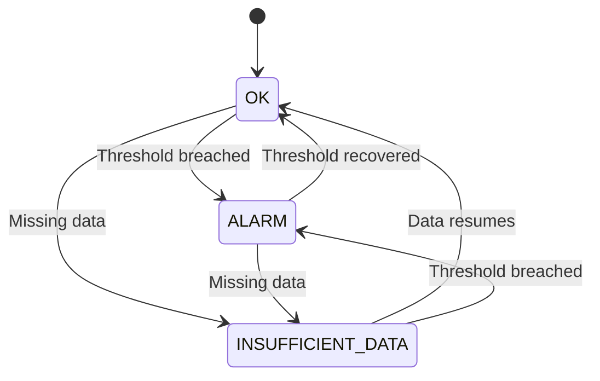
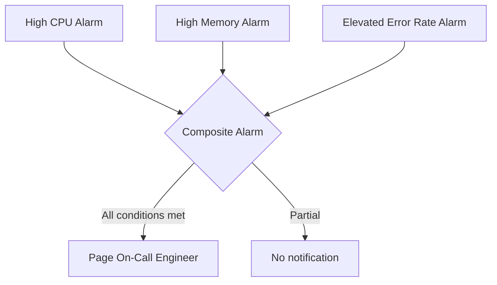
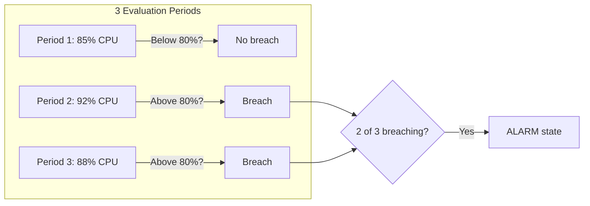

# AWS CloudWatch Alerting Best Practices

Author: [nawazdhandala](https://github.com/nawazdhandala)

Tags: AWS, CloudWatch, Alerting, Monitoring, DevOps

Description: Best practices for setting up effective CloudWatch alarms including threshold selection, alarm actions, composite alarms, and reducing alert fatigue.

---

CloudWatch alarms are the backbone of operational awareness on AWS. But poorly configured alarms create more problems than they solve. Teams drown in noise, start ignoring pages, and eventually miss the alerts that actually matter. This post covers practical strategies for building an alerting setup that keeps your team informed without burning them out.

## Understanding CloudWatch Alarm States

Every CloudWatch alarm exists in one of three states: OK, ALARM, or INSUFFICIENT_DATA. The transitions between these states drive your notification and automation workflows.



The INSUFFICIENT_DATA state catches many people off guard. When a metric stops reporting (say, because an instance was terminated), the alarm transitions to INSUFFICIENT_DATA rather than staying in OK. You need to explicitly decide how to treat missing data for each alarm.

## Choosing the Right Thresholds

Static thresholds are the simplest approach, but getting the numbers right takes effort. A common mistake is setting thresholds based on gut feeling rather than actual baseline data.

Start by examining your metrics over a meaningful time window. Two weeks of data usually captures enough variation to set reasonable thresholds.

The following CLI command pulls p99 CPU utilization over 14 days, which helps you understand what "normal" looks like before setting any thresholds.

```bash
# Pull p99 CPU utilization stats over the past 14 days
aws cloudwatch get-metric-statistics \
  --namespace AWS/EC2 \
  --metric-name CPUUtilization \
  --start-time $(date -u -d '14 days ago' +%Y-%m-%dT%H:%M:%S) \
  --end-time $(date -u +%Y-%m-%dT%H:%M:%S) \
  --period 3600 \
  --statistics p99 \
  --dimensions Name=InstanceId,Value=i-0abc123def456
```

Once you have baseline data, set your warning threshold at the 95th percentile and your critical threshold at something clearly abnormal, like 2x the 95th percentile value. This avoids the trap of alerting on normal variance.

### CloudWatch Anomaly Detection

For metrics with seasonal patterns (think traffic that spikes every Monday morning), static thresholds are a poor fit. CloudWatch Anomaly Detection builds a model of expected behavior and alerts when the metric deviates from it.

This CloudFormation snippet creates an anomaly detection alarm that triggers when CPU goes beyond 2 standard deviations from the expected band.

```yaml
# CloudFormation: Anomaly detection alarm for CPU utilization
CPUAnomalyAlarm:
  Type: AWS::CloudWatch::AnomalyDetector
  Properties:
    MetricName: CPUUtilization
    Namespace: AWS/EC2
    Stat: Average
    Dimensions:
      - Name: InstanceId
        Value: !Ref MyInstance

CPUAnomalyAlarmDefinition:
  Type: AWS::CloudWatch::Alarm
  Properties:
    AlarmName: cpu-anomaly-detection
    ComparisonOperator: GreaterThanUpperThreshold
    EvaluationPeriods: 3
    DatapointsToAlarm: 2
    ThresholdMetricId: ad1
    Metrics:
      - Id: m1
        MetricStat:
          Metric:
            MetricName: CPUUtilization
            Namespace: AWS/EC2
            Dimensions:
              - Name: InstanceId
                Value: !Ref MyInstance
          Period: 300
          Stat: Average
      - Id: ad1
        Expression: ANOMALY_DETECTION_BAND(m1, 2)
    TreatMissingData: breaching
```

## Composite Alarms: Reducing Noise

Single-metric alarms are noisy by nature. A brief CPU spike on one instance does not necessarily mean your service is degraded. Composite alarms let you combine multiple alarm states with boolean logic so you only get paged when there is a genuine problem.



Here is a composite alarm that fires only when both CPU is high and the error rate is elevated, filtering out benign CPU spikes.

```yaml
# Composite alarm: Only page when CPU is high AND errors are elevated
ServiceDegradedAlarm:
  Type: AWS::CloudWatch::CompositeAlarm
  Properties:
    AlarmName: service-degraded
    AlarmRule: >
      ALARM("high-cpu-alarm") AND
      ALARM("elevated-error-rate-alarm")
    AlarmActions:
      - !Ref PagerDutySNSTopic
```

This pattern dramatically cuts down on false positives. You can extend it further with OR conditions for different failure modes.

## Treating Missing Data Correctly

The `TreatMissingData` parameter controls what happens when CloudWatch has no data points to evaluate. The options are:

| Setting | Behavior | Good For |
|---------|----------|----------|
| `missing` | Maintains current state | Sporadic metrics |
| `notBreaching` | Treats gaps as OK | Non-critical metrics |
| `breaching` | Treats gaps as threshold violated | Health checks, heartbeats |
| `ignore` | Skips evaluation | Batch job metrics |

For health check alarms and heartbeat metrics, use `breaching`. If a metric stops reporting, that is often the problem itself. For metrics that are naturally sparse (like Lambda invocations on a low-traffic function), use `missing` or `notBreaching` to avoid spurious alerts.

## Alarm Actions Beyond SNS

Most teams wire alarms to SNS topics that send emails or trigger PagerDuty. But CloudWatch alarm actions can do much more.

Auto-remediation with Systems Manager is one of the most powerful patterns. When an alarm fires, it can trigger an SSM Automation document that restarts a service, scales a fleet, or runs a diagnostic script.

This example triggers an SSM automation to restart an EC2 instance when the alarm fires, handling the common case of a stuck process.

```yaml
# Alarm action: Auto-restart instance via SSM on sustained high CPU
HighCPUAlarm:
  Type: AWS::CloudWatch::Alarm
  Properties:
    AlarmName: auto-remediate-high-cpu
    MetricName: CPUUtilization
    Namespace: AWS/EC2
    Statistic: Average
    Period: 300
    EvaluationPeriods: 3
    DatapointsToAlarm: 3
    Threshold: 95
    ComparisonOperator: GreaterThanThreshold
    Dimensions:
      - Name: InstanceId
        Value: !Ref MyInstance
    AlarmActions:
      - !Sub "arn:aws:ssm:${AWS::Region}:${AWS::AccountId}:automation-definition/AWS-RestartEC2Instance"
```

Other useful alarm actions include:

- **EC2 actions**: Stop, terminate, or reboot instances directly
- **Auto Scaling policies**: Scale out when demand exceeds capacity
- **Lambda functions** (via SNS): Run arbitrary remediation logic

## Structuring Alarm Naming and Tagging

As your alarm count grows, naming conventions become essential. A pattern that works well:

```
{environment}-{service}-{metric}-{severity}
```

For example: `prod-payment-api-error-rate-critical` or `staging-order-service-latency-warning`.

Tag every alarm with at least:
- `Environment` (prod, staging, dev)
- `Service` (the owning service)
- `Team` (the responsible team)
- `Severity` (critical, warning, info)

This makes it possible to filter alarms in the console, build targeted dashboards, and route notifications to the right team.

## Setting Evaluation Periods to Avoid Flapping

A single data point breaching a threshold should rarely trigger an alert. Use `EvaluationPeriods` and `DatapointsToAlarm` together to require sustained threshold breaches.

A good starting point for most operational alarms is 3 evaluation periods with 2 out of 3 data points required. This tolerates a single spike while still catching real issues within minutes.



For critical alarms where you need fast response (like a health check failure), you might drop to 1 out of 1, but be prepared for more noise.

## Alert Fatigue Mitigation

Alert fatigue is the number one killer of on-call effectiveness. Some practical measures:

1. **Tier your alarms.** Critical alarms page. Warning alarms go to a Slack channel. Info alarms go to a dashboard. Not everything needs to wake someone up.

2. **Review alarms monthly.** Any alarm that fired more than 10 times without leading to human action should be tuned or deleted.

3. **Suppress during deployments.** Use CloudWatch alarm suppression or composite alarms that factor in deployment state to avoid paging during known-noisy windows.

4. **Set OK actions.** Configure alarms to notify when they recover. This lets on-call engineers know they can stand down without manually checking.

5. **Document runbooks.** Every critical alarm should link to a runbook that explains what to check and how to remediate. Embed the link in the alarm description.

## Monitoring Your Alarms

It sounds circular, but you should monitor your monitoring. Use CloudWatch metrics on your alarms themselves:

- Track the number of alarms in ALARM state over time
- Monitor INSUFFICIENT_DATA transitions, which may indicate broken metric pipelines
- Set up a daily digest of all alarm state changes

The CloudWatch console provides an alarm summary view, but for a more comprehensive approach, use CloudWatch Metrics Insights to query alarm state changes programmatically.

## Summary

Effective CloudWatch alerting comes down to a few principles: base thresholds on real data, use composite alarms to reduce noise, treat missing data intentionally, tier your alerts by severity, and review your alarm configuration regularly. The goal is not to alert on everything, but to alert on the things that require human attention and handle the rest through automation.
