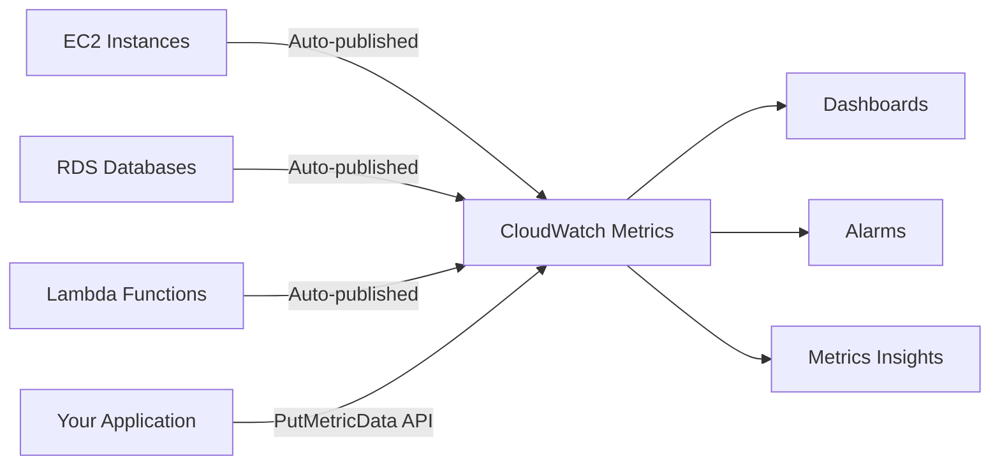
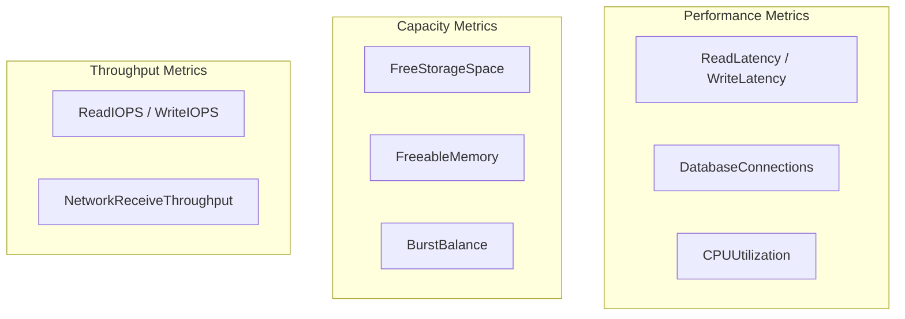
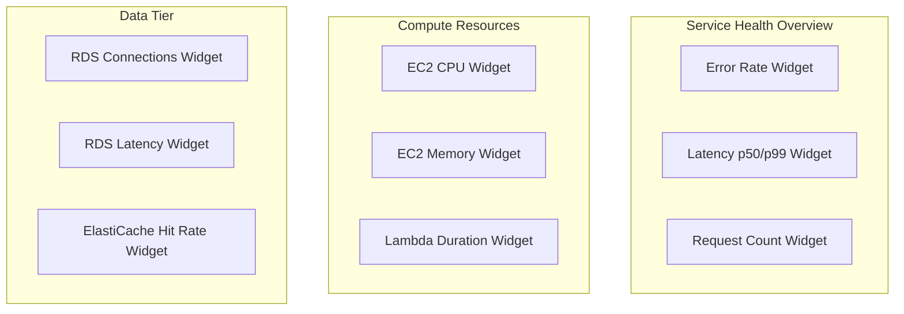

# How to Monitor AWS Infrastructure with CloudWatch

Author: [nawazdhandala](https://github.com/nawazdhandala)

Tags: AWS, CloudWatch, Infrastructure, Monitoring, DevOps

Description: A comprehensive guide to using CloudWatch for infrastructure monitoring covering EC2, RDS, Lambda, and custom metrics with dashboards and alarms.

---

CloudWatch is the default monitoring service baked into every AWS account. It collects metrics from most AWS services automatically, and it gives you the tools to build dashboards, set alarms, and dig into logs. Rather than treating it as a black box, this guide walks through how to use CloudWatch effectively across your core infrastructure components.

## How CloudWatch Metrics Work

Every AWS service emits metrics into CloudWatch namespaces. EC2 metrics live under `AWS/EC2`, RDS under `AWS/RDS`, and so on. Each metric has dimensions (like InstanceId or DBInstanceIdentifier) that let you filter to specific resources.



The default metric resolution is 5 minutes for most services. Detailed monitoring bumps EC2 metrics to 1-minute resolution for an additional cost. For most use cases, 1-minute resolution is worth enabling on production instances.

## Monitoring EC2 Instances

EC2 publishes CPU, network, disk I/O, and status check metrics out of the box. However, it does not publish memory utilization or disk space usage. For those, you need the CloudWatch Agent.

### Installing the CloudWatch Agent

The CloudWatch Agent runs on your instances and pushes OS-level metrics (memory, disk, process counts) and log files to CloudWatch. Install it through Systems Manager for the cleanest workflow.

This SSM command installs the CloudWatch Agent on all instances tagged with the monitoring role.

```bash
# Install CloudWatch Agent via Systems Manager on tagged instances
aws ssm send-command \
  --document-name "AWS-ConfigureAWSPackage" \
  --targets "Key=tag:Role,Values=monitoring" \
  --parameters '{"action":["Install"],"name":["AmazonCloudWatchAgent"]}' \
  --comment "Install CW Agent on monitored instances"
```

After installation, the agent needs a configuration file. Here is a practical configuration that captures memory, disk, and CPU metrics at 60-second intervals.

```json
{
  "agent": {
    "metrics_collection_interval": 60,
    "run_as_user": "cwagent"
  },
  "metrics": {
    "namespace": "Custom/EC2",
    "append_dimensions": {
      "InstanceId": "${aws:InstanceId}",
      "AutoScalingGroupName": "${aws:AutoScalingGroupName}"
    },
    "metrics_collected": {
      "mem": {
        "measurement": ["mem_used_percent", "mem_available"],
        "metrics_collection_interval": 60
      },
      "disk": {
        "measurement": ["used_percent", "inodes_free"],
        "resources": ["/", "/data"],
        "metrics_collection_interval": 60
      },
      "cpu": {
        "measurement": ["cpu_usage_idle", "cpu_usage_iowait"],
        "totalcpu": true,
        "metrics_collection_interval": 60
      }
    }
  }
}
```

### Key EC2 Metrics to Monitor

Not all metrics deserve alarms. Focus on these:

| Metric | Why It Matters | Alarm Threshold Guidance |
|--------|---------------|------------------------|
| CPUUtilization | Sustained high CPU indicates under-provisioning | > 80% for 10+ minutes |
| StatusCheckFailed | Hardware or software failure on the host | Any failure |
| mem_used_percent | Memory exhaustion causes OOM kills | > 85% |
| disk_used_percent | Full disks cause application crashes | > 80% |
| NetworkPacketsOut | Sudden drops indicate network issues | Anomaly detection |

The status check metric is particularly important because it catches problems that CPU and memory metrics miss, like underlying hardware failures or loss of network connectivity.

## Monitoring RDS Databases

RDS metrics come through CloudWatch automatically, but the metrics that matter most depend on your database engine and workload pattern.

### Essential RDS Metrics

For relational databases, these metrics give you the best signal.



BurstBalance is a metric many teams overlook. If you are running on gp2 or gp3 storage and your burst balance drops to zero, your disk I/O performance drops to baseline, which can cause severe latency spikes.

This CloudFormation snippet creates an alarm for low burst balance, giving you early warning before performance degrades.

```yaml
# Alarm when RDS burst balance drops below 20%
RDSBurstBalanceAlarm:
  Type: AWS::CloudWatch::Alarm
  Properties:
    AlarmName: prod-db-burst-balance-warning
    MetricName: BurstBalance
    Namespace: AWS/RDS
    Statistic: Average
    Period: 300
    EvaluationPeriods: 3
    DatapointsToAlarm: 2
    Threshold: 20
    ComparisonOperator: LessThanThreshold
    Dimensions:
      - Name: DBInstanceIdentifier
        Value: !Ref ProductionDatabase
    AlarmActions:
      - !Ref OpsAlertTopic
```

### Enhanced Monitoring for RDS

Standard CloudWatch metrics have a 1-minute floor. Enhanced Monitoring gives you OS-level metrics at up to 1-second granularity. It reports process lists, memory breakdowns, and file system usage from within the database instance.

Enable it through the RDS console or with this CLI command.

```bash
# Enable Enhanced Monitoring with 10-second granularity
aws rds modify-db-instance \
  --db-instance-identifier prod-primary \
  --monitoring-interval 10 \
  --monitoring-role-arn arn:aws:iam::123456789012:role/rds-monitoring-role
```

## Monitoring Lambda Functions

Lambda metrics behave differently from EC2 or RDS because functions are ephemeral. There are no instances to track. Instead, focus on invocation patterns and error rates.

### Key Lambda Metrics

The metrics you need:

- **Duration**: How long each invocation takes. Watch the p99, not just the average.
- **Errors**: Failed invocations. Even a small error rate can mean data loss.
- **Throttles**: Invocations rejected due to concurrency limits.
- **ConcurrentExecutions**: How close you are to your concurrency limit.
- **IteratorAge**: For stream-based triggers (Kinesis, DynamoDB Streams), this shows processing lag.

This Metrics Insights query finds the Lambda functions with the highest error rates across your account, which is useful for triaging issues.

```sql
-- Find Lambda functions with the highest error rates
SELECT FunctionName,
       SUM(Errors) / SUM(Invocations) * 100 AS error_rate,
       SUM(Invocations) AS total_invocations
FROM SCHEMA("AWS/Lambda", FunctionName)
WHERE Invocations > 0
GROUP BY FunctionName
ORDER BY error_rate DESC
LIMIT 10
```

### Alarms for Lambda

A practical alarm setup for a production Lambda function covers duration, errors, and throttles.

```yaml
# Alarm: Lambda duration approaching timeout
LambdaDurationAlarm:
  Type: AWS::CloudWatch::Alarm
  Properties:
    AlarmName: prod-order-processor-duration-warning
    MetricName: Duration
    Namespace: AWS/Lambda
    ExtendedStatistic: p99
    Period: 300
    EvaluationPeriods: 2
    Threshold: 25000
    ComparisonOperator: GreaterThanThreshold
    Dimensions:
      - Name: FunctionName
        Value: order-processor
    AlarmActions:
      - !Ref OpsAlertTopic
```

If your function has a 30-second timeout, alarming at 25 seconds (p99) gives you a heads-up before invocations start timing out.

## Custom Metrics

AWS service metrics only tell part of the story. Your application knows things CloudWatch does not: request latency, queue depth, cache hit rates, business KPIs. Push these as custom metrics.

This Python snippet publishes a custom metric for order processing latency. Embedding dimension data lets you slice the metric later by environment and service.

```python
import boto3
from datetime import datetime

# Publish custom metric: order processing latency
cloudwatch = boto3.client("cloudwatch")

cloudwatch.put_metric_data(
    Namespace="MyApp/Orders",
    MetricData=[
        {
            "MetricName": "ProcessingLatencyMs",
            "Value": 142.5,
            "Unit": "Milliseconds",
            "Timestamp": datetime.utcnow(),
            "Dimensions": [
                {"Name": "Environment", "Value": "production"},
                {"Name": "Service", "Value": "order-processor"},
            ],
        }
    ],
)
```

For high-throughput applications, use the Embedded Metric Format (EMF) instead of PutMetricData. EMF lets you emit metrics through CloudWatch Logs, avoiding the API throttling limits of PutMetricData.

```python
import json
import sys

# Emit metric using Embedded Metric Format (EMF) via stdout
# CloudWatch Logs automatically extracts the metric
emf_payload = {
    "_aws": {
        "Timestamp": 1707840000000,
        "CloudWatchMetrics": [
            {
                "Namespace": "MyApp/Orders",
                "Dimensions": [["Environment", "Service"]],
                "Metrics": [
                    {"Name": "ProcessingLatencyMs", "Unit": "Milliseconds"}
                ],
            }
        ],
    },
    "Environment": "production",
    "Service": "order-processor",
    "ProcessingLatencyMs": 142.5,
}

# Write to stdout; the CloudWatch Agent or Lambda picks it up
print(json.dumps(emf_payload))
```

## Building Dashboards

Dashboards bring your metrics together in one view. A well-structured dashboard follows the USE method: Utilization, Saturation, and Errors for each resource.

Organize your dashboard into sections.



Use the CloudWatch dashboard API to version-control your dashboards. Store the JSON definition in your infrastructure repo alongside your CloudFormation or Terraform code.

## Cross-Account and Cross-Region Monitoring

For multi-account setups (which is the norm for any team following AWS best practices), CloudWatch cross-account observability lets you view metrics from multiple accounts in a single monitoring account.

Set up a monitoring account as the "sink" and each workload account as a "source." Once linked, you can query metrics, create dashboards, and set alarms across all your accounts from one place.

This is especially useful for organizations running separate AWS accounts for development, staging, and production. You get a single pane of glass without duplicating your monitoring configuration.

## Cost Considerations

CloudWatch pricing has several dimensions:

- **Metrics**: First 10 free per account, then $0.30/metric/month
- **Dashboards**: First 3 free, then $3/dashboard/month
- **Alarms**: First 10 free, then $0.10/alarm/month (standard) or $0.30/alarm/month (anomaly detection)
- **API calls**: GetMetricData at $0.01 per 1,000 metrics requested

Custom metrics are where costs can surprise you. Each unique combination of metric name, namespace, and dimensions counts as a separate metric. A custom metric published with 5 dimension values creates 5 separate metrics, not 1.

Keep costs manageable by aggregating where possible and avoiding high-cardinality dimensions (like request IDs or user IDs) in custom metrics.

## Wrapping Up

CloudWatch gives you solid infrastructure monitoring out of the box, but it requires intentional configuration to be truly useful. Install the CloudWatch Agent for OS-level visibility, enable Enhanced Monitoring on RDS, push custom metrics for application-level insight, and build dashboards that follow a consistent structure. Combined with well-tuned alarms (see [AWS CloudWatch Alerting Best Practices](https://oneuptime.com/blog/post/2026-02-13-aws-cloudwatch-alerting-best-practices/view) for more on that), you get a monitoring setup that scales with your infrastructure.
