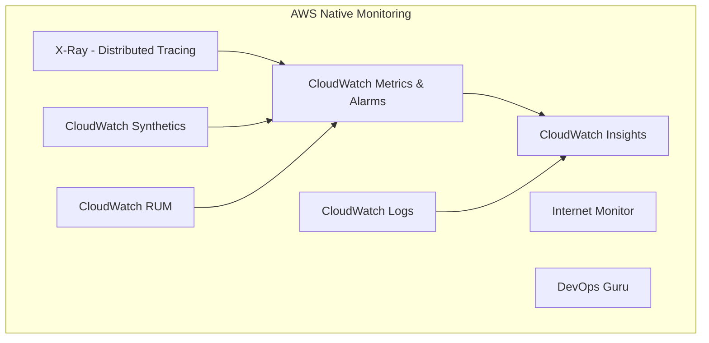
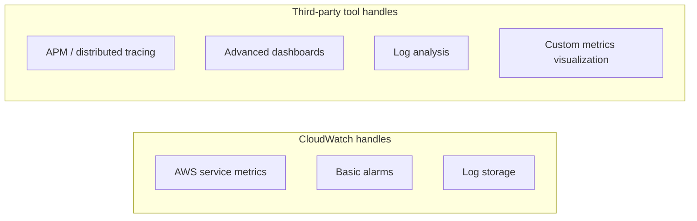

# Comparing AWS Monitoring Tools - CloudWatch vs Third-Party Options

Author: [nawazdhandala](https://github.com/nawazdhandala)

Tags: AWS, Monitoring, CloudWatch, Observability, DevOps

Description: A comparison of AWS-native monitoring tools against popular third-party alternatives, covering features, pricing, and use cases to help you choose the right stack.

---

Choosing monitoring tools for AWS infrastructure is rarely a simple decision. AWS offers a deep set of native services, but third-party tools bring features and workflows that AWS has not matched. This post breaks down the landscape, compares the options honestly, and helps you figure out where each tool fits.

## The AWS-Native Monitoring Stack

AWS does not have a single monitoring tool. It has several, each covering different aspects of observability.



**CloudWatch** handles metrics, logs, and alarms. It is the default and everything AWS emits data into it automatically.

**X-Ray** provides distributed tracing across services. It instruments your code to trace requests as they flow through Lambda, API Gateway, ECS, and downstream services.

**CloudWatch Synthetics** runs canary scripts that probe your endpoints on a schedule, similar to synthetic monitoring from third-party tools.

**DevOps Guru** uses machine learning to detect operational anomalies and recommend fixes. It is the newest addition and is still maturing.

## The Third-Party Landscape

The major players in AWS monitoring are Datadog, New Relic, Grafana Cloud, and Dynatrace. Each has carved out a position with different strengths.

### Feature Comparison

| Feature | CloudWatch | Datadog | New Relic | Grafana Cloud |
|---------|-----------|---------|-----------|---------------|
| AWS metric collection | Native | Via integration | Via integration | Via integration |
| Custom metrics | Yes | Yes | Yes | Yes |
| Log management | CloudWatch Logs | Log Management | Logs | Loki |
| Distributed tracing | X-Ray | APM | APM | Tempo |
| Dashboards | Basic | Advanced | Advanced | Advanced (Grafana) |
| Alerting | Good | Advanced | Advanced | Good |
| ML-based anomaly detection | Anomaly Detection + DevOps Guru | Watchdog | Applied Intelligence | Limited |
| Infrastructure maps | Limited | Yes | Yes | Limited |
| Real user monitoring | CloudWatch RUM | RUM | Browser | Faro |
| Pricing model | Pay per metric/API call | Per host + add-ons | Per GB ingested | Per metric + logs |

### Datadog

Datadog has become the default third-party choice for AWS monitoring. Its AWS integration pulls in CloudWatch metrics automatically and enriches them with tags from your AWS resources. The infrastructure map, which visualizes your resources and their relationships, is genuinely useful for understanding complex deployments.

Where Datadog shines:
- Unified platform covering metrics, logs, traces, and profiling
- Strong AWS integration that auto-discovers resources
- Powerful query language for metrics and logs
- Excellent dashboarding and collaboration features

Where it struggles:
- Cost. Datadog pricing scales aggressively with infrastructure size and add-on features. A medium-sized deployment can easily reach five or six figures annually.
- Vendor lock-in on dashboards, monitors, and integrations

### New Relic

New Relic repositioned itself with a consumption-based pricing model (pay per GB of data ingested). This makes costs more predictable for some workloads but can also become expensive with high log volumes.

Where New Relic shines:
- Full-stack observability in one platform
- Strong APM with code-level visibility
- Consumption pricing can be cheaper for smaller teams
- NRQL query language is powerful and well-documented

Where it struggles:
- The UI has gone through several redesigns and can feel inconsistent
- AWS integration is not as deep as Datadog's
- Alert configuration can be complex

### Grafana Cloud

Grafana Cloud is built on the open-source Grafana, Loki, Tempo, and Mimir stack. It appeals to teams that want flexibility and want to avoid vendor lock-in.

Where Grafana Cloud shines:
- Open-source foundations mean you can self-host if needed
- Grafana dashboards are the industry standard for visualization
- PromQL support for teams already using Prometheus
- More transparent pricing

Where it struggles:
- Requires more assembly; it is a toolkit rather than a turnkey platform
- AWS integration requires more configuration than Datadog
- Less polished onboarding experience

## Pricing Reality Check

Pricing is where most teams get burned. Here is a realistic comparison for a mid-size deployment: 50 EC2 instances, 10 RDS databases, 20 Lambda functions, and moderate log volume (100 GB/month).

```mermaid
bar chart
    title Estimated Monthly Cost (USD) - Mid-Size AWS Deployment
    x-axis ["CloudWatch", "Datadog", "New Relic", "Grafana Cloud"]
    y-axis "Monthly Cost (USD)" 0 --> 8000
    bar [800, 6500, 4000, 2500]
```

These are rough estimates and actual costs vary significantly based on configuration choices. But the order of magnitude is representative.

**CloudWatch** is cheap for basic monitoring but costs add up with custom metrics, high-resolution metrics, and heavy Logs Insights usage.

**Datadog** is the most expensive option for most deployments. The per-host pricing model plus add-ons for logs, APM, and other features compounds quickly.

**New Relic** falls in the middle, but watch your data ingestion volume carefully. High-volume logging can push costs up.

**Grafana Cloud** is typically the most cost-effective third-party option, especially if you can self-host some components.

## When to Use What

There is no universal right answer, but there are clear patterns based on team size, complexity, and budget.

### CloudWatch Only

Best for:
- Small teams with straightforward AWS architectures
- Teams with limited monitoring budgets
- Workloads that are primarily AWS-native services (Lambda, DynamoDB, S3)
- Early-stage companies where simplicity matters more than features

CloudWatch covers the basics well. If your architecture is mostly managed AWS services and you do not need advanced APM or complex dashboarding, it is a perfectly reasonable choice.

### CloudWatch + One Third-Party Tool

This is the most common setup for mid-size teams. Use CloudWatch for AWS infrastructure metrics (it is free for default metrics) and add a third-party tool for application-level observability.

A common split looks like this.



This approach lets you keep CloudWatch costs down (since you are mostly using default metrics) while getting the richer analysis and visualization from a third-party tool.

### Full Third-Party Stack

Best for:
- Large engineering teams with dedicated platform/SRE teams
- Complex microservices architectures
- Multi-cloud deployments where you need a single pane of glass
- Organizations where developer productivity justifies the higher cost

If you are running hundreds of services across multiple environments, a unified platform like Datadog or New Relic reduces context switching and makes it easier to correlate signals across your stack.

## Migration Considerations

Switching monitoring tools is painful. Dashboards, alerts, and runbooks all need to be recreated. Before committing to a tool, consider:

1. **Start with a proof of concept.** Most third-party tools offer free tiers or trials. Run them alongside CloudWatch for a month on a subset of your infrastructure.

2. **Evaluate the AWS integration depth.** How many clicks does it take to go from "I see high latency" to "here is the specific Lambda function and the slow database query causing it"? This workflow matters more than any feature checklist.

3. **Check the alert routing.** Can the tool integrate with your on-call system (PagerDuty, Opsgenie, etc.)? Does it support alert grouping and suppression?

4. **Consider data residency.** Third-party tools send your monitoring data outside your AWS account. For regulated industries, this may require additional compliance review.

5. **Measure actual costs.** Request a quote based on your real infrastructure size, not the pricing page estimates. Most vendors offer volume discounts but the starting prices can be misleading.

## Open-Source Alternatives

If budget is a primary constraint, the open-source stack of Prometheus, Grafana, and Loki running on your own infrastructure is a viable option. The trade-off is operational overhead: you are running and maintaining your monitoring infrastructure alongside your application infrastructure.

Tools like Thanos or Cortex add long-term storage and multi-tenancy to Prometheus, making it more suitable for production use at scale. But these add complexity.

The managed version (Grafana Cloud, Amazon Managed Prometheus, Amazon Managed Grafana) gives you the benefits of the open-source ecosystem without the operational burden, at a cost that is typically between CloudWatch and Datadog.

## Making the Decision

Ask these questions:

- **How many engineers will use the monitoring tools daily?** If it is 3 people, the investment in Datadog is harder to justify. If it is 30, the productivity gains are worth it.
- **How complex is your architecture?** Monolith on EC2? CloudWatch is fine. 50 microservices on ECS with Lambda and SQS? You probably need better tracing.
- **What is your monitoring budget?** If you have not set one, do it before evaluating tools. Otherwise you will pick the fanciest option and deal with sticker shock later.
- **Do you need multi-cloud support?** If yes, a third-party tool is almost mandatory since CloudWatch only covers AWS.

The best monitoring stack is the one your team actually uses. A perfectly configured Datadog instance that nobody looks at is worse than CloudWatch dashboards that your on-call engineers check every morning.
