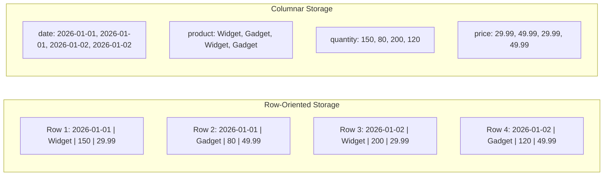
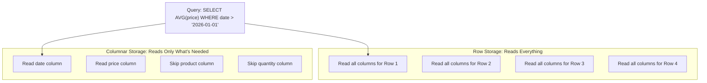
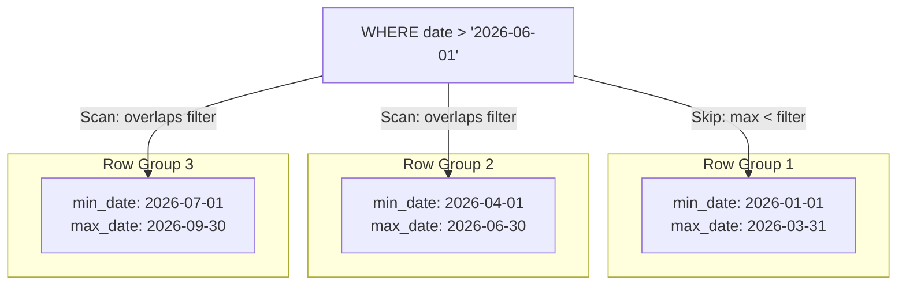
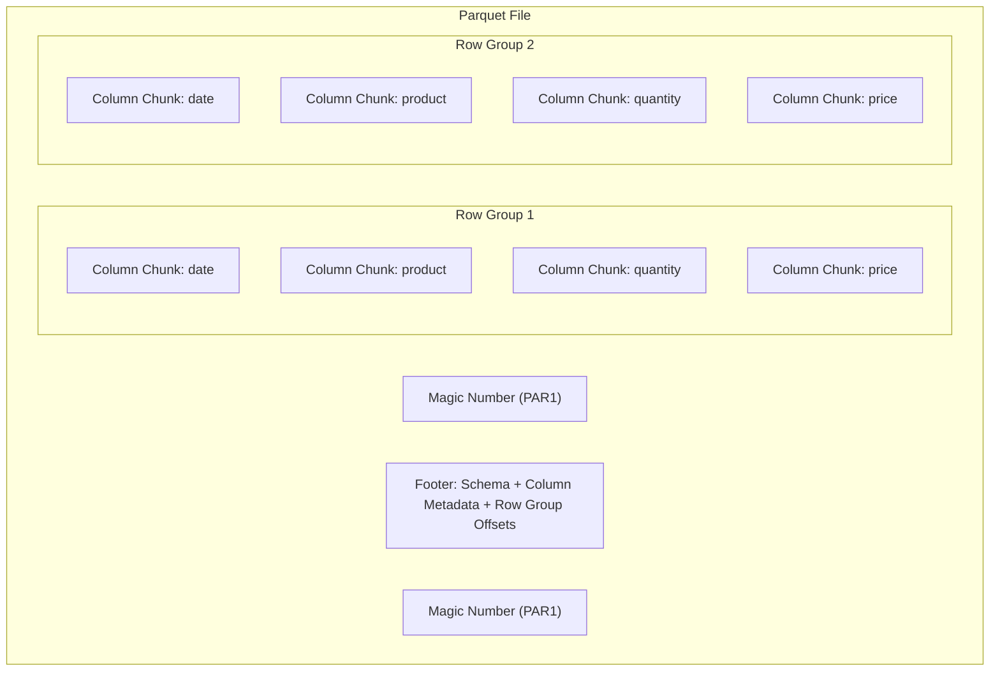

# Columnar Storage Explained - Why It Matters for Analytics

Author: [nawazdhandala](https://github.com/nawazdhandala)

Tags: Data Engineering, Columnar Storage, Parquet, Analytics, Performance

Description: An explanation of how columnar storage formats like Parquet and ORC work, why they outperform row-based storage for analytical queries, and when to use them.

---

If you have ever wondered why analytical queries on Parquet files run 10x to 100x faster than the same queries on CSV or JSON, the answer is columnar storage. The way data is physically arranged on disk has an enormous impact on query performance, compression ratios, and I/O efficiency. This post explains how columnar storage works under the hood and when you should (and should not) use it.

## Row vs. Column Orientation

Traditional databases and file formats (CSV, JSON, row-oriented databases like MySQL) store data row by row. Each row's fields are stored together on disk.

Columnar formats (Parquet, ORC, Arrow) store data column by column. All values for a single column are stored together, separate from other columns.

Consider a table with sales data:



This difference in physical layout has major consequences for how queries execute.

## Why Columnar Storage Wins for Analytics

Analytical queries have a characteristic pattern: they read many rows but only a few columns. A query like `SELECT AVG(price) FROM sales WHERE date > '2026-01-01'` only needs the `date` and `price` columns. It does not care about `product` or `quantity`.

### Column Pruning

In a row-oriented format, the storage engine must read every column of every row, even if the query only needs two columns out of twenty. The unwanted data is read from disk and then discarded.

In a columnar format, the engine reads only the columns referenced in the query. If your table has 20 columns and the query touches 2, you read roughly 10% of the data.



For wide tables (50+ columns), this difference alone can deliver a 10x reduction in I/O.

### Better Compression

Values in the same column share the same data type and often have similar values. A column of country codes contains a small set of repeated strings. A column of timestamps has incrementally increasing values. A column of boolean flags is mostly zeros and ones.

Columnar formats exploit this repetition with type-specific encoding schemes:

| Encoding | How It Works | Good For |
|----------|-------------|----------|
| Dictionary encoding | Replaces repeated values with integer codes | Low-cardinality strings (country, status) |
| Run-length encoding | Stores consecutive identical values as (value, count) | Sorted columns, flags |
| Delta encoding | Stores differences between consecutive values | Timestamps, incrementing IDs |
| Bit packing | Uses the minimum number of bits per value | Small integers, encoded values |

After these encoding steps, general-purpose compression (Snappy, Zstd, or Gzip) is applied. Because encoded column data has less entropy than raw row data, the compression ratios are dramatically better.

A typical result: a 10 GB CSV file becomes a 1-2 GB Parquet file. The same data in gzipped CSV might be 3-4 GB.

### Predicate Pushdown

Columnar formats store metadata about each chunk of data: min/max values, null counts, and sometimes bloom filters. Query engines use this metadata to skip entire chunks without reading them.

If a query filters on `date > '2026-06-01'` and a chunk's max date value is `2026-03-31`, the engine skips the entire chunk. For sorted or partially sorted data, this can eliminate the majority of I/O.



## Apache Parquet Deep Dive

Parquet is the most widely used columnar format in the data engineering ecosystem. It is the default output format for Spark, supported by every major query engine (Presto, Trino, DuckDB, BigQuery, Athena), and works with every major cloud data lake.

### Parquet File Structure

A Parquet file is organized into row groups, each containing column chunks, which are further divided into pages.



- **Row groups** are horizontal partitions of the data, typically 128 MB to 1 GB each. They define the unit of parallel processing.
- **Column chunks** contain all values for one column within one row group.
- **Pages** are the unit of compression and encoding within a column chunk, typically 1 MB.
- **Footer** contains the schema, column statistics, and offsets. Query engines read the footer first to plan which row groups and columns to read.

### Writing Parquet Files

Here is a Python example that writes a Parquet file with explicit schema control and compression settings.

```python
import pyarrow as pa
import pyarrow.parquet as pq

# Define schema with explicit types for better compression and compatibility
schema = pa.schema([
    pa.field("date", pa.date32()),
    pa.field("product", pa.dictionary(pa.int16(), pa.string())),
    pa.field("quantity", pa.int32()),
    pa.field("price", pa.float64()),
])

# Create sample data
table = pa.table({
    "date": [date(2026, 1, 1), date(2026, 1, 2)],
    "product": ["Widget", "Gadget"],
    "quantity": [150, 80],
    "price": [29.99, 49.99],
}, schema=schema)

# Write with Zstd compression and a 128MB row group size
pq.write_table(
    table,
    "sales.parquet",
    compression="zstd",
    row_group_size=128 * 1024 * 1024,
    use_dictionary=True,
    write_statistics=True,
)
```

Notice the `pa.dictionary()` type for the product column. This tells Parquet to use dictionary encoding, which is significantly more efficient for low-cardinality string columns.

### Reading Parquet Files Efficiently

The key to fast reads is only reading what you need. Both PyArrow and DuckDB support column selection and predicate pushdown.

```python
import pyarrow.parquet as pq

# Read only specific columns, pushing the filter to the file reader
# This avoids reading product and quantity columns from disk entirely
table = pq.read_table(
    "sales.parquet",
    columns=["date", "price"],
    filters=[("date", ">", "2026-01-01")],
)
```

With DuckDB, you get the same optimizations through SQL.

```sql
-- DuckDB automatically pushes predicates down to the Parquet reader
-- and only reads the columns referenced in the query
SELECT AVG(price)
FROM read_parquet('sales.parquet')
WHERE date > '2026-01-01';
```

## Apache ORC

ORC (Optimized Row Columnar) is Parquet's main competitor. It was developed in the Hadoop ecosystem and is the default format for Hive tables.

ORC and Parquet share the same fundamental design (columnar layout, row groups, encoding, compression). The differences are mostly in implementation details:

- ORC has built-in ACID support (used by Hive ACID tables)
- ORC includes bloom filters by default for string columns
- Parquet has broader ecosystem support outside Hadoop
- Parquet handles nested data (structs, arrays, maps) more naturally

For new projects, Parquet is typically the better choice due to wider tool support. If you are working in a Hive-centric environment, ORC is a solid option.

## When NOT to Use Columnar Storage

Columnar storage is not universally better. It has clear disadvantages in certain access patterns.

**Point lookups by primary key.** If you need to fetch a single row by ID, columnar storage is slow because it must read from every column chunk to reconstruct the row. Row-oriented storage reads one contiguous block.

**OLTP workloads.** Transactional databases that do frequent single-row inserts, updates, and deletes are a poor fit. Columnar formats are designed for bulk reads and batch writes.

**Very small datasets.** If your data fits in a single CSV file under a few megabytes, the overhead of Parquet metadata and encoding is not worth it. Just use CSV.

**Streaming writes.** Columnar formats work best with batch writes. You cannot efficiently append one row at a time to a Parquet file. If you need streaming ingestion, write to a row-oriented format first and convert to Parquet in batches.

## Columnar Storage in Practice

### Data Lakes

The standard pattern for data lakes is to store raw data as Parquet files in object storage (S3, GCS, ADLS), partitioned by date or another high-level key.

```
s3://data-lake/sales/
  year=2026/
    month=01/
      part-00000.parquet
      part-00001.parquet
    month=02/
      part-00000.parquet
```

This combination of columnar storage and partition pruning gives query engines two levels of data skipping: skip irrelevant partitions (directories), then skip irrelevant row groups within the remaining files.

### Data Warehouses

Every modern cloud data warehouse (BigQuery, Snowflake, Redshift, Databricks) uses columnar storage internally. When you load data into these systems, it gets re-organized into a columnar layout optimized for the warehouse's query engine.

Understanding columnar storage helps you write better queries in these systems. Queries that `SELECT *` from wide tables are inherently slower than queries that select specific columns, even in a warehouse, because they defeat column pruning.

### File Size Matters

Parquet file size impacts query performance. Too many small files create excessive metadata overhead and file-open operations. Too few large files limit parallelism.

The sweet spot depends on your query engine, but a general guideline is 128 MB to 1 GB per file after compression. If your pipeline produces thousands of tiny Parquet files, add a compaction step to merge them.

## Choosing the Right Compression

All columnar formats support multiple compression codecs. The choice is a trade-off between compression ratio and speed.

| Codec | Compression Ratio | Speed | Best For |
|-------|-------------------|-------|----------|
| Snappy | Lower | Fastest | Interactive queries, Spark jobs |
| Zstd | Higher | Fast | Data lakes, archival, Athena |
| Gzip | Higher | Slow | Maximum compression, cold storage |
| LZ4 | Lower | Fastest | Streaming, low-latency reads |

Zstd has become the default choice for most use cases because it offers compression ratios close to Gzip with speeds close to Snappy. When in doubt, use Zstd.

Columnar storage is one of those foundational concepts that pays dividends across the entire data stack. Whether you are designing a data lake, optimizing warehouse queries, or choosing a file format for data exchange, understanding how data is physically stored helps you make better decisions at every level.
