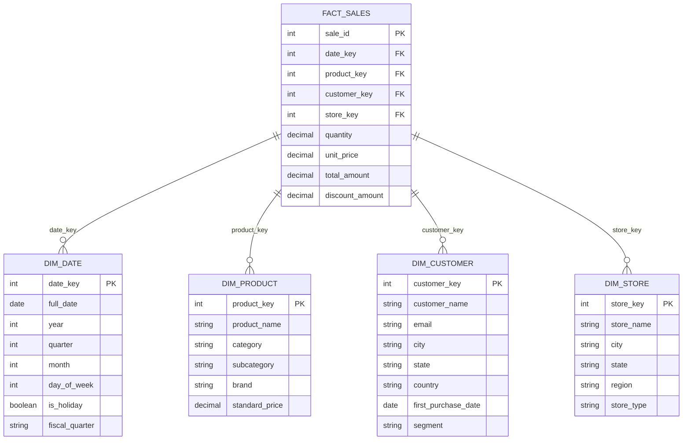
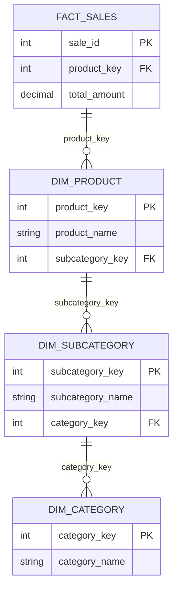

# A Practical Guide to Dimensional Modeling for Data Warehouses

Author: [nawazdhandala](https://github.com/nawazdhandala)

Tags: Data Engineering, Dimensional Modeling, Data Warehouse, Star Schema, Analytics

Description: A hands-on guide to dimensional modeling covering star schemas, snowflake schemas, slowly changing dimensions, and best practices for building maintainable data warehouses.

---

Dimensional modeling is the standard approach to structuring data in a warehouse for analytical queries. It was formalized by Ralph Kimball decades ago, and it remains the dominant methodology because it works. It produces schemas that are intuitive to query, perform well at scale, and map naturally to how business users think about data. This guide covers the core concepts with practical examples you can adapt for your own warehouse.

## Facts and Dimensions

Every dimensional model is built from two types of tables: fact tables and dimension tables.

**Fact tables** store measurements and events. Each row represents something that happened: a sale, a page view, a support ticket, a shipment. Fact tables contain foreign keys to dimension tables and numeric measures (amounts, counts, durations).

**Dimension tables** describe the context around facts. They answer who, what, where, when, and how. A customer dimension describes who bought something. A product dimension describes what was sold. A date dimension describes when it happened.



This is a star schema. The fact table sits in the center, connected to dimension tables through foreign keys. It is called a "star" because the diagram looks like one.

## Star Schema vs. Snowflake Schema

A snowflake schema normalizes the dimension tables further. Instead of a flat product dimension with category and subcategory columns, you would have separate category and subcategory tables.



Snowflake schemas save storage by eliminating repeated strings, but they require more joins at query time. In a modern columnar data warehouse (BigQuery, Snowflake, Redshift), the storage savings are negligible because compression handles repeated values efficiently. The additional joins, however, make queries more complex and can hurt performance.

**Recommendation:** Start with a star schema. Snowflake only when you have a specific reason, like a dimension that changes independently and updating it in a denormalized table would be expensive.

## The Date Dimension

Every warehouse needs a date dimension. It seems redundant (why not just use a date column?), but a proper date dimension makes queries far more convenient.

This SQL creates a date dimension table with fiscal calendar, holiday flags, and common grouping columns pre-computed.

```sql
-- Create and populate a date dimension for calendar years 2020-2030
CREATE TABLE dim_date AS
WITH date_spine AS (
    SELECT
        dateadd(day, seq4(), '2020-01-01'::date) AS full_date
    FROM table(generator(rowcount => 4018))
)
SELECT
    -- Surrogate key in YYYYMMDD format for easy filtering
    to_number(to_char(full_date, 'YYYYMMDD'))   AS date_key,
    full_date,
    extract(year FROM full_date)                  AS year,
    extract(quarter FROM full_date)               AS quarter,
    extract(month FROM full_date)                 AS month,
    extract(day FROM full_date)                   AS day_of_month,
    extract(dayofweek FROM full_date)             AS day_of_week,
    to_char(full_date, 'YYYY-Q')                  AS year_quarter,
    to_char(full_date, 'YYYY-MM')                 AS year_month,
    to_char(full_date, 'Day')                     AS day_name,
    to_char(full_date, 'Month')                   AS month_name,
    CASE
        WHEN extract(dayofweek FROM full_date) IN (0, 6) THEN TRUE
        ELSE FALSE
    END                                           AS is_weekend,
    -- Fiscal calendar (assuming fiscal year starts in April)
    CASE
        WHEN extract(month FROM full_date) >= 4
        THEN extract(year FROM full_date)
        ELSE extract(year FROM full_date) - 1
    END                                           AS fiscal_year,
    CASE
        WHEN extract(month FROM full_date) >= 4
        THEN ceil((extract(month FROM full_date) - 3) / 3.0)
        ELSE ceil((extract(month FROM full_date) + 9) / 3.0)
    END                                           AS fiscal_quarter
FROM date_spine;
```

With this dimension, a query for "total sales in fiscal Q2 2026" becomes a simple join and filter rather than complex date arithmetic.

## Fact Table Types

Not all fact tables store the same kind of data. The three main types serve different analytical needs.

### Transaction Facts

Each row represents a discrete event. This is the most common type. Examples: a sale, a click, a login event.

```sql
-- Transaction fact: one row per sale event
CREATE TABLE fact_sales (
    sale_id         BIGINT PRIMARY KEY,
    date_key        INT REFERENCES dim_date(date_key),
    product_key     INT REFERENCES dim_product(product_key),
    customer_key    INT REFERENCES dim_customer(customer_key),
    quantity        INT,
    unit_price      DECIMAL(10,2),
    discount_pct    DECIMAL(5,2),
    total_amount    DECIMAL(12,2)
);
```

### Periodic Snapshot Facts

Each row represents the state of something at regular intervals. Examples: daily account balances, monthly inventory levels, weekly pipeline summaries.

```sql
-- Periodic snapshot fact: one row per account per day
CREATE TABLE fact_daily_account_balance (
    date_key             INT REFERENCES dim_date(date_key),
    account_key          INT REFERENCES dim_account(account_key),
    opening_balance      DECIMAL(14,2),
    closing_balance      DECIMAL(14,2),
    total_deposits       DECIMAL(14,2),
    total_withdrawals    DECIMAL(14,2),
    transaction_count    INT,
    PRIMARY KEY (date_key, account_key)
);
```

### Accumulating Snapshot Facts

Each row represents a process with a defined start and end, and the row gets updated as the process progresses. Examples: order fulfillment, insurance claims, loan applications.

```sql
-- Accumulating snapshot: tracks order lifecycle milestones
CREATE TABLE fact_order_fulfillment (
    order_key           BIGINT PRIMARY KEY,
    customer_key        INT REFERENCES dim_customer(customer_key),
    order_date_key      INT REFERENCES dim_date(date_key),
    payment_date_key    INT REFERENCES dim_date(date_key),
    ship_date_key       INT REFERENCES dim_date(date_key),
    delivery_date_key   INT REFERENCES dim_date(date_key),
    order_amount        DECIMAL(12,2),
    days_to_ship        INT,
    days_to_deliver     INT
);
```

The date keys start as NULL and get filled in as the order progresses through each stage.

## Slowly Changing Dimensions (SCDs)

Dimension data changes over time. A customer moves to a new city. A product gets reclassified. How you handle these changes determines whether your historical analyses are correct.

### Type 1: Overwrite

Simply overwrite the old value with the new one. History is lost, but the dimension stays simple.

```sql
-- SCD Type 1: Just update the record in place
UPDATE dim_customer
SET city = 'San Francisco',
    state = 'CA'
WHERE customer_key = 12345;
```

Use Type 1 for corrections (fixing a typo) or attributes where history does not matter.

### Type 2: Track History with New Rows

Insert a new row for each change, with effective date columns to track which version was active when.

```sql
-- SCD Type 2 dimension table structure
CREATE TABLE dim_customer (
    customer_key        INT PRIMARY KEY,        -- Surrogate key (unique per version)
    customer_id         INT,                     -- Natural key (same across versions)
    customer_name       VARCHAR(200),
    city                VARCHAR(100),
    state               VARCHAR(50),
    effective_date      DATE,
    expiration_date     DATE,                    -- NULL or '9999-12-31' for current
    is_current          BOOLEAN
);
```

When a customer moves, the ETL process expires the old row and inserts a new one.

```sql
-- Step 1: Expire the current row
UPDATE dim_customer
SET expiration_date = current_date - 1,
    is_current = FALSE
WHERE customer_id = 42
  AND is_current = TRUE;

-- Step 2: Insert new version
INSERT INTO dim_customer (customer_key, customer_id, customer_name,
                          city, state, effective_date, expiration_date, is_current)
VALUES (next_surrogate_key(), 42, 'Jane Smith',
        'San Francisco', 'CA', current_date, '9999-12-31', TRUE);
```

Type 2 preserves full history. A sale from 2024 correctly associates with the customer's 2024 address, even though they moved in 2025. The trade-off is dimension table growth: every change creates a new row.

### Type 3: Track Limited History with New Columns

Add columns for the previous value. This only tracks the most recent change.

```sql
-- SCD Type 3: Previous and current values in the same row
ALTER TABLE dim_customer
ADD COLUMN previous_city VARCHAR(100),
ADD COLUMN previous_state VARCHAR(50),
ADD COLUMN city_change_date DATE;
```

Type 3 is rarely used in practice because it only captures one historical change. Type 2 is almost always a better choice when you need history.

## Conformed Dimensions

When multiple fact tables share a dimension (the same customer dimension used by both sales and support tickets), that dimension is called "conformed." Conformed dimensions enable cross-process analysis.


The customer dimension is defined once and used everywhere. This ensures that "customer segment = Enterprise" means the same thing across all analyses.

Conformed dimensions require governance. When the definition of a customer segment changes, it changes everywhere. This is a feature, not a bug, but it requires coordination across teams that own different fact tables.

## Surrogate Keys

Dimensional models use surrogate keys (warehouse-generated integers) rather than natural keys (business identifiers) as primary keys. The reasons:

1. **Natural keys change.** A product SKU can be reassigned. A customer email can change. Surrogate keys are immutable.
2. **Natural keys can be missing.** Unknown or anonymous customers need a row in the dimension. A surrogate key handles this cleanly.
3. **Natural keys can be non-uniform.** Different source systems might identify the same customer with different IDs. The surrogate key provides a single, consistent identifier.
4. **Performance.** Integer joins are faster than string joins.

Always include the natural key in the dimension table so you can trace back to the source system, but use the surrogate key for joins.

## Practical Tips

**Keep fact tables narrow.** Only store foreign keys and additive measures. Do not denormalize dimension attributes into the fact table. It seems like it would be faster, but it makes updates painful and bloats the table.

**Make dimensions wide.** Put every useful attribute in the dimension. Adding a column to a dimension is cheap. Users should be able to filter and group by any attribute without writing subqueries.

**Use a junk dimension for flags.** If your fact table has several low-cardinality flags (is_promotional, is_online, is_gift_wrapped), combine them into a single "junk" dimension rather than having separate boolean columns on the fact table.

**Build slowly.** Start with one fact table and its dimensions. Get it right, get users querying it, then add the next fact table. Trying to model the entire business upfront leads to analysis paralysis and models that do not match how people actually use the data.

Dimensional modeling is not glamorous, but it is the foundation that makes everything else in the analytics stack work. Get the model right, and dashboards, reports, and ad-hoc analyses all become straightforward. Get it wrong, and every query requires a workaround.
