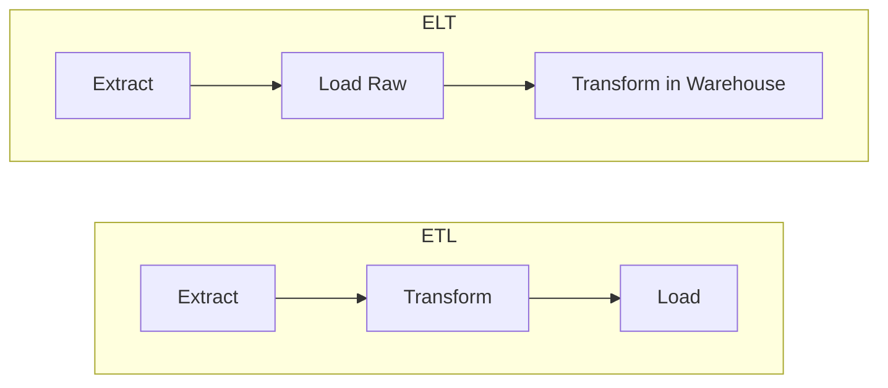
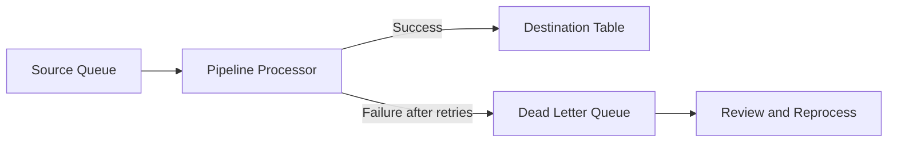
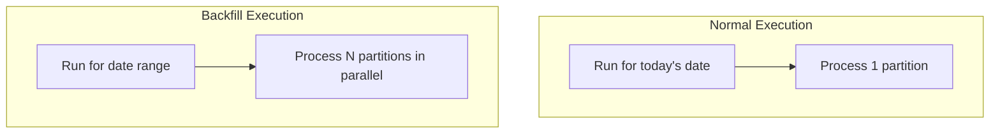

# ETL Best Practices for Building Reliable Data Pipelines

Author: [nawazdhandala](https://github.com/nawazdhandala)

Tags: Data Engineering, ETL, Data Pipelines, Best Practices, Data Quality

Description: Best practices for designing and building ETL pipelines including idempotency, error handling, data validation, monitoring, and choosing between ETL and ELT approaches.

---

ETL pipelines are the plumbing of the data stack. They are invisible when working correctly and catastrophic when they break. A failed pipeline means stale dashboards, incorrect reports, and a loss of trust that takes months to rebuild. This post covers the practices that separate reliable pipelines from fragile ones.

## ETL vs. ELT

Before diving into best practices, it is worth clarifying the two dominant approaches.

**ETL (Extract, Transform, Load):** Data is extracted from sources, transformed in an intermediate processing layer (Spark, Python, etc.), then loaded into the destination.

**ELT (Extract, Load, Transform):** Data is extracted from sources, loaded raw into the destination (usually a cloud data warehouse), then transformed using SQL inside the warehouse.



ELT has become the default approach for most analytics use cases because modern warehouses (BigQuery, Snowflake, Redshift) have enough compute power to handle transformations at scale. ETL is still preferred when:

- Transformations require complex logic that is difficult in SQL
- Data volumes are enormous and processing in the warehouse is too expensive
- Data needs to be cleaned or redacted before it enters the warehouse (PII, compliance)

Tools like dbt have made the "T" in ELT significantly more manageable by bringing software engineering practices (version control, testing, documentation) to SQL transformations.

## Idempotency: The Foundation

An idempotent pipeline produces the same result whether it runs once or ten times for the same input. This is the single most important property of a reliable pipeline.

Without idempotency, rerunning a failed pipeline can duplicate data, and you end up manually cleaning tables at 2 AM. With idempotency, you simply re-trigger the pipeline and move on.

### How to Achieve Idempotency

The standard pattern is to use partition-based overwrites rather than appending data.

This SQL demonstrates the partition-overwrite pattern, where each run replaces an entire date partition instead of appending to it.

```sql
-- Idempotent load: Replace the entire partition for the target date
-- Running this multiple times for the same date produces the same result
BEGIN TRANSACTION;

DELETE FROM analytics.daily_revenue
WHERE report_date = '{{ ds }}';

INSERT INTO analytics.daily_revenue
SELECT
    '{{ ds }}'::date                           AS report_date,
    product_category,
    SUM(order_total)                           AS total_revenue,
    COUNT(DISTINCT customer_id)                AS unique_customers,
    COUNT(*)                                   AS order_count
FROM raw.orders
WHERE order_date = '{{ ds }}'
GROUP BY product_category;

COMMIT;
```

The DELETE followed by INSERT within a transaction means re-running for the same date simply replaces the data rather than duplicating it. Some warehouses support MERGE or REPLACE syntax that achieves the same thing more concisely.

For file-based pipelines, write output to a deterministic path based on the partition.

```python
# Idempotent file output: overwrite the partition path
output_path = f"s3://data-lake/daily_revenue/date={execution_date}/"

# Write mode "overwrite" replaces existing files at this path
df.write.mode("overwrite").parquet(output_path)
```

## Data Validation

Catching bad data early prevents it from propagating through your pipeline and corrupting downstream tables.

### Row-Level Validation

Check individual records against expected constraints.

```python
# Row-level validation checks before loading data
def validate_orders(df):
    """Validate order data, returning clean and rejected DataFrames."""
    checks = {
        "positive_amount": df["order_total"] > 0,
        "valid_email": df["email"].str.contains(r"@.+\..+", na=False),
        "known_status": df["status"].isin(["pending", "shipped", "delivered", "cancelled"]),
        "not_future": df["order_date"] <= pd.Timestamp.now(),
    }

    # Combine all checks: a row is valid only if it passes every check
    all_valid = pd.concat(checks.values(), axis=1).all(axis=1)

    clean_df = df[all_valid].copy()
    rejected_df = df[~all_valid].copy()

    # Tag rejected rows with the reason for rejection
    for check_name, mask in checks.items():
        rejected_df.loc[~mask, "rejection_reason"] = check_name

    return clean_df, rejected_df
```

Route rejected rows to a quarantine table rather than silently dropping them. This gives you visibility into data quality issues and makes it possible to reprocess records once the source issue is fixed.

### Dataset-Level Validation

Beyond individual rows, validate the dataset as a whole. Check for expected volume, completeness, and consistency.

```python
# Dataset-level validation: catch anomalies in the overall batch
def validate_batch(df, execution_date, historical_avg_count):
    """Validate the batch against expected characteristics."""
    issues = []

    # Check that we received a reasonable number of rows
    row_count = len(df)
    if row_count == 0:
        issues.append("CRITICAL: Zero rows received")
    elif row_count < historical_avg_count * 0.5:
        issues.append(
            f"WARNING: Row count ({row_count}) is less than "
            f"50% of historical average ({historical_avg_count})"
        )

    # Check for unexpected NULL rates
    null_rate = df["customer_id"].isna().mean()
    if null_rate > 0.05:
        issues.append(
            f"WARNING: customer_id NULL rate is {null_rate:.1%}, "
            f"expected < 5%"
        )

    # Check that all dates fall within the expected range
    date_range = df["order_date"].agg(["min", "max"])
    if str(date_range["min"]) != str(execution_date):
        issues.append(
            f"WARNING: Min date {date_range['min']} does not match "
            f"execution date {execution_date}"
        )

    return issues
```

Treat validation failures like test failures. Critical issues should halt the pipeline. Warnings should be logged and surfaced to the team.

## Error Handling and Retries

Network failures, API rate limits, and transient database errors are a fact of life. Your pipeline needs to handle them gracefully.

### Retry with Backoff

For transient errors, retry with exponential backoff. This pattern works for API calls, database connections, and file operations.

```python
import time
import random

def retry_with_backoff(func, max_retries=3, base_delay=1.0):
    """
    Retry a function with exponential backoff and jitter.
    Handles transient failures in API calls, DB connections, etc.
    """
    for attempt in range(max_retries + 1):
        try:
            return func()
        except Exception as e:
            if attempt == max_retries:
                raise  # Final attempt failed, propagate the exception

            # Exponential backoff with random jitter to avoid thundering herd
            delay = base_delay * (2 ** attempt) + random.uniform(0, 1)
            print(f"Attempt {attempt + 1} failed: {e}. "
                  f"Retrying in {delay:.1f}s...")
            time.sleep(delay)
```

### Dead Letter Queues

For streaming or event-driven pipelines, use a dead letter queue (DLQ) to capture records that fail processing after all retries. This prevents a single bad record from blocking the entire pipeline.



## Pipeline Monitoring

A pipeline without monitoring is a pipeline waiting to fail silently. Track these signals at minimum.

### Execution Metrics

Every pipeline run should record:

- **Start time and end time** (to detect regressions in processing duration)
- **Row counts** at each stage (extracted, transformed, loaded, rejected)
- **Data freshness** (the max timestamp in the loaded data)
- **Success or failure status**

This Python class captures execution metrics and logs them for each pipeline run.

```python
from dataclasses import dataclass, field
from datetime import datetime

@dataclass
class PipelineMetrics:
    """Track key metrics for each pipeline execution."""
    pipeline_name: str
    execution_date: str
    start_time: datetime = field(default_factory=datetime.utcnow)
    end_time: datetime = None
    rows_extracted: int = 0
    rows_transformed: int = 0
    rows_loaded: int = 0
    rows_rejected: int = 0
    status: str = "running"
    error_message: str = None

    def complete(self, status="success"):
        self.end_time = datetime.utcnow()
        self.status = status

    def duration_seconds(self):
        if self.end_time:
            return (self.end_time - self.start_time).total_seconds()
        return None

    def to_dict(self):
        return {
            "pipeline_name": self.pipeline_name,
            "execution_date": self.execution_date,
            "start_time": self.start_time.isoformat(),
            "end_time": self.end_time.isoformat() if self.end_time else None,
            "duration_seconds": self.duration_seconds(),
            "rows_extracted": self.rows_extracted,
            "rows_transformed": self.rows_transformed,
            "rows_loaded": self.rows_loaded,
            "rows_rejected": self.rows_rejected,
            "status": self.status,
            "error_message": self.error_message,
        }
```

Store these metrics in a dedicated table and build a dashboard over it. You want to see trends in row counts, processing times, and failure rates at a glance.

### Data Freshness Alerts

Data freshness is often more important than pipeline success. A pipeline can succeed but load stale data if the source was delayed. Monitor the max event timestamp in your target tables and alert when it falls behind expectations.

```sql
-- Check data freshness: alert if the most recent data is over 2 hours old
SELECT
    table_name,
    MAX(event_timestamp)                                   AS latest_data,
    DATEDIFF(hour, MAX(event_timestamp), CURRENT_TIMESTAMP) AS hours_behind
FROM analytics.event_stream
GROUP BY table_name
HAVING hours_behind > 2;
```

## Schema Evolution

Source schemas change. Columns get added, renamed, or removed. Your pipeline needs to handle this without breaking.

### Defensive Schema Handling

Select columns explicitly rather than using `SELECT *`. This way, new columns in the source do not break your transformations, and removed columns surface as clear errors.

```python
# Explicit column selection with type casting for defensive schema handling
EXPECTED_COLUMNS = {
    "order_id": "int64",
    "customer_id": "int64",
    "order_date": "datetime64[ns]",
    "order_total": "float64",
    "status": "string",
}

def apply_schema(df):
    """
    Select expected columns and cast types.
    Raises a clear error if expected columns are missing.
    """
    missing = set(EXPECTED_COLUMNS.keys()) - set(df.columns)
    if missing:
        raise ValueError(f"Missing expected columns: {missing}")

    # Select only expected columns in the defined order
    df = df[list(EXPECTED_COLUMNS.keys())].copy()

    # Cast each column to the expected type
    for col, dtype in EXPECTED_COLUMNS.items():
        df[col] = df[col].astype(dtype)

    return df
```

## Backfill Strategy

At some point, you will need to reprocess historical data, whether due to a bug fix, a new column, or a schema change. Design your pipelines to support backfills from day one.



Key principles for backfill-friendly pipelines:

1. **Parameterize the execution date.** Never hardcode `today()` or `now()`. Pass the date as a parameter so the same pipeline logic works for historical dates.

2. **Idempotent loads.** This is why idempotency matters so much. Backfills re-run the pipeline for historical dates, and you need each run to produce correct results regardless of what data already exists.

3. **Parallelizable partitions.** Each date partition should be independent, allowing you to backfill multiple dates in parallel.

4. **Source data availability.** Ensure your source data is retained long enough to support backfills. If your source only keeps 30 days of data, you cannot backfill beyond that window.

## Testing Pipelines

Treat pipeline code like application code. Write tests.

```python
import pandas as pd
import pytest

def test_revenue_calculation():
    """Verify that revenue transformation handles edge cases correctly."""
    # Arrange: create test input with known values
    input_df = pd.DataFrame({
        "order_id": [1, 2, 3],
        "quantity": [2, 0, 1],
        "unit_price": [10.00, 25.00, 0.00],
        "discount_pct": [0.10, 0.00, 0.00],
    })

    # Act: run the transformation
    result = calculate_revenue(input_df)

    # Assert: verify expected output
    assert result.loc[0, "total_revenue"] == 18.00   # 2 * 10 * 0.9
    assert result.loc[1, "total_revenue"] == 0.00    # 0 quantity
    assert result.loc[2, "total_revenue"] == 0.00    # 0 price


def test_validate_orders_rejects_negative_amounts():
    """Verify that negative order amounts are rejected."""
    input_df = pd.DataFrame({
        "order_id": [1],
        "order_total": [-50.00],
        "email": ["test@example.com"],
        "status": ["pending"],
        "order_date": [pd.Timestamp("2026-01-01")],
    })

    clean, rejected = validate_orders(input_df)
    assert len(clean) == 0
    assert len(rejected) == 1
```

Unit tests for transformation logic are cheap to write and catch regressions before they reach production. Integration tests that run against a test database with sample data catch issues that unit tests miss, like type mismatches and constraint violations.

## Orchestration

Use a proper orchestrator (Airflow, Dagster, Prefect) rather than cron jobs. Orchestrators give you:

- **Dependency management.** Define which pipelines depend on which, and let the scheduler handle execution order.
- **Retry policies.** Configure automatic retries with backoff at the task level.
- **Backfill support.** Re-run pipelines for historical dates through the UI.
- **Monitoring and alerting.** Built-in visibility into pipeline status and SLA tracking.
- **Audit trail.** Full history of when each pipeline ran, what it produced, and whether it succeeded.

Cron jobs scale to about three pipelines before you lose track of what depends on what and start debugging failures by tailing log files on a server.

## Putting It Together

Reliable ETL is not about any single technique. It is the combination of idempotent loads, data validation, proper error handling, monitoring, and testing that creates a system you can trust. Start with idempotency and validation, add monitoring early, and build in testing and backfill support as your pipeline count grows. The upfront investment pays back every time a pipeline fails at 3 AM and you can fix it with a simple re-run instead of a manual data cleanup.
