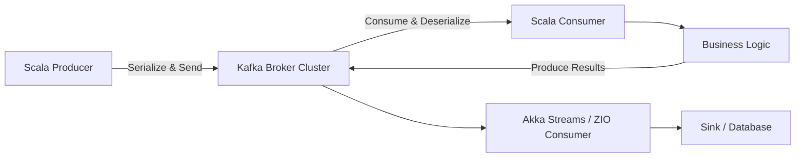

# How to Use Apache Kafka with Scala

Author: [nawazdhandala](https://github.com/nawazdhandala)

Tags: Kafka, Scala, Streaming, JVM, Event-Driven

Description: A practical guide to building Kafka producers and consumers in Scala, covering serialization, error handling, and integration with Akka Streams and ZIO.

---

Apache Kafka and Scala share deep roots in the JVM ecosystem. Kafka itself was originally written in Scala, and the two technologies pair naturally when you need to build high-throughput, event-driven systems. This guide walks through building producers and consumers in Scala, handling serialization properly, dealing with errors, and integrating with both Akka Streams and ZIO for more idiomatic functional programming.

## Why Scala for Kafka?

Scala gives you strong type safety, pattern matching, and functional composition. These features matter when you are processing streams of events where data integrity and error handling are critical. The Kafka client library is a Java library, but Scala wrappers and integrations make the experience significantly cleaner.

Here is a high-level view of how a typical Kafka-based Scala application is structured:



## Setting Up Dependencies

You will need the Kafka client library and a few Scala-specific libraries. Here is a typical `build.sbt` configuration:

```scala
// build.sbt - Core dependencies for Kafka with Scala
libraryDependencies ++= Seq(
  "org.apache.kafka"  % "kafka-clients"    % "3.7.0",
  "io.circe"         %% "circe-core"       % "0.14.7",
  "io.circe"         %% "circe-generic"    % "0.14.7",
  "io.circe"         %% "circe-parser"     % "0.14.7"
)
```

## Building a Producer

The Kafka Java client works fine from Scala, but wrapping it in a class with proper resource management makes it production-ready.

```scala
// A typed Kafka producer that handles serialization through Circe JSON encoding
import org.apache.kafka.clients.producer._
import org.apache.kafka.common.serialization.StringSerializer
import io.circe.syntax._
import io.circe.Encoder
import java.util.Properties

class TypedKafkaProducer(bootstrapServers: String) {

  private val props = new Properties()
  props.put(ProducerConfig.BOOTSTRAP_SERVERS_CONFIG, bootstrapServers)
  props.put(ProducerConfig.KEY_SERIALIZER_CLASS_CONFIG, classOf[StringSerializer].getName)
  props.put(ProducerConfig.VALUE_SERIALIZER_CLASS_CONFIG, classOf[StringSerializer].getName)
  props.put(ProducerConfig.ACKS_CONFIG, "all")
  props.put(ProducerConfig.RETRIES_CONFIG, "3")
  props.put(ProducerConfig.ENABLE_IDEMPOTENCE_CONFIG, "true")

  private val producer = new KafkaProducer[String, String](props)

  def send[T: Encoder](topic: String, key: String, value: T): Unit = {
    val json = value.asJson.noSpaces
    val record = new ProducerRecord[String, String](topic, key, json)

    producer.send(record, new Callback {
      override def onCompletion(metadata: RecordMetadata, exception: Exception): Unit = {
        if (exception != null) {
          System.err.println(s"Failed to send record to $topic: ${exception.getMessage}")
        }
      }
    })
  }

  def close(): Unit = producer.close()
}
```

Notice that idempotence is enabled. This means that even if the producer retries a send, Kafka will deduplicate the message. This is essential for exactly-once semantics.

## Building a Consumer

Consumers require more thought around offset management and error handling. Here is a consumer that processes records with proper shutdown handling:

```scala
// A consumer that polls Kafka and processes records with manual offset commits
import org.apache.kafka.clients.consumer._
import org.apache.kafka.common.serialization.StringDeserializer
import io.circe.parser.decode
import io.circe.Decoder
import java.time.Duration
import java.util.{Collections, Properties}
import scala.util.{Try, Success, Failure}

class TypedKafkaConsumer[T: Decoder](
    bootstrapServers: String,
    groupId: String,
    topic: String
) {

  private val props = new Properties()
  props.put(ConsumerConfig.BOOTSTRAP_SERVERS_CONFIG, bootstrapServers)
  props.put(ConsumerConfig.GROUP_ID_CONFIG, groupId)
  props.put(ConsumerConfig.KEY_DESERIALIZER_CLASS_CONFIG, classOf[StringDeserializer].getName)
  props.put(ConsumerConfig.VALUE_DESERIALIZER_CLASS_CONFIG, classOf[StringDeserializer].getName)
  props.put(ConsumerConfig.ENABLE_AUTO_COMMIT_CONFIG, "false")
  props.put(ConsumerConfig.AUTO_OFFSET_RESET_CONFIG, "earliest")

  private val consumer = new KafkaConsumer[String, String](props)
  @volatile private var running = true

  def poll(handler: T => Unit): Unit = {
    consumer.subscribe(Collections.singletonList(topic))

    while (running) {
      val records = consumer.poll(Duration.ofMillis(500))
      val iterator = records.iterator()

      while (iterator.hasNext) {
        val record = iterator.next()
        decode[T](record.value()) match {
          case Right(value) =>
            Try(handler(value)) match {
              case Success(_) => // processed ok
              case Failure(ex) =>
                System.err.println(s"Handler failed for offset ${record.offset()}: ${ex.getMessage}")
            }
          case Left(err) =>
            System.err.println(s"Deserialization failed: ${err.getMessage}")
        }
      }

      consumer.commitSync()
    }

    consumer.close()
  }

  def shutdown(): Unit = { running = false }
}
```

Auto-commit is turned off intentionally. By committing offsets manually after processing, you avoid the scenario where a message is marked as consumed but the handler actually failed.

## Custom Serialization with Circe

Circe handles JSON serialization through type class derivation. Define your case classes and the encoders/decoders come for free:

```scala
// Domain models with automatic JSON codec derivation via Circe
import io.circe.generic.auto._

case class OrderEvent(
    orderId: String,
    customerId: String,
    amount: BigDecimal,
    timestamp: Long
)

case class ShipmentEvent(
    orderId: String,
    carrier: String,
    trackingNumber: String
)
```

With `circe-generic` on the classpath and the `auto._` import, `Encoder[OrderEvent]` and `Decoder[OrderEvent]` are derived at compile time. No runtime reflection, no annotation processing.

## Integrating with Akka Streams

Alpakka Kafka (formerly Reactive Kafka) provides a streaming interface to Kafka that integrates with Akka Streams. This gives you backpressure, stream composition, and supervision out of the box.

```scala
// Akka Streams consumer with backpressure and at-least-once delivery
import akka.actor.ActorSystem
import akka.kafka.scaladsl.{Consumer, Committer}
import akka.kafka.{ConsumerSettings, CommitterSettings}
import org.apache.kafka.common.serialization.StringDeserializer

implicit val system: ActorSystem = ActorSystem("kafka-streams")

val consumerSettings = ConsumerSettings(system, new StringDeserializer, new StringDeserializer)
  .withBootstrapServers("localhost:9092")
  .withGroupId("akka-consumer-group")

val committerSettings = CommitterSettings(system)

// committableSource gives us a stream of messages with committable offsets
Consumer
  .committableSource(consumerSettings, akka.kafka.Subscriptions.topics("orders"))
  .map { msg =>
    println(s"Processing: ${msg.record.value()}")
    msg.committableOffset
  }
  .via(Committer.flow(committerSettings))
  .run()
```

The `committableSource` pattern ensures that offsets are only committed after the message has passed through the entire stream graph. If any stage fails, the offset is not committed and the message will be redelivered.

## Integrating with ZIO

ZIO Kafka provides a purely functional interface. If your team uses ZIO, this is the idiomatic way to work with Kafka:

```scala
// ZIO Kafka consumer using the ZStream API for functional composition
import zio._
import zio.kafka.consumer._
import zio.kafka.serde.Serde

val consumer: ZIO[Consumer, Throwable, Unit] =
  Consumer
    .plainStream(Subscription.topics("orders"), Serde.string, Serde.string)
    .tap(record => Console.printLine(s"Got: ${record.value}"))
    .map(_.offset)
    .aggregateAsync(Consumer.offsetBatches)
    .mapZIO(_.commit)
    .runDrain
```

ZIO Kafka handles offset batching automatically. The `aggregateAsync` combinator collects offsets and commits them in batches, reducing the number of round trips to the broker.

## Error Handling Strategies

There are three common patterns for handling poison pill messages (messages that consistently fail processing):

1. **Dead letter queue**: Send the failed message to a separate topic for later inspection.
2. **Skip and log**: Log the failure and move on. Simple but you lose the message.
3. **Retry with backoff**: Retry a fixed number of times with increasing delays.

```scala
// Dead letter queue pattern - sends unprocessable messages to a separate topic
def processWithDLQ[T: Decoder: Encoder](
    raw: String,
    handler: T => Unit,
    dlqProducer: TypedKafkaProducer,
    dlqTopic: String
): Unit = {
  decode[T](raw) match {
    case Right(value) =>
      Try(handler(value)) match {
        case Success(_) => ()
        case Failure(_) =>
          dlqProducer.send(dlqTopic, "failed", raw)
      }
    case Left(_) =>
      dlqProducer.send(dlqTopic, "parse-error", raw)
  }
}
```

## Performance Tuning

A few configuration knobs that matter most in production:

- **`linger.ms`**: Set to 5-20ms to allow the producer to batch messages. Default is 0, which sends every message immediately.
- **`batch.size`**: Increase from the default 16KB to 64KB or more for high-throughput topics.
- **`fetch.min.bytes`** on the consumer: Set higher (e.g., 50KB) to reduce the number of fetch requests when throughput matters more than latency.
- **`max.poll.records`**: Control how many records a single poll returns. Set this based on how long your processing takes per record.

```scala
// Producer configuration tuned for high throughput
props.put(ProducerConfig.LINGER_MS_CONFIG, "10")
props.put(ProducerConfig.BATCH_SIZE_CONFIG, "65536")
props.put(ProducerConfig.COMPRESSION_TYPE_CONFIG, "lz4")
props.put(ProducerConfig.BUFFER_MEMORY_CONFIG, "67108864") // 64MB
```

## Testing

Use the `EmbeddedKafka` library for integration tests. It spins up a Kafka broker in-process, so your tests do not need Docker or external infrastructure.

```scala
// Integration test using EmbeddedKafka for an in-process broker
import io.github.embeddedkafka.EmbeddedKafka._
import org.scalatest.flatspec.AnyFlatSpec

class KafkaProducerSpec extends AnyFlatSpec {
  "TypedKafkaProducer" should "send and receive messages" in {
    withRunningKafka {
      val producer = new TypedKafkaProducer("localhost:6001")
      producer.send("test-topic", "key1", OrderEvent("o1", "c1", 99.99, System.currentTimeMillis()))
      val message = consumeFirstStringMessageFrom("test-topic")
      assert(message.contains("o1"))
      producer.close()
    }
  }
}
```

## Summary

Scala and Kafka are a strong combination for event-driven systems. The Java client works directly, but the real power comes from Scala-specific integrations: Circe for type-safe serialization, Akka Streams for backpressured stream processing, and ZIO Kafka for purely functional pipelines. Whichever approach you pick, always disable auto-commit, enable idempotence on the producer side, and have a dead letter queue strategy for messages that cannot be processed.
