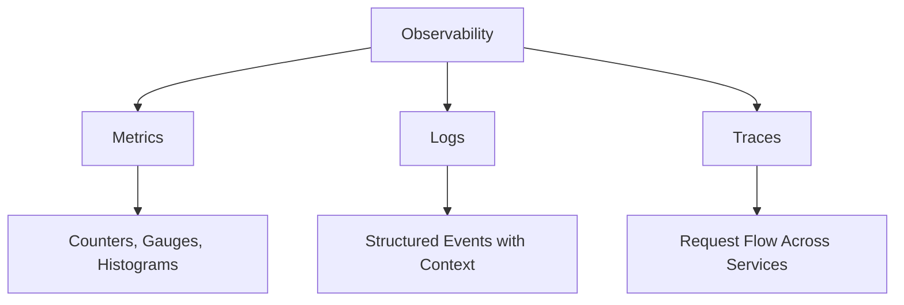
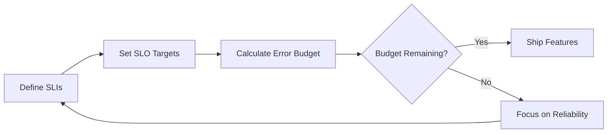
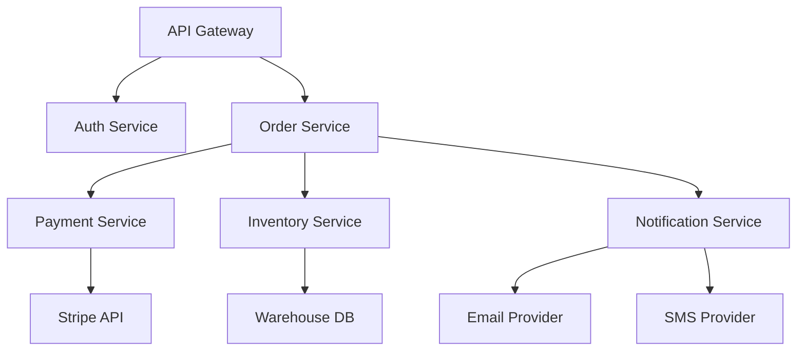
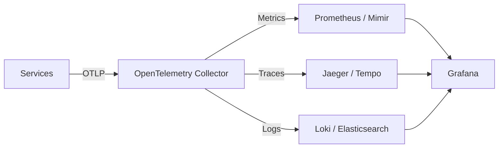

# How to Monitor Microservices Effectively

Author: [nawazdhandala](https://github.com/nawazdhandala)

Tags: Microservices, Monitoring, Observability, Distributed Systems, DevOps

Description: A guide to monitoring microservices architectures covering the three pillars of observability, service-level objectives, distributed tracing, and alerting strategies.

---

Monitoring a monolith is straightforward: you watch CPU, memory, disk, and a handful of application metrics. Microservices change the game entirely. You now have dozens or hundreds of services communicating over the network, each with its own failure modes, deployment cadence, and resource profile. The approaches that worked for a single application fall apart when applied to a distributed system.

This guide covers the practical techniques and architectural patterns that make microservices monitoring workable.

## The Three Pillars of Observability

Every monitoring strategy for microservices builds on three types of telemetry data:



**Metrics** are numeric measurements aggregated over time. They are cheap to store and fast to query. Use them for dashboards and alerting.

**Logs** are discrete events. In a microservices environment, logs must be structured (JSON, not free-form text) and include correlation IDs so you can trace a request across services.

**Traces** represent the journey of a single request through multiple services. Each service adds a span to the trace, and the assembled trace shows you exactly where time was spent.

None of these is sufficient on its own. Metrics tell you something is wrong. Logs tell you what happened. Traces tell you where it happened.

## Service-Level Objectives (SLOs)

Before you instrument anything, define what "healthy" means for each service. SLOs give you that definition.

An SLO is a target for a service-level indicator (SLI). For example:

- 99.9% of API requests complete in under 200ms
- 99.95% of payment processing requests succeed
- 99.99% of health check endpoints return 200

The error budget is the inverse of your SLO. If your SLO is 99.9% availability, your error budget allows 0.1% downtime per measurement window. When the error budget is spent, you stop deploying new features and focus on reliability.



This framework prevents two failure modes: teams that never ship because they are chasing perfect reliability, and teams that ship so fast they break everything.

## What to Monitor in Each Service

Every microservice should expose a baseline set of metrics. The RED method (Rate, Errors, Duration) is the standard:

- **Rate**: requests per second
- **Errors**: failed requests per second
- **Duration**: distribution of response times (use histograms, not averages)

Here is a Prometheus instrumentation example for a Go HTTP service:

```go
// Prometheus middleware that tracks request rate, errors, and duration per endpoint
import (
    "github.com/prometheus/client_golang/prometheus"
    "github.com/prometheus/client_golang/prometheus/promauto"
)

var (
    httpRequestsTotal = promauto.NewCounterVec(
        prometheus.CounterOpts{
            Name: "http_requests_total",
            Help: "Total HTTP requests",
        },
        []string{"method", "endpoint", "status"},
    )

    httpRequestDuration = promauto.NewHistogramVec(
        prometheus.HistogramOpts{
            Name:    "http_request_duration_seconds",
            Help:    "HTTP request duration in seconds",
            Buckets: []float64{0.01, 0.05, 0.1, 0.25, 0.5, 1.0, 2.5, 5.0},
        },
        []string{"method", "endpoint"},
    )
)
```

Notice the histogram buckets are chosen to match the SLO thresholds. If your SLO says "200ms," you need a bucket boundary at 0.2 seconds to query against it.

## Distributed Tracing

When a user request touches five services, and the response is slow, you need tracing to figure out which service is the bottleneck.

OpenTelemetry is the standard. It provides SDKs for most languages and exports to backends like Jaeger, Zipkin, or cloud-native solutions.

```python
# OpenTelemetry tracing setup for a Python Flask service
from opentelemetry import trace
from opentelemetry.sdk.trace import TracerProvider
from opentelemetry.sdk.trace.export import BatchSpanProcessor
from opentelemetry.exporter.otlp.proto.grpc.trace_exporter import OTLPSpanExporter
from opentelemetry.instrumentation.flask import FlaskInstrumentor
from opentelemetry.instrumentation.requests import RequestsInstrumentor

# Initialize the tracer with OTLP export to a collector
provider = TracerProvider()
processor = BatchSpanProcessor(OTLPSpanExporter(endpoint="http://otel-collector:4317"))
provider.add_span_processor(processor)
trace.set_tracer_provider(provider)

# Auto-instrument Flask and outgoing HTTP requests
FlaskInstrumentor().instrument()
RequestsInstrumentor().instrument()
```

The key insight is that auto-instrumentation covers the framework-level spans (HTTP handlers, database clients, HTTP clients), but you still need manual instrumentation for business-critical operations:

```python
# Manual span for a business-critical operation within a request handler
tracer = trace.get_tracer(__name__)

def process_order(order):
    with tracer.start_as_current_span("process_order") as span:
        span.set_attribute("order.id", order.id)
        span.set_attribute("order.total", float(order.total))
        # validation, payment, inventory reservation...
        validate_order(order)
        charge_payment(order)
        reserve_inventory(order)
```

## Structured Logging with Correlation

Unstructured logs in a microservices environment are nearly useless. When you have 50 services each producing thousands of log lines per second, grep is not a debugging strategy.

Every log entry should include:

- A trace ID or correlation ID
- The service name and version
- A structured payload (JSON)

```json
{
  "timestamp": "2026-02-13T14:22:31.442Z",
  "level": "error",
  "service": "payment-service",
  "version": "2.4.1",
  "trace_id": "abc123def456",
  "span_id": "789ghi",
  "message": "Payment gateway timeout",
  "gateway": "stripe",
  "retry_count": 2,
  "order_id": "ord-9981"
}
```

With structured logs and a trace ID, you can query your log aggregation system for every log line related to a single user request across all services.

## Health Checks and Readiness Probes

Every microservice should expose two endpoints:

- `/health` (liveness): "Is the process running and not deadlocked?"
- `/ready` (readiness): "Can this instance handle traffic right now?"

The distinction matters in Kubernetes. A failing liveness probe restarts the pod. A failing readiness probe removes the pod from the service's load balancer but does not restart it. This is important during startup (when the service is loading caches or warming connections) and during dependency outages (when the service is running but cannot serve useful responses).

```yaml
# Kubernetes deployment with separate liveness and readiness probes
livenessProbe:
  httpGet:
    path: /health
    port: 8080
  initialDelaySeconds: 10
  periodSeconds: 15
  failureThreshold: 3
readinessProbe:
  httpGet:
    path: /ready
    port: 8080
  initialDelaySeconds: 5
  periodSeconds: 5
  failureThreshold: 2
```

## Alerting Strategy

The biggest mistake teams make is alerting on symptoms they cannot act on. Follow these principles:

**Alert on SLO burn rate, not raw thresholds.** Instead of alerting when p99 latency exceeds 500ms, alert when you are consuming your error budget faster than expected. A brief spike that resolves itself should not page anyone at 3am.

**Use multi-window burn rates.** Check both a short window (5 minutes) and a long window (1 hour). This catches both sudden failures and slow degradation while filtering out noise.

```yaml
# Prometheus alerting rule using multi-window burn rate
groups:
  - name: slo-alerts
    rules:
      - alert: HighErrorBurnRate
        # Fires when 5m burn rate exceeds 14x AND 1h burn rate exceeds 14x
        expr: |
          (
            sum(rate(http_requests_total{status=~"5.."}[5m]))
            / sum(rate(http_requests_total[5m]))
          ) > (14 * 0.001)
          and
          (
            sum(rate(http_requests_total{status=~"5.."}[1h]))
            / sum(rate(http_requests_total[1h]))
          ) > (14 * 0.001)
        labels:
          severity: page
```

**Tier your alerts.** Page-worthy alerts (service is down, data loss imminent) go to on-call. Warning-level alerts (elevated error rate, approaching capacity) go to a Slack channel for next-business-day review.

## Service Dependency Mapping

You cannot monitor what you do not understand. Maintain a dependency map that shows which services call which other services. Distributed tracing can generate this automatically, but you should also have a static map in your documentation.



This map tells you that if the Payment Service is down, the Order Service will be affected, but Auth and Notification will not. That information is critical for incident response.

## Centralized Observability Platform

All telemetry data needs to flow into a centralized platform. Running separate tools for metrics, logs, and traces creates silos. When you are debugging an incident, you need to jump from a metric anomaly to the relevant traces to the specific log lines without switching between three different UIs.

The collection pipeline typically looks like this:



The OpenTelemetry Collector acts as a routing layer. Services send all telemetry to the collector, and the collector fans it out to the appropriate backends. This decouples your services from your backend choices, so you can switch from Jaeger to Tempo without changing a single line of application code.

## Practical Recommendations

Start small and expand. Do not try to instrument everything on day one. Begin with the RED metrics on your most critical services, add tracing to the request paths that matter most, and build from there.

Automate instrumentation wherever possible. Use OpenTelemetry auto-instrumentation libraries, sidecar proxies that capture network metrics, and service mesh telemetry. Manual instrumentation should be reserved for business-specific spans and metrics.

Review your alerts quarterly. Alert fatigue is real. If an alert has not led to a meaningful action in three months, either fix the underlying issue or remove the alert.

Monitoring microservices is an ongoing practice, not a one-time project. The architecture evolves, new services appear, old ones get deprecated, and your monitoring strategy needs to evolve with it.
