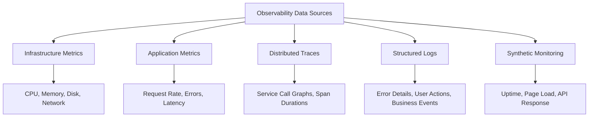
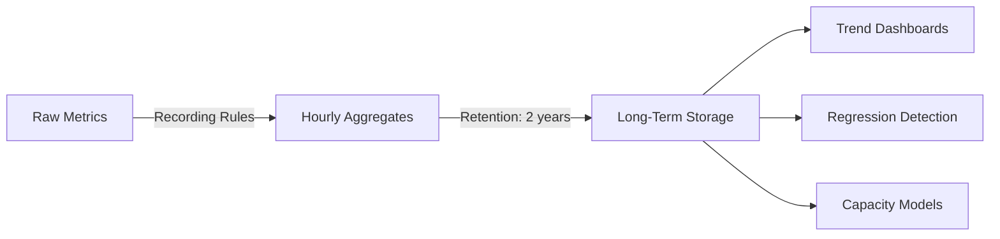
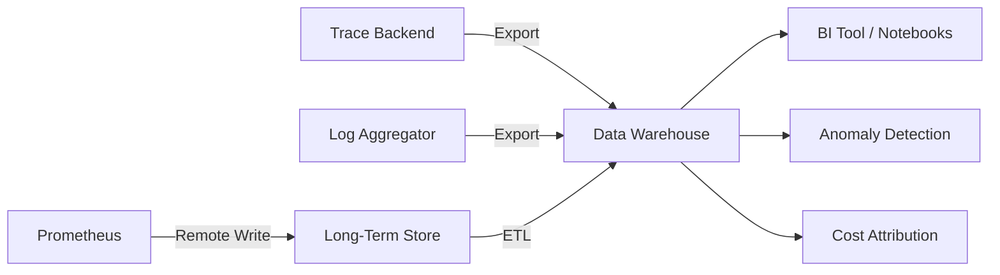

# Using Observability Data for Business and Operational Analytics

Author: [nawazdhandala](https://github.com/nawazdhandala)

Tags: Observability, Analytics, Metrics, Data Analysis, SRE

Description: How to extract actionable insights from observability data beyond incident response, including capacity planning, performance trending, and business impact analysis.

---

Most teams treat observability data as something you look at when things break. The dashboards get checked during incidents, the traces get queried when a request is slow, and the logs get searched when a customer reports a bug. The rest of the time, this data sits in storage, quietly burning through your budget.

That is a missed opportunity. Observability data contains a rich signal about how your system behaves, how your users interact with it, and where your infrastructure spend is actually going. This post covers how to extract that value.

## The Observability Data Landscape

Before extracting analytics, it helps to understand what data you already have:



Each of these data types answers different analytical questions. The trick is combining them to build a fuller picture.

## Capacity Planning

Capacity planning is the most straightforward analytics use case. You already have the data; you just need to trend it over time instead of looking at point-in-time values.

The process is:

1. Collect resource utilization metrics (CPU, memory, connections, queue depth) over weeks or months.
2. Correlate utilization with traffic volume.
3. Extrapolate based on growth projections.

Here is a PromQL query that calculates the linear prediction of disk usage 30 days from now:

```promql
# Predict disk usage 30 days out based on the last 14 days of data
predict_linear(
  node_filesystem_avail_bytes{mountpoint="/data"}[14d],
  30 * 24 * 3600
)
```

This single query replaces a spreadsheet exercise that most teams do manually once a quarter. Run it on a dashboard and you have continuous capacity forecasting.

For more sophisticated planning, export your metrics to a data warehouse and use statistical models:

```python
# Export Prometheus metrics to a DataFrame for capacity modeling
import pandas as pd
from sklearn.linear_model import LinearRegression
import numpy as np

# Assume df has columns: timestamp, cpu_usage, request_rate
df = pd.read_csv("metrics_export.csv", parse_dates=["timestamp"])

# Fit a model that predicts CPU usage from request rate
X = df[["request_rate"]].values
y = df["cpu_usage"].values
model = LinearRegression().fit(X, y)

# Predict CPU at 2x current traffic
current_rate = df["request_rate"].iloc[-1]
predicted_cpu = model.predict([[current_rate * 2]])[0]
print(f"At 2x traffic, predicted CPU: {predicted_cpu:.1f}%")
```

This tells you whether you can handle a traffic surge with current infrastructure or whether you need to scale up before a launch.

## Performance Trending

Point-in-time performance numbers are misleading. A p99 latency of 450ms means nothing without context. Is that better or worse than last week? Last month? Before the last deployment?

Trending requires storing historical percentile data. If you use Prometheus, recording rules let you downsample high-cardinality data into something queryable over long time ranges:

```yaml
# Recording rules that pre-compute weekly latency percentiles for trending
groups:
  - name: latency_trends
    interval: 1h
    rules:
      - record: api:request_duration:p50_1h
        expr: histogram_quantile(0.50, sum(rate(http_request_duration_seconds_bucket[1h])) by (le, service))
      - record: api:request_duration:p99_1h
        expr: histogram_quantile(0.99, sum(rate(http_request_duration_seconds_bucket[1h])) by (le, service))
```

With hourly pre-computed percentiles, you can build dashboards that show latency trends over months. Sudden jumps correlate with deployments. Gradual increases indicate growing data volumes, cache degradation, or dependency slowdowns.



## Business Impact Analysis

This is where observability data becomes genuinely valuable to people outside engineering. The core idea is correlating technical metrics with business outcomes.

Example questions you can answer:

- **How much revenue is lost per minute of downtime?** Correlate error rates with transaction volumes.
- **Which API endpoints drive the most revenue?** Join trace data with business event logs.
- **Does latency affect conversion?** Compare response time percentiles with checkout completion rates.

```sql
-- Correlate API latency with checkout conversion rates by hour
-- Requires joining observability data with business event data in your warehouse
SELECT
    date_trunc('hour', o.timestamp) AS hour,
    avg(o.duration_ms) AS avg_latency_ms,
    count(CASE WHEN b.event = 'checkout_complete' THEN 1 END)::float
        / nullif(count(CASE WHEN b.event = 'checkout_started' THEN 1 END), 0) AS conversion_rate
FROM observability.traces o
JOIN business.events b ON o.trace_id = b.trace_id
WHERE o.service = 'checkout-service'
    AND o.timestamp > current_date - interval '30 days'
GROUP BY 1
ORDER BY 1;
```

If this query shows that conversion drops from 4.2% to 2.8% when average latency exceeds 800ms, you have a dollar figure you can attach to performance improvements. That number is what gets infrastructure budget approved.

## Cost Attribution

Cloud bills are notoriously hard to understand at the service level. Observability data can fill the gap by mapping resource consumption to individual services and teams.

The approach:

1. Tag all infrastructure metrics with service and team labels.
2. Calculate per-service resource consumption.
3. Map consumption to cost using your cloud provider's pricing.

```python
# Calculate per-service monthly cost estimate from CPU and memory usage
service_costs = {}
cpu_price_per_core_hour = 0.048  # example pricing
mem_price_per_gb_hour = 0.006

for service in services:
    # Average CPU cores used over the month
    avg_cpu = query_prometheus(f'avg_over_time(container_cpu_usage_cores{{service="{service}"}}[30d])')
    # Average memory GB used over the month
    avg_mem = query_prometheus(f'avg_over_time(container_memory_usage_bytes{{service="{service}"}}[30d])') / 1e9

    hours_in_month = 730
    cpu_cost = avg_cpu * cpu_price_per_core_hour * hours_in_month
    mem_cost = avg_mem * mem_price_per_gb_hour * hours_in_month
    service_costs[service] = cpu_cost + mem_cost

# Sort by cost descending
for svc, cost in sorted(service_costs.items(), key=lambda x: -x[1]):
    print(f"{svc}: ${cost:.2f}/month")
```

This kind of analysis frequently reveals that 80% of your compute bill comes from 5 services, and one of those is a batch job that could run on spot instances for a third of the cost.

## Anomaly Detection

Static thresholds for alerting are brittle. A request rate of 10,000 rps might be normal at 2pm on a Tuesday but alarming at 3am on a Sunday. Anomaly detection uses historical patterns to define what "normal" looks like at any given time.

The simplest approach is seasonal decomposition. Most service traffic has daily and weekly patterns:

```python
# Detect anomalies using seasonal decomposition of time series
from statsmodels.tsa.seasonal import seasonal_decompose

# Assume request_rate is a pandas Series with hourly data, indexed by datetime
result = seasonal_decompose(request_rate, model='additive', period=168)  # 168 hours = 1 week

# The residual component contains the noise after removing trend and seasonality
# Flag points where the residual exceeds 3 standard deviations
residual = result.resid.dropna()
threshold = residual.std() * 3
anomalies = residual[abs(residual) > threshold]
print(f"Found {len(anomalies)} anomalous hours in the dataset")
```

More advanced approaches use machine learning, but start with statistical methods. They are easier to debug and explain to stakeholders.

## Dependency Analysis from Traces

Distributed traces contain a service dependency graph. By aggregating trace data, you can answer questions like:

- Which service has the most downstream dependencies?
- Which dependency is the most common source of latency?
- What is the blast radius if service X goes down?

```sql
-- Find the services most frequently on the critical path of slow requests
SELECT
    s.service_name,
    count(*) AS slow_request_appearances,
    avg(s.duration_ms) AS avg_span_duration_ms
FROM traces.spans s
JOIN traces.traces t ON s.trace_id = t.trace_id
WHERE t.duration_ms > 1000  -- traces slower than 1 second
    AND t.timestamp > current_date - interval '7 days'
GROUP BY s.service_name
ORDER BY slow_request_appearances DESC
LIMIT 10;
```

This query identifies the services that appear most often in slow request paths. It is a much better signal for optimization effort than simply looking at which services are slowest in isolation.

## Building the Analytics Pipeline

To make all of this work, you need a pipeline that moves observability data from its operational stores into an analytical environment:



Keep your operational observability stack separate from your analytics pipeline. The operational stack needs fast queries over recent data. The analytics pipeline needs large scans over historical data. Trying to serve both needs from one system leads to a system that does neither well.

## Getting Started

Pick one use case and build it end to end. Capacity planning is usually the easiest starting point because it requires only infrastructure metrics and basic linear extrapolation. Once you have a working pipeline and a dashboard that someone outside engineering actually looks at, expand to the other use cases.

The observability data is already there. You are already paying for collection and storage. The marginal cost of extracting analytics from it is small compared to the insights you get back.
