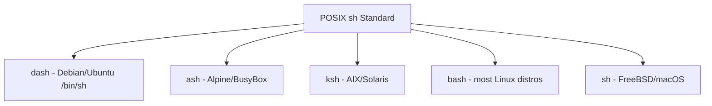

# Writing POSIX-Compatible Shell Scripts for Maximum Portability

Author: [nawazdhandala](https://github.com/nawazdhandala)

Tags: Shell Scripting, POSIX, Linux, Portability, DevOps

Description: How to write shell scripts that work across different Unix systems by following POSIX standards, avoiding Bash-specific features, and testing for compatibility.

---

Most shell scripts are written in Bash and tested on one Linux distribution. They work fine until someone tries to run them on Alpine Linux (which uses `ash`), FreeBSD (which ships `sh` from the Almquist shell family), macOS (which has a very old Bash and now defaults to `zsh`), or a minimal Docker container. At that point, the script fails in confusing ways.

Writing POSIX-compatible shell scripts avoids these problems entirely. POSIX `sh` is the lowest common denominator that every Unix-like system supports. If your script runs under POSIX `sh`, it runs everywhere.

## What POSIX sh Actually Is

POSIX is a family of standards maintained by the IEEE. The shell portion (formally IEEE Std 1003.1, Shell Command Language) defines the syntax and built-in utilities that conforming shells must support. Every system that calls itself Unix-like provides a `/bin/sh` that conforms to this standard (with varying degrees of strictness).

The practical implication: if you stick to POSIX features, your script will work with `dash`, `ash`, `ksh`, `bash`, and the native `sh` on BSD systems, Solaris, and macOS.



## The Shebang Line

Start every portable script with:

```sh
#!/bin/sh
```

Not `#!/bin/bash`, not `#!/usr/bin/env bash`. Using `/bin/sh` signals to both the operating system and future maintainers that this script intentionally avoids Bash-specific features.

## Common Bash Features That Are Not POSIX

Here is where most portability problems come from. These features work in Bash but will fail or behave differently under a strict POSIX shell.

### Arrays

Bash arrays are not part of POSIX. This fails under `dash`:

```sh
# WRONG: Bash arrays do not exist in POSIX sh
items=("apple" "banana" "cherry")
for item in "${items[@]}"; do
    echo "$item"
done
```

The POSIX alternative uses positional parameters or simple string splitting:

```sh
# CORRECT: Use positional parameters as a substitute for arrays
set -- "apple" "banana" "cherry"
for item in "$@"; do
    echo "$item"
done
```

### Double Brackets

The `[[ ... ]]` test construct is a Bash extension. POSIX uses single brackets:

```sh
# WRONG: [[ is not POSIX
if [[ "$name" == "admin" ]]; then
    echo "Welcome"
fi

# CORRECT: Use single brackets and = for string comparison
if [ "$name" = "admin" ]; then
    echo "Welcome"
fi
```

Note the operator difference: `==` is Bash, `=` is POSIX for string comparison.

### String Substitution

Bash supports `${variable//pattern/replacement}` for global substitution. POSIX does not:

```sh
# WRONG: Global substitution is a Bash extension
clean="${input//,/ }"

# CORRECT: Use an external tool for global substitution
clean=$(echo "$input" | tr ',' ' ')
```

POSIX does support prefix and suffix removal (`${var#pattern}`, `${var%pattern}`, `${var##pattern}`, `${var%%pattern}`), which covers many use cases.

### Process Substitution

`<(command)` is Bash-only:

```sh
# WRONG: Process substitution is not POSIX
diff <(sort file1) <(sort file2)

# CORRECT: Use temporary files instead
sort file1 > /tmp/sorted1.$$
sort file2 > /tmp/sorted2.$$
diff /tmp/sorted1.$$ /tmp/sorted2.$$
rm -f /tmp/sorted1.$$ /tmp/sorted2.$$
```

### The `source` Command

`source` is a Bash alias for the POSIX `.` command:

```sh
# WRONG: source is not guaranteed in POSIX
source ./config.sh

# CORRECT: Use the dot command
. ./config.sh
```

### Here Strings

Here strings (`<<<`) are Bash-only:

```sh
# WRONG: Here strings are not POSIX
read -r name <<< "$input"

# CORRECT: Use a here document or printf with pipe
name=$(printf '%s' "$input")
```

## Arithmetic

POSIX provides `$(( ))` for arithmetic expansion, but it only supports integer math:

```sh
# POSIX arithmetic - integers only, no floating point
count=$((count + 1))
total=$((price * quantity))
remainder=$((value % 10))
```

For floating point, use `awk` or `bc`:

```sh
# Floating point arithmetic using awk
average=$(echo "$sum $count" | awk '{printf "%.2f", $1 / $2}')
```

## Functions

POSIX function syntax does not use the `function` keyword:

```sh
# WRONG: The function keyword is not POSIX
function greet() {
    echo "Hello, $1"
}

# CORRECT: POSIX function definition
greet() {
    echo "Hello, $1"
}
```

POSIX functions also cannot use `local` for variable scoping in a standardized way. While many shells support `local`, it is technically not part of the POSIX standard. If strict compliance matters, avoid it or accept the minor portability risk since nearly all modern shells do support `local`.

## Conditionals and Tests

The `test` command (equivalent to `[`) has specific POSIX-defined operators:

```sh
# String tests
[ -z "$var" ]       # true if empty
[ -n "$var" ]       # true if non-empty
[ "$a" = "$b" ]     # string equality
[ "$a" != "$b" ]    # string inequality

# Numeric tests
[ "$a" -eq "$b" ]   # equal
[ "$a" -ne "$b" ]   # not equal
[ "$a" -lt "$b" ]   # less than
[ "$a" -gt "$b" ]   # greater than

# File tests
[ -f "$path" ]      # regular file exists
[ -d "$path" ]      # directory exists
[ -r "$path" ]      # file is readable
[ -x "$path" ]      # file is executable
```

Always quote variables inside `[ ]`. Unquoted variables that expand to empty strings cause syntax errors:

```sh
# This breaks if $var is empty because [ -n  ] is invalid syntax
[ -n $var ]

# This works correctly even when $var is empty
[ -n "$var" ]
```

## Portable Command Detection

Checking whether a command exists varies by shell. `which` is not POSIX. Use `command -v` instead:

```sh
# CORRECT: POSIX way to check if a command is available
if command -v git > /dev/null 2>&1; then
    echo "git is installed"
else
    echo "git is not installed"
    exit 1
fi
```

## Signal Handling

The `trap` command is POSIX and is essential for cleanup:

```sh
# Set up a cleanup trap that removes temp files on exit or interruption
cleanup() {
    rm -f "$tmpfile"
}
trap cleanup EXIT INT TERM

tmpfile=$(mktemp)
# ... use tmpfile ...
# cleanup runs automatically on exit
```

Note: `mktemp` is not POSIX, but it is available on virtually every modern system. If you need strict POSIX compliance, create temp files manually with `$$` (process ID) in the name.

## Testing Your Script for POSIX Compliance

### ShellCheck

ShellCheck is the best static analysis tool for shell scripts. Run it with POSIX mode:

```sh
# Run ShellCheck in POSIX mode to flag non-portable constructs
shellcheck -s sh script.sh
```

### Testing with dash

Debian's `dash` is a strict POSIX shell. If your script runs under `dash`, it is almost certainly POSIX-compatible:

```sh
# Run your script under dash to verify POSIX compatibility
dash ./script.sh
```

### Docker-based testing

For thorough testing, run your script across multiple environments:

```sh
# Test the script under Alpine (ash), Debian (dash), and FreeBSD (sh)
for image in alpine:latest debian:latest; do
    echo "Testing on $image"
    docker run --rm -v "$(pwd):/scripts" "$image" sh /scripts/myscript.sh
done
```

## A Complete POSIX-Compatible Example

Here is a real-world script that demonstrates multiple portable patterns:

```sh
#!/bin/sh
# Deploy script that checks prerequisites, builds, and deploys an application
# Compatible with any POSIX-compliant shell

set -eu

# POSIX-compatible logging function with timestamp
log() {
    printf '[%s] %s\n' "$(date '+%Y-%m-%d %H:%M:%S')" "$1"
}

# Check for required commands
for cmd in docker git curl; do
    if ! command -v "$cmd" > /dev/null 2>&1; then
        log "ERROR: Required command '$cmd' not found"
        exit 1
    fi
done

# Parse arguments without getopt (which varies across systems)
ENVIRONMENT=""
TAG=""
while [ $# -gt 0 ]; do
    case "$1" in
        -e|--env)
            ENVIRONMENT="$2"
            shift 2
            ;;
        -t|--tag)
            TAG="$2"
            shift 2
            ;;
        *)
            log "Unknown argument: $1"
            exit 1
            ;;
    esac
done

# Validate required arguments
if [ -z "$ENVIRONMENT" ] || [ -z "$TAG" ]; then
    log "Usage: $0 -e <environment> -t <tag>"
    exit 1
fi

# Build and deploy
log "Deploying tag $TAG to $ENVIRONMENT"
docker build -t "myapp:$TAG" .
docker push "myapp:$TAG"
log "Deployment complete"
```

Every construct in this script is POSIX-compliant. It will run identically on Debian, Alpine, macOS, FreeBSD, and any other Unix-like system.

## When to Use Bash Instead

POSIX compliance is not always the right choice. If your script:

- Only runs on systems you control (all running Bash)
- Needs associative arrays, regex matching, or advanced string manipulation
- Is complex enough that Bash's features significantly reduce code size

Then write it in Bash, put `#!/bin/bash` at the top, and move on. The goal is not purity; it is making an informed decision about portability requirements. For scripts that ship with open-source projects, run in Docker containers with unknown base images, or execute in CI pipelines across different runners, POSIX compatibility saves hours of debugging.
