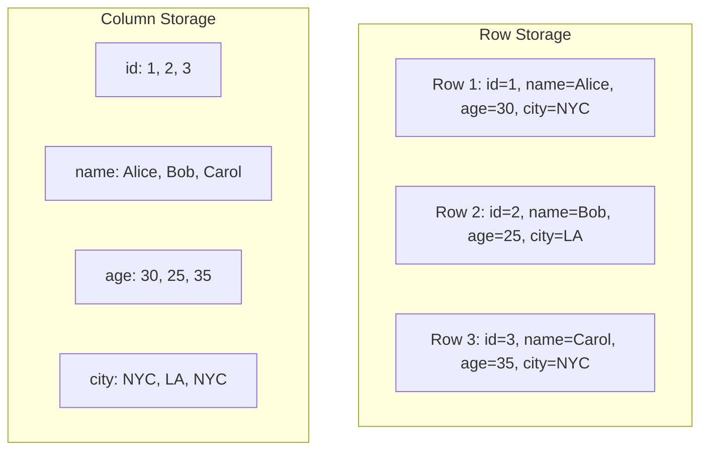
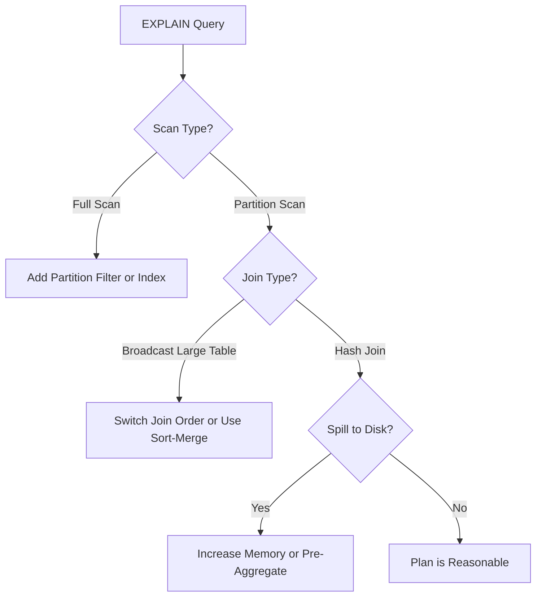

# Query Optimization Techniques for Data Warehouses

Author: [nawazdhandala](https://github.com/nawazdhandala)

Tags: Data Warehouse, SQL, Query Optimization, Performance, Analytics

Description: Practical techniques for optimizing queries in data warehouses including partition pruning, sort keys, materialized views, and query plan analysis.

---

Data warehouse queries scan massive datasets. A query that takes 30 seconds instead of 3 minutes might not seem like a big deal for a one-off analysis, but when that query runs in a dashboard viewed by 200 people every morning, or inside an ETL pipeline that blocks downstream jobs, the difference compounds fast.

This guide covers the optimization techniques that have the most impact in columnar data warehouses like Redshift, BigQuery, Snowflake, and ClickHouse. The principles apply broadly even though the syntax varies.

## Understanding Columnar Storage

Traditional row-oriented databases store entire rows together on disk. Columnar databases store each column separately. This fundamentally changes what makes a query fast or slow.



In a columnar system, `SELECT avg(age) FROM users` only reads the `age` column. It never touches `name`, `city`, or any other column. This means the single most impactful optimization is to select only the columns you need.

```sql
-- BAD: Reads every column from a potentially wide table
SELECT * FROM events WHERE event_date = '2026-02-01';

-- GOOD: Reads only the three columns needed
SELECT event_id, user_id, event_type
FROM events
WHERE event_date = '2026-02-01';
```

On a table with 50 columns and billions of rows, this change alone can reduce scan volume by 90% or more.

## Partition Pruning

Partitioning divides a table into segments based on a column value, typically a date. When a query filters on the partition column, the engine skips partitions that cannot contain matching rows.

```sql
-- This query benefits from partition pruning if the table is partitioned by event_date
SELECT user_id, count(*) AS event_count
FROM events
WHERE event_date BETWEEN '2026-01-01' AND '2026-01-31'
GROUP BY user_id;
```

Without partitioning, this query scans every row in the table. With daily partitions, it scans only 31 partitions out of potentially thousands.

The critical requirement is that your WHERE clause must reference the partition column directly. Functions applied to the partition column break pruning:

```sql
-- BAD: Wrapping the partition column in a function prevents pruning
SELECT * FROM events
WHERE EXTRACT(MONTH FROM event_date) = 1;

-- GOOD: Use direct comparison on the partition column
SELECT * FROM events
WHERE event_date >= '2026-01-01' AND event_date < '2026-02-01';
```

## Sort Keys and Clustering

Sort keys (Redshift), clustering keys (Snowflake, BigQuery), or ORDER BY keys (ClickHouse) determine the physical order of data within partitions. When your query filters or joins on the sort key, the engine can skip large blocks of data using zone maps (min/max metadata stored per block).

```sql
-- Redshift: Create a table with a compound sort key
CREATE TABLE events (
    event_id BIGINT,
    user_id BIGINT,
    event_type VARCHAR(50),
    event_date DATE,
    payload VARCHAR(65535)
)
SORTKEY(event_date, user_id);
```

Choose sort keys based on your most common query patterns. If 80% of your queries filter by date and then by user, `(event_date, user_id)` is the right compound sort key.

In BigQuery, clustering serves the same purpose:

```sql
-- BigQuery: Create a clustered table
CREATE TABLE dataset.events
PARTITION BY event_date
CLUSTER BY user_id, event_type
AS SELECT * FROM dataset.raw_events;
```

## Materialized Views

When you have a complex aggregation that gets queried repeatedly, materialized views pre-compute and store the result. The warehouse refreshes the materialized view incrementally as the base table changes.

```sql
-- Materialized view that pre-aggregates daily user activity
CREATE MATERIALIZED VIEW daily_user_summary AS
SELECT
    event_date,
    user_id,
    count(*) AS total_events,
    count(DISTINCT event_type) AS unique_event_types,
    min(created_at) AS first_event_at,
    max(created_at) AS last_event_at
FROM events
GROUP BY event_date, user_id;
```

Queries that match the materialized view's shape get automatically rewritten by the query planner (in systems that support query rewrite) or can reference the view directly:

```sql
-- This query reads from the pre-computed summary instead of scanning raw events
SELECT user_id, sum(total_events) AS monthly_events
FROM daily_user_summary
WHERE event_date BETWEEN '2026-01-01' AND '2026-01-31'
GROUP BY user_id
HAVING sum(total_events) > 100;
```

## Query Plan Analysis

Every data warehouse provides an EXPLAIN command that shows the query execution plan. Reading these plans is the most important skill for query optimization.

```sql
-- View the execution plan without running the query
EXPLAIN
SELECT u.name, count(e.event_id) AS events
FROM users u
JOIN events e ON u.user_id = e.user_id
WHERE e.event_date = '2026-02-01'
GROUP BY u.name
ORDER BY events DESC
LIMIT 10;
```

Things to look for in the plan:

- **Full table scans** on large tables when you expected partition pruning
- **Hash joins** on very large tables (consider whether a sort-merge join would be cheaper)
- **Spills to disk** indicating insufficient memory for a sort or hash operation
- **Broadcast joins** where a large table is being broadcast to all nodes (the small table should be broadcast, not the large one)



## Join Optimization

Joins are the most expensive operation in a data warehouse. Several techniques reduce their cost:

### Filter Before Joining

Push filters as early as possible. Do not join two full tables and then filter the result:

```sql
-- BAD: Joins all events with all users, then filters
SELECT u.name, e.event_type
FROM users u
JOIN events e ON u.user_id = e.user_id
WHERE e.event_date = '2026-02-01'
  AND u.country = 'US';

-- BETTER: Most optimizers handle this automatically, but CTEs make it explicit
WITH filtered_events AS (
    SELECT user_id, event_type
    FROM events
    WHERE event_date = '2026-02-01'
),
filtered_users AS (
    SELECT user_id, name
    FROM users
    WHERE country = 'US'
)
SELECT u.name, e.event_type
FROM filtered_users u
JOIN filtered_events e ON u.user_id = e.user_id;
```

Modern query optimizers usually push down predicates automatically, but complex queries with multiple joins sometimes confuse the optimizer. Making the intent explicit with CTEs helps.

### Join on Distribution Keys

In distributed systems like Redshift, data is distributed across nodes. If two tables are distributed on the same key and you join on that key, data does not need to move between nodes:

```sql
-- Redshift: Both tables distributed on user_id for collocated joins
CREATE TABLE users (user_id BIGINT, name VARCHAR(100))
DISTKEY(user_id);

CREATE TABLE events (event_id BIGINT, user_id BIGINT, event_type VARCHAR(50))
DISTKEY(user_id);
```

When you join `users` and `events` on `user_id`, matching rows are already on the same node. No network shuffle required.

## Approximate Functions

When exact precision is not required, approximate functions are dramatically faster:

```sql
-- Exact distinct count - expensive on large datasets
SELECT count(DISTINCT user_id) FROM events;

-- Approximate distinct count - uses HyperLogLog, much faster
-- Syntax varies by warehouse
SELECT approx_count_distinct(user_id) FROM events;  -- BigQuery
SELECT approximate count(DISTINCT user_id) FROM events;  -- Redshift
SELECT approx_count_distinct(user_id) FROM events;  -- Snowflake
```

The approximation is typically within 2-3% of the exact count. For dashboards and trend analysis, that is perfectly acceptable.

## Window Functions vs. Self-Joins

A common anti-pattern is using self-joins to compute things like "previous row" or "running total." Window functions do this without joining the table to itself:

```sql
-- BAD: Self-join to find the previous event for each user
SELECT a.user_id, a.event_date, b.event_date AS prev_event_date
FROM events a
LEFT JOIN events b
    ON a.user_id = b.user_id
    AND b.event_date = (
        SELECT max(event_date) FROM events c
        WHERE c.user_id = a.user_id AND c.event_date < a.event_date
    );

-- GOOD: Window function does the same thing without a self-join
SELECT
    user_id,
    event_date,
    LAG(event_date) OVER (PARTITION BY user_id ORDER BY event_date) AS prev_event_date
FROM events;
```

The window function version scans the table once instead of joining it to itself. On a table with billions of rows, this is the difference between a query that finishes in seconds and one that times out.

## Practical Optimization Workflow

When you encounter a slow query, follow this process:

1. Run EXPLAIN and read the plan. Identify the most expensive node.
2. Check whether partition pruning is happening. If not, adjust the WHERE clause.
3. Check the join strategy. Are large tables being broadcast? Is data moving between nodes unnecessarily?
4. Check for type mismatches in join keys (e.g., joining a VARCHAR to an INT causes implicit casting and prevents optimizations).
5. Consider whether a materialized view or pre-aggregation table would help if this query runs frequently.
6. Test your changes. Measure wall clock time and bytes scanned before and after.

Query optimization is iterative. Make one change, measure the impact, and move to the next bottleneck. Trying to optimize everything at once makes it impossible to understand which change actually helped.
