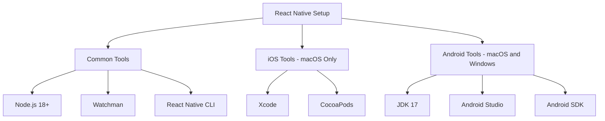

# How to Set Up a React Native Development Environment

Author: [nawazdhandala](https://github.com/nawazdhandala)

Tags: React Native, Mobile Development, JavaScript, iOS, Android

Description: A step-by-step guide to setting up a React Native development environment on macOS and Windows, covering Xcode, Android Studio, and common troubleshooting steps.

---

Getting a React Native development environment working is the first real obstacle most mobile developers face. The framework itself is straightforward, but the toolchain involves Node.js, Watchman, Xcode (macOS only), Android Studio, Java Development Kit, platform-specific SDKs, and emulators. Any one of these pieces being misconfigured will produce cryptic error messages.

This guide walks through the setup for both macOS and Windows, targeting the React Native CLI (not Expo). Expo simplifies the setup considerably but limits your access to native modules, so this guide covers the full native setup.

## Prerequisites

Before installing anything React Native-specific, you need:

- **Node.js** (version 18 or later)
- **npm** or **yarn** (npm comes with Node)
- **A code editor** (VS Code is the most popular choice for React Native)



## macOS Setup

### Install Homebrew

If you do not have Homebrew already, install it first. Most of the tools below are installed through Homebrew.

```bash
# Install Homebrew package manager for macOS
/bin/bash -c "$(curl -fsSL https://raw.githubusercontent.com/Homebrew/install/HEAD/install.sh)"
```

### Install Node.js and Watchman

Watchman is a file watching service created by Facebook. React Native uses it to detect file changes during development.

```bash
# Install Node.js and Watchman via Homebrew
brew install node
brew install watchman
```

Verify the installations:

```bash
# Confirm versions are correct
node --version    # Should show v18.x or later
watchman --version
```

### Install Xcode (for iOS development)

Xcode is required for building iOS apps. Install it from the Mac App Store. This is a large download (around 12 GB), so plan accordingly.

After installation, open Xcode once to accept the license agreement, then install the command line tools:

```bash
# Install Xcode command line tools and set the active developer directory
xcode-select --install
sudo xcode-select --switch /Applications/Xcode.app/Contents/Developer
```

### Install CocoaPods

CocoaPods manages native iOS dependencies. React Native uses it to link native modules.

```bash
# Install CocoaPods for iOS dependency management
sudo gem install cocoapods
```

If you run into permission errors with the system Ruby, use a Ruby version manager like `rbenv`:

```bash
# Alternative: Install CocoaPods using rbenv to avoid system Ruby permission issues
brew install rbenv
rbenv install 3.2.2
rbenv global 3.2.2
gem install cocoapods
```

### Install JDK for Android

Android development requires the Java Development Kit. JDK 17 is the recommended version for current React Native:

```bash
# Install JDK 17 using Homebrew
brew install --cask zulu@17
```

After installation, add the JAVA_HOME environment variable to your shell profile:

```bash
# Add to ~/.zshrc or ~/.bash_profile
export JAVA_HOME=$(/usr/libexec/java_home -v 17)
```

### Install Android Studio

Download Android Studio from the official website or use Homebrew:

```bash
# Install Android Studio via Homebrew
brew install --cask android-studio
```

When you first open Android Studio, the setup wizard will guide you through installing the Android SDK. Make sure you install:

- Android SDK Platform 34 (or the latest stable)
- Android SDK Build-Tools 34.0.0
- Android Emulator
- Android SDK Platform-Tools

After installation, add the Android SDK paths to your shell profile:

```bash
# Add Android SDK environment variables to ~/.zshrc
export ANDROID_HOME=$HOME/Library/Android/sdk
export PATH=$PATH:$ANDROID_HOME/emulator
export PATH=$PATH:$ANDROID_HOME/platform-tools
export PATH=$PATH:$ANDROID_HOME/tools
export PATH=$PATH:$ANDROID_HOME/tools/bin
```

Reload your shell profile:

```bash
# Reload the shell configuration
source ~/.zshrc
```

## Windows Setup

### Install Node.js

Download the LTS version of Node.js from the official website and run the installer. Alternatively, use Chocolatey:

```powershell
# Install Node.js using Chocolatey package manager
choco install nodejs-lts
```

### Install JDK

```powershell
# Install JDK 17 using Chocolatey
choco install microsoft-openjdk17
```

### Install Android Studio

Download Android Studio from the official website and run the installer. During the setup wizard, select:

- Android SDK
- Android SDK Platform
- Android Virtual Device

After installation, set the environment variables. Open System Properties, go to Environment Variables, and add:

- `ANDROID_HOME` = `C:\Users\<YourUsername>\AppData\Local\Android\Sdk`
- Add to PATH: `%ANDROID_HOME%\platform-tools`, `%ANDROID_HOME%\emulator`, `%ANDROID_HOME%\tools`, `%ANDROID_HOME%\tools\bin`

Windows cannot build iOS apps natively. For iOS development on Windows, you need a macOS machine or a cloud-based Mac service.

## Creating Your First Project

With the environment set up, create a new React Native project:

```bash
# Create a new React Native project using the CLI
npx @react-native-community/cli init MyApp
```

This scaffolds a complete project with both iOS and Android configurations.

## Running on iOS (macOS only)

```bash
# Navigate to the project directory and install iOS dependencies
cd MyApp
cd ios && pod install && cd ..

# Start the Metro bundler and run on iOS simulator
npx react-native run-ios
```

The first build takes several minutes as Xcode compiles all native dependencies. Subsequent builds are much faster thanks to caching.

To run on a specific simulator:

```bash
# Run on a specific iPhone simulator model
npx react-native run-ios --simulator="iPhone 15 Pro"
```

## Running on Android

First, create an Android Virtual Device (AVD) through Android Studio:

1. Open Android Studio
2. Go to Tools, then Device Manager
3. Click "Create Device"
4. Select a phone (Pixel 7 is a good default)
5. Download and select a system image (API 34 recommended)
6. Finish the wizard and start the emulator

Then run the app:

```bash
# Start the Metro bundler and run on Android emulator
npx react-native run-android
```

## Running on a Physical Device

### iOS Physical Device

Connect your iPhone via USB. Open the `.xcworkspace` file in Xcode (not the `.xcodeproj`), select your device as the build target, and configure a development team in Signing & Capabilities. Then:

```bash
# Run on a connected physical iOS device
npx react-native run-ios --device "Your iPhone Name"
```

### Android Physical Device

Enable Developer Options and USB Debugging on your Android device, then connect via USB:

```bash
# Verify the device is detected
adb devices

# Run on the connected Android device
npx react-native run-android
```

## Common Troubleshooting

### "SDK location not found"

This means `ANDROID_HOME` is not set correctly. Verify it:

```bash
# Check that ANDROID_HOME points to the correct directory
echo $ANDROID_HOME
ls $ANDROID_HOME/platform-tools/adb
```

### CocoaPods Installation Fails

If `pod install` fails, try clearing the cache:

```bash
# Clear CocoaPods cache and reinstall
cd ios
pod deintegrate
pod cache clean --all
pod install
cd ..
```

### Metro Bundler Port Conflict

If port 8081 is already in use:

```bash
# Start Metro on a different port
npx react-native start --port 8082
```

### Android Build Fails with Memory Error

Gradle sometimes runs out of memory. Increase the heap size in `android/gradle.properties`:

```properties
# Increase Gradle daemon memory to 4GB for large builds
org.gradle.jvmargs=-Xmx4096m -XX:MaxMetaspaceSize=512m
```

### Xcode Build Fails After Upgrade

After upgrading Xcode, clean the build folder:

```bash
# Clean derived data after Xcode upgrade
rm -rf ~/Library/Developer/Xcode/DerivedData
cd ios && pod install && cd ..
```

## Environment Verification

React Native provides a built-in tool to verify your environment:

```bash
# Run the React Native doctor to check your environment setup
npx react-native doctor
```

This command checks every dependency and reports what is installed, what is missing, and in many cases offers to fix issues automatically. Run it any time you suspect an environment problem.

## Editor Setup

VS Code with the following extensions provides a solid React Native development experience:

- **React Native Tools** (by Microsoft): debugging, IntelliSense for React Native APIs
- **ESLint**: code linting
- **Prettier**: code formatting
- **TypeScript**: type checking (React Native defaults to TypeScript in new projects)

Create a `.vscode/settings.json` in your project:

```json
{
  "editor.formatOnSave": true,
  "editor.defaultFormatter": "esbenp.prettier-prettier",
  "typescript.tsdk": "node_modules/typescript/lib"
}
```

## Project Structure Overview

After creating a project, you will see this structure:

```
MyApp/
  android/          # Native Android project (Gradle-based)
  ios/              # Native iOS project (Xcode workspace)
  node_modules/     # JavaScript dependencies
  src/              # Your application code (create this)
  App.tsx           # Root component
  index.js          # Entry point
  metro.config.js   # Metro bundler configuration
  package.json      # Dependencies and scripts
  tsconfig.json     # TypeScript configuration
```

Keep your application code in a `src/` directory. The top-level `App.tsx` should import from `src/` and serve as the entry component.

## Next Steps

With the environment working, the actual development begins. Start by modifying `App.tsx`, add navigation with React Navigation, set up state management, and build your first screens. The React Native documentation has solid guides for each of these topics. The hard part (environment setup) is behind you.
