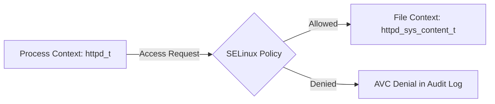
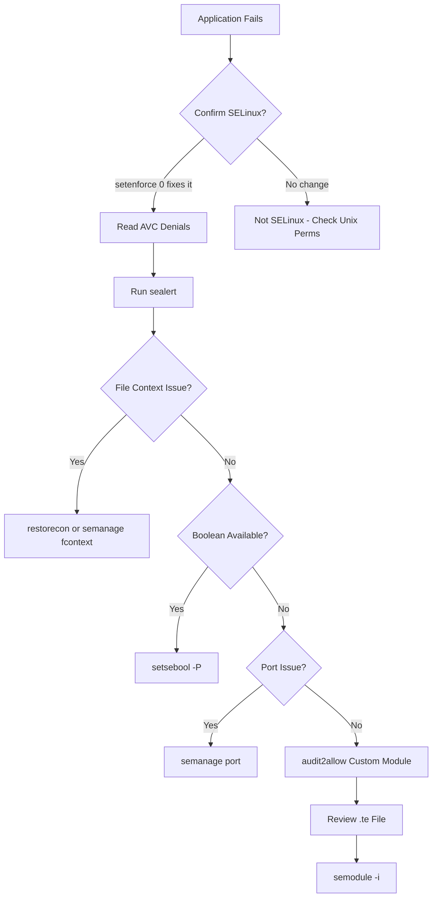

# How to Troubleshoot SELinux Permission Denials

Author: [nawazdhandala](https://github.com/nawazdhandala)

Tags: SELinux, Linux, Security, Troubleshooting, System Administration

Description: A practical guide to diagnosing and fixing SELinux permission denials using audit logs, sealert, and custom policy modules without disabling SELinux entirely.

---

SELinux has a reputation for being the first thing system administrators disable on a new server. The typical workflow goes like this: deploy an application, find out it does not work, see "Permission denied" in the logs, run `setenforce 0`, and move on. This works in the short term but leaves the system without mandatory access control, which is a significant security regression.

The real issue is not that SELinux is too restrictive. It is that most people do not know how to diagnose and fix the denials. This guide covers the practical tools and techniques for troubleshooting SELinux without disabling it.

## How SELinux Works (Briefly)

SELinux assigns a security context (label) to every process, file, port, and system resource. Policy rules define which contexts can interact with which other contexts. If a process tries to access a resource and no rule allows it, the access is denied and an audit event is logged.



The key concept is that SELinux operates independently of standard Unix permissions. A file might be `chmod 777`, but if SELinux policy does not allow the process context to access the file context, the access is still denied.

## Step 1: Confirm SELinux Is the Problem

Before troubleshooting SELinux, confirm it is actually causing the issue. Temporarily set SELinux to permissive mode:

```bash
# Switch to permissive mode - SELinux logs denials but does not enforce them
sudo setenforce 0
```

If the problem goes away, SELinux was the cause. Switch back to enforcing mode before proceeding with the fix:

```bash
# Switch back to enforcing mode
sudo setenforce 1
```

You can also check the current mode:

```bash
# Display the current SELinux mode (Enforcing, Permissive, or Disabled)
getenforce
```

Never leave a production system in permissive mode. It exists only as a diagnostic tool.

## Step 2: Read the Audit Log

SELinux denials are logged as AVC (Access Vector Cache) messages in `/var/log/audit/audit.log`. Search for recent denials:

```bash
# Search for AVC denial messages in the audit log from today
sudo ausearch -m avc -ts today
```

A typical denial looks like this:

```
type=AVC msg=audit(1707840000.123:456): avc:  denied  { read } for
  pid=12345 comm="httpd" name="config.json" dev="sda1" ino=789012
  scontext=system_u:system_r:httpd_t:s0
  tcontext=unconfined_u:object_r:user_home_t:s0 tclass=file permissive=0
```

Breaking this down:

- **denied { read }**: The operation that was blocked (read access to a file)
- **comm="httpd"**: The process that attempted the access
- **scontext=...httpd_t:s0**: The security context of the process (the source)
- **tcontext=...user_home_t:s0**: The security context of the target file
- **tclass=file**: The class of the target object

This denial says: the `httpd` process (running as `httpd_t`) tried to read a file labeled `user_home_t`, and SELinux blocked it because no policy rule allows `httpd_t` to read `user_home_t` files.

## Step 3: Use sealert for Human-Readable Analysis

The `sealert` tool (part of `setroubleshoot-server`) translates raw AVC messages into explanations with suggested fixes:

```bash
# Install setroubleshoot if not already present
sudo yum install setroubleshoot-server   # RHEL/CentOS
sudo dnf install setroubleshoot-server   # Fedora

# Analyze all denials in the audit log
sudo sealert -a /var/log/audit/audit.log
```

The output includes:

- A description of what was denied
- Why it was denied
- Suggested commands to fix it
- Confidence ratings for each suggestion

This is the single most useful tool for SELinux troubleshooting. Always check `sealert` before writing custom policies.

## Step 4: Fix File Context Labels

The most common cause of SELinux denials is incorrect file labels. This happens when files are moved (not copied), created in non-standard locations, or when backup restores do not preserve labels.

### Check Current Labels

```bash
# Display the SELinux context of files in a directory
ls -Z /var/www/html/
```

Output:

```
unconfined_u:object_r:user_home_t:s0 config.json
system_u:object_r:httpd_sys_content_t:s0 index.html
```

The `config.json` file has the `user_home_t` label instead of `httpd_sys_content_t`. This is why `httpd` cannot read it.

### Fix with restorecon

The `restorecon` command resets file labels to the default defined by policy:

```bash
# Restore the default SELinux labels for files in /var/www/html
sudo restorecon -Rv /var/www/html/
```

The `-R` flag is recursive, and `-v` is verbose (shows what changed).

### Set Custom File Contexts

If your application uses a non-standard directory, you need to define the expected label:

```bash
# Define a custom SELinux file context rule for a non-standard web root
sudo semanage fcontext -a -t httpd_sys_content_t "/opt/myapp/static(/.*)?"

# Apply the new rule to existing files
sudo restorecon -Rv /opt/myapp/static/
```

The `semanage fcontext` command creates a persistent rule that survives relabeling operations.

## Step 5: Manage SELinux Booleans

SELinux booleans are on/off switches for specific policy behaviors. Many common use cases are covered by booleans rather than requiring custom policies.

```bash
# List all booleans related to httpd
sudo getsebool -a | grep httpd
```

Common booleans that fix frequent issues:

```bash
# Allow httpd to connect to the network (for reverse proxies)
sudo setsebool -P httpd_can_network_connect on

# Allow httpd to send email
sudo setsebool -P httpd_can_sendmail on

# Allow httpd to connect to databases
sudo setsebool -P httpd_can_network_connect_db on

# Allow httpd to read user home directories
sudo setsebool -P httpd_read_user_content on
```

The `-P` flag makes the change persistent across reboots. Without it, the boolean reverts on the next boot.

## Step 6: Manage Port Labels

SELinux restricts which ports a service can bind to. If your application listens on a non-standard port, you need to label that port:

```bash
# Check which ports httpd is allowed to use
sudo semanage port -l | grep http_port_t

# Add port 8443 to the list of allowed HTTP ports
sudo semanage port -a -t http_port_t -p tcp 8443
```

If the port is already assigned to another type, you may need to modify instead of add:

```bash
# Modify an existing port label assignment
sudo semanage port -m -t http_port_t -p tcp 8443
```

## Step 7: Create Custom Policy Modules

When booleans and file contexts do not solve the problem, you need a custom policy module. The `audit2allow` tool generates policy modules from denial messages:

```bash
# Generate a custom policy module from recent denials for httpd
sudo ausearch -m avc -ts today | audit2allow -M my_httpd_policy
```

This creates two files:
- `my_httpd_policy.te` (the policy source)
- `my_httpd_policy.pp` (the compiled policy module)

Before installing, review the generated policy:

```bash
# Review the generated policy source to verify it is appropriate
cat my_httpd_policy.te
```

A typical generated policy:

```
module my_httpd_policy 1.0;

require {
    type httpd_t;
    type user_home_t;
    class file { read open getattr };
}

# Allow httpd to read files labeled user_home_t
allow httpd_t user_home_t:file { read open getattr };
```

If the policy looks reasonable, install it:

```bash
# Install the custom policy module
sudo semodule -i my_httpd_policy.pp
```

**Important**: Never blindly install generated policies. The `audit2allow` output might grant more access than intended. Always review the `.te` file first. If it contains `allow` rules for types that seem unrelated to your application, investigate further.

## Step 8: Debugging with Audit2why

The `audit2why` tool explains why a specific denial occurred and what fix is needed:

```bash
# Pipe a denial through audit2why for an explanation
sudo ausearch -m avc -ts today | audit2why
```

The output tells you whether:
- A boolean needs to be toggled
- A file context is wrong
- A custom policy is needed

This is faster than `sealert` for quick diagnosis when you already know which denial to investigate.

## Workflow Summary

Here is the complete troubleshooting workflow:



## Preventing Future Issues

A few habits that reduce SELinux troubleshooting:

**Copy files instead of moving them.** When you `cp` a file, it inherits the label of the destination directory. When you `mv` a file, it keeps its original label. This is the single most common source of file context problems.

**Use `matchpathcon` to check expected labels.** Before deploying files to a new location, verify what label SELinux expects:

```bash
# Check what SELinux label is expected for a given path
matchpathcon /var/www/html/index.html
```

**Run `restorecon` after deployments.** If your deployment process creates or modifies files, add a `restorecon` step at the end. It is a no-op if labels are already correct.

**Test in permissive mode first.** When deploying a new application, set it to permissive mode for the specific domain (not the whole system):

```bash
# Set only the httpd_t domain to permissive, keeping everything else enforcing
sudo semanage permissive -a httpd_t

# After testing and creating any needed policies, remove permissive
sudo semanage permissive -d httpd_t
```

SELinux exists for a reason. It prevents compromised processes from accessing resources they should not touch. Learning to work with it rather than against it is a worthwhile investment for anyone managing Linux servers.
