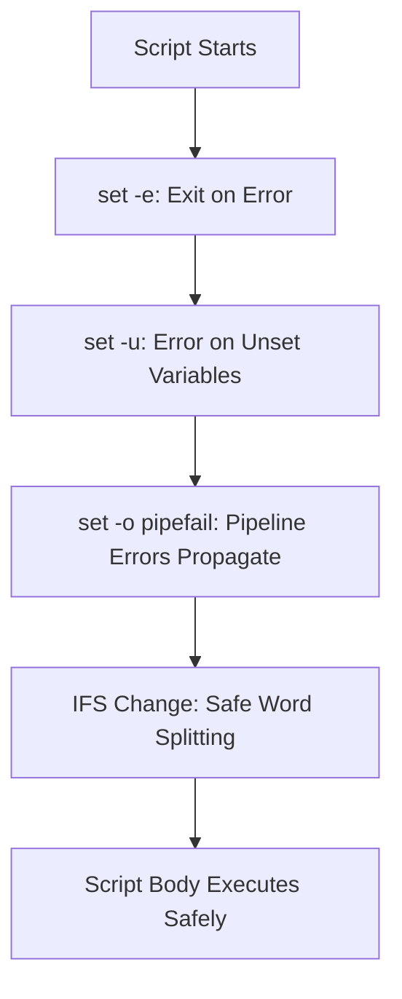

# Shell Scripting Best Practices for Production Systems

Author: [nawazdhandala](https://github.com/nawazdhandala)

Tags: Shell Scripting, Bash, Linux, DevOps, Automation

Description: Best practices for writing production-grade shell scripts covering error handling, logging, portability, security, and testing strategies.

---

Shell scripts have a bad reputation in production environments. They start as quick hacks, grow into critical infrastructure, and then break at 3am in ways nobody can debug. The language itself is not the problem. The problem is that most scripts are written without the discipline applied to other production code.

This guide covers the practices that turn fragile one-off scripts into reliable production tools.

## Start Every Script Right

The first three lines of every production script should be:

```bash
#!/bin/bash
set -euo pipefail
IFS=$'\n\t'
```

Here is what each setting does:

- **`set -e`**: Exit immediately if any command fails. Without this, the script continues after errors, causing cascading failures.
- **`set -u`**: Treat unset variables as errors. Without this, `$UNSET_VAR` silently expands to an empty string.
- **`set -o pipefail`**: A pipeline fails if any command in it fails. Without this, `bad_command | grep something` succeeds as long as `grep` succeeds, even if `bad_command` failed.
- **`IFS=$'\n\t'`**: Changes the Internal Field Separator so that word splitting does not happen on spaces. This prevents bugs with filenames containing spaces.



## Error Handling

`set -e` catches most errors, but some patterns need explicit handling.

### Trap for Cleanup

Use `trap` to ensure cleanup code runs regardless of how the script exits:

```bash
# Cleanup function that removes temporary files and restores state
cleanup() {
    local exit_code=$?
    rm -f "$TMPFILE"
    # Restore any modified state
    if [ -f "$BACKUP_FILE" ]; then
        mv "$BACKUP_FILE" "$ORIGINAL_FILE"
    fi
    exit "$exit_code"
}

trap cleanup EXIT ERR INT TERM

TMPFILE=$(mktemp)
BACKUP_FILE=""
ORIGINAL_FILE=""
```

The `EXIT` trap fires on normal exit, `ERR` on errors (with `set -e`), `INT` on Ctrl+C, and `TERM` on kill signals.

### Commands That Are Expected to Fail

Sometimes a command failing is normal (e.g., checking if a process exists). Use `|| true` to prevent `set -e` from killing the script:

```bash
# Check if a process is running without exiting the script if it is not
pid=$(pgrep -f "my-service" || true)
if [ -n "$pid" ]; then
    echo "Service is running with PID $pid"
else
    echo "Service is not running"
fi
```

### Retry Logic

Network operations and external service calls should include retry logic:

```bash
# Retry a command up to N times with exponential backoff
retry() {
    local max_attempts=$1
    local delay=$2
    shift 2
    local attempt=1

    while [ $attempt -le $max_attempts ]; do
        if "$@"; then
            return 0
        fi
        echo "Attempt $attempt/$max_attempts failed. Retrying in ${delay}s..."
        sleep "$delay"
        delay=$((delay * 2))
        attempt=$((attempt + 1))
    done

    echo "All $max_attempts attempts failed"
    return 1
}

# Usage: retry 5 times with initial 2-second delay
retry 5 2 curl -sf "https://api.example.com/health"
```

## Logging

Production scripts need structured, timestamped logging. Do not use bare `echo` statements.

```bash
# Logging functions with severity levels and timestamps
readonly LOG_FILE="/var/log/myapp/deploy.log"

log() {
    local level=$1
    shift
    local message="$*"
    local timestamp
    timestamp=$(date '+%Y-%m-%d %H:%M:%S')
    printf '[%s] [%s] %s\n' "$timestamp" "$level" "$message" | tee -a "$LOG_FILE"
}

info()  { log "INFO"  "$@"; }
warn()  { log "WARN"  "$@"; }
error() { log "ERROR" "$@" >&2; }
fatal() { log "FATAL" "$@" >&2; exit 1; }
```

Usage:

```bash
# Using the logging functions throughout the script
info "Starting deployment of version $VERSION"
warn "Disk usage is above 80%"
error "Failed to connect to database"
fatal "Cannot continue without database connection"  # exits with code 1
```

## Input Validation

Never trust input. Validate everything that comes from arguments, environment variables, or files:

```bash
# Validate required arguments and their format
validate_inputs() {
    if [ $# -lt 2 ]; then
        fatal "Usage: $0 <environment> <version>"
    fi

    local environment=$1
    local version=$2

    # Validate environment is one of the allowed values
    case "$environment" in
        staging|production) ;;
        *) fatal "Invalid environment: $environment. Must be 'staging' or 'production'" ;;
    esac

    # Validate version format (semantic versioning)
    if ! echo "$version" | grep -qE '^[0-9]+\.[0-9]+\.[0-9]+$'; then
        fatal "Invalid version format: $version. Expected X.Y.Z"
    fi
}

validate_inputs "$@"
```

## Quoting

Quote every variable expansion. Unquoted variables are the source of an enormous number of shell script bugs.

```bash
# WRONG: Breaks if filename contains spaces or glob characters
file=$1
if [ -f $file ]; then
    cp $file /tmp/backup/
fi

# CORRECT: Properly quoted variable expansions
file=$1
if [ -f "$file" ]; then
    cp "$file" /tmp/backup/
fi
```

The only exception is inside `[[ ]]` (Bash double brackets) where word splitting does not occur, but single brackets `[ ]` always need quotes.

## Temporary Files

Use `mktemp` for temporary files, and always clean them up:

```bash
# Create and manage temporary files safely
WORK_DIR=$(mktemp -d)
trap 'rm -rf "$WORK_DIR"' EXIT

# Use the temp directory for intermediate files
curl -sf "https://example.com/data.json" > "$WORK_DIR/data.json"
jq '.results[]' "$WORK_DIR/data.json" > "$WORK_DIR/processed.json"
```

Never use predictable temp file names like `/tmp/myapp.tmp`. This is a security vulnerability (symlink attacks). `mktemp` generates unpredictable names.

## Configuration

Separate configuration from code. Use environment variables with defaults:

```bash
# Configuration with defaults and validation
DB_HOST="${DB_HOST:-localhost}"
DB_PORT="${DB_PORT:-5432}"
DB_NAME="${DB_NAME:?DB_NAME environment variable is required}"
DEPLOY_TIMEOUT="${DEPLOY_TIMEOUT:-300}"

# The :? syntax causes the script to exit with an error if the variable is unset
# The :- syntax provides a default value if the variable is unset
```

For more complex configuration, source a config file:

```bash
# Load configuration from a file if it exists
CONFIG_FILE="${CONFIG_FILE:-/etc/myapp/config.sh}"
if [ -f "$CONFIG_FILE" ]; then
    # shellcheck source=/dev/null
    . "$CONFIG_FILE"
fi
```

## Security

### Avoid eval

`eval` executes arbitrary strings as shell commands. It is almost never necessary and is a common vector for injection attacks:

```bash
# WRONG: eval with user input is a security vulnerability
user_input="$1"
eval "echo $user_input"  # if input is '; rm -rf /' this is catastrophic

# CORRECT: Use variables directly, never eval user input
user_input="$1"
printf '%s\n' "$user_input"
```

### Restrict File Permissions

Scripts that contain credentials or sensitive configuration should have restricted permissions:

```bash
# Set restrictive permissions on sensitive files
umask 077  # New files created by this script are owner-only
chmod 700 "$CONFIG_FILE"
```

### Avoid Storing Secrets in Variables

Secrets stored in shell variables appear in `/proc/<pid>/environ` on Linux:

```bash
# WRONG: Secret visible in process environment
export DB_PASSWORD="supersecret"

# BETTER: Read from a file descriptor or secrets manager
DB_PASSWORD=$(cat /run/secrets/db_password)
```

## Idempotency

Production scripts often run multiple times (manual reruns, cron jobs, CI retries). Make operations idempotent:

```bash
# Idempotent directory creation
mkdir -p /opt/myapp/data

# Idempotent user creation
if ! id "appuser" > /dev/null 2>&1; then
    useradd -r -s /bin/false appuser
fi

# Idempotent service restart (only if config changed)
new_hash=$(sha256sum /etc/myapp/config.json | awk '{print $1}')
old_hash=$(cat /var/run/myapp/config.hash 2>/dev/null || true)
if [ "$new_hash" != "$old_hash" ]; then
    systemctl restart myapp
    echo "$new_hash" > /var/run/myapp/config.hash
fi
```

## Locking

If a script should not run concurrently (e.g., a deployment script), use file locking:

```bash
# Prevent concurrent execution using flock
LOCK_FILE="/var/run/myapp/deploy.lock"
exec 9>"$LOCK_FILE"
if ! flock -n 9; then
    fatal "Another instance is already running"
fi
# Lock is automatically released when the script exits
```

## Testing

### ShellCheck

ShellCheck is a static analysis tool that catches bugs and bad practices:

```bash
# Run ShellCheck on your script to find common issues
shellcheck -x deploy.sh
```

The `-x` flag tells ShellCheck to follow `source`/`.` directives and check included files.

### Unit Testing with BATS

BATS (Bash Automated Testing System) provides a testing framework for shell scripts:

```bash
# test_deploy.bats - unit tests for deployment functions
#!/usr/bin/env bats

# Source the functions we want to test
setup() {
    source ./deploy_functions.sh
}

@test "validate_version accepts valid semver" {
    run validate_version "1.2.3"
    [ "$status" -eq 0 ]
}

@test "validate_version rejects invalid format" {
    run validate_version "not-a-version"
    [ "$status" -eq 1 ]
}

@test "validate_environment rejects unknown environments" {
    run validate_environment "narnia"
    [ "$status" -eq 1 ]
}
```

Run the tests:

```bash
# Execute BATS test suite
bats test_deploy.bats
```

## Documentation in the Script

Add a usage block at the top of every script:

```bash
#!/bin/bash
# deploy.sh - Deploy the application to a target environment
#
# Usage:
#   deploy.sh <environment> <version>
#
# Arguments:
#   environment   Target environment (staging or production)
#   version       Semantic version to deploy (e.g., 1.2.3)
#
# Environment Variables:
#   DB_HOST       Database hostname (default: localhost)
#   DB_PORT       Database port (default: 5432)
#   DB_NAME       Database name (required)
#
# Examples:
#   deploy.sh staging 1.2.3
#   DB_HOST=db.prod.internal deploy.sh production 2.0.0
```

This block serves as both documentation and the output of a `--help` flag:

```bash
# Show help text when --help is passed
if [ "${1:-}" = "--help" ] || [ "${1:-}" = "-h" ]; then
    sed -n '2,/^[^#]/p' "$0" | sed 's/^# \?//'
    exit 0
fi
```

## When to Stop Using Shell

Shell scripts are the right tool for orchestration: calling other programs, moving files, and coordinating system operations. They are the wrong tool for:

- Parsing complex data formats (use Python or jq)
- Math beyond integer arithmetic (use Python or awk)
- Anything over 500 lines (rewrite in a proper language)
- Anything that manages complex state

Knowing when to graduate from shell to Python, Go, or another language is itself a best practice. The goal is reliable automation, not proving that everything can be done in Bash.
