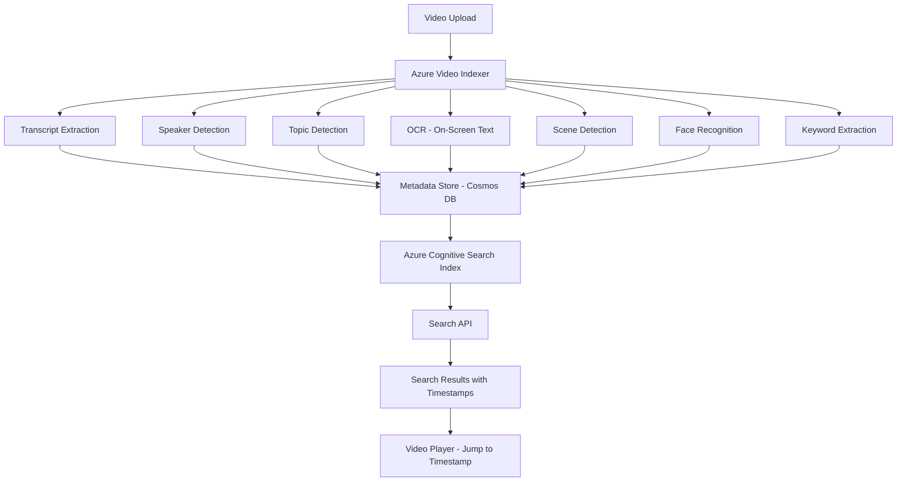

# How to Create an AI-Powered Video Indexing Solution with Azure Video Indexer and Cognitive Search

Author: [nawazdhandala](https://www.github.com/nawazdhandala)

Tags: Azure, Video Indexer, Cognitive Search, AI, Video Analytics, Search, Machine Learning

Description: Build an AI-powered video indexing solution using Azure Video Indexer for content extraction and Cognitive Search for searchable video metadata.

---

Video content is notoriously hard to search. If you have a library of hundreds or thousands of videos - training courses, recorded meetings, webinars, product demos - finding the specific moment where someone mentions a particular topic requires watching through hours of footage. Azure Video Indexer uses AI to automatically extract transcripts, detect speakers, identify topics, recognize faces, read on-screen text (OCR), and detect key scenes. Combined with Azure Cognitive Search, this extracted metadata becomes a searchable index where users can find the exact moment in any video that matches their query.

In this guide, I will build a video indexing pipeline that automatically processes uploaded videos, extracts rich metadata, and makes everything searchable.

## Architecture

The pipeline takes a video, runs it through Video Indexer's AI models, stores the extracted metadata, and indexes it for search.



## Setting Up Video Indexer

Create a Video Indexer account connected to your Azure subscription.

```bash
# Create a Media Services account (required for Video Indexer)
az ams account create \
  --name vi-media-account \
  --resource-group rg-video-indexer \
  --storage-account vistorageacct \
  --location eastus

# Create a Video Indexer account via ARM template
# Video Indexer is managed through the Azure portal or REST API
```

You will need the Video Indexer Account ID and an access token, which you can get from the Video Indexer portal or API.

## Uploading and Indexing Videos

Here is the backend code that uploads a video to Video Indexer and monitors the indexing progress.

```javascript
// src/services/video-indexer.js
const axios = require('axios');

const VI_BASE_URL = 'https://api.videoindexer.ai';
const ACCOUNT_ID = process.env.VIDEO_INDEXER_ACCOUNT_ID;
const LOCATION = process.env.VIDEO_INDEXER_LOCATION || 'eastus';

class VideoIndexerService {
  constructor() {
    this.accessToken = null;
    this.tokenExpiry = null;
  }

  // Get an access token for the Video Indexer API
  async getAccessToken() {
    if (this.accessToken && this.tokenExpiry > Date.now()) {
      return this.accessToken;
    }

    const response = await axios.get(
      `${VI_BASE_URL}/auth/${LOCATION}/Accounts/${ACCOUNT_ID}/AccessToken`,
      {
        headers: {
          'Ocp-Apim-Subscription-Key': process.env.VIDEO_INDEXER_KEY
        },
        params: {
          allowEdit: true
        }
      }
    );

    this.accessToken = response.data;
    // Token expires in 1 hour, refresh at 50 minutes
    this.tokenExpiry = Date.now() + 50 * 60 * 1000;
    return this.accessToken;
  }

  // Upload and index a video
  async indexVideo(videoUrl, videoName, description) {
    const token = await this.getAccessToken();

    const response = await axios.post(
      `${VI_BASE_URL}/${LOCATION}/Accounts/${ACCOUNT_ID}/Videos`,
      null,
      {
        params: {
          accessToken: token,
          name: videoName,
          description: description,
          videoUrl: videoUrl,
          // AI features to enable
          indexingPreset: 'AdvancedVideo',
          // Language for transcript
          language: 'en-US',
          // Send callback when indexing completes
          callbackUrl: process.env.INDEXING_CALLBACK_URL,
          // Privacy settings
          privacy: 'Private'
        }
      }
    );

    return {
      videoId: response.data.id,
      state: response.data.state,
      name: videoName
    };
  }

  // Get the full index (all extracted metadata)
  async getVideoIndex(videoId) {
    const token = await this.getAccessToken();

    const response = await axios.get(
      `${VI_BASE_URL}/${LOCATION}/Accounts/${ACCOUNT_ID}/Videos/${videoId}/Index`,
      {
        params: {
          accessToken: token,
          language: 'en-US'
        }
      }
    );

    return response.data;
  }

  // Get the transcript with timestamps
  async getTranscript(videoId) {
    const index = await this.getVideoIndex(videoId);
    const transcript = [];

    if (index.videos && index.videos[0] && index.videos[0].insights) {
      const insights = index.videos[0].insights;

      // Extract transcript lines with timestamps
      if (insights.transcript) {
        for (const line of insights.transcript) {
          transcript.push({
            text: line.text,
            startTime: line.instances[0].start,
            endTime: line.instances[0].end,
            speakerId: line.speakerId,
            confidence: line.confidence
          });
        }
      }
    }

    return transcript;
  }

  // Extract all searchable metadata from the video index
  async extractSearchableMetadata(videoId) {
    const index = await this.getVideoIndex(videoId);
    const video = index.videos[0];
    const insights = video.insights;

    return {
      videoId: videoId,
      name: index.name,
      description: index.description,
      duration: video.insights.duration?.time || '',

      // Full transcript text for search
      transcriptText: (insights.transcript || [])
        .map(t => t.text)
        .join(' '),

      // Individual transcript segments with timestamps
      transcriptSegments: (insights.transcript || []).map(t => ({
        text: t.text,
        startTime: t.instances[0]?.start,
        endTime: t.instances[0]?.end,
        speakerId: t.speakerId
      })),

      // Topics detected in the video
      topics: (insights.topics || []).map(t => ({
        name: t.name,
        confidence: t.confidence,
        appearances: t.instances.map(i => ({
          startTime: i.start,
          endTime: i.end
        }))
      })),

      // Keywords extracted
      keywords: (insights.keywords || []).map(k => ({
        text: k.text,
        confidence: k.confidence,
        appearances: k.instances.map(i => ({
          startTime: i.start,
          endTime: i.end
        }))
      })),

      // Named entities (people, places, organizations)
      namedEntities: (insights.namedPeople || []).map(p => ({
        name: p.name,
        appearances: p.instances.map(i => ({
          startTime: i.start,
          endTime: i.end
        }))
      })),

      // OCR text from slides/screen
      ocrText: (insights.ocr || []).map(o => ({
        text: o.text,
        confidence: o.confidence,
        appearances: o.instances.map(i => ({
          startTime: i.start,
          endTime: i.end
        }))
      })),

      // Speakers detected
      speakers: (insights.speakers || []).map(s => ({
        id: s.id,
        name: s.name,
        totalSpeakingTime: s.instances
          .reduce((total, i) => total + parseDuration(i.end) - parseDuration(i.start), 0)
      })),

      // Scene detection
      scenes: (insights.scenes || []).map(s => ({
        id: s.id,
        appearances: s.instances.map(i => ({
          startTime: i.start,
          endTime: i.end
        }))
      }))
    };
  }
}

// Helper to parse Video Indexer time format (HH:MM:SS.mmm)
function parseDuration(timeStr) {
  if (!timeStr) return 0;
  const parts = timeStr.split(':');
  return parseInt(parts[0]) * 3600 +
         parseInt(parts[1]) * 60 +
         parseFloat(parts[2]);
}

module.exports = new VideoIndexerService();
```

## Creating the Search Index

Define a Cognitive Search index that stores the extracted video metadata.

```javascript
// scripts/create-video-index.js
const { SearchIndexClient, AzureKeyCredential } = require('@azure/search-documents');

const indexClient = new SearchIndexClient(
  process.env.SEARCH_ENDPOINT,
  new AzureKeyCredential(process.env.SEARCH_ADMIN_KEY)
);

async function createVideoIndex() {
  const index = {
    name: 'video-content',
    fields: [
      { name: 'videoId', type: 'Edm.String', key: true },
      { name: 'name', type: 'Edm.String', searchable: true },
      { name: 'description', type: 'Edm.String', searchable: true },
      { name: 'duration', type: 'Edm.String' },

      // Full transcript for broad text search
      { name: 'transcriptText', type: 'Edm.String', searchable: true,
        analyzerName: 'en.microsoft' },

      // Topics and keywords as collections for filtering
      { name: 'topicNames', type: 'Collection(Edm.String)',
        searchable: true, filterable: true, facetable: true },
      { name: 'keywordTexts', type: 'Collection(Edm.String)',
        searchable: true, filterable: true, facetable: true },
      { name: 'speakerNames', type: 'Collection(Edm.String)',
        filterable: true, facetable: true },

      // Structured metadata stored as JSON strings
      { name: 'transcriptSegments', type: 'Edm.String' },
      { name: 'topics', type: 'Edm.String' },
      { name: 'keywords', type: 'Edm.String' },

      // Timestamps
      { name: 'indexedAt', type: 'Edm.DateTimeOffset',
        filterable: true, sortable: true }
    ],
    suggesters: [
      {
        name: 'videoSuggester',
        searchMode: 'analyzingInfixMatching',
        sourceFields: ['name', 'topicNames', 'keywordTexts']
      }
    ]
  };

  await indexClient.createIndex(index);
  console.log('Video search index created');
}

createVideoIndex();
```

## Search API with Timestamp Results

Build a search endpoint that returns matching videos with the specific timestamps where the match occurs.

```javascript
// src/api/video-search.js
const { SearchClient, AzureKeyCredential } = require('@azure/search-documents');

const searchClient = new SearchClient(
  process.env.SEARCH_ENDPOINT,
  'video-content',
  new AzureKeyCredential(process.env.SEARCH_QUERY_KEY)
);

// Search for content across all videos
async function searchVideos(query, options = {}) {
  const { topic, speaker, page = 1, pageSize = 10 } = options;

  // Build filter
  const filters = [];
  if (topic) filters.push(`topicNames/any(t: t eq '${topic}')`);
  if (speaker) filters.push(`speakerNames/any(s: s eq '${speaker}')`);

  const searchResults = await searchClient.search(query, {
    filter: filters.length > 0 ? filters.join(' and ') : undefined,
    top: pageSize,
    skip: (page - 1) * pageSize,
    includeTotalCount: true,
    highlightFields: 'transcriptText',
    highlightPreTag: '<mark>',
    highlightPostTag: '</mark>',
    facets: ['topicNames,count:10', 'speakerNames,count:10'],
    select: ['videoId', 'name', 'description', 'duration',
             'topicNames', 'speakerNames', 'transcriptSegments', 'keywords']
  });

  const results = [];
  for await (const result of searchResults.results) {
    // Find the timestamp where the query matches in the transcript
    const timestamps = findMatchingTimestamps(
      result.document.transcriptSegments, query
    );

    results.push({
      videoId: result.document.videoId,
      name: result.document.name,
      description: result.document.description,
      duration: result.document.duration,
      topics: result.document.topicNames,
      speakers: result.document.speakerNames,
      score: result.score,
      highlights: result.highlights,
      matchingTimestamps: timestamps
    });
  }

  return {
    query,
    totalResults: searchResults.count,
    results
  };
}

// Find timestamps in transcript segments that match the query
function findMatchingTimestamps(segmentsJson, query) {
  if (!segmentsJson) return [];

  const segments = JSON.parse(segmentsJson);
  const queryWords = query.toLowerCase().split(/\s+/);

  return segments
    .filter(segment => {
      const text = segment.text.toLowerCase();
      return queryWords.some(word => text.includes(word));
    })
    .map(segment => ({
      text: segment.text,
      startTime: segment.startTime,
      endTime: segment.endTime,
      speakerId: segment.speakerId
    }))
    .slice(0, 5); // Return top 5 matching timestamps
}

module.exports = { searchVideos };
```

## Wrapping Up

The combination of Azure Video Indexer and Cognitive Search turns a video library from a black box into a fully searchable knowledge base. Video Indexer's AI extracts transcripts, topics, keywords, speakers, and on-screen text. Cognitive Search indexes all of this metadata and provides fast, relevant search results. The timestamp-linked results let users jump directly to the exact moment in a video that answers their question. This is invaluable for corporate training libraries, educational platforms, conference recordings, and any scenario where people need to find specific information buried in hours of video content.
