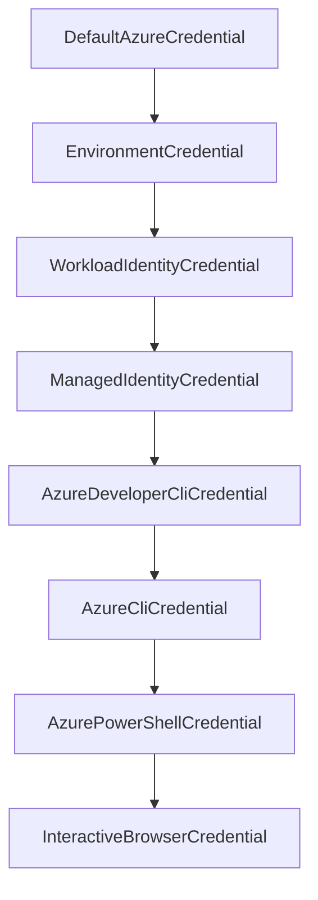

# How to Authenticate with Azure Services Using Azure.Identity in C# .NET

Author: [nawazdhandala](https://www.github.com/nawazdhandala)

Tags: Azure, C#, .NET, Authentication, Azure Identity, DefaultAzureCredential, Security

Description: Learn how to authenticate .NET applications with Azure services using the Azure.Identity library and DefaultAzureCredential for seamless credential management.

---

Every Azure SDK call requires authentication. The Azure.Identity library for .NET provides a unified way to handle credentials across development, testing, and production environments. Instead of scattering connection strings and secrets throughout your code, you use a single credential class that automatically picks the right authentication method based on where your code is running.

In this post, I will show how to use Azure.Identity in C# applications, from basic setup to production patterns.

## Installing the Package

Add the Azure.Identity NuGet package to your project.

```bash
# Add via .NET CLI
dotnet add package Azure.Identity

# You will also need the SDK for whatever service you are using
dotnet add package Azure.Security.KeyVault.Secrets
dotnet add package Azure.Storage.Blobs
```

## DefaultAzureCredential Basics

DefaultAzureCredential tries multiple authentication methods in order until one succeeds. This is the class you want to use 90% of the time.

```csharp
using Azure.Identity;
using Azure.Security.KeyVault.Secrets;

// Create a credential - it figures out how to authenticate automatically
var credential = new DefaultAzureCredential();

// Use it with any Azure SDK client
var client = new SecretClient(
    new Uri("https://my-vault.vault.azure.net/"),
    credential
);

// Fetch a secret
KeyVaultSecret secret = await client.GetSecretAsync("my-database-password");
Console.WriteLine($"Secret value: {secret.Value}");
```

The credential chain looks like this:



On your development machine, it uses your Azure CLI or Visual Studio login. In production on Azure, it uses managed identity. Same code, different environments, no changes needed.

## Local Development Setup

For local development, log in to Azure CLI first.

```bash
# Log in to Azure
az login

# Verify your account
az account show
```

If you use Visual Studio, you can also authenticate through Tools > Options > Azure Service Authentication. DefaultAzureCredential picks up Visual Studio credentials automatically.

## Using with Multiple Services

One credential instance works with every Azure SDK client.

```csharp
using Azure.Identity;
using Azure.Security.KeyVault.Secrets;
using Azure.Storage.Blobs;
using Azure.Messaging.ServiceBus;

// Single credential for everything
var credential = new DefaultAzureCredential();

// Key Vault client
var secretClient = new SecretClient(
    new Uri("https://my-vault.vault.azure.net/"),
    credential
);

// Blob Storage client
var blobClient = new BlobServiceClient(
    new Uri("https://mystorageacct.blob.core.windows.net/"),
    credential
);

// Service Bus client
var serviceBusClient = new ServiceBusClient(
    "my-namespace.servicebus.windows.net",
    credential
);
```

## Configuring DefaultAzureCredential

You can customize which credential types are tried and in what order.

```csharp
// Exclude credential types you do not need
var options = new DefaultAzureCredentialOptions
{
    ExcludeEnvironmentCredential = false,
    ExcludeManagedIdentityCredential = false,
    ExcludeAzureCliCredential = false,
    ExcludeVisualStudioCredential = true,       // Skip VS
    ExcludeVisualStudioCodeCredential = true,    // Skip VS Code
    ExcludeAzurePowerShellCredential = true,     // Skip PowerShell
    ExcludeInteractiveBrowserCredential = true   // Skip browser popup
};

var credential = new DefaultAzureCredential(options);
```

For user-assigned managed identity, specify the client ID.

```csharp
var options = new DefaultAzureCredentialOptions
{
    ManagedIdentityClientId = "your-managed-identity-client-id"
};

var credential = new DefaultAzureCredential(options);
```

## Dependency Injection in ASP.NET Core

In ASP.NET Core applications, register the credential in the DI container.

```csharp
// Program.cs
using Azure.Identity;
using Azure.Security.KeyVault.Secrets;
using Azure.Storage.Blobs;

var builder = WebApplication.CreateBuilder(args);

// Register Azure credential as a singleton
var credential = new DefaultAzureCredential();

// Register Azure service clients
builder.Services.AddSingleton(new SecretClient(
    new Uri(builder.Configuration["KeyVault:Url"]!),
    credential
));

builder.Services.AddSingleton(new BlobServiceClient(
    new Uri(builder.Configuration["Storage:Url"]!),
    credential
));

var app = builder.Build();

// Use the clients in your controllers/services
app.MapGet("/health", async (SecretClient secretClient) =>
{
    try
    {
        // Test Key Vault connectivity
        await secretClient.GetSecretAsync("health-check-secret");
        return Results.Ok(new { status = "healthy" });
    }
    catch (Exception ex)
    {
        return Results.Problem($"Key Vault connection failed: {ex.Message}");
    }
});

app.Run();
```

## Using Azure.Extensions.AspNetCore.Configuration.Secrets

For loading Key Vault secrets directly into .NET configuration, use the configuration provider.

```csharp
// Program.cs
using Azure.Identity;

var builder = WebApplication.CreateBuilder(args);

// Load secrets from Key Vault into the configuration system
builder.Configuration.AddAzureKeyVault(
    new Uri("https://my-vault.vault.azure.net/"),
    new DefaultAzureCredential()
);

// Now secrets are available through IConfiguration
// A secret named "Database--ConnectionString" in Key Vault
// becomes Configuration["Database:ConnectionString"]

var app = builder.Build();
app.Run();
```

```bash
# Add the NuGet package
dotnet add package Azure.Extensions.AspNetCore.Configuration.Secrets
```

## Managed Identity in Production

In Azure App Service, enable managed identity and assign RBAC roles.

```bash
# Enable system-assigned managed identity
az webapp identity assign \
    --name my-app \
    --resource-group my-rg

# Get the principal ID
PRINCIPAL_ID=$(az webapp identity show \
    --name my-app \
    --resource-group my-rg \
    --query principalId -o tsv)

# Assign Key Vault access
az role assignment create \
    --role "Key Vault Secrets User" \
    --assignee $PRINCIPAL_ID \
    --scope /subscriptions/<sub>/resourceGroups/<rg>/providers/Microsoft.KeyVault/vaults/<vault>

# Assign Storage access
az role assignment create \
    --role "Storage Blob Data Contributor" \
    --assignee $PRINCIPAL_ID \
    --scope /subscriptions/<sub>/resourceGroups/<rg>/providers/Microsoft.Storage/storageAccounts/<account>
```

No code changes needed. DefaultAzureCredential automatically uses managed identity when running on Azure.

## Environment Variables for CI/CD

In CI/CD pipelines, set environment variables for service principal authentication.

```yaml
# GitHub Actions example
env:
  AZURE_TENANT_ID: ${{ secrets.AZURE_TENANT_ID }}
  AZURE_CLIENT_ID: ${{ secrets.AZURE_CLIENT_ID }}
  AZURE_CLIENT_SECRET: ${{ secrets.AZURE_CLIENT_SECRET }}
```

DefaultAzureCredential picks these up through EnvironmentCredential automatically.

## Error Handling

When authentication fails, you get a CredentialUnavailableException or AuthenticationFailedException.

```csharp
using Azure.Identity;
using Azure.Security.KeyVault.Secrets;

try
{
    var credential = new DefaultAzureCredential();
    var client = new SecretClient(
        new Uri("https://my-vault.vault.azure.net/"),
        credential
    );

    // This forces a token request
    KeyVaultSecret secret = await client.GetSecretAsync("test-secret");
}
catch (CredentialUnavailableException ex)
{
    // No credential type in the chain was available
    Console.WriteLine($"No credentials available: {ex.Message}");
}
catch (AuthenticationFailedException ex)
{
    // Credentials were found but authentication failed
    Console.WriteLine($"Authentication failed: {ex.Message}");
}
catch (Azure.RequestFailedException ex)
{
    // Authentication succeeded but the request failed (e.g., no permission)
    Console.WriteLine($"Request failed: {ex.Status} - {ex.Message}");
}
```

## Using Specific Credential Types

Sometimes you want to use a specific credential type instead of the chain.

```csharp
// Use managed identity explicitly
var credential = new ManagedIdentityCredential();

// Use a service principal with a certificate
var certCredential = new ClientCertificateCredential(
    tenantId: "your-tenant-id",
    clientId: "your-client-id",
    clientCertificatePath: "/path/to/cert.pem"
);

// Chain specific credentials manually
var credential = new ChainedTokenCredential(
    new ManagedIdentityCredential(),
    new AzureCliCredential()
);
```

## Token Caching

Azure.Identity caches tokens internally. Tokens are reused until they expire, and the library handles refresh automatically. You do not need to implement any caching yourself.

For applications that create many credential instances, consider sharing a single instance across the application to take advantage of the token cache.

```csharp
// Good: shared credential instance
public static class AzureCredentials
{
    // Single instance, shared across the application
    public static readonly DefaultAzureCredential Instance = new();
}

// Usage
var secretClient = new SecretClient(vaultUri, AzureCredentials.Instance);
var blobClient = new BlobServiceClient(storageUri, AzureCredentials.Instance);
```

## Best Practices

1. **Use DefaultAzureCredential unless you have a specific reason not to.** It handles the most common scenarios.
2. **Register credentials as singletons** in DI containers to share the token cache.
3. **Exclude unused credential types** to speed up authentication and reduce log noise.
4. **Use managed identity in production.** It eliminates secrets entirely.
5. **Test locally with Azure CLI.** The `az login` flow is the simplest way to authenticate during development.
6. **Handle authentication errors separately** from service errors for better diagnostics.

## Wrapping Up

Azure.Identity simplifies authentication across the entire Azure SDK surface in .NET. DefaultAzureCredential gives you environment-aware authentication that works from your development machine to production without code changes. Combined with managed identity and RBAC, you can build applications that never need to handle raw credentials.
