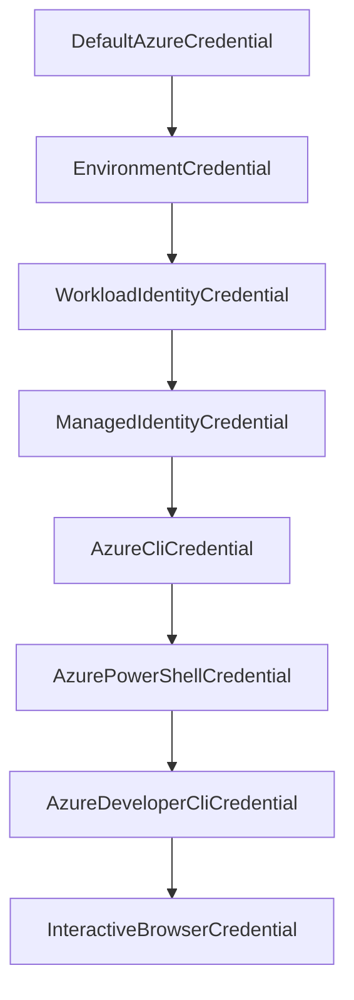

# How to Authenticate with Azure Services Using azure-identity DefaultAzureCredential in Python

Author: [nawazdhandala](https://www.github.com/nawazdhandala)

Tags: Azure, Python, Authentication, Azure Identity, DefaultAzureCredential, Cloud Security, SDK

Description: Learn how to use the azure-identity library and DefaultAzureCredential to authenticate your Python applications with Azure services seamlessly across development and production.

---

Authentication is the first hurdle you hit when building anything on Azure. You need to prove your identity before you can talk to Key Vault, Blob Storage, Cosmos DB, or any other Azure service. The old way - hardcoding connection strings or managing service principal secrets manually - was fragile and insecure. The azure-identity library changes that entirely with a single class called DefaultAzureCredential.

In this post, I will walk through how DefaultAzureCredential works, why it matters, and how to use it in real Python projects.

## What is DefaultAzureCredential?

DefaultAzureCredential is a credential class from the azure-identity Python package. Instead of tying your code to one specific authentication method, it tries multiple methods in order until one works. This means the same code runs on your laptop during development and in production on an Azure VM or App Service without any changes.

The credential chain it follows looks like this:



It starts with environment variables, moves to managed identity (for Azure-hosted resources), then falls back to Azure CLI (for local development). This ordering is intentional. In production, environment or managed identity credentials pick up automatically. On your machine, it grabs your Azure CLI login.

## Installing the Package

You need the azure-identity package plus whatever service SDK you plan to use. For this walkthrough I will also install the Key Vault secrets client as an example.

```bash
# Install azure-identity along with Key Vault client
pip install azure-identity azure-keyvault-secrets
```

## Basic Usage

The simplest possible example looks like this. You create a DefaultAzureCredential instance and pass it to a service client.

```python
from azure.identity import DefaultAzureCredential
from azure.keyvault.secrets import SecretClient

# Create a credential object - no secrets needed in code
credential = DefaultAzureCredential()

# Pass the credential to any Azure SDK client
vault_url = "https://my-vault.vault.azure.net/"
client = SecretClient(vault_url=vault_url, credential=credential)

# Now you can use the client as normal
secret = client.get_secret("my-database-password")
print(f"Secret value: {secret.value}")
```

That is it. No client IDs, no secrets, no certificates in your code. The credential object figures out how to authenticate based on the environment it is running in.

## How It Works Locally

On your development machine, DefaultAzureCredential typically uses your Azure CLI session. Make sure you are logged in first.

```bash
# Log in to Azure CLI
az login

# Verify your account
az account show
```

Once logged in, any Python script using DefaultAzureCredential will automatically use your CLI session. This is incredibly convenient because you do not need separate credentials for local development.

If you prefer to use Visual Studio Code's Azure extension, that works too. DefaultAzureCredential checks the VS Code credential as part of its chain.

## How It Works in Production

In production, you typically want to use Managed Identity. There are two flavors:

**System-assigned managed identity** - Azure creates an identity tied to a specific resource (like an App Service or VM). When you delete the resource, the identity goes away.

**User-assigned managed identity** - You create the identity separately and can attach it to multiple resources. This is useful when several services need the same permissions.

For system-assigned identity on an Azure App Service, you just enable it in the portal or CLI.

```bash
# Enable system-assigned managed identity on an App Service
az webapp identity assign --name my-web-app --resource-group my-rg
```

Once enabled, DefaultAzureCredential automatically detects it. No code changes needed.

For user-assigned identity, you need to tell DefaultAzureCredential which identity to use by passing the client ID.

```python
from azure.identity import DefaultAzureCredential

# Specify the client ID of your user-assigned managed identity
credential = DefaultAzureCredential(
    managed_identity_client_id="your-managed-identity-client-id"
)
```

## Using Environment Variables

Sometimes you want to authenticate with a service principal, especially in CI/CD pipelines. DefaultAzureCredential checks for these environment variables first.

```bash
# Set these environment variables for service principal auth
export AZURE_TENANT_ID="your-tenant-id"
export AZURE_CLIENT_ID="your-client-id"
export AZURE_CLIENT_SECRET="your-client-secret"
```

When these three variables are set, DefaultAzureCredential uses them automatically through the EnvironmentCredential in its chain.

## Excluding Credential Types

If you know you will never use certain credential types, you can exclude them. This speeds up authentication and avoids confusing error messages when a credential type fails.

```python
from azure.identity import DefaultAzureCredential

# Exclude credentials you do not need
credential = DefaultAzureCredential(
    exclude_environment_credential=False,
    exclude_managed_identity_credential=False,
    exclude_cli_credential=False,
    exclude_powershell_credential=True,  # Skip PowerShell
    exclude_visual_studio_code_credential=True,  # Skip VS Code
    exclude_interactive_browser_credential=True  # Skip browser popup
)
```

This is especially useful in containerized environments where you know managed identity is the only valid method.

## Working with Multiple Azure Services

DefaultAzureCredential works with every Azure SDK client. Here is an example that connects to both Blob Storage and Key Vault with the same credential.

```python
from azure.identity import DefaultAzureCredential
from azure.keyvault.secrets import SecretClient
from azure.storage.blob import BlobServiceClient

# One credential, multiple services
credential = DefaultAzureCredential()

# Connect to Key Vault
vault_client = SecretClient(
    vault_url="https://my-vault.vault.azure.net/",
    credential=credential
)

# Connect to Blob Storage
blob_client = BlobServiceClient(
    account_url="https://mystorageaccount.blob.core.windows.net/",
    credential=credential
)

# Use both clients
secret = vault_client.get_secret("storage-key")
containers = blob_client.list_containers()
for container in containers:
    print(container.name)
```

## Error Handling

When DefaultAzureCredential cannot authenticate with any method in the chain, it raises a ClientAuthenticationError. Handling this properly is important for debugging.

```python
from azure.identity import DefaultAzureCredential, CredentialUnavailableError
from azure.core.exceptions import ClientAuthenticationError

try:
    credential = DefaultAzureCredential()
    # Force a token request to test authentication
    token = credential.get_token("https://management.azure.com/.default")
    print("Authentication successful")
except ClientAuthenticationError as e:
    # This means all credential types in the chain failed
    print(f"Authentication failed: {e.message}")
except CredentialUnavailableError as e:
    # A specific credential type was not available
    print(f"Credential not available: {e.message}")
```

## Async Support

If you are building an async Python application, the azure-identity library has async versions of all credential classes.

```python
import asyncio
from azure.identity.aio import DefaultAzureCredential
from azure.keyvault.secrets.aio import SecretClient

async def get_secret():
    # Async credential
    credential = DefaultAzureCredential()
    client = SecretClient(
        vault_url="https://my-vault.vault.azure.net/",
        credential=credential
    )

    # Await the async call
    secret = await client.get_secret("my-secret")
    print(secret.value)

    # Always close async clients
    await client.close()
    await credential.close()

asyncio.run(get_secret())
```

## RBAC Permissions

Authentication is only half the story. Your identity also needs the right permissions. Azure uses Role-Based Access Control (RBAC) for this. After authenticating, you need to assign roles to your identity.

```bash
# Grant Key Vault Secrets User role to your managed identity
az role assignment create \
    --role "Key Vault Secrets User" \
    --assignee <principal-id> \
    --scope /subscriptions/<sub-id>/resourceGroups/<rg>/providers/Microsoft.KeyVault/vaults/<vault-name>
```

Common roles you will need:
- **Storage Blob Data Contributor** for Blob Storage read/write
- **Key Vault Secrets User** for reading secrets
- **Cosmos DB Account Reader Role** for Cosmos DB queries
- **Service Bus Data Sender/Receiver** for Service Bus messaging

## Best Practices

A few things I have learned from using DefaultAzureCredential in production:

1. **Never hardcode credentials.** DefaultAzureCredential exists specifically to avoid this.
2. **Use managed identity in production.** It eliminates secret rotation entirely.
3. **Limit the credential chain.** Exclude methods you do not use to speed up authentication and reduce noise in logs.
4. **Use RBAC with least privilege.** Give your identity only the permissions it actually needs.
5. **Test locally with Azure CLI.** The az login workflow makes local development smooth.

## Wrapping Up

DefaultAzureCredential is one of those things that seems simple on the surface but solves a genuinely hard problem - making authentication portable across environments. Your code does not care if it is running on your laptop or in a Kubernetes pod. The credential chain handles it.

If you are starting a new Python project on Azure, use azure-identity from the beginning. It saves you from the credential management headaches that inevitably show up later.
