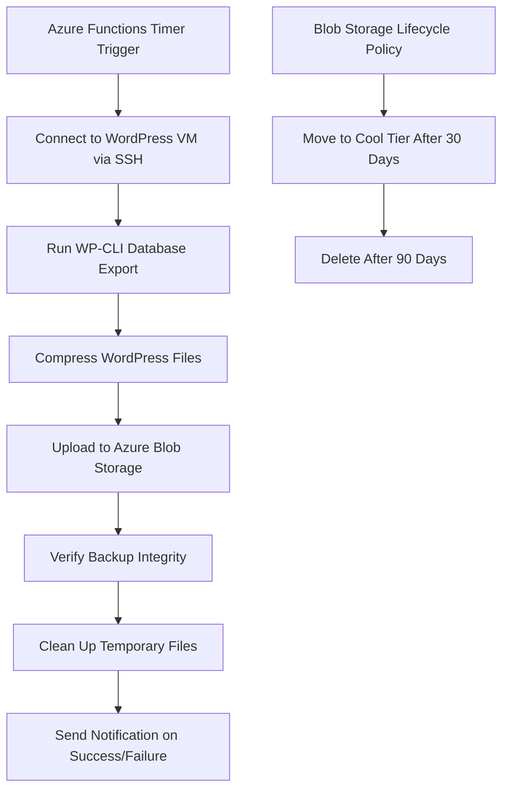

# How to Automate WordPress Backups to Azure Blob Storage Using Azure Functions and WP-CLI

Author: [nawazdhandala](https://www.github.com/nawazdhandala)

Tags: Azure, WordPress, Backups, Blob Storage, Azure Functions, WP-CLI, Automation

Description: Automate WordPress database and file backups to Azure Blob Storage using Azure Functions with WP-CLI for reliable, scheduled backup management.

---

Backups are one of those things everyone knows they should do but few set up properly. Manual backups are unreliable because people forget. WordPress backup plugins work but often have limited storage and can slow down your site during the backup process. A better approach is to run backups externally - using Azure Functions on a schedule to connect to your WordPress server, create backups via WP-CLI, and store them in Azure Blob Storage with automatic lifecycle management.

This guide walks through building an automated backup system that handles both database and file backups, stores them securely in Blob Storage, and cleans up old backups automatically.

## Architecture

The backup flow works like this: an Azure Function runs on a timer trigger (daily or however often you want). It connects to your WordPress server via SSH, runs WP-CLI commands to export the database and compress the files, uploads the result to Blob Storage, and then cleans up the temporary files on the server.



## Setting Up Azure Blob Storage for Backups

Create a storage account with lifecycle management for automatic cost optimization.

```bash
# Create a storage account for backups
az storage account create \
  --name wpbackupstorage \
  --resource-group rg-wordpress \
  --location eastus \
  --sku Standard_GRS \
  --kind StorageV2

# Create a container for backups
az storage container create \
  --name backups \
  --account-name wpbackupstorage

# Create a container for database backups separately
az storage container create \
  --name db-backups \
  --account-name wpbackupstorage
```

I chose Standard_GRS (geo-redundant storage) for backups. This replicates your data to a secondary region automatically - important for disaster recovery. Backups stored only in the same region as your server do not protect against regional outages.

## Configuring Lifecycle Management

Set up rules to move old backups to cheaper storage tiers and eventually delete them.

```bash
# Create a lifecycle management policy
az storage account management-policy create \
  --account-name wpbackupstorage \
  --resource-group rg-wordpress \
  --policy @lifecycle-policy.json
```

Here is the lifecycle policy JSON.

```json
{
  "rules": [
    {
      "name": "MoveToCoolAfter30Days",
      "enabled": true,
      "type": "Lifecycle",
      "definition": {
        "filters": {
          "blobTypes": ["blockBlob"],
          "prefixMatch": ["backups/", "db-backups/"]
        },
        "actions": {
          "baseBlob": {
            "tierToCool": {
              "daysAfterModificationGreaterThan": 30
            },
            "tierToArchive": {
              "daysAfterModificationGreaterThan": 60
            },
            "delete": {
              "daysAfterModificationGreaterThan": 180
            }
          }
        }
      }
    }
  ]
}
```

This policy keeps backups on the Hot tier for 30 days (fast retrieval), moves them to Cool for another 30 days (cheaper, slightly slower retrieval), archives them for another 120 days (very cheap but takes hours to retrieve), and deletes them after 180 days total.

## Creating the Azure Function

Create an Azure Functions project with a timer trigger. I will use Python, but you could use any supported language.

```bash
# Create a Function App
az functionapp create \
  --name wp-backup-functions \
  --resource-group rg-wordpress \
  --storage-account wpbackupstorage \
  --consumption-plan-location eastus \
  --runtime python \
  --runtime-version 3.11 \
  --functions-version 4 \
  --os-type Linux
```

Here is the function code.

```python
# function_app.py
import azure.functions as func
import paramiko
import io
import datetime
import logging
from azure.storage.blob import BlobServiceClient

app = func.FunctionApp()

# Run daily at 2 AM UTC
@app.timer_trigger(schedule="0 0 2 * * *",
                   arg_name="timer",
                   run_on_startup=False)
def backup_wordpress(timer: func.TimerRequest) -> None:
    logging.info("Starting WordPress backup")

    # Configuration
    wp_host = os.environ["WP_HOST"]
    wp_user = os.environ["WP_SSH_USER"]
    wp_ssh_key = os.environ["WP_SSH_PRIVATE_KEY"]
    wp_path = os.environ.get("WP_PATH", "/var/www/wordpress")
    storage_conn = os.environ["BACKUP_STORAGE_CONNECTION"]

    timestamp = datetime.datetime.utcnow().strftime("%Y%m%d_%H%M%S")

    try:
        # Connect to the WordPress server via SSH
        ssh = create_ssh_connection(wp_host, wp_user, wp_ssh_key)

        # Step 1: Backup the database
        db_backup_path = backup_database(ssh, wp_path, timestamp)

        # Step 2: Backup WordPress files
        files_backup_path = backup_files(ssh, wp_path, timestamp)

        # Step 3: Download and upload to Blob Storage
        upload_backup(ssh, db_backup_path, "db-backups", storage_conn, timestamp)
        upload_backup(ssh, files_backup_path, "backups", storage_conn, timestamp)

        # Step 4: Clean up temporary files on the server
        cleanup(ssh, db_backup_path, files_backup_path)

        ssh.close()
        logging.info("WordPress backup completed successfully")

    except Exception as e:
        logging.error(f"Backup failed: {str(e)}")
        raise


def create_ssh_connection(host, user, private_key_str):
    """Establish an SSH connection to the WordPress server."""
    ssh = paramiko.SSHClient()
    ssh.set_missing_host_key_policy(paramiko.AutoAddPolicy())

    # Load the private key from the environment variable
    key = paramiko.RSAKey.from_private_key(io.StringIO(private_key_str))

    ssh.connect(hostname=host, username=user, pkey=key)
    return ssh


def backup_database(ssh, wp_path, timestamp):
    """Run WP-CLI to export the database."""
    backup_file = f"/tmp/wp_db_{timestamp}.sql.gz"

    # Use WP-CLI to export the database and compress it
    command = (
        f"wp db export - --path={wp_path} --allow-root "
        f"| gzip > {backup_file}"
    )

    stdin, stdout, stderr = ssh.exec_command(command)
    exit_code = stdout.channel.recv_exit_status()

    if exit_code != 0:
        error = stderr.read().decode()
        raise Exception(f"Database backup failed: {error}")

    logging.info(f"Database backup created: {backup_file}")
    return backup_file


def backup_files(ssh, wp_path, timestamp):
    """Compress WordPress files (excluding uploads if offloaded)."""
    backup_file = f"/tmp/wp_files_{timestamp}.tar.gz"

    # Exclude uploads directory if media is offloaded to Blob Storage
    # Also exclude cache directories and node_modules
    command = (
        f"tar -czf {backup_file} "
        f"--exclude='{wp_path}/wp-content/uploads' "
        f"--exclude='{wp_path}/wp-content/cache' "
        f"--exclude='node_modules' "
        f"-C {wp_path} ."
    )

    stdin, stdout, stderr = ssh.exec_command(command)
    exit_code = stdout.channel.recv_exit_status()

    if exit_code != 0:
        error = stderr.read().decode()
        raise Exception(f"File backup failed: {error}")

    logging.info(f"File backup created: {backup_file}")
    return backup_file


def upload_backup(ssh, remote_path, container, storage_conn, timestamp):
    """Download backup from server and upload to Blob Storage."""
    # Open an SFTP session to download the file
    sftp = ssh.open_sftp()

    # Read the file into memory
    with sftp.open(remote_path, 'rb') as f:
        file_data = f.read()

    sftp.close()

    # Upload to Azure Blob Storage
    blob_service = BlobServiceClient.from_connection_string(storage_conn)
    blob_name = f"{timestamp}/{remote_path.split('/')[-1]}"

    blob_client = blob_service.get_blob_client(
        container=container, blob=blob_name
    )
    blob_client.upload_blob(file_data, overwrite=True)

    logging.info(f"Uploaded {blob_name} to {container}")


def cleanup(ssh, *file_paths):
    """Remove temporary backup files from the server."""
    for path in file_paths:
        ssh.exec_command(f"rm -f {path}")
    logging.info("Cleaned up temporary files")
```

## Configuring Function App Settings

Store the SSH key and connection details as Function App settings.

```bash
# Set environment variables for the function
az functionapp config appsettings set \
  --name wp-backup-functions \
  --resource-group rg-wordpress \
  --settings \
    WP_HOST="your-wordpress-vm-ip" \
    WP_SSH_USER="azureuser" \
    WP_PATH="/var/www/wordpress" \
    BACKUP_STORAGE_CONNECTION="DefaultEndpointsProtocol=https;AccountName=wpbackupstorage;..."
```

For the SSH private key, use Azure Key Vault for secure storage.

```bash
# Store the SSH key in Key Vault
az keyvault secret set \
  --vault-name wp-keyvault \
  --name wp-ssh-key \
  --file ~/.ssh/id_rsa

# Grant the Function App access to Key Vault
az functionapp identity assign \
  --name wp-backup-functions \
  --resource-group rg-wordpress

# Add a Key Vault reference in the app settings
az functionapp config appsettings set \
  --name wp-backup-functions \
  --resource-group rg-wordpress \
  --settings \
    WP_SSH_PRIVATE_KEY="@Microsoft.KeyVault(VaultName=wp-keyvault;SecretName=wp-ssh-key)"
```

## Adding Backup Verification

A backup is only useful if you can restore from it. Add a verification step that checks the backup file integrity.

```python
def verify_backup(ssh, backup_path, backup_type):
    """Verify that the backup file is valid."""
    if backup_type == "database":
        # Verify the gzipped SQL file can be read
        command = f"gunzip -t {backup_path}"
    else:
        # Verify the tar archive is intact
        command = f"tar -tzf {backup_path} > /dev/null"

    stdin, stdout, stderr = ssh.exec_command(command)
    exit_code = stdout.channel.recv_exit_status()

    if exit_code != 0:
        error = stderr.read().decode()
        raise Exception(f"Backup verification failed: {error}")

    # Check file size is reasonable (not empty)
    command = f"stat -c%s {backup_path}"
    stdin, stdout, stderr = ssh.exec_command(command)
    size = int(stdout.read().decode().strip())

    if size < 1024:  # Less than 1KB is suspicious
        raise Exception(f"Backup file suspiciously small: {size} bytes")

    logging.info(f"Backup verified: {backup_path} ({size} bytes)")
```

## Notification on Failure

Send an alert when a backup fails so you know about it immediately.

```python
import requests

def send_failure_notification(error_message):
    """Send a notification when backup fails."""
    # Using a webhook (Slack, Teams, or email via Logic App)
    webhook_url = os.environ.get("ALERT_WEBHOOK_URL")
    if webhook_url:
        payload = {
            "text": f"WordPress Backup Failed: {error_message}",
            "timestamp": datetime.datetime.utcnow().isoformat()
        }
        requests.post(webhook_url, json=payload)
```

## Restoring from Backup

When you need to restore, download the backup from Blob Storage and use WP-CLI to import it.

```bash
# Download the database backup from Blob Storage
az storage blob download \
  --account-name wpbackupstorage \
  --container-name db-backups \
  --name "20260216_020000/wp_db_20260216_020000.sql.gz" \
  --file /tmp/restore.sql.gz

# Decompress and import via WP-CLI
gunzip /tmp/restore.sql.gz
wp db import /tmp/restore.sql --path=/var/www/wordpress

# For file restore
az storage blob download \
  --account-name wpbackupstorage \
  --container-name backups \
  --name "20260216_020000/wp_files_20260216_020000.tar.gz" \
  --file /tmp/restore_files.tar.gz

tar -xzf /tmp/restore_files.tar.gz -C /var/www/wordpress
```

## Wrapping Up

Automated backups with Azure Functions and WP-CLI give you reliable, hands-off protection for your WordPress site. The function runs on a schedule, creates consistent backups using WP-CLI, stores them in geo-redundant Blob Storage, and lifecycle management keeps costs down by automatically tiering and eventually deleting old backups. The most important part is that the backups run outside your WordPress server, so they do not impact site performance, and they work even if your WordPress admin is inaccessible. Test your restore process periodically - a backup you have never restored from is just a hope, not a plan.
