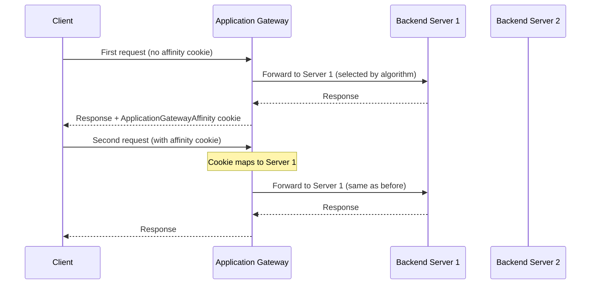

# How to Configure Azure Application Gateway with Cookie-Based Session Affinity

Author: [nawazdhandala](https://www.github.com/nawazdhandala)

Tags: Azure, Application Gateway, Session Affinity, Cookies, Sticky Sessions, Load Balancing, Web Applications

Description: Configure cookie-based session affinity on Azure Application Gateway to keep user sessions pinned to the same backend server.

---

Cookie-based session affinity on Azure Application Gateway ensures that once a user connects to a specific backend server, all subsequent requests from that user go to the same server. The gateway manages this by inserting a special cookie into the HTTP response, and the client's browser sends it back with every subsequent request.

This is essential for applications that store session state in-process on the web server. Without session affinity, a user might log in on Server A, then get routed to Server B for the next request and lose their session. Cookie-based affinity prevents this without requiring you to modify your application.

In this guide, I will cover how Application Gateway implements cookie-based affinity, how to enable and configure it, and the trade-offs you need to consider.

## How It Works

Azure Application Gateway uses a managed cookie called `ApplicationGatewayAffinity` (for v1) or `ApplicationGatewayAffinityCORS` (for v2 with CORS support). The flow looks like this:



The cookie contains an encoded reference to the specific backend server. Application Gateway decodes the cookie on each request and routes accordingly. If the target server is unhealthy, the gateway routes to a different healthy server and issues a new cookie.

## Step 1: Create the Application Gateway

Let us set up an Application Gateway v2 with a backend pool.

```bash
# Create a resource group
az group create \
  --name rg-appgw-affinity \
  --location eastus

# Create a VNet and subnet for the gateway
az network vnet create \
  --resource-group rg-appgw-affinity \
  --name vnet-appgw \
  --address-prefix 10.0.0.0/16 \
  --subnet-name snet-appgw \
  --subnet-prefix 10.0.1.0/24

# Create a public IP
az network public-ip create \
  --resource-group rg-appgw-affinity \
  --name pip-appgw \
  --sku Standard \
  --allocation-method Static

# Create the Application Gateway with two backend servers
az network application-gateway create \
  --resource-group rg-appgw-affinity \
  --name appgw-main \
  --location eastus \
  --sku Standard_v2 \
  --capacity 2 \
  --vnet-name vnet-appgw \
  --subnet snet-appgw \
  --public-ip-address pip-appgw \
  --http-settings-cookie-based-affinity Enabled \
  --servers 10.0.2.4 10.0.2.5 \
  --frontend-port 80 \
  --http-settings-port 80 \
  --http-settings-protocol Http
```

The `--http-settings-cookie-based-affinity Enabled` flag in the create command turns on session affinity for the default HTTP settings.

## Step 2: Enable Session Affinity on Existing HTTP Settings

If you already have an Application Gateway, you can enable cookie-based affinity on existing HTTP settings.

```bash
# Enable cookie-based affinity on existing HTTP settings
az network application-gateway http-settings update \
  --resource-group rg-appgw-affinity \
  --gateway-name appgw-main \
  --name appGatewayBackendHttpSettings \
  --cookie-based-affinity Enabled
```

To verify the current configuration:

```bash
# Check the current affinity setting
az network application-gateway http-settings show \
  --resource-group rg-appgw-affinity \
  --gateway-name appgw-main \
  --name appGatewayBackendHttpSettings \
  --query cookieBasedAffinity \
  --output tsv
```

## Step 3: Configure Custom Affinity Cookie Name

By default, the cookie is named `ApplicationGatewayAffinity`. You can customize this name if needed.

```bash
# Set a custom affinity cookie name
az network application-gateway http-settings update \
  --resource-group rg-appgw-affinity \
  --gateway-name appgw-main \
  --name appGatewayBackendHttpSettings \
  --cookie-based-affinity Enabled \
  --affinity-cookie-name "MyAppSessionId"
```

Custom cookie names are useful when:
- You have multiple Application Gateways and want to distinguish their cookies
- Your application already uses a cookie name that conflicts with the default
- Security scanning tools flag the default cookie name

## Step 4: Test Session Affinity

After enabling affinity, test it by making requests and examining the cookies.

```bash
# Make a request and look for the affinity cookie in the response
curl -v http://<gateway-ip>/ 2>&1 | grep -i "set-cookie"

# Expected output (something like):
# Set-Cookie: ApplicationGatewayAffinity=xxxxxxxxxxxx; Path=/; HttpOnly
```

Now send subsequent requests with the cookie and verify they hit the same backend. If your backend servers return their hostname or IP in a custom header, you can verify affinity easily.

```bash
# Save the cookie and make multiple requests
# All requests should hit the same backend
curl -c cookies.txt http://<gateway-ip>/
curl -b cookies.txt http://<gateway-ip>/
curl -b cookies.txt http://<gateway-ip>/
```

## Configuring Affinity for Different Backend Pools

If your Application Gateway routes to multiple backend pools (for different URL paths), you can have different affinity settings per HTTP settings object.

```bash
# Create separate HTTP settings for API traffic without affinity
az network application-gateway http-settings create \
  --resource-group rg-appgw-affinity \
  --gateway-name appgw-main \
  --name http-settings-api \
  --port 80 \
  --protocol Http \
  --cookie-based-affinity Disabled \
  --timeout 60

# Create HTTP settings for web traffic with affinity
az network application-gateway http-settings create \
  --resource-group rg-appgw-affinity \
  --gateway-name appgw-main \
  --name http-settings-web \
  --port 80 \
  --protocol Http \
  --cookie-based-affinity Enabled \
  --timeout 120
```

Then use path-based routing to direct traffic to the appropriate HTTP settings.

```bash
# Create a URL path map that routes /api to the stateless settings
# and everything else to the stateful settings
az network application-gateway url-path-map create \
  --resource-group rg-appgw-affinity \
  --gateway-name appgw-main \
  --name path-map \
  --paths "/api/*" \
  --http-settings http-settings-api \
  --address-pool backend-pool-api \
  --default-http-settings http-settings-web \
  --default-address-pool backend-pool-web

# Create a routing rule that uses the URL path map
az network application-gateway rule create \
  --resource-group rg-appgw-affinity \
  --gateway-name appgw-main \
  --name rule-path-based \
  --http-listener listener-http \
  --rule-type PathBasedRouting \
  --url-path-map path-map \
  --priority 100
```

This gives you affinity for web traffic (where sessions matter) and no affinity for API traffic (which should be stateless and evenly distributed).

## Cookie Properties

The affinity cookie set by Application Gateway has specific properties:

- **HttpOnly**: Yes. The cookie cannot be accessed by JavaScript, reducing XSS attack surface.
- **Secure**: Set when the frontend uses HTTPS.
- **Path**: Set to `/` by default, meaning it applies to all paths.
- **SameSite**: Follows browser defaults (usually Lax in modern browsers).
- **Expiry**: Session cookie (no explicit expiry). It lasts until the browser is closed.

Since the cookie is a session cookie, closing the browser clears it. The next time the user visits, they might be routed to a different backend. If your application needs persistent affinity across browser sessions, you will need to implement that at the application level.

## What Happens When a Backend Fails

If the backend server that the cookie points to becomes unhealthy, Application Gateway handles it gracefully:

1. The health probe detects the server is unhealthy
2. On the next request with the affinity cookie, Application Gateway sees the target is unhealthy
3. Application Gateway routes the request to a different healthy backend
4. A new affinity cookie is set for the new backend

The user loses their session on the failed server, but they do not get an error page. This is a trade-off inherent to in-process session state - if the server goes down, the session is lost regardless.

## Connection Draining for Graceful Shutdowns

When you need to take a backend server out of rotation (for updates, scaling, etc.), enable connection draining to give existing sessions time to complete.

```bash
# Enable connection draining with a 60-second timeout
az network application-gateway http-settings update \
  --resource-group rg-appgw-affinity \
  --gateway-name appgw-main \
  --name appGatewayBackendHttpSettings \
  --connection-draining-timeout 60
```

With connection draining enabled:
- New sessions are not sent to the draining server
- Existing sessions (identified by the affinity cookie) continue to be served for up to 60 seconds
- After the timeout, all remaining connections are terminated

## Monitoring Session Affinity

Use Application Gateway access logs to monitor affinity behavior.

```bash
# Enable diagnostic logging
az monitor diagnostic-settings create \
  --resource $(az network application-gateway show \
    -g rg-appgw-affinity -n appgw-main --query id -o tsv) \
  --name appgw-diagnostics \
  --logs '[{"category":"ApplicationGatewayAccessLog","enabled":true}]' \
  --workspace $(az monitor log-analytics workspace show \
    -g rg-monitoring -n law-main --query id -o tsv)
```

Query the logs to see how sessions are distributed across backends.

```
// Session distribution across backends
AzureDiagnostics
| where Category == "ApplicationGatewayAccessLog"
| where TimeGenerated > ago(1h)
| summarize RequestCount = count() by serverRouted_s
| render piechart
```

If session affinity is working properly, you should see requests distributed across backends, but individual client IPs should consistently route to the same backend.

```
// Verify individual clients stick to one backend
AzureDiagnostics
| where Category == "ApplicationGatewayAccessLog"
| where TimeGenerated > ago(1h)
| summarize
    UniqueBackends = dcount(serverRouted_s),
    RequestCount = count()
    by clientIP_s
| where UniqueBackends > 1
| order by RequestCount desc
```

Clients with `UniqueBackends > 1` had their session affinity broken - either by a backend failure or by the cookie being cleared.

## The Case Against Session Affinity

While session affinity solves immediate problems, it creates others. Uneven load distribution is the biggest concern - popular users with lots of requests get pinned to one server, potentially overloading it while others sit idle.

The recommended long-term approach is to externalize session state to a shared store like Redis.

```bash
# Create an Azure Cache for Redis for externalized session state
az redis create \
  --resource-group rg-appgw-affinity \
  --name redis-sessions \
  --location eastus \
  --sku Standard \
  --vm-size C1
```

With externalized sessions, you can disable affinity and let the gateway distribute load evenly. But that is a bigger change. Cookie-based affinity is the practical solution when you need something working today.
