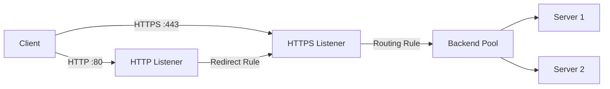

# How to Configure Azure Application Gateway with HTTP to HTTPS Redirect

Author: [nawazdhandala](https://www.github.com/nawazdhandala)

Tags: Azure, Application Gateway, HTTPS, SSL, Redirect, Web Security, Load Balancing

Description: Step-by-step guide to configuring Azure Application Gateway to automatically redirect all HTTP traffic to HTTPS for secure web applications.

---

Every web application should enforce HTTPS. There is no debate about that anymore. The question is just how you implement it. If you are using Azure Application Gateway as your load balancer and ingress point, you can handle HTTP to HTTPS redirection right at the gateway level, which means your backend servers never have to worry about it.

In this post, I will walk through the process of configuring Azure Application Gateway v2 to automatically redirect all HTTP requests to HTTPS. We will cover the certificate setup, listener configuration, and the redirect rules that tie everything together.

## Prerequisites

Before we start, you need a few things in place:

- An Azure Application Gateway v2 (Standard_v2 or WAF_v2 SKU)
- An SSL/TLS certificate (either uploaded directly or stored in Azure Key Vault)
- A backend pool with at least one healthy backend server
- A public IP address assigned to the gateway

If you are starting from scratch, I will include the commands to create the gateway as well.

## Understanding the Components

Application Gateway uses a pipeline of components to process requests. Understanding these is important before you start configuring redirects.



- **Listeners** watch for incoming connections on a specific port and protocol.
- **Rules** connect listeners to actions - either routing traffic to a backend pool or performing a redirect.
- **Backend pools** are your actual application servers.

The redirect strategy is simple: create an HTTP listener on port 80, create an HTTPS listener on port 443 with a certificate, then create a redirect rule that sends all HTTP traffic to the HTTPS listener.

## Step 1: Create the Application Gateway

If you already have a gateway running, skip to Step 2. Otherwise, let us set up the foundation.

```bash
# Create a resource group
az group create \
  --name rg-appgw \
  --location eastus

# Create a VNet and subnet for the gateway
az network vnet create \
  --resource-group rg-appgw \
  --name vnet-appgw \
  --address-prefix 10.0.0.0/16 \
  --subnet-name snet-appgw \
  --subnet-prefix 10.0.1.0/24

# Create a public IP for the gateway frontend
az network public-ip create \
  --resource-group rg-appgw \
  --name pip-appgw \
  --sku Standard \
  --allocation-method Static
```

## Step 2: Prepare Your SSL Certificate

You can either upload a PFX certificate directly or reference one stored in Azure Key Vault. I recommend Key Vault for production because it handles renewal and access control.

If you are using Key Vault, first create the vault and import your certificate.

```bash
# Create a Key Vault for certificate storage
az keyvault create \
  --resource-group rg-appgw \
  --name kv-appgw-certs \
  --location eastus

# Import a PFX certificate into Key Vault
az keyvault certificate import \
  --vault-name kv-appgw-certs \
  --name my-ssl-cert \
  --file /path/to/certificate.pfx \
  --password "your-pfx-password"
```

The Application Gateway needs a managed identity to access Key Vault. Create one and grant it access.

```bash
# Create a user-assigned managed identity for the gateway
az identity create \
  --resource-group rg-appgw \
  --name id-appgw

# Get the identity's principal ID
IDENTITY_ID=$(az identity show \
  --resource-group rg-appgw \
  --name id-appgw \
  --query principalId \
  --output tsv)

# Grant the identity access to Key Vault secrets
az keyvault set-policy \
  --name kv-appgw-certs \
  --object-id $IDENTITY_ID \
  --secret-permissions get list
```

## Step 3: Create the Application Gateway with Both Listeners

Now we create the gateway with the HTTPS listener and certificate configured.

```bash
# Get the Key Vault certificate secret ID
SECRET_ID=$(az keyvault certificate show \
  --vault-name kv-appgw-certs \
  --name my-ssl-cert \
  --query "sid" \
  --output tsv)

# Get the managed identity resource ID
IDENTITY_RESOURCE_ID=$(az identity show \
  --resource-group rg-appgw \
  --name id-appgw \
  --query id \
  --output tsv)

# Create the Application Gateway with HTTPS frontend
az network application-gateway create \
  --resource-group rg-appgw \
  --name appgw-main \
  --location eastus \
  --sku WAF_v2 \
  --capacity 2 \
  --vnet-name vnet-appgw \
  --subnet snet-appgw \
  --public-ip-address pip-appgw \
  --http-settings-port 443 \
  --http-settings-protocol Https \
  --frontend-port 443 \
  --key-vault-secret-id $SECRET_ID \
  --identity $IDENTITY_RESOURCE_ID \
  --servers 10.0.2.4 10.0.2.5
```

## Step 4: Add the HTTP Listener

The gateway was created with an HTTPS listener. Now add an HTTP listener on port 80.

```bash
# Add a frontend port for HTTP (port 80)
az network application-gateway frontend-port create \
  --resource-group rg-appgw \
  --gateway-name appgw-main \
  --name port-http \
  --port 80

# Create an HTTP listener that listens on port 80
az network application-gateway http-listener create \
  --resource-group rg-appgw \
  --gateway-name appgw-main \
  --name listener-http \
  --frontend-port port-http \
  --frontend-ip appGatewayFrontendIP
```

## Step 5: Create the Redirect Configuration

This is where the magic happens. We create a redirect configuration that points from the HTTP listener to the HTTPS listener.

```bash
# Create a redirect configuration that sends HTTP traffic to HTTPS
# Permanent (301) tells browsers to cache the redirect
az network application-gateway redirect-config create \
  --resource-group rg-appgw \
  --gateway-name appgw-main \
  --name redirect-http-to-https \
  --type Permanent \
  --target-listener listener-https \
  --include-path true \
  --include-query-string true
```

The flags `--include-path true` and `--include-query-string true` make sure the full URL is preserved during the redirect. A request to `http://example.com/api/users?page=2` will redirect to `https://example.com/api/users?page=2`.

The `--type Permanent` flag returns a 301 status code, which tells browsers and search engines that this redirect is permanent. This is what you want for HTTP to HTTPS redirects because it helps with SEO and browsers will remember the redirect for future requests.

## Step 6: Create the Routing Rule for HTTP

Now tie the HTTP listener to the redirect configuration with a routing rule.

```bash
# Create a rule that connects the HTTP listener to the redirect config
az network application-gateway rule create \
  --resource-group rg-appgw \
  --gateway-name appgw-main \
  --name rule-http-redirect \
  --http-listener listener-http \
  --redirect-config redirect-http-to-https \
  --priority 200 \
  --rule-type Basic
```

Each rule needs a unique priority value. Lower numbers mean higher priority. Make sure this does not conflict with your existing rules.

## Testing the Redirect

After the gateway finishes updating (it can take a few minutes), test the redirect with curl.

```bash
# Test the redirect - should return 301 with Location header pointing to HTTPS
curl -I http://your-gateway-ip/

# Expected output:
# HTTP/1.1 301 Moved Permanently
# Location: https://your-gateway-ip/
```

You should see a 301 response with a Location header pointing to the HTTPS URL. If you follow the redirect, you should reach your backend application over HTTPS.

```bash
# Follow the redirect and verify the full chain works
curl -L -I http://your-gateway-ip/
```

## Multi-Site Configuration

If your Application Gateway handles multiple domains (multi-site listeners), you need to set up the redirect per domain. Each domain needs its own HTTP listener, HTTPS listener, and redirect configuration.

```bash
# Create a multi-site HTTP listener for a specific domain
az network application-gateway http-listener create \
  --resource-group rg-appgw \
  --gateway-name appgw-main \
  --name listener-http-example-com \
  --frontend-port port-http \
  --frontend-ip appGatewayFrontendIP \
  --host-name "example.com"

# Create the matching HTTPS listener with the domain's certificate
az network application-gateway http-listener create \
  --resource-group rg-appgw \
  --gateway-name appgw-main \
  --name listener-https-example-com \
  --frontend-port port-https \
  --frontend-ip appGatewayFrontendIP \
  --host-name "example.com" \
  --ssl-cert my-ssl-cert

# Create a redirect config targeting the domain-specific HTTPS listener
az network application-gateway redirect-config create \
  --resource-group rg-appgw \
  --gateway-name appgw-main \
  --name redirect-example-com \
  --type Permanent \
  --target-listener listener-https-example-com \
  --include-path true \
  --include-query-string true
```

## Using ARM Templates

For repeatable deployments, here is the relevant snippet from an ARM template that configures the redirect.

```json
{
  "type": "Microsoft.Network/applicationGateways",
  "properties": {
    "redirectConfigurations": [
      {
        "name": "redirect-http-to-https",
        "properties": {
          "redirectType": "Permanent",
          "targetListener": {
            "id": "[concat(resourceId('Microsoft.Network/applicationGateways', 'appgw-main'), '/httpListeners/listener-https')]"
          },
          "includePath": true,
          "includeQueryString": true
        }
      }
    ]
  }
}
```

## Common Issues

**Certificate errors**: If the HTTPS listener cannot start, check that the certificate in Key Vault is accessible and the managed identity has the right permissions.

**Redirect loops**: This usually happens when the backend also tries to redirect. Make sure your backend is not doing its own HTTP to HTTPS redirect.

**Health probe failures**: If the backend health shows unhealthy, check that the HTTP settings protocol matches what your backend expects. If your backend only serves HTTP internally, set the HTTP settings to use HTTP even though the frontend uses HTTPS.

**Gateway update takes too long**: Application Gateway v2 updates can take 5-10 minutes. Be patient and do not stack multiple updates.

Configuring HTTP to HTTPS redirect on Azure Application Gateway is a one-time setup that gives you a clean, centralized way to enforce encryption. Once it is in place, you never have to think about it again, and your users always get the secure version of your site.
