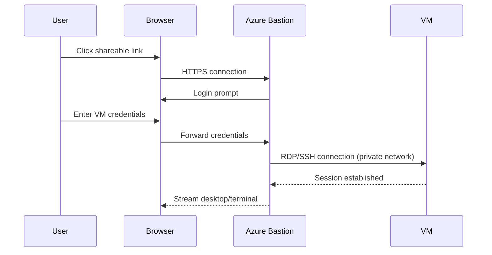

# How to Set Up Azure Bastion Shareable Link for VM Access Without Azure Portal

Author: [nawazdhandala](https://www.github.com/nawazdhandala)

Tags: Azure, Bastion, Shareable Link, VM Access, Remote Access, Security, SSH

Description: Configure Azure Bastion shareable links to provide secure VM access to users without requiring them to use the Azure portal.

---

Azure Bastion is the go-to service for secure RDP and SSH access to Azure VMs without exposing them to the public internet. But it has a practical limitation: users need access to the Azure portal to initiate a Bastion connection. That does not work for contractors, external partners, or team members who should not have portal access.

Azure Bastion Shareable Links solve this problem. They generate a unique URL that anyone can use to connect to a specific VM through Bastion - no Azure portal access required. The user clicks the link, authenticates with their VM credentials, and gets a browser-based RDP or SSH session.

In this post, I will walk through setting up Bastion with shareable links, creating links for specific VMs, managing link access, and the security considerations you need to think about.

## Prerequisites

Shareable Links require the Azure Bastion Standard SKU or higher. The Basic SKU does not support this feature. If you have a Basic SKU Bastion, you will need to upgrade.

## Step 1: Deploy Azure Bastion with Standard SKU

If you do not already have Bastion deployed, let us set it up.

```bash
# Create a resource group
az group create \
  --name rg-bastion \
  --location eastus

# Create or use an existing VNet
az network vnet create \
  --resource-group rg-bastion \
  --name vnet-main \
  --address-prefix 10.0.0.0/16 \
  --subnet-name snet-workload \
  --subnet-prefix 10.0.1.0/24

# Create the AzureBastionSubnet (must be named exactly this, minimum /26)
az network vnet subnet create \
  --resource-group rg-bastion \
  --vnet-name vnet-main \
  --name AzureBastionSubnet \
  --address-prefix 10.0.2.0/26

# Create a public IP for Bastion
az network public-ip create \
  --resource-group rg-bastion \
  --name pip-bastion \
  --sku Standard \
  --allocation-method Static

# Deploy Bastion with Standard SKU and shareable links enabled
az network bastion create \
  --resource-group rg-bastion \
  --name bastion-main \
  --vnet-name vnet-main \
  --public-ip-address pip-bastion \
  --sku Standard \
  --enable-shareable-link true \
  --location eastus
```

The `--enable-shareable-link true` flag is what makes this possible. Without it, you cannot create shareable links even on the Standard SKU.

## Step 2: Enable Shareable Links on an Existing Bastion

If you already have a Standard SKU Bastion deployed, you can enable shareable links without redeploying.

```bash
# Enable shareable links on an existing Bastion instance
az network bastion update \
  --resource-group rg-bastion \
  --name bastion-main \
  --enable-shareable-link true
```

## Step 3: Create a Shareable Link for a VM

Now create a shareable link for a specific VM. This generates a unique URL that grants access to that VM through Bastion.

Currently, shareable link creation is best done through the Azure portal or REST API. Here is how to do it with the Azure REST API.

```bash
# Get the Bastion resource ID
BASTION_ID=$(az network bastion show \
  --resource-group rg-bastion \
  --name bastion-main \
  --query id \
  --output tsv)

# Get the VM resource ID
VM_ID=$(az vm show \
  --resource-group rg-bastion \
  --name vm-web-01 \
  --query id \
  --output tsv)

# Create a shareable link using the REST API
az rest --method PUT \
  --url "${BASTION_ID}/createShareableLinks?api-version=2023-04-01" \
  --body "{
    \"vms\": [
      {
        \"vm\": {
          \"id\": \"${VM_ID}\"
        }
      }
    ]
  }"
```

The response contains a shareable link URL that looks something like:

```
https://bst-xxxxxxxx-xxxx.bastion.azure.com/api/shareable-url/tokenxxxxxxxx
```

This URL can be shared with anyone who needs access to the VM.

## Step 4: List and Manage Shareable Links

You can list all active shareable links for your Bastion instance.

```bash
# List all shareable links
az rest --method POST \
  --url "${BASTION_ID}/getShareableLinks?api-version=2023-04-01" \
  --body "{}"
```

To delete a shareable link when access should be revoked:

```bash
# Delete a shareable link for a specific VM
az rest --method POST \
  --url "${BASTION_ID}/deleteShareableLinks?api-version=2023-04-01" \
  --body "{
    \"vms\": [
      {
        \"vm\": {
          \"id\": \"${VM_ID}\"
        }
      }
    ]
  }"
```

Deleting the link immediately invalidates it. Anyone who has the URL will no longer be able to connect.

## How the User Experience Works

When a user receives a shareable link, here is what happens:

1. They open the link in a web browser (Chrome, Edge, Firefox - any modern browser works)
2. The browser connects to Azure Bastion
3. Bastion presents an RDP or SSH login screen directly in the browser
4. The user enters the VM's local credentials (username and password, or SSH key)
5. A full RDP or SSH session opens in the browser tab



The user never needs Azure portal access, an Azure subscription, or any special client software. Just a web browser.

## Setting Up Multiple Links for a Team

For a team of developers who need access to different VMs, create links in bulk.

```bash
# Create shareable links for multiple VMs at once
VM_IDS=$(az vm list \
  --resource-group rg-dev-environment \
  --query "[].id" \
  --output tsv)

# Build the JSON body with all VM IDs
VM_JSON="["
FIRST=true
for vm_id in $VM_IDS; do
  if [ "$FIRST" = true ]; then
    FIRST=false
  else
    VM_JSON="${VM_JSON},"
  fi
  VM_JSON="${VM_JSON}{\"vm\":{\"id\":\"${vm_id}\"}}"
done
VM_JSON="${VM_JSON}]"

# Create shareable links for all VMs
az rest --method PUT \
  --url "${BASTION_ID}/createShareableLinks?api-version=2023-04-01" \
  --body "{\"vms\": ${VM_JSON}}"
```

## Security Considerations

Shareable links are powerful but need careful management. Here are the security aspects to consider:

### Link Exposure

The shareable link is essentially a bearer token. Anyone who has the URL can attempt to connect to the VM. They still need valid VM credentials to log in, but the link itself should be treated as sensitive.

- Share links through secure channels (encrypted messaging, password managers)
- Do not post shareable links in public channels or emails that might be forwarded
- Rotate links periodically by deleting and recreating them

### VM-Level Authentication

The shareable link gets the user to the Bastion login screen. They still need to authenticate against the VM itself. Make sure your VMs have strong authentication:

```bash
# For Linux VMs, disable password authentication and use SSH keys only
az vm update \
  --resource-group rg-bastion \
  --name vm-linux-01 \
  --set osProfile.linuxConfiguration.disablePasswordAuthentication=true
```

For Windows VMs, enforce strong passwords and consider using Azure AD authentication.

### Network Security

Bastion connections are always encrypted end-to-end with TLS. The shareable link URL uses HTTPS. Traffic between Bastion and the target VM uses RDP (3389) or SSH (22) over the private network.

### Auditing

All Bastion connections are logged, including those through shareable links. Enable diagnostic logging to track who connects and when.

```bash
# Enable Bastion diagnostic logging
az monitor diagnostic-settings create \
  --resource $(az network bastion show -g rg-bastion -n bastion-main --query id -o tsv) \
  --name bastion-logs \
  --logs '[{"category":"BastionAuditLogs","enabled":true}]' \
  --workspace $(az monitor log-analytics workspace show \
    -g rg-monitoring -n law-main --query id -o tsv)
```

Query the audit logs in Log Analytics.

```
// Show all Bastion connection attempts in the last 24 hours
MicrosoftAzureBastionAuditLogs
| where TimeGenerated > ago(24h)
| project
    TimeGenerated,
    UserAgent,
    UserName,
    ClientIpAddress,
    TargetVMIPAddress,
    Protocol,
    SessionStartTime,
    SessionEndTime,
    Message
| order by TimeGenerated desc
```

### Link Revocation

When someone leaves the project or no longer needs access, revoke their link immediately. Unlike credentials that might expire, shareable links remain active until explicitly deleted.

Build a process for regular link review. A simple script that lists all active links and their creation dates can help:

```bash
# List all active shareable links with details
az rest --method POST \
  --url "${BASTION_ID}/getShareableLinks?api-version=2023-04-01" \
  --body "{}" \
  --query "value[].{vm:vm.id, link:bsl, createdAt:createdAt}" \
  --output table
```

## Cost Considerations

Azure Bastion Standard SKU is billed by the hour, regardless of whether shareable links are used. The cost of enabling shareable links is included in the Standard SKU pricing - there is no additional per-link charge.

However, Bastion also charges for outbound data transfer. Browser-based RDP sessions can consume significant bandwidth, especially for graphical workloads. Monitor your data transfer costs if you have many concurrent users.

## Alternatives to Consider

If shareable links do not fit your scenario, consider these alternatives:

- **Azure AD authentication with Bastion**: Users authenticate with their Azure AD credentials instead of local VM credentials. Requires Azure AD integration on the VM.
- **Native client support**: Bastion Standard supports native RDP and SSH clients (not just browser-based). Users connect using their local terminal or RDP client through a Bastion tunnel.
- **Just-in-time VM access**: Microsoft Defender for Cloud can lock down VM access and open it temporarily when requested.

Shareable links fill a specific gap in the Azure Bastion workflow - giving VM access to people who do not have Azure portal access. They are simple to create, easy to revoke, and maintain the security posture that Bastion provides. Just treat the links like credentials and manage them accordingly.
