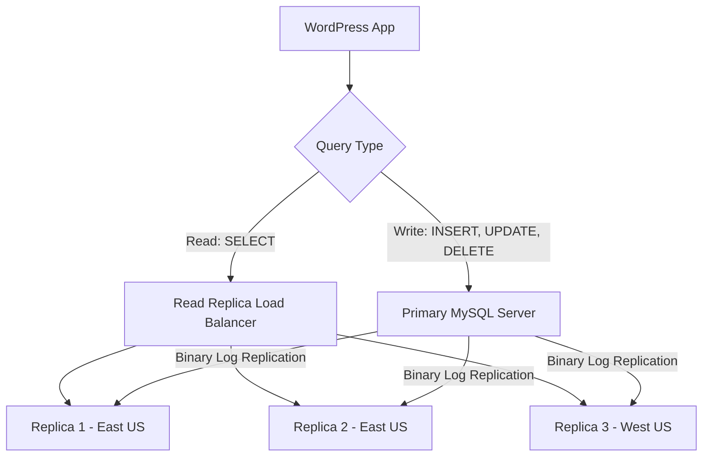

# How to Configure Azure Database for MySQL as a WordPress Backend with Read Replicas

Author: [nawazdhandala](https://www.github.com/nawazdhandala)

Tags: Azure, MySQL, WordPress, Read Replicas, Database, Performance, Scaling

Description: Configure Azure Database for MySQL Flexible Server as a WordPress backend and use read replicas to scale database performance under heavy traffic.

---

WordPress is a database-heavy application. Every page load can trigger dozens of MySQL queries - fetching posts, loading options, resolving menus, and running plugin queries. On a busy site, the database becomes the bottleneck long before PHP or the web server runs out of capacity. Azure Database for MySQL Flexible Server gives you a managed MySQL instance, and its read replica feature lets you offload read-heavy queries to separate database instances.

In this guide, I will walk through setting up Azure Database for MySQL as a WordPress backend and configuring read replicas to distribute the database load.

## Creating the Primary MySQL Server

Start with a Flexible Server instance that will serve as your primary (write) server.

```bash
# Create the primary MySQL Flexible Server
az mysql flexible-server create \
  --name wp-primary-mysql \
  --resource-group rg-wordpress \
  --location eastus \
  --admin-user wpadmin \
  --admin-password 'Str0ngP@ssword123!' \
  --sku-name Standard_D2ds_v4 \
  --tier GeneralPurpose \
  --storage-size 64 \
  --version 8.0 \
  --high-availability ZoneRedundant

# Create the WordPress database
az mysql flexible-server db create \
  --resource-group rg-wordpress \
  --server-name wp-primary-mysql \
  --database-name wordpress
```

I chose the GeneralPurpose tier with zone-redundant high availability. For a production WordPress site, this gives you automatic failover with a standby server in a different availability zone. The D2ds_v4 SKU provides 2 vCores and 8 GB of RAM, which handles moderate WordPress traffic well.

## Optimizing MySQL Server Parameters

WordPress has specific patterns that benefit from tuning certain MySQL parameters.

```bash
# Increase the InnoDB buffer pool for caching
az mysql flexible-server parameter set \
  --resource-group rg-wordpress \
  --server-name wp-primary-mysql \
  --name innodb_buffer_pool_size \
  --value 4294967296

# Increase max connections (WordPress with caching plugins can be connection-heavy)
az mysql flexible-server parameter set \
  --resource-group rg-wordpress \
  --server-name wp-primary-mysql \
  --name max_connections \
  --value 500

# Enable slow query log for performance debugging
az mysql flexible-server parameter set \
  --resource-group rg-wordpress \
  --server-name wp-primary-mysql \
  --name slow_query_log \
  --value ON

# Log queries taking longer than 2 seconds
az mysql flexible-server parameter set \
  --resource-group rg-wordpress \
  --server-name wp-primary-mysql \
  --name long_query_time \
  --value 2

# Optimize for WordPress query patterns
az mysql flexible-server parameter set \
  --resource-group rg-wordpress \
  --server-name wp-primary-mysql \
  --name query_cache_type \
  --value 1

az mysql flexible-server parameter set \
  --resource-group rg-wordpress \
  --server-name wp-primary-mysql \
  --name query_cache_size \
  --value 67108864
```

## Creating Read Replicas

Read replicas are copies of your primary server that receive updates asynchronously through MySQL binary log replication. They can serve read queries independently, which is perfect for WordPress since the vast majority of its queries are reads (SELECT statements).

```bash
# Create the first read replica in the same region
az mysql flexible-server replica create \
  --replica-name wp-replica-1 \
  --resource-group rg-wordpress \
  --source-server wp-primary-mysql

# Create a second read replica for more capacity
az mysql flexible-server replica create \
  --replica-name wp-replica-2 \
  --resource-group rg-wordpress \
  --source-server wp-primary-mysql

# Optionally create a replica in a different region for geographic distribution
az mysql flexible-server replica create \
  --replica-name wp-replica-westus \
  --resource-group rg-wordpress \
  --source-server wp-primary-mysql \
  --location westus2
```

Each replica runs independently with its own compute and storage. They are read-only, so any write queries sent to them will fail.

## Understanding the Replication Architecture

Here is how the data flows between the primary and replicas.



Replication lag is typically under a second for Azure MySQL Flexible Server replicas. This means there is a brief window where a user might write data (like posting a comment) and not immediately see it when the page reloads if the read hits a replica. There are strategies to handle this, which I will cover below.

## Configuring WordPress to Use Read Replicas

WordPress does not natively support read replicas. You need a plugin that splits read and write queries. The HyperDB plugin (originally developed by Automattic for WordPress.com) is the standard solution.

Download HyperDB and place the `db.php` file in your `wp-content` directory. Then configure it with your primary and replica connection details.

```php
// wp-content/db-config.php
// HyperDB configuration for Azure MySQL read replicas

$wpdb->save_queries = false;
$wpdb->persistent = false;
$wpdb->max_connections = 10;
$wpdb->check_tcp_responsiveness = true;

// Primary server - handles all writes and reads when replicas are unavailable
$wpdb->add_database(array(
    'host'     => 'wp-primary-mysql.mysql.database.azure.com',
    'user'     => 'wpadmin',
    'password' => 'Str0ngP@ssword123!',
    'name'     => 'wordpress',
    'write'    => 1,    // This server accepts writes
    'read'     => 1,    // Also accepts reads as fallback
    'dataset'  => 'global',
    'timeout'  => 0.5,  // Connection timeout in seconds
));

// Read replica 1
$wpdb->add_database(array(
    'host'     => 'wp-replica-1.mysql.database.azure.com',
    'user'     => 'wpadmin',
    'password' => 'Str0ngP@ssword123!',
    'name'     => 'wordpress',
    'write'    => 0,    // Read-only
    'read'     => 2,    // Higher priority for reads
    'dataset'  => 'global',
    'timeout'  => 0.5,
));

// Read replica 2
$wpdb->add_database(array(
    'host'     => 'wp-replica-2.mysql.database.azure.com',
    'user'     => 'wpadmin',
    'password' => 'Str0ngP@ssword123!',
    'name'     => 'wordpress',
    'write'    => 0,
    'read'     => 2,
    'dataset'  => 'global',
    'timeout'  => 0.5,
));
```

HyperDB automatically routes SELECT queries to the read replicas and everything else to the primary. The `read` weight parameter controls how queries are distributed. Higher values mean more reads go to that server.

## Handling Replication Lag

Replication lag can cause issues where a user submits a form and does not see their changes on the next page load. There are a few strategies to handle this.

The simplest approach is to force the primary server for logged-in users. Since most write operations come from logged-in users (admin, editors, commenters), routing all their queries to the primary avoids lag issues entirely.

```php
// In your theme's functions.php or a custom plugin
// Force primary database for logged-in users
add_action('init', function() {
    if (is_user_logged_in()) {
        // Tell HyperDB to use the primary for all queries
        global $wpdb;
        $wpdb->stickywrite = true;
    }
});
```

Another approach is to use the "sticky write" feature. After any write operation, HyperDB routes all subsequent reads to the primary for the remainder of the request. This handles the case where a write and read happen in the same page load.

## Monitoring Replica Performance

Keep an eye on replication lag and replica health.

```bash
# Check replication status for a replica
az mysql flexible-server replica list \
  --resource-group rg-wordpress \
  --name wp-primary-mysql \
  --output table

# Monitor replication lag via MySQL
mysql -h wp-replica-1.mysql.database.azure.com \
  -u wpadmin -p \
  -e "SHOW SLAVE STATUS\G" | grep "Seconds_Behind_Master"
```

You can also set up Azure Monitor alerts for replication lag.

```bash
# Create an alert when replication lag exceeds 10 seconds
az monitor metrics alert create \
  --name "ReplicaLagAlert" \
  --resource-group rg-wordpress \
  --scopes "/subscriptions/{sub-id}/resourceGroups/rg-wordpress/providers/Microsoft.DBforMySQL/flexibleServers/wp-replica-1" \
  --condition "avg replication_lag > 10" \
  --description "MySQL replica lag exceeds 10 seconds"
```

## When to Add More Replicas

A single replica can handle a significant amount of read traffic. You should consider adding more replicas when you see sustained CPU usage above 70% on existing replicas, average query latency increasing during peak hours, or connection count approaching the limit.

Each replica can be a different SKU from the primary. If your read workload is lighter than your write workload, you can use smaller SKUs for replicas to save cost.

## Cost Considerations

Read replicas are billed independently. Each replica incurs its own compute and storage costs. For a WordPress site, one replica is often enough to double your effective database capacity. Two replicas give you redundancy - if one replica fails, the other keeps serving reads.

The high-availability feature on the primary server is separate from read replicas. HA provides automatic failover for the primary server. Replicas provide read scalability. You usually want both for a production WordPress site.

## Wrapping Up

Azure Database for MySQL with read replicas transforms WordPress from a single-database application into a horizontally scalable one. The primary server handles writes, replicas handle reads, and HyperDB routes queries automatically. For content-heavy WordPress sites where most traffic is anonymous readers viewing published content, this architecture can handle significantly more traffic than a single database server. The combination of managed MySQL, automatic replication, and zone-redundant high availability gives you enterprise-grade database reliability for your WordPress site.
