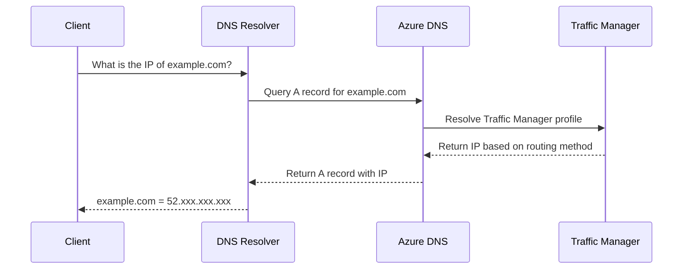

# How to Set Up Azure DNS Alias Records for Zone Apex with Traffic Manager

Author: [nawazdhandala](https://www.github.com/nawazdhandala)

Tags: Azure, DNS, Alias Records, Zone Apex, Traffic Manager, Networking, High Availability

Description: Configure Azure DNS alias records to point your zone apex domain to Azure Traffic Manager without CNAME limitations.

---

If you have ever tried to point your root domain (the zone apex, like `example.com` without any prefix) to an Azure Traffic Manager profile, you have hit a fundamental DNS limitation: CNAME records cannot exist at the zone apex. The DNS specification (RFC 1034) prohibits it because a CNAME cannot coexist with other record types, and the zone apex always has SOA and NS records.

This means you cannot do this:

```
example.com    CNAME    myapp.trafficmanager.net    # NOT ALLOWED at zone apex
```

Azure DNS alias records solve this problem. An alias record is an Azure-specific feature that lets you point a DNS record at the zone apex to another Azure resource - including Traffic Manager profiles - without using a CNAME.

In this post, I will walk through setting up alias records to point your zone apex to Traffic Manager, explain how they work compared to traditional records, and cover the gotchas you need to know.

## How Alias Records Work

Alias records are a feature of Azure DNS (they do not exist in standard DNS). When a DNS resolver queries an alias record, Azure DNS resolves the target resource internally and returns the final IP address (an A record) to the client. The client never sees the indirection.



From the client's perspective, it just gets an A record. The alias resolution happens entirely within Azure's infrastructure. This makes it compatible with every DNS resolver and client in the world - no special support needed.

## Step 1: Set Up the Traffic Manager Profile

First, let us make sure we have a Traffic Manager profile with endpoints configured.

```bash
# Create a resource group
az group create \
  --name rg-dns-tm \
  --location eastus

# Create a Traffic Manager profile with performance routing
az network traffic-manager profile create \
  --resource-group rg-dns-tm \
  --name tm-myapp \
  --routing-method Performance \
  --unique-dns-name myapp-tm \
  --ttl 30 \
  --protocol HTTPS \
  --port 443 \
  --path "/health"

# Add endpoints to the profile
az network traffic-manager endpoint create \
  --resource-group rg-dns-tm \
  --profile-name tm-myapp \
  --type azureEndpoints \
  --name endpoint-eastus \
  --target-resource-id $(az webapp show -g rg-app -n myapp-eastus --query id -o tsv) \
  --endpoint-status Enabled

az network traffic-manager endpoint create \
  --resource-group rg-dns-tm \
  --profile-name tm-myapp \
  --type azureEndpoints \
  --name endpoint-westus \
  --target-resource-id $(az webapp show -g rg-app -n myapp-westus --query id -o tsv) \
  --endpoint-status Enabled
```

## Step 2: Create the Azure DNS Zone

If you do not already have an Azure DNS zone for your domain, create one.

```bash
# Create a DNS zone for your domain
az network dns zone create \
  --resource-group rg-dns-tm \
  --name example.com
```

After creating the zone, update your domain registrar to use Azure's name servers.

```bash
# Get the Azure name servers
az network dns zone show \
  --resource-group rg-dns-tm \
  --name example.com \
  --query nameServers \
  --output tsv
```

## Step 3: Create the Zone Apex Alias Record

Now create an alias A record at the zone apex that points to the Traffic Manager profile.

```bash
# Get the Traffic Manager profile resource ID
TM_ID=$(az network traffic-manager profile show \
  --resource-group rg-dns-tm \
  --name tm-myapp \
  --query id \
  --output tsv)

# Create an alias A record at the zone apex pointing to Traffic Manager
az network dns record-set a create \
  --resource-group rg-dns-tm \
  --zone-name example.com \
  --name "@" \
  --target-resource $TM_ID
```

The `"@"` symbol represents the zone apex. The `--target-resource` flag creates an alias record instead of a regular A record.

That is it. `example.com` now resolves to the IP addresses returned by Traffic Manager, based on whatever routing method you configured (performance, priority, weighted, etc.).

## Step 4: Create an Alias Record for www

While we are at it, set up `www.example.com` as well. For the www subdomain, you could use a CNAME, but an alias record works too and has some advantages.

```bash
# Create an alias record for www pointing to the same Traffic Manager profile
az network dns record-set a create \
  --resource-group rg-dns-tm \
  --zone-name example.com \
  --name "www" \
  --target-resource $TM_ID
```

Or if you prefer, create a CNAME for www that points to the zone apex.

```bash
# Alternative: CNAME for www pointing to the zone apex
az network dns record-set cname set-record \
  --resource-group rg-dns-tm \
  --zone-name example.com \
  --record-set-name "www" \
  --cname "example.com"
```

## Verifying the Setup

Test DNS resolution from an external perspective.

```bash
# Query the zone apex - should return an A record with an IP address
dig example.com A

# Query www - should return the same or similar result
dig www.example.com A

# Compare with the Traffic Manager FQDN
dig myapp-tm.trafficmanager.net A
```

The IP addresses returned for `example.com` should match those returned for `myapp-tm.trafficmanager.net`.

## Alias Records vs. CNAME Flattening

Some other DNS providers offer "CNAME flattening" to solve the zone apex problem. Azure's alias records serve a similar purpose but have some important differences:

| Feature | Azure Alias Records | CNAME Flattening |
|---|---|---|
| DNS Standard | Azure-specific extension | Provider-specific |
| Works at zone apex | Yes | Yes |
| Resolves within Azure | Yes | Provider-dependent |
| Health-check aware | Yes | No |
| Supports Azure resources | Yes | No |
| Free query charges | Yes (for Azure resources) | Provider-dependent |

The key advantage of alias records is the health-check integration. If an Azure resource (like Traffic Manager) becomes unhealthy, the alias record reflects this immediately. With CNAME flattening, the DNS provider does not know about the resource's health.

## Supported Target Resources

Alias records can point to several types of Azure resources:

- **Traffic Manager profiles**: Most common use case for zone apex routing
- **Azure CDN endpoints**: Point your domain directly to a CDN endpoint
- **Public IP addresses**: Point to a specific public IP (useful for load balancers)
- **Azure Front Door profiles**: Route zone apex traffic through Front Door
- **Another DNS record set in the same zone**: Create aliases within the zone

```bash
# Alias to an Azure Public IP
az network dns record-set a create \
  --resource-group rg-dns-tm \
  --zone-name example.com \
  --name "lb" \
  --target-resource $(az network public-ip show \
    -g rg-lb -n pip-lb-main --query id -o tsv)

# Alias to an Azure Front Door endpoint
az network dns record-set a create \
  --resource-group rg-dns-tm \
  --zone-name example.com \
  --name "@" \
  --target-resource $(az afd endpoint show \
    -g rg-fd --profile-name fd-main --endpoint-name myapp --query id -o tsv)
```

## TTL Behavior with Alias Records

Alias records have a special TTL behavior. The TTL of the alias record is ignored - instead, the TTL from the target resource is used. For Traffic Manager, this means the TTL you set on the Traffic Manager profile (not the DNS record) controls the caching behavior.

```bash
# Set the Traffic Manager profile TTL to 30 seconds for fast failover
az network traffic-manager profile update \
  --resource-group rg-dns-tm \
  --name tm-myapp \
  --ttl 30
```

This is actually an advantage because it keeps the TTL consistent between direct Traffic Manager queries and alias record queries.

## Handling Multiple Record Types

Unlike CNAME records, alias A records can coexist with other record types at the zone apex. This means you can have:

```bash
# Alias A record at zone apex (for Traffic Manager)
# Already created above

# MX records at zone apex (for email)
az network dns record-set mx add-record \
  --resource-group rg-dns-tm \
  --zone-name example.com \
  --record-set-name "@" \
  --exchange "mail.example.com" \
  --preference 10

# TXT records at zone apex (for SPF, verification, etc.)
az network dns record-set txt add-record \
  --resource-group rg-dns-tm \
  --zone-name example.com \
  --record-set-name "@" \
  --value "v=spf1 include:spf.protection.outlook.com -all"
```

This would not be possible with a CNAME at the zone apex because CNAME records cannot coexist with any other record types.

## Monitoring and Troubleshooting

Check the alias record resolution using Azure CLI.

```bash
# Show the alias record configuration
az network dns record-set a show \
  --resource-group rg-dns-tm \
  --zone-name example.com \
  --name "@" \
  --output json
```

If the alias is not resolving correctly:

**Target resource not found**: Verify the Traffic Manager profile exists and the resource ID is correct. If the target is deleted, the alias record will return NXDOMAIN.

**Slow propagation**: After creating or changing an alias record, allow a few minutes for propagation. DNS resolvers worldwide cache records based on the TTL.

**Health check failures**: If Traffic Manager health checks mark all endpoints as unhealthy, the alias record will still resolve (to the last known good IP), but Traffic Manager will return a degraded state. Check endpoint health status.

```bash
# Check Traffic Manager endpoint health
az network traffic-manager profile show \
  --resource-group rg-dns-tm \
  --name tm-myapp \
  --query "endpoints[].{name:name, status:endpointStatus, monitor:endpointMonitorStatus}" \
  --output table
```

## Cost Benefits

Alias records that point to Azure resources are free from DNS query charges. Regular DNS queries against Azure DNS zones are billed per million queries, but alias record queries to Azure resources are exempt. This can save meaningful money for high-traffic domains.

Setting up alias records for zone apex with Traffic Manager takes just a few minutes but solves a real DNS limitation that has frustrated network engineers for years. The integration with Traffic Manager health checks and the transparent resolution makes it the cleanest solution for pointing your root domain to a globally distributed application.
