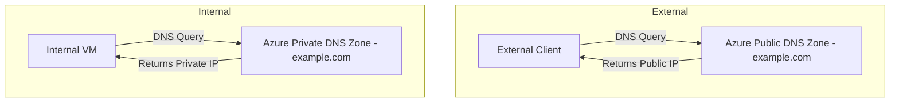

# How to Configure Azure DNS Split-Horizon for Internal and External Resolution

Author: [nawazdhandala](https://www.github.com/nawazdhandala)

Tags: Azure, DNS, Split-Horizon, Private DNS, Networking, Name Resolution, Azure DNS

Description: Implement split-horizon DNS in Azure so the same domain name resolves to private IPs internally and public IPs for external users.

---

Split-horizon DNS is a pattern where the same domain name resolves to different IP addresses depending on where the query comes from. Internal users on your corporate network get private IP addresses, while external users get public IP addresses. This is a common requirement in enterprise environments where you want `app.example.com` to point to a private IP for employees and a public IP for customers.

Azure supports split-horizon DNS through a combination of Azure Public DNS zones and Azure Private DNS zones. In this post, I will show you how to set this up, how it works behind the scenes, and what pitfalls to watch out for.

## Why Split-Horizon DNS?

There are several practical reasons to use split-horizon DNS:

- **Performance**: Internal users connect directly to private endpoints instead of going through a public load balancer and back into the network (a pattern called "hairpinning").
- **Security**: Internal traffic stays on the private network. You avoid exposing internal services to the public DNS.
- **Simplicity**: Applications use the same hostname regardless of where they run. No need for separate internal and external URLs.
- **Compliance**: Some regulatory frameworks require that certain traffic never traverse the public internet.

## How It Works in Azure

The split-horizon setup in Azure relies on two DNS zones with the same domain name but different visibility:



- **Azure Public DNS zone**: Visible to the entire internet. Contains A records pointing to public IPs.
- **Azure Private DNS zone**: Visible only to linked VNets. Contains A records pointing to private IPs.

When a VM in a linked VNet queries DNS, Azure's resolver checks the private DNS zone first. If the record exists there, it returns the private IP. If not, it falls through to public DNS. External clients query public DNS resolvers and get the public IP.

## Step 1: Create the Public DNS Zone

The public DNS zone handles resolution for external users.

```bash
# Create a resource group for DNS resources
az group create \
  --name rg-dns \
  --location eastus

# Create a public DNS zone for your domain
az network dns zone create \
  --resource-group rg-dns \
  --name example.com
```

After creating the zone, you need to update your domain registrar to point to Azure's name servers. Get the name server records.

```bash
# Get the Azure name servers for your zone
az network dns zone show \
  --resource-group rg-dns \
  --name example.com \
  --query "nameServers" \
  --output tsv
```

Update your domain registrar with these NS records. This delegates DNS resolution for `example.com` to Azure.

## Step 2: Create the Private DNS Zone

The private DNS zone handles resolution for internal VNet resources.

```bash
# Create a private DNS zone with the same domain name
az network private-dns zone create \
  --resource-group rg-dns \
  --name example.com
```

Yes, the zone name is identical. That is the whole point of split-horizon - same name, different results depending on who is asking.

## Step 3: Link the Private DNS Zone to Your VNets

The private DNS zone only works for VNets that are linked to it. Link all the VNets where you need internal resolution.

```bash
# Link the private DNS zone to the application VNet
az network private-dns link vnet create \
  --resource-group rg-dns \
  --zone-name example.com \
  --name link-vnet-app \
  --virtual-network /subscriptions/<sub-id>/resourceGroups/rg-network/providers/Microsoft.Network/virtualNetworks/vnet-app \
  --registration-enabled false

# Link to the hub VNet as well
az network private-dns link vnet create \
  --resource-group rg-dns \
  --zone-name example.com \
  --name link-vnet-hub \
  --virtual-network /subscriptions/<sub-id>/resourceGroups/rg-network/providers/Microsoft.Network/virtualNetworks/vnet-hub \
  --registration-enabled false
```

The `--registration-enabled false` flag means VMs in these VNets will not automatically register their DNS records in the zone. Set it to `true` if you want automatic registration (useful for VMs, less so for split-horizon scenarios).

## Step 4: Add Records to Both Zones

Now add the DNS records. The public zone gets public IPs, and the private zone gets private IPs.

```bash
# Add a public A record for the web application (external users)
az network dns record-set a add-record \
  --resource-group rg-dns \
  --zone-name example.com \
  --record-set-name app \
  --ipv4-address 20.100.50.25

# Add the corresponding private A record (internal users)
az network private-dns record-set a add-record \
  --resource-group rg-dns \
  --zone-name example.com \
  --record-set-name app \
  --ipv4-address 10.0.1.100
```

Now, `app.example.com` resolves to `20.100.50.25` for external users and `10.0.1.100` for VMs in the linked VNets.

You can add records for multiple services.

```bash
# Public records for various services
az network dns record-set a add-record \
  --resource-group rg-dns \
  --zone-name example.com \
  --record-set-name api \
  --ipv4-address 20.100.50.26

az network dns record-set a add-record \
  --resource-group rg-dns \
  --zone-name example.com \
  --record-set-name portal \
  --ipv4-address 20.100.50.27

# Corresponding private records
az network private-dns record-set a add-record \
  --resource-group rg-dns \
  --zone-name example.com \
  --record-set-name api \
  --ipv4-address 10.0.1.101

az network private-dns record-set a add-record \
  --resource-group rg-dns \
  --zone-name example.com \
  --record-set-name portal \
  --ipv4-address 10.0.1.102
```

## Step 5: Verify the Configuration

Test from a VM inside a linked VNet to confirm private resolution.

```bash
# From a VM inside the VNet, resolve the hostname
nslookup app.example.com

# Expected output:
# Name:    app.example.com
# Address:  10.0.1.100
```

Test from an external machine to confirm public resolution.

```bash
# From your local machine or any external location
nslookup app.example.com

# Expected output:
# Name:    app.example.com
# Address:  20.100.50.25
```

## Handling Private Endpoints with Split-Horizon

A common scenario is using split-horizon DNS with Azure Private Link. When you create a private endpoint for a service like Azure SQL or Storage, Azure recommends a specific private DNS zone (like `privatelink.database.windows.net`). But you might also want your own custom domain to resolve to the private endpoint.

Here is how to chain them together.

```bash
# Create a CNAME in your private DNS zone that points to the private endpoint FQDN
az network private-dns record-set cname set-record \
  --resource-group rg-dns \
  --zone-name example.com \
  --record-set-name sql \
  --cname sqlserver-prod.privatelink.database.windows.net
```

This way, `sql.example.com` resolves to the CNAME `sqlserver-prod.privatelink.database.windows.net`, which in turn resolves to the private IP through the `privatelink.database.windows.net` private DNS zone.

## DNS Forwarding for Hybrid Environments

If you have on-premises DNS servers and need them to resolve your Azure private DNS zones, you need DNS forwarding. Set up a DNS forwarder in Azure (or use Azure DNS Private Resolver) to forward queries from on-premises to Azure Private DNS.

```bash
# Create an Azure DNS Private Resolver for hybrid DNS forwarding
az dns-resolver create \
  --resource-group rg-dns \
  --resolver-name resolver-main \
  --location eastus \
  --id /subscriptions/<sub-id>/resourceGroups/rg-network/providers/Microsoft.Network/virtualNetworks/vnet-hub

# Create an inbound endpoint (on-premises forwards queries here)
az dns-resolver inbound-endpoint create \
  --resource-group rg-dns \
  --resolver-name resolver-main \
  --inbound-endpoint-name inbound \
  --location eastus \
  --ip-configurations "[{\"privateIpAllocationMethod\":\"Dynamic\",\"subnet\":{\"id\":\"/subscriptions/<sub-id>/resourceGroups/rg-network/providers/Microsoft.Network/virtualNetworks/vnet-hub/subnets/snet-dns-inbound\"}}]"
```

Configure your on-premises DNS server to conditionally forward queries for `example.com` to the inbound endpoint's IP address. This lets on-premises users also get the private IP resolution.

## Things to Watch Out For

**TTL consistency**: Keep TTL values consistent between public and private zones, or you might get confusing behavior during transitions.

**Zone linkage**: If you forget to link a VNet to the private DNS zone, VMs in that VNet will get the public IP instead of the private one. This can cause traffic to hairpin unnecessarily.

**Auto-registration conflicts**: If you enable auto-registration on a private DNS zone, VMs register their computer names. This can conflict with manually created records if the names overlap.

**VPN and ExpressRoute users**: On-premises users connecting through VPN or ExpressRoute need DNS forwarding set up (as described above) to benefit from private DNS resolution. Without forwarding, they query public DNS and get public IPs.

**Multiple subscriptions**: Private DNS zones can be linked to VNets in different subscriptions, but the person setting up the link needs appropriate permissions in both the DNS zone's subscription and the VNet's subscription.

Split-horizon DNS in Azure is a clean solution for serving different IP addresses to internal and external users. The combination of public and private DNS zones is straightforward to set up, and once it is running, it requires minimal maintenance. Just make sure you keep both zones in sync when you add or change records, and always verify from both internal and external perspectives after making changes.
