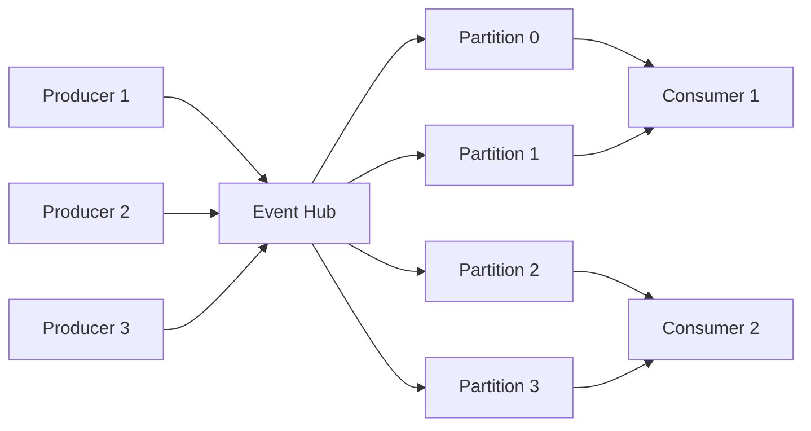

# How to Implement Azure Event Hubs Event Processing with @azure/event-hubs in Node.js

Author: [nawazdhandala](https://www.github.com/nawazdhandala)

Tags: Azure, Event Hubs, Node.js, Event Processing, Streaming, TypeScript, Messaging

Description: Learn how to produce and consume events using Azure Event Hubs with the @azure/event-hubs SDK in a Node.js application.

---

When your application generates thousands or millions of events per second - telemetry from IoT devices, clickstream data from a website, transaction logs from a payment system - you need something designed for high-throughput event ingestion. Azure Event Hubs is that something. It can handle millions of events per second with low latency and integrates natively with other Azure services. The `@azure/event-hubs` SDK for Node.js gives you a clean API for both producing and consuming events.

This guide covers the full picture: setting up Event Hubs, sending events, processing events with checkpointing, and handling errors in production.

## How Event Hubs Works

Event Hubs uses a partitioned consumer model. Events are distributed across partitions (think of them as parallel lanes on a highway), and consumers read from those partitions independently. This design is what gives Event Hubs its throughput. Multiple consumers in a consumer group can process events in parallel, each reading from different partitions.



## Prerequisites

- Azure account with an active subscription
- Node.js 18 or later
- Azure CLI installed
- Basic understanding of event-driven architecture

## Provisioning Event Hubs

Create an Event Hubs namespace and an event hub:

```bash
# Create a resource group
az group create --name eventhubs-demo-rg --location eastus

# Create an Event Hubs namespace
az eventhubs namespace create \
  --name my-eventhubs-ns \
  --resource-group eventhubs-demo-rg \
  --location eastus \
  --sku Standard

# Create an event hub with 4 partitions
az eventhubs eventhub create \
  --name my-events \
  --resource-group eventhubs-demo-rg \
  --namespace-name my-eventhubs-ns \
  --partition-count 4 \
  --message-retention 7

# Create a consumer group for our application
az eventhubs eventhub consumer-group create \
  --name my-app-group \
  --resource-group eventhubs-demo-rg \
  --namespace-name my-eventhubs-ns \
  --eventhub-name my-events

# Get the connection string
az eventhubs namespace authorization-rule keys list \
  --name RootManageSharedAccessKey \
  --resource-group eventhubs-demo-rg \
  --namespace-name my-eventhubs-ns \
  --query primaryConnectionString \
  --output tsv
```

You also need a storage account for checkpointing (more on this later):

```bash
# Create storage account for checkpoint data
az storage account create \
  --name eventhubscheckpoints \
  --resource-group eventhubs-demo-rg \
  --location eastus \
  --sku Standard_LRS

# Create a blob container for checkpoints
az storage container create \
  --name checkpoints \
  --account-name eventhubscheckpoints
```

## Project Setup

```bash
# Initialize the project
mkdir eventhubs-demo && cd eventhubs-demo
npm init -y

# Install Event Hubs SDK and checkpoint store
npm install @azure/event-hubs @azure/eventhubs-checkpointstore-blob @azure/storage-blob dotenv
npm install --save-dev typescript @types/node ts-node
```

Create a `.env` file:

```env
# Event Hubs connection details
EVENT_HUBS_CONNECTION_STRING="Endpoint=sb://my-eventhubs-ns.servicebus.windows.net/;SharedAccessKeyName=RootManageSharedAccessKey;SharedAccessKey=your-key"
EVENT_HUB_NAME="my-events"
CONSUMER_GROUP="my-app-group"

# Storage account for checkpointing
STORAGE_CONNECTION_STRING="DefaultEndpointsProtocol=https;AccountName=eventhubscheckpoints;AccountKey=your-key;EndpointSuffix=core.windows.net"
STORAGE_CONTAINER_NAME="checkpoints"
```

## Sending Events

Here is a producer that sends events to the hub:

```typescript
// src/producer.ts - Send events to Azure Event Hubs
import { EventHubProducerClient, EventData } from '@azure/event-hubs';
import dotenv from 'dotenv';

dotenv.config();

// Interface for our event payload
interface SensorReading {
  sensorId: string;
  temperature: number;
  humidity: number;
  timestamp: string;
}

async function sendEvents() {
  // Create the producer client
  const producer = new EventHubProducerClient(
    process.env.EVENT_HUBS_CONNECTION_STRING!,
    process.env.EVENT_HUB_NAME!
  );

  try {
    // Create a batch of events
    const batch = await producer.createBatch();

    // Generate some sample sensor readings
    const readings: SensorReading[] = Array.from({ length: 100 }, (_, i) => ({
      sensorId: `sensor-${(i % 10) + 1}`,
      temperature: 20 + Math.random() * 15,
      humidity: 40 + Math.random() * 30,
      timestamp: new Date().toISOString(),
    }));

    for (const reading of readings) {
      const eventData: EventData = {
        body: reading,
        // Use sensor ID as partition key to ensure
        // events from the same sensor go to the same partition
        properties: {
          source: 'sensor-network',
          type: 'reading',
        },
      };

      // tryAdd returns false if the batch is full
      if (!batch.tryAdd(eventData)) {
        // Send the current batch and create a new one
        await producer.sendBatch(batch);
        console.log(`Sent batch of ${batch.count} events`);

        const newBatch = await producer.createBatch();
        if (!newBatch.tryAdd(eventData)) {
          throw new Error('Event too large for an empty batch');
        }
      }
    }

    // Send any remaining events
    if (batch.count > 0) {
      await producer.sendBatch(batch);
      console.log(`Sent final batch of ${batch.count} events`);
    }
  } finally {
    // Always close the producer when done
    await producer.close();
  }
}

// Send events with partition key for ordering guarantee
async function sendWithPartitionKey() {
  const producer = new EventHubProducerClient(
    process.env.EVENT_HUBS_CONNECTION_STRING!,
    process.env.EVENT_HUB_NAME!
  );

  try {
    // Events with the same partition key go to the same partition
    // This guarantees ordering for events from the same source
    const batch = await producer.createBatch({
      partitionKey: 'sensor-1',
    });

    batch.tryAdd({ body: { value: 1 } });
    batch.tryAdd({ body: { value: 2 } });
    batch.tryAdd({ body: { value: 3 } });

    await producer.sendBatch(batch);
    console.log('Sent ordered events for sensor-1');
  } finally {
    await producer.close();
  }
}

sendEvents().catch(console.error);
```

## Consuming Events with Checkpointing

The consumer is more complex because it needs to handle checkpointing. Checkpointing records which events have been processed so that if your consumer restarts, it picks up where it left off instead of reprocessing everything:

```typescript
// src/consumer.ts - Process events from Azure Event Hubs with checkpointing
import { EventHubConsumerClient, ReceivedEventData, PartitionContext } from '@azure/event-hubs';
import { ContainerClient } from '@azure/storage-blob';
import { BlobCheckpointStore } from '@azure/eventhubs-checkpointstore-blob';
import dotenv from 'dotenv';

dotenv.config();

async function processEvents() {
  // Create blob storage client for checkpoint data
  const containerClient = new ContainerClient(
    process.env.STORAGE_CONNECTION_STRING!,
    process.env.STORAGE_CONTAINER_NAME!
  );

  // Create the checkpoint store backed by Azure Blob Storage
  const checkpointStore = new BlobCheckpointStore(containerClient);

  // Create the consumer client with checkpoint store
  const consumer = new EventHubConsumerClient(
    process.env.CONSUMER_GROUP!,
    process.env.EVENT_HUBS_CONNECTION_STRING!,
    process.env.EVENT_HUB_NAME!,
    checkpointStore
  );

  // Track event counts per partition for logging
  const partitionCounts: Record<string, number> = {};

  // Subscribe to all partitions
  const subscription = consumer.subscribe({
    // Called for each batch of events received
    processEvents: async (events: ReceivedEventData[], context: PartitionContext) => {
      if (events.length === 0) {
        return;
      }

      // Track how many events we have processed per partition
      const partitionId = context.partitionId;
      partitionCounts[partitionId] = (partitionCounts[partitionId] || 0) + events.length;

      for (const event of events) {
        const reading = event.body;
        console.log(
          `Partition ${partitionId} | Sensor: ${reading.sensorId} | ` +
          `Temp: ${reading.temperature.toFixed(1)} | ` +
          `Humidity: ${reading.humidity.toFixed(1)}`
        );

        // Process the event - in production, this might write to a database,
        // trigger an alert, or forward to another service
        await handleSensorReading(reading);
      }

      // Checkpoint after processing the batch
      // This records the last processed event so we do not reprocess on restart
      await context.updateCheckpoint(events[events.length - 1]);
      console.log(
        `Checkpointed partition ${partitionId} at offset ${events[events.length - 1].offset}`
      );
    },

    // Called when an error occurs during processing
    processError: async (err: Error, context: PartitionContext) => {
      console.error(
        `Error on partition ${context.partitionId}: ${err.message}`
      );
    },
  });

  // Run for a specified duration, then clean up
  console.log('Consumer started. Press Ctrl+C to stop.');

  // Handle graceful shutdown
  process.on('SIGINT', async () => {
    console.log('Shutting down consumer...');
    await subscription.close();
    await consumer.close();
    console.log('Consumer stopped. Partition counts:', partitionCounts);
    process.exit(0);
  });
}

// Business logic for processing a sensor reading
async function handleSensorReading(reading: {
  sensorId: string;
  temperature: number;
  humidity: number;
}) {
  // Check for threshold violations
  if (reading.temperature > 30) {
    console.warn(`HIGH TEMP ALERT: ${reading.sensorId} at ${reading.temperature.toFixed(1)}C`);
  }

  if (reading.humidity > 60) {
    console.warn(`HIGH HUMIDITY ALERT: ${reading.sensorId} at ${reading.humidity.toFixed(1)}%`);
  }
}

processEvents().catch(console.error);
```

## Error Handling and Retries

In production, you want robust error handling. Events that fail processing should not block the entire partition:

```typescript
// Resilient event processing with dead-letter handling
processEvents: async (events, context) => {
  const failedEvents: ReceivedEventData[] = [];

  for (const event of events) {
    try {
      await handleSensorReading(event.body);
    } catch (error) {
      console.error(`Failed to process event: ${error}`);
      failedEvents.push(event);
    }
  }

  // Send failed events to a dead-letter queue for later investigation
  if (failedEvents.length > 0) {
    await sendToDeadLetter(failedEvents);
  }

  // Always checkpoint to avoid reprocessing successful events
  if (events.length > 0) {
    await context.updateCheckpoint(events[events.length - 1]);
  }
},
```

## Monitoring Throughput

Keep track of your processing rate to ensure your consumers can keep up with producers:

```typescript
// Simple throughput monitor
let processedCount = 0;
let lastReportTime = Date.now();

// Report throughput every 10 seconds
setInterval(() => {
  const elapsed = (Date.now() - lastReportTime) / 1000;
  const rate = processedCount / elapsed;
  console.log(`Throughput: ${rate.toFixed(0)} events/second`);
  processedCount = 0;
  lastReportTime = Date.now();
}, 10000);
```

## Wrapping Up

Azure Event Hubs with the `@azure/event-hubs` SDK provides a reliable, high-throughput event processing pipeline for Node.js applications. The partitioned model gives you parallelism, checkpointing ensures you do not lose events on restart, and the managed service means you do not have to run Kafka clusters yourself. The key patterns to remember are: use partition keys for ordering guarantees, checkpoint after processing (not before), and handle errors per event rather than per batch so one bad event does not stall your pipeline.
