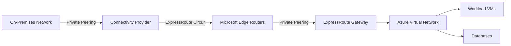

# How to Configure Azure ExpressRoute Private Peering with Virtual Network Gateway

Author: [nawazdhandala](https://www.github.com/nawazdhandala)

Tags: Azure, ExpressRoute, Private Peering, Virtual Network Gateway, Hybrid Networking, BGP

Description: Set up Azure ExpressRoute private peering with a virtual network gateway to establish a dedicated private connection between on-premises and Azure networks.

---

ExpressRoute is Azure's dedicated private connection service. Unlike VPN connections that go over the public internet, ExpressRoute gives you a private link between your on-premises data center and Azure through a connectivity provider. Private peering is the most common peering type - it extends your on-premises network into Azure, letting resources communicate as if they were on the same network.

In this guide, I will cover the full setup process for ExpressRoute private peering, including creating the circuit, configuring the peering, deploying a virtual network gateway, and connecting everything together.

## Architecture Overview

Here is how the components fit together.



The key components are:

- **ExpressRoute Circuit**: The logical connection between your network and Microsoft's network, provisioned through a connectivity provider.
- **Private Peering**: The BGP session between your edge routers and Microsoft's edge routers, used for VNet connectivity.
- **ExpressRoute Gateway**: A virtual network gateway deployed in your VNet that connects the VNet to the ExpressRoute circuit.

## Step 1: Create the ExpressRoute Circuit

First, create the ExpressRoute circuit. You will need to choose a connectivity provider, peering location, and bandwidth tier.

```bash
# Create a resource group for ExpressRoute resources
az group create \
  --name rg-expressroute \
  --location eastus

# Create an ExpressRoute circuit
# Choose your provider and peering location from available options
az network express-route create \
  --resource-group rg-expressroute \
  --name er-circuit-main \
  --provider "Equinix" \
  --peering-location "Washington DC" \
  --bandwidth 1000 \
  --sku-family MeteredData \
  --sku-tier Standard \
  --allow-classic-operations false
```

After creating the circuit, you get a service key. Share this key with your connectivity provider so they can provision their side of the connection.

```bash
# Get the service key to share with your connectivity provider
az network express-route show \
  --resource-group rg-expressroute \
  --name er-circuit-main \
  --query serviceKey \
  --output tsv
```

The circuit will show a provider status of "NotProvisioned" until the connectivity provider completes their setup. This process can take days to weeks depending on the provider.

```bash
# Check the provisioning status of the circuit
az network express-route show \
  --resource-group rg-expressroute \
  --name er-circuit-main \
  --query "serviceProviderProvisioningState" \
  --output tsv
```

Wait until the status shows "Provisioned" before proceeding.

## Step 2: Configure Private Peering

Once the provider has provisioned the circuit, configure the private peering. You need to agree on BGP parameters with your network team.

```bash
# Configure private peering on the ExpressRoute circuit
# The /30 subnets are used for point-to-point BGP sessions
az network express-route peering create \
  --resource-group rg-expressroute \
  --circuit-name er-circuit-main \
  --peering-type AzurePrivatePeering \
  --peer-asn 65001 \
  --primary-peer-subnet 172.16.0.0/30 \
  --secondary-peer-subnet 172.16.0.4/30 \
  --vlan-id 100 \
  --shared-key "YourBGPAuthKey123"
```

Here is what each parameter means:

- `--peer-asn 65001`: The BGP Autonomous System Number (ASN) of your on-premises network. This must be a private ASN (64512-65534 for 16-bit) unless you own a public ASN.
- `--primary-peer-subnet 172.16.0.0/30`: A /30 subnet for the primary BGP link. Azure uses .1, your router uses .2.
- `--secondary-peer-subnet 172.16.0.4/30`: A /30 subnet for the secondary (redundant) BGP link. Same allocation - Azure gets .5, you get .6.
- `--vlan-id 100`: The VLAN tag for this peering. Coordinate this with your connectivity provider.
- `--shared-key`: Optional MD5 authentication key for the BGP session.

## Step 3: Create the Virtual Network and Gateway Subnet

The ExpressRoute gateway needs a dedicated subnet called GatewaySubnet.

```bash
# Create a VNet for your workloads
az network vnet create \
  --resource-group rg-expressroute \
  --name vnet-main \
  --address-prefix 10.0.0.0/16 \
  --subnet-name snet-workload \
  --subnet-prefix 10.0.1.0/24

# Create the GatewaySubnet (must be at least /27 for ExpressRoute)
az network vnet subnet create \
  --resource-group rg-expressroute \
  --vnet-name vnet-main \
  --name GatewaySubnet \
  --address-prefix 10.0.255.0/27
```

The GatewaySubnet for ExpressRoute should be at least /27. Microsoft recommends /27 as the minimum to support future expansion and coexistence scenarios.

## Step 4: Deploy the ExpressRoute Gateway

Create the virtual network gateway with the ExpressRoute type.

```bash
# Create a public IP for the gateway (required even for private peering)
az network public-ip create \
  --resource-group rg-expressroute \
  --name pip-ergw \
  --sku Standard \
  --allocation-method Static

# Create the ExpressRoute gateway (takes 30-45 minutes)
az network vnet-gateway create \
  --resource-group rg-expressroute \
  --name ergw-main \
  --vnet vnet-main \
  --public-ip-address pip-ergw \
  --gateway-type ExpressRoute \
  --sku ErGw1AZ \
  --no-wait
```

The `--sku ErGw1AZ` is the zone-redundant Standard SKU. Available SKUs are:

- **Standard (ErGw1AZ)**: Up to 1 Gbps, suitable for most workloads
- **High Performance (ErGw2AZ)**: Up to 2 Gbps, for bandwidth-intensive scenarios
- **Ultra Performance (ErGw3AZ)**: Up to 10 Gbps, for extreme throughput requirements

Choose the SKU based on your bandwidth needs. The gateway can be resized later without downtime (upgrading only, not downgrading).

## Step 5: Connect the Gateway to the ExpressRoute Circuit

Once the gateway is deployed, create a connection between it and the ExpressRoute circuit.

```bash
# Get the circuit resource ID
CIRCUIT_ID=$(az network express-route show \
  --resource-group rg-expressroute \
  --name er-circuit-main \
  --query id \
  --output tsv)

# Create the connection between the gateway and the circuit
az network vpn-connection create \
  --resource-group rg-expressroute \
  --name conn-er-main \
  --vnet-gateway1 ergw-main \
  --express-route-circuit2 $CIRCUIT_ID \
  --connection-type ExpressRoute \
  --routing-weight 0
```

The `--routing-weight 0` is the default. If you have multiple ExpressRoute connections, you can use routing weight to prefer one over another.

## Step 6: Verify the Connection

Check that everything is connected and BGP sessions are established.

```bash
# Verify the ExpressRoute peering status
az network express-route peering show \
  --resource-group rg-expressroute \
  --circuit-name er-circuit-main \
  --name AzurePrivatePeering \
  --query "{state:state, primaryPeerState:primaryAzurePort, secondaryPeerState:secondaryAzurePort}" \
  --output table

# Check the connection status
az network vpn-connection show \
  --resource-group rg-expressroute \
  --name conn-er-main \
  --query "connectionStatus" \
  --output tsv
```

The peering state should be "Connected" and the connection status should also show "Connected."

## Verify BGP Route Learning

Check which routes the ExpressRoute gateway has learned from on-premises.

```bash
# List BGP routes learned by the gateway from on-premises
az network vnet-gateway list-learned-routes \
  --resource-group rg-expressroute \
  --name ergw-main \
  --output table
```

You should see your on-premises network prefixes in the learned routes. Similarly, check what routes Azure is advertising to on-premises.

```bash
# List routes the gateway is advertising to on-premises
az network vnet-gateway list-advertised-routes \
  --resource-group rg-expressroute \
  --name ergw-main \
  --peer 172.16.0.2 \
  --output table
```

The gateway advertises the VNet address space and any connected VNet peerings (if route propagation is enabled).

## Connecting Multiple VNets

You can connect multiple VNets to the same ExpressRoute circuit by peering them with the VNet that has the gateway and enabling gateway transit, or by connecting additional gateways.

```bash
# Peer a spoke VNet with the hub VNet that has the ExpressRoute gateway
az network vnet peering create \
  --resource-group rg-expressroute \
  --name hub-to-spoke1 \
  --vnet-name vnet-main \
  --remote-vnet vnet-spoke-1 \
  --allow-vnet-access \
  --allow-forwarded-traffic \
  --allow-gateway-transit

az network vnet peering create \
  --resource-group rg-spoke \
  --name spoke1-to-hub \
  --vnet-name vnet-spoke-1 \
  --remote-vnet vnet-main \
  --allow-vnet-access \
  --allow-forwarded-traffic \
  --use-remote-gateways
```

The `--allow-gateway-transit` and `--use-remote-gateways` flags let the spoke VNet use the hub's ExpressRoute gateway for on-premises connectivity.

## Monitoring ExpressRoute

Set up monitoring to track circuit health and bandwidth usage.

```bash
# Check circuit statistics including bandwidth usage
az network express-route show \
  --resource-group rg-expressroute \
  --name er-circuit-main \
  --query "serviceProviderProperties" \
  --output table

# Get ARP table to verify Layer 2 connectivity
az network express-route get-stats \
  --resource-group rg-expressroute \
  --name er-circuit-main
```

## Troubleshooting

**Peering state not connected**: Verify that the VLAN ID, peer ASN, and subnet configurations match what your connectivity provider and on-premises team have configured. All parameters must match on both sides.

**No routes learned**: If the BGP session is up but no routes are being learned, check your on-premises router's BGP advertisement configuration. Make sure it is advertising the correct prefixes.

**Asymmetric routing**: With ExpressRoute, traffic might take different paths for inbound and outbound flows. This can cause issues with stateful firewalls. Use AS path prepending to influence route preference.

**Circuit not provisioned**: The provider must complete their side before you can configure peering. Contact your provider if the status stays at "NotProvisioned" for more than a few days.

ExpressRoute private peering gives you a reliable, low-latency connection between your data center and Azure. The setup involves coordination between your team, your connectivity provider, and Azure, so plan for a few weeks from start to finish. Once running, it provides the foundation for a true hybrid cloud architecture.
