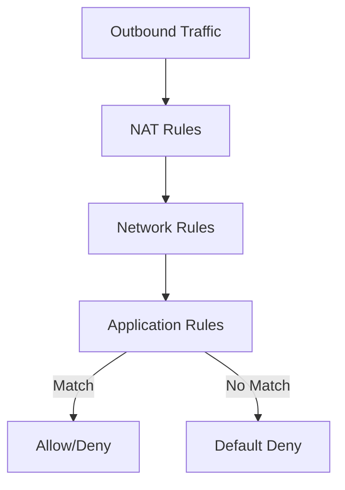

# How to Configure Azure Firewall Application Rules for FQDN-Based Filtering

Author: [nawazdhandala](https://www.github.com/nawazdhandala)

Tags: Azure, Azure Firewall, FQDN Filtering, Application Rules, Network Security, Firewall Policy

Description: Configure Azure Firewall application rules to control outbound traffic using FQDN-based filtering instead of IP-based rules.

---

One of the most useful features of Azure Firewall is FQDN-based filtering. Instead of trying to maintain lists of IP addresses that change constantly, you can write rules based on domain names. Your application servers need to reach api.github.com? Just write a rule for that FQDN. The firewall resolves the DNS and handles the rest.

In this post, I will walk through configuring Azure Firewall application rules for FQDN-based filtering. We will cover the difference between network rules and application rules, how to use FQDN tags for common Azure services, and how to set up custom FQDN rules for your specific needs.

## Network Rules vs. Application Rules

Azure Firewall has three types of rule collections, and it is important to understand when to use each:

- **NAT rules**: For inbound traffic translation (DNAT). Not relevant for outbound filtering.
- **Network rules**: Filter traffic by IP address, port, and protocol. Processed before application rules.
- **Application rules**: Filter outbound HTTP/HTTPS traffic by FQDN. Can also filter SQL traffic by FQDN.

Application rules are specifically designed for FQDN filtering. They operate at Layer 7 for HTTP/S traffic, which means the firewall inspects the SNI (Server Name Indication) in TLS or the Host header in HTTP to determine the target FQDN.



The processing order matters. Network rules are evaluated before application rules. If a network rule matches the traffic, application rules are not evaluated. This means you should use application rules for HTTP/S and SQL traffic, and network rules for everything else.

## Step 1: Deploy Azure Firewall with a Firewall Policy

Azure Firewall policies are the recommended way to manage rules. They support inheritance, which is great for enterprise environments where you want a base policy that child policies extend.

```bash
# Create a resource group
az group create \
  --name rg-firewall \
  --location eastus

# Create a VNet with a subnet for Azure Firewall
az network vnet create \
  --resource-group rg-firewall \
  --name vnet-hub \
  --address-prefix 10.0.0.0/16 \
  --subnet-name AzureFirewallSubnet \
  --subnet-prefix 10.0.1.0/24

# Create a public IP for the firewall
az network public-ip create \
  --resource-group rg-firewall \
  --name pip-firewall \
  --sku Standard \
  --allocation-method Static

# Create a firewall policy
az network firewall policy create \
  --resource-group rg-firewall \
  --name policy-main \
  --location eastus \
  --sku Standard

# Deploy Azure Firewall with the policy
az network firewall create \
  --resource-group rg-firewall \
  --name fw-hub \
  --location eastus \
  --vnet-name vnet-hub \
  --public-ip pip-firewall \
  --firewall-policy policy-main
```

## Step 2: Create Application Rule Collections for FQDN Filtering

Application rule collections group related rules together. Let us create some common ones.

### Allow Access to Specific FQDNs

This is the most common use case - your application needs to reach specific external services.

```bash
# Create an application rule collection for allowed web services
az network firewall policy rule-collection-group create \
  --resource-group rg-firewall \
  --policy-name policy-main \
  --name rcg-application \
  --priority 300

# Add a collection that allows access to specific FQDNs
az network firewall policy rule-collection-group collection add-filter-collection \
  --resource-group rg-firewall \
  --policy-name policy-main \
  --rule-collection-group-name rcg-application \
  --name rc-allowed-websites \
  --collection-priority 100 \
  --action Allow \
  --rule-name allow-github \
  --rule-type ApplicationRule \
  --source-addresses "10.0.0.0/16" \
  --protocols Https=443 \
  --target-fqdns "github.com" "api.github.com" "*.githubusercontent.com"
```

### Allow Access Using Wildcard FQDNs

You can use wildcards to match entire domains. This is useful for services that use many subdomains.

```bash
# Allow all Azure DevOps subdomains
az network firewall policy rule-collection-group collection rule add \
  --resource-group rg-firewall \
  --policy-name policy-main \
  --rule-collection-group-name rcg-application \
  --collection-name rc-allowed-websites \
  --name allow-azure-devops \
  --rule-type ApplicationRule \
  --source-addresses "10.0.0.0/16" \
  --protocols Https=443 \
  --target-fqdns "*.dev.azure.com" "*.visualstudio.com" "*.vsassets.io"
```

## Step 3: Use FQDN Tags for Azure Services

Azure Firewall supports FQDN tags - predefined groups of FQDNs associated with Azure services. Instead of figuring out every domain that Windows Update or Azure Backup uses, you can just reference the tag.

```bash
# Create a rule that allows Windows Update using FQDN tags
az network firewall policy rule-collection-group collection add-filter-collection \
  --resource-group rg-firewall \
  --policy-name policy-main \
  --rule-collection-group-name rcg-application \
  --name rc-azure-services \
  --collection-priority 200 \
  --action Allow \
  --rule-name allow-windows-update \
  --rule-type ApplicationRule \
  --source-addresses "10.0.0.0/16" \
  --protocols Http=80 Https=443 \
  --fqdn-tags "WindowsUpdate"
```

Available FQDN tags include:

- **WindowsUpdate** - Microsoft Windows Update endpoints
- **WindowsDiagnostics** - Windows diagnostic data collection
- **MicrosoftActiveProtectionService** - Microsoft Defender
- **AppServiceEnvironment** - Azure App Service Environment management traffic
- **AzureBackup** - Azure Backup service endpoints
- **AzureHDInsight** - HDInsight cluster management
- **WindowsVirtualDesktop** - Azure Virtual Desktop

FQDN tags are managed by Microsoft and automatically updated when the underlying FQDNs change. This saves you from having to track those changes yourself.

## Step 4: Configure FQDN Filtering for SQL Traffic

Azure Firewall can also filter SQL (MSSQL) traffic by FQDN. This is useful for controlling which Azure SQL databases your applications can reach.

```bash
# Allow SQL traffic to specific Azure SQL servers
az network firewall policy rule-collection-group collection add-filter-collection \
  --resource-group rg-firewall \
  --policy-name policy-main \
  --rule-collection-group-name rcg-application \
  --name rc-sql-access \
  --collection-priority 300 \
  --action Allow \
  --rule-name allow-sql-prod \
  --rule-type ApplicationRule \
  --source-addresses "10.0.2.0/24" \
  --protocols Mssql=1433 \
  --target-fqdns "sqlserver-prod.database.windows.net" "sqlserver-analytics.database.windows.net"
```

## Step 5: Set Up Deny Rules

In addition to allow rules, you might want to explicitly deny certain categories of traffic. For example, blocking social media from production servers.

```bash
# Deny social media sites from production subnets
az network firewall policy rule-collection-group collection add-filter-collection \
  --resource-group rg-firewall \
  --policy-name policy-main \
  --rule-collection-group-name rcg-application \
  --name rc-denied-sites \
  --collection-priority 50 \
  --action Deny \
  --rule-name deny-social-media \
  --rule-type ApplicationRule \
  --source-addresses "10.0.2.0/24" \
  --protocols Https=443 Http=80 \
  --target-fqdns "*.facebook.com" "*.twitter.com" "*.instagram.com" "*.tiktok.com"
```

Remember that rule collection priority determines the order. Lower numbers are processed first. Put deny rules at a lower priority number (higher priority) than allow rules to make sure they take effect.

## Step 6: Route Traffic Through the Firewall

None of these rules matter unless traffic actually flows through the firewall. You need a user-defined route (UDR) that sends outbound traffic from your workload subnets to the firewall's private IP.

```bash
# Get the firewall's private IP
FW_PRIVATE_IP=$(az network firewall show \
  --resource-group rg-firewall \
  --name fw-hub \
  --query "ipConfigurations[0].privateIPAddress" \
  --output tsv)

# Create a route table for workload subnets
az network route-table create \
  --resource-group rg-firewall \
  --name rt-workload

# Add a default route that sends all internet traffic through the firewall
az network route-table route create \
  --resource-group rg-firewall \
  --route-table-name rt-workload \
  --name to-internet \
  --address-prefix 0.0.0.0/0 \
  --next-hop-type VirtualAppliance \
  --next-hop-ip-address $FW_PRIVATE_IP

# Associate the route table with your workload subnet
az network vnet subnet update \
  --resource-group rg-firewall \
  --vnet-name vnet-hub \
  --name snet-workload \
  --route-table rt-workload
```

## Monitoring and Logging

Enable diagnostic logging to see which rules are being triggered and which traffic is being blocked.

```bash
# Enable diagnostic logging for the firewall
az monitor diagnostic-settings create \
  --resource $(az network firewall show -g rg-firewall -n fw-hub --query id -o tsv) \
  --name fw-diagnostics \
  --logs '[
    {"category":"AzureFirewallApplicationRule","enabled":true},
    {"category":"AzureFirewallNetworkRule","enabled":true},
    {"category":"AzureFirewallDnsProxy","enabled":true}
  ]' \
  --workspace $(az monitor log-analytics workspace show \
    -g rg-firewall -n law-firewall --query id -o tsv)
```

Then query the logs in Log Analytics.

```
// Show all denied application rule hits in the last hour
AzureDiagnostics
| where Category == "AzureFirewallApplicationRule"
| where TimeGenerated > ago(1h)
| where msg_s contains "Deny"
| parse msg_s with Protocol " request from " SourceIP ":" SourcePort " to " TargetFQDN ":" TargetPort ". Action: " Action
| project TimeGenerated, SourceIP, TargetFQDN, TargetPort, Action
| order by TimeGenerated desc
```

## Best Practices

**Start with deny-all, then add allow rules**: Azure Firewall denies all traffic by default. Add only the rules you need. This follows the principle of least privilege.

**Use FQDN tags wherever possible**: They are maintained by Microsoft and are always up to date. Rolling your own lists of Azure service FQDNs is error-prone.

**Group rules logically**: Use separate rule collections for different application tiers or environments. This makes auditing and troubleshooting much easier.

**Enable DNS proxy**: Azure Firewall should be the DNS proxy for your VNets to ensure FQDN resolution in network rules works correctly. Enable it with `az network firewall policy update --resource-group rg-firewall --name policy-main --dns-servers --enable-dns-proxy true`.

**Test before going live**: Use the firewall logs to monitor in audit mode before switching to enforcement. This helps you catch missing rules before they cause outages.

FQDN-based filtering with Azure Firewall gives you a much more maintainable security posture than IP-based rules. Domain names are stable, human-readable, and match how developers think about their application dependencies. Combined with FQDN tags for Azure services, you get comprehensive outbound filtering without the maintenance burden.
