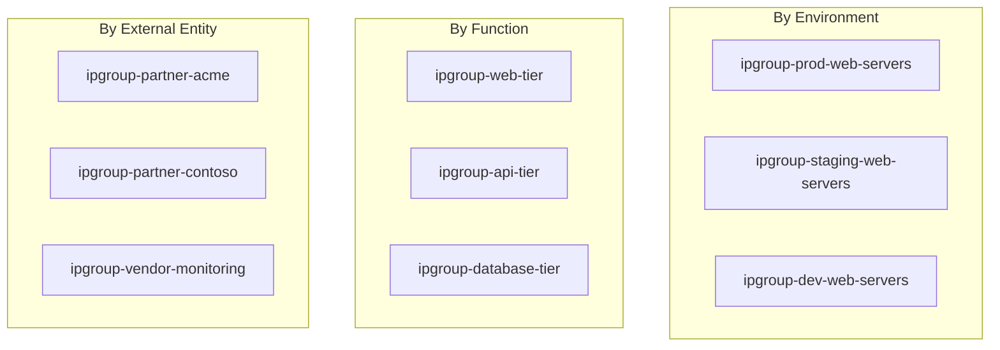

# How to Configure Azure Firewall with IP Groups for Rule Management

Author: [nawazdhandala](https://www.github.com/nawazdhandala)

Tags: Azure, Azure Firewall, IP Groups, Firewall Rules, Network Security, Rule Management

Description: Use Azure Firewall IP Groups to simplify rule management by grouping IP addresses and CIDR ranges into reusable named collections.

---

Managing firewall rules at scale gets messy fast. You start with a few rules, each with a handful of IP addresses. Then the environment grows, and suddenly you have hundreds of rules with overlapping IP ranges scattered across multiple rule collections. Updating a single IP address means editing a dozen rules. It is tedious, error-prone, and a recipe for security gaps.

Azure Firewall IP Groups solve this by letting you create named collections of IP addresses and CIDR ranges. Instead of hardcoding IPs into individual firewall rules, you reference the IP Group. When an IP changes, you update it in one place and every rule that references the group picks up the change automatically.

In this post, I will show how to create IP Groups, use them in Azure Firewall rules, and build a maintainable rule management strategy.

## What Are IP Groups?

An IP Group is an Azure resource that holds a list of individual IP addresses, IP ranges, or CIDR subnets. You can think of it as a named variable for your firewall rules. Instead of writing:

```
Source: 10.0.1.4, 10.0.1.5, 10.0.1.6, 10.0.2.0/24
```

You write:

```
Source: ipgroup-web-servers
```

IP Groups support up to 5,000 individual IP addresses or prefixes per group. A single firewall policy can reference up to 200 unique IP Groups across all its rules.

## Step 1: Create IP Groups

Let us create IP Groups for common use cases: web servers, database servers, and trusted external IPs.

```bash
# Create a resource group for IP Groups
az group create \
  --name rg-firewall \
  --location eastus

# Create an IP Group for web server IPs
az network ip-group create \
  --resource-group rg-firewall \
  --name ipgroup-web-servers \
  --location eastus \
  --ip-addresses 10.0.1.4 10.0.1.5 10.0.1.6 10.0.1.7

# Create an IP Group for database server IPs
az network ip-group create \
  --resource-group rg-firewall \
  --name ipgroup-db-servers \
  --location eastus \
  --ip-addresses 10.0.2.10 10.0.2.11

# Create an IP Group for monitoring subnet
az network ip-group create \
  --resource-group rg-firewall \
  --name ipgroup-monitoring \
  --location eastus \
  --ip-addresses 10.0.3.0/24

# Create an IP Group for trusted external partners
az network ip-group create \
  --resource-group rg-firewall \
  --name ipgroup-trusted-partners \
  --location eastus \
  --ip-addresses 203.0.113.0/24 198.51.100.50 198.51.100.51
```

You can mix individual IPs and CIDR ranges in the same group.

## Step 2: Create a Firewall Policy Using IP Groups

Now create firewall rules that reference the IP Groups instead of hardcoded addresses.

```bash
# Create a firewall policy
az network firewall policy create \
  --resource-group rg-firewall \
  --name policy-main \
  --location eastus \
  --sku Standard

# Create a rule collection group
az network firewall policy rule-collection-group create \
  --resource-group rg-firewall \
  --policy-name policy-main \
  --name rcg-main \
  --priority 200
```

### Network Rules with IP Groups

Create network rules using IP Groups as source and destination references.

```bash
# Get the IP Group resource IDs
WEB_IPGROUP_ID=$(az network ip-group show \
  --resource-group rg-firewall \
  --name ipgroup-web-servers \
  --query id --output tsv)

DB_IPGROUP_ID=$(az network ip-group show \
  --resource-group rg-firewall \
  --name ipgroup-db-servers \
  --query id --output tsv)

MONITORING_IPGROUP_ID=$(az network ip-group show \
  --resource-group rg-firewall \
  --name ipgroup-monitoring \
  --query id --output tsv)

# Create a network rule allowing web servers to access database servers on port 5432
az network firewall policy rule-collection-group collection add-filter-collection \
  --resource-group rg-firewall \
  --policy-name policy-main \
  --rule-collection-group-name rcg-main \
  --name rc-web-to-db \
  --collection-priority 100 \
  --action Allow \
  --rule-name allow-web-to-postgres \
  --rule-type NetworkRule \
  --source-ip-groups $WEB_IPGROUP_ID \
  --destination-ip-groups $DB_IPGROUP_ID \
  --ip-protocols TCP \
  --destination-ports 5432
```

Notice how clean the rule is - `source-ip-groups` references the web server group, and `destination-ip-groups` references the database server group. If a new web server is added, you update the IP Group, not the rule.

```bash
# Allow monitoring subnet to access all servers on monitoring ports
az network firewall policy rule-collection-group collection rule add \
  --resource-group rg-firewall \
  --policy-name policy-main \
  --rule-collection-group-name rcg-main \
  --collection-name rc-web-to-db \
  --name allow-monitoring \
  --rule-type NetworkRule \
  --source-ip-groups $MONITORING_IPGROUP_ID \
  --destination-ip-groups $WEB_IPGROUP_ID $DB_IPGROUP_ID \
  --ip-protocols TCP \
  --destination-ports 9090 9100 3000
```

### Application Rules with IP Groups

IP Groups work with application rules too, for controlling outbound HTTP/HTTPS access.

```bash
# Allow web servers to access external APIs over HTTPS
az network firewall policy rule-collection-group collection add-filter-collection \
  --resource-group rg-firewall \
  --policy-name policy-main \
  --rule-collection-group-name rcg-main \
  --name rc-outbound-access \
  --collection-priority 200 \
  --action Allow \
  --rule-name allow-web-to-apis \
  --rule-type ApplicationRule \
  --source-ip-groups $WEB_IPGROUP_ID \
  --protocols Https=443 \
  --target-fqdns "api.stripe.com" "api.sendgrid.com" "api.github.com"
```

## Step 3: Update IP Groups

When infrastructure changes, update the IP Groups. All rules referencing the group automatically pick up the changes.

```bash
# Add a new web server to the group
az network ip-group update \
  --resource-group rg-firewall \
  --name ipgroup-web-servers \
  --add ipAddresses 10.0.1.8

# Remove an old server that was decommissioned
az network ip-group update \
  --resource-group rg-firewall \
  --name ipgroup-web-servers \
  --remove ipAddresses 10.0.1.4
```

You can also replace the entire IP list at once.

```bash
# Replace all IPs in the group with a new set
az network ip-group update \
  --resource-group rg-firewall \
  --name ipgroup-web-servers \
  --ip-addresses 10.0.1.5 10.0.1.6 10.0.1.7 10.0.1.8 10.0.1.9
```

This operation is atomic - the IP Group is updated all at once, so there is no window where the group is partially updated.

## Organizing IP Groups for Enterprise Environments

For larger environments, establish a naming convention and organizational strategy for IP Groups.



A consistent naming convention makes it easy to understand what each group contains at a glance. Consider including the environment, tier, and purpose in the name.

## Automating IP Group Updates

In dynamic environments (auto-scaling, Kubernetes, etc.), you might need to update IP Groups automatically. Here is a script that syncs VM IPs from a resource group into an IP Group.

```bash
#!/bin/bash
# Script to sync VM private IPs from a resource group into an IP Group
# Useful for environments with frequently changing VM instances

RESOURCE_GROUP="rg-production"
IP_GROUP_NAME="ipgroup-prod-web-servers"
IP_GROUP_RG="rg-firewall"

# Get all private IPs from VMs in the resource group
CURRENT_IPS=$(az vm list-ip-addresses \
  --resource-group $RESOURCE_GROUP \
  --query "[].virtualMachine.network.privateIpAddresses[]" \
  --output tsv | tr '\n' ' ')

echo "Current VM IPs: $CURRENT_IPS"

# Update the IP Group with the current VM IPs
az network ip-group update \
  --resource-group $IP_GROUP_RG \
  --name $IP_GROUP_NAME \
  --ip-addresses $CURRENT_IPS

echo "IP Group $IP_GROUP_NAME updated successfully"
```

Run this script on a schedule (via Azure Automation, a cron job, or a CI/CD pipeline) to keep IP Groups in sync with your infrastructure.

## IP Groups in ARM Templates

For infrastructure-as-code deployments, here is how IP Groups look in an ARM template.

```json
{
  "type": "Microsoft.Network/ipGroups",
  "apiVersion": "2023-04-01",
  "name": "ipgroup-web-servers",
  "location": "[resourceGroup().location]",
  "properties": {
    "ipAddresses": [
      "10.0.1.4",
      "10.0.1.5",
      "10.0.1.6",
      "10.0.1.0/24"
    ]
  }
}
```

Reference them in firewall rules using the `resourceId` function:

```json
{
  "sourceIpGroups": [
    "[resourceId('Microsoft.Network/ipGroups', 'ipgroup-web-servers')]"
  ],
  "destinationIpGroups": [
    "[resourceId('Microsoft.Network/ipGroups', 'ipgroup-db-servers')]"
  ]
}
```

## Limits and Considerations

**Size limits**: Each IP Group supports up to 5,000 individual IP addresses or prefixes. If you need more, split into multiple groups.

**Policy limits**: A single firewall policy can reference up to 200 unique IP Groups across all rules. Plan your grouping strategy to stay within this limit.

**Update propagation**: Changes to IP Groups propagate to the firewall within minutes. During this window, traffic might be evaluated against the old IP list.

**Shared across policies**: IP Groups are standalone resources. They can be referenced by multiple firewall policies, which is useful if you have different policies for different environments that share common IP sets.

**Cross-subscription support**: IP Groups must be in the same subscription as the firewall policy that references them.

## Best Practices

**Group by function, not by individual rule**: Create IP Groups based on roles (web servers, databases, monitoring) rather than per-rule groups. This maximizes reusability.

**Use CIDR ranges where possible**: Instead of listing individual IPs, use subnet CIDR ranges. This reduces the number of entries and automatically includes new IPs added to the subnet.

**Automate updates**: Do not rely on manual IP Group updates. Automate synchronization with your infrastructure to prevent drift.

**Audit changes**: Enable Azure Activity Log monitoring for IP Group modifications. Any change to an IP Group effectively changes firewall rules, so treat these changes with the same scrutiny.

IP Groups transform Azure Firewall rule management from a manual, error-prone process into something maintainable and scalable. The investment in setting up proper IP Groups pays off quickly as your environment grows.
