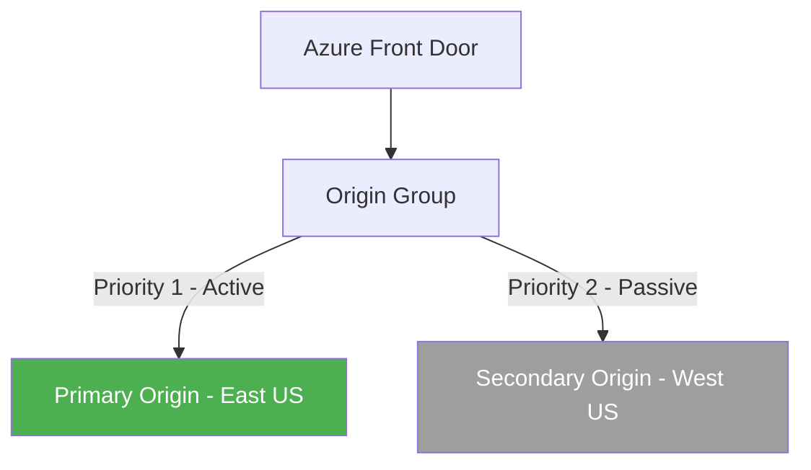

# How to Set Up Azure Front Door with Origin Groups for Active-Passive Failover

Author: [nawazdhandala](https://www.github.com/nawazdhandala)

Tags: Azure, Front Door, Origin Groups, Active-Passive, Failover, High Availability, CDN

Description: Configure Azure Front Door origin groups with priority-based routing to implement active-passive failover for reliable application delivery.

---

Active-passive failover is the simplest and most predictable high availability pattern. You have a primary origin that handles all traffic, and a secondary origin that sits idle until the primary fails. When the primary goes down, traffic automatically shifts to the secondary. No split-brain issues, no data consistency problems, no complicated conflict resolution.

Azure Front Door makes implementing this pattern straightforward through origin groups with priority-based routing. In this post, I will walk through the setup, including health probe configuration, failover behavior, and how to handle failback when the primary recovers.

## How Origin Groups Work

An origin group in Azure Front Door is a collection of backend origins (servers, app services, storage accounts, etc.) along with rules for how to distribute traffic among them. Each origin within the group has two key properties:

- **Priority**: Lower numbers are preferred. Origins with the same priority share traffic. Origins with higher priority numbers only receive traffic when all lower-priority origins are unhealthy.
- **Weight**: When origins share the same priority, weight determines the traffic distribution ratio.

For active-passive failover, you set the primary origin to priority 1 and the secondary origin to priority 2. Under normal conditions, 100% of traffic goes to priority 1. When priority 1 fails all health checks, traffic shifts to priority 2.



## Step 1: Create the Front Door Profile

```bash
# Create a resource group
az group create \
  --name rg-frontdoor \
  --location eastus

# Create a Front Door profile
az afd profile create \
  --resource-group rg-frontdoor \
  --profile-name fd-myapp \
  --sku Standard_AzureFrontDoor
```

## Step 2: Create an Endpoint

```bash
# Create a Front Door endpoint
az afd endpoint create \
  --resource-group rg-frontdoor \
  --profile-name fd-myapp \
  --endpoint-name myapp \
  --enabled-state Enabled
```

## Step 3: Create the Origin Group with Health Probes

The origin group is where you configure health probing and failover behavior. The health probe settings directly affect how fast failover happens.

```bash
# Create an origin group with health probe configuration
az afd origin-group create \
  --resource-group rg-frontdoor \
  --profile-name fd-myapp \
  --origin-group-name og-myapp \
  --probe-request-type GET \
  --probe-protocol Https \
  --probe-interval-in-seconds 10 \
  --probe-path "/health" \
  --sample-size 4 \
  --successful-samples-required 2 \
  --additional-latency-in-milliseconds 0
```

Let me explain the health probe parameters:

- `--probe-interval-in-seconds 10`: Probes every 10 seconds. Lower values detect failures faster but generate more probe traffic.
- `--sample-size 4`: Uses the last 4 probe results to make a health decision.
- `--successful-samples-required 2`: At least 2 out of 4 probes must succeed for the origin to be considered healthy.
- `--additional-latency-in-milliseconds 0`: No additional latency tolerance. Set this higher if you want to avoid failing over due to minor latency differences.

With these settings, if the primary origin starts failing health checks, it takes approximately 20-40 seconds for Front Door to detect the failure and shift traffic to the secondary.

## Step 4: Add Origins with Priority Settings

Add the primary and secondary origins with appropriate priority values.

```bash
# Add the primary origin with priority 1 (active)
az afd origin create \
  --resource-group rg-frontdoor \
  --profile-name fd-myapp \
  --origin-group-name og-myapp \
  --origin-name primary-eastus \
  --host-name myapp-eastus.azurewebsites.net \
  --origin-host-header myapp-eastus.azurewebsites.net \
  --http-port 80 \
  --https-port 443 \
  --priority 1 \
  --weight 1000 \
  --enabled-state Enabled

# Add the secondary origin with priority 2 (passive)
az afd origin create \
  --resource-group rg-frontdoor \
  --profile-name fd-myapp \
  --origin-group-name og-myapp \
  --origin-name secondary-westus \
  --host-name myapp-westus.azurewebsites.net \
  --origin-host-header myapp-westus.azurewebsites.net \
  --http-port 80 \
  --https-port 443 \
  --priority 2 \
  --weight 1000 \
  --enabled-state Enabled
```

The primary has priority 1 and the secondary has priority 2. Under normal operation, all traffic goes to the primary. The weight values do not matter in active-passive because the origins have different priorities.

## Step 5: Create the Route

Connect the endpoint to the origin group with a route.

```bash
# Create a route that sends all traffic through the origin group
az afd route create \
  --resource-group rg-frontdoor \
  --profile-name fd-myapp \
  --endpoint-name myapp \
  --route-name route-default \
  --origin-group og-myapp \
  --supported-protocols Https Http \
  --patterns-to-match "/*" \
  --forwarding-protocol HttpsOnly \
  --https-redirect Enabled
```

## Implementing the Health Endpoint

Your application needs a `/health` endpoint that the Front Door probes will hit. This endpoint should return a 200 status code when the application is healthy and a 5xx or timeout when it is not.

A good health endpoint checks actual dependencies, not just whether the web server is running.

```python
# Example Flask health endpoint that checks database connectivity
from flask import Flask, jsonify
import psycopg2

app = Flask(__name__)

@app.route('/health')
def health_check():
    try:
        # Check database connectivity
        conn = psycopg2.connect(
            host="db-server",
            database="myapp",
            user="health_checker",
            password="readonly_password",
            connect_timeout=3  # Fail fast if DB is unresponsive
        )
        conn.close()

        # Check any other critical dependencies here
        return jsonify({"status": "healthy"}), 200

    except Exception as e:
        # Return 503 so Front Door marks this origin as unhealthy
        return jsonify({"status": "unhealthy", "error": str(e)}), 503
```

## Testing Failover

To test failover without actually breaking your primary, temporarily disable the primary origin.

```bash
# Disable the primary origin to simulate failure
az afd origin update \
  --resource-group rg-frontdoor \
  --profile-name fd-myapp \
  --origin-group-name og-myapp \
  --origin-name primary-eastus \
  --enabled-state Disabled
```

Monitor the traffic shift by checking the Front Door access logs or by sending requests and noting which origin responds.

```bash
# Verify which origin is handling traffic
curl -sI https://myapp-xxxx.z01.azurefd.net/ | grep -i "x-azure-ref\|x-fd-healthprobe"
```

Re-enable the primary origin after testing.

```bash
# Re-enable the primary origin
az afd origin update \
  --resource-group rg-frontdoor \
  --profile-name fd-myapp \
  --origin-group-name og-myapp \
  --origin-name primary-eastus \
  --enabled-state Enabled
```

## Failback Behavior

When the primary origin recovers and starts passing health probes again, Front Door automatically fails back to it. This happens because the primary has a higher priority (lower number) than the secondary. As soon as Front Door sees the primary is healthy, it starts routing traffic back.

The failback happens gradually. Front Door does not instantly shift 100% of traffic back. It increases the traffic to the primary over several probe intervals to confirm it is stable. This prevents flapping if the primary is intermittently healthy.

If you want to control failback manually (maybe you want to verify the primary is fully recovered before sending traffic), you can keep the primary origin disabled and only re-enable it when you are ready.

## Monitoring Failover Events

Set up diagnostic logging to track when failovers happen.

```bash
# Enable Front Door diagnostic logging
az monitor diagnostic-settings create \
  --resource $(az afd profile show --resource-group rg-frontdoor \
    --profile-name fd-myapp --query id -o tsv) \
  --name fd-diagnostics \
  --logs '[
    {"category":"FrontDoorAccessLog","enabled":true},
    {"category":"FrontDoorHealthProbeLog","enabled":true}
  ]' \
  --workspace $(az monitor log-analytics workspace show \
    -g rg-monitoring -n law-main --query id -o tsv)
```

Query the health probe logs to see origin health status changes.

```
// Track origin health status changes
AzureDiagnostics
| where Category == "FrontDoorHealthProbeLog"
| where TimeGenerated > ago(24h)
| project TimeGenerated, originName_s, healthProbeResult_s, httpStatusCode_d
| where healthProbeResult_s != "Healthy"
| order by TimeGenerated desc
```

## Multi-Tier Active-Passive

For applications with multiple tiers (web, API, backend), you can create separate origin groups for each tier, each with its own active-passive configuration.

```bash
# Origin group for the web tier
az afd origin-group create \
  --resource-group rg-frontdoor \
  --profile-name fd-myapp \
  --origin-group-name og-web \
  --probe-path "/health" \
  --probe-interval-in-seconds 10 \
  --probe-protocol Https \
  --probe-request-type GET \
  --sample-size 4 \
  --successful-samples-required 2

# Origin group for the API tier with a different health endpoint
az afd origin-group create \
  --resource-group rg-frontdoor \
  --profile-name fd-myapp \
  --origin-group-name og-api \
  --probe-path "/api/health" \
  --probe-interval-in-seconds 10 \
  --probe-protocol Https \
  --probe-request-type GET \
  --sample-size 4 \
  --successful-samples-required 2
```

Then create separate routes for `/api/*` and `/*` pointing to their respective origin groups.

Active-passive failover with Azure Front Door gives you a reliable, simple high availability pattern. The priority-based routing makes the configuration clear, the health probes handle detection automatically, and the failback behavior prevents premature traffic shifts. It is the right choice when you want predictable failover behavior without the complexity of active-active architectures.
