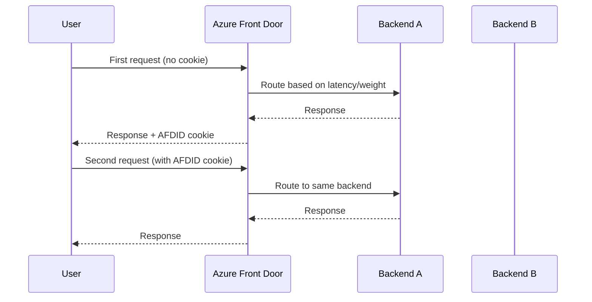

# How to Set Up Azure Front Door with Session Affinity for Stateful Applications

Author: [nawazdhandala](https://www.github.com/nawazdhandala)

Tags: Azure, Front Door, Session Affinity, Stateful Applications, Load Balancing, CDN, Sticky Sessions

Description: Configure Azure Front Door session affinity to route returning users to the same backend for stateful application workloads.

---

Session affinity - sometimes called sticky sessions - is one of those features you hope you never need, but when you do, it is absolutely critical. If you are running a stateful application behind Azure Front Door, you need a way to make sure returning users get routed to the same backend server that holds their session data. Without it, users get bounced between backends and lose their state, which leads to dropped shopping carts, lost form data, and frustrated customers.

Azure Front Door supports cookie-based session affinity, and setting it up is relatively straightforward. In this post, I will cover how it works under the hood, how to configure it, and what to watch out for.

## When Do You Need Session Affinity?

Before we dig in, it is worth asking whether you actually need this. Session affinity introduces coupling between a user and a specific backend, which can lead to uneven load distribution. If you can make your application stateless - by storing session data in Redis, a database, or a distributed cache - that is almost always the better approach.

That said, there are legitimate cases where session affinity makes sense:

- Legacy applications that store session state in-process
- WebSocket connections that need to maintain a persistent connection to one backend
- Applications during a migration phase where you have not yet externalized session state
- Specific workflows that rely on local caching for performance

If any of these describe your situation, session affinity is a practical solution.

## How Front Door Session Affinity Works

Azure Front Door uses a cookie-based approach. When a user first connects, Front Door routes them to a backend based on its normal routing logic (latency, weight, priority). It then sets a cookie called `AFDID` in the response. On subsequent requests, the browser sends this cookie back, and Front Door uses it to route the request to the same backend.



The cookie is set by Front Door itself - your application does not need to do anything special. The cookie is tied to the specific backend origin, so as long as that origin is healthy, the user keeps going to the same place.

## Setting Up Front Door with Session Affinity

Let us walk through the setup using the Azure CLI. We will create a Front Door profile, add origins, and enable session affinity on the route.

### Step 1: Create the Front Door Profile

```bash
# Create a resource group for the Front Door resources
az group create \
  --name rg-frontdoor \
  --location eastus

# Create a Front Door profile using the Standard tier
az afd profile create \
  --resource-group rg-frontdoor \
  --profile-name fd-myapp \
  --sku Standard_AzureFrontDoor
```

### Step 2: Create an Endpoint

```bash
# Create a Front Door endpoint - this generates the public hostname
az afd endpoint create \
  --resource-group rg-frontdoor \
  --profile-name fd-myapp \
  --endpoint-name myapp-endpoint \
  --enabled-state Enabled
```

### Step 3: Create an Origin Group with Session Affinity Enabled

This is where session affinity gets turned on. It is a property of the origin group.

```bash
# Create an origin group with session affinity enabled
# session-affinity-state is the key setting here
az afd origin-group create \
  --resource-group rg-frontdoor \
  --profile-name fd-myapp \
  --origin-group-name og-myapp \
  --probe-request-type GET \
  --probe-protocol Http \
  --probe-interval-in-seconds 30 \
  --probe-path "/health" \
  --sample-size 4 \
  --successful-samples-required 3 \
  --additional-latency-in-milliseconds 50 \
  --session-affinity-state Enabled
```

The `--session-affinity-state Enabled` flag is what turns on the cookie-based sticky session behavior.

### Step 4: Add Origins to the Group

```bash
# Add the first backend origin (e.g., an App Service in East US)
az afd origin create \
  --resource-group rg-frontdoor \
  --profile-name fd-myapp \
  --origin-group-name og-myapp \
  --origin-name origin-eastus \
  --host-name myapp-eastus.azurewebsites.net \
  --origin-host-header myapp-eastus.azurewebsites.net \
  --http-port 80 \
  --https-port 443 \
  --priority 1 \
  --weight 50 \
  --enabled-state Enabled

# Add the second backend origin (e.g., an App Service in West US)
az afd origin create \
  --resource-group rg-frontdoor \
  --profile-name fd-myapp \
  --origin-group-name og-myapp \
  --origin-name origin-westus \
  --host-name myapp-westus.azurewebsites.net \
  --origin-host-header myapp-westus.azurewebsites.net \
  --http-port 80 \
  --https-port 443 \
  --priority 1 \
  --weight 50 \
  --enabled-state Enabled
```

Both origins have the same priority and weight, so without session affinity, Front Door would distribute traffic based on latency. With session affinity enabled, returning users stick to whichever origin they first connected to.

### Step 5: Create a Route

```bash
# Create a route that connects the endpoint to the origin group
az afd route create \
  --resource-group rg-frontdoor \
  --profile-name fd-myapp \
  --endpoint-name myapp-endpoint \
  --route-name route-default \
  --origin-group og-myapp \
  --supported-protocols Https Http \
  --patterns-to-match "/*" \
  --forwarding-protocol HttpsOnly \
  --https-redirect Enabled
```

## Verifying Session Affinity

After the deployment completes, test that session affinity is working by examining the response cookies.

```bash
# Make a request and check for the AFDID session affinity cookie
curl -v https://myapp-endpoint-xxxxx.z01.azurefd.net/ 2>&1 | grep -i "set-cookie"
```

You should see a `Set-Cookie` header with the `AFDID` cookie. Send subsequent requests with this cookie and verify they hit the same backend. You can confirm this by having each backend return its hostname in a response header.

## Handling Backend Failures

When a backend that has session affinity becomes unhealthy, Front Door will stop routing traffic to it - even if a user has a sticky cookie pointing to that backend. Front Door re-routes the user to a different healthy backend, and a new AFDID cookie gets set.

This is important: session affinity does not override health checks. If a backend goes down, users will get moved. You need to plan for this in your application. Either accept that sessions might be lost when backends fail, or use a shared session store as a fallback.

## Session Affinity with Multiple Origin Groups

If your Front Door configuration has multiple routes with different origin groups, session affinity is configured per origin group. You can have one origin group with session affinity enabled (for your stateful application paths) and another without it (for static assets or API endpoints).

```bash
# A separate origin group for stateless API traffic without session affinity
az afd origin-group create \
  --resource-group rg-frontdoor \
  --profile-name fd-myapp \
  --origin-group-name og-api \
  --probe-request-type GET \
  --probe-protocol Https \
  --probe-interval-in-seconds 30 \
  --probe-path "/api/health" \
  --sample-size 4 \
  --successful-samples-required 3 \
  --session-affinity-state Disabled
```

Then create separate routes for the stateful and stateless paths.

```bash
# Route for the stateful web application (with session affinity)
az afd route create \
  --resource-group rg-frontdoor \
  --profile-name fd-myapp \
  --endpoint-name myapp-endpoint \
  --route-name route-web \
  --origin-group og-myapp \
  --supported-protocols Https \
  --patterns-to-match "/app/*" \
  --forwarding-protocol HttpsOnly

# Route for the stateless API (without session affinity)
az afd route create \
  --resource-group rg-frontdoor \
  --profile-name fd-myapp \
  --endpoint-name myapp-endpoint \
  --route-name route-api \
  --origin-group og-api \
  --supported-protocols Https \
  --patterns-to-match "/api/*" \
  --forwarding-protocol HttpsOnly
```

## Monitoring and Troubleshooting

Use Azure Monitor and Front Door diagnostics to track session affinity behavior.

```bash
# Enable diagnostic logging for Front Door
az monitor diagnostic-settings create \
  --resource $(az afd profile show --resource-group rg-frontdoor --profile-name fd-myapp --query id -o tsv) \
  --name fd-diagnostics \
  --logs '[{"category":"FrontDoorAccessLog","enabled":true}]' \
  --workspace your-log-analytics-workspace-id
```

In the access logs, you can see which origin each request was routed to. Look for patterns where the same client IP consistently hits the same origin - that confirms session affinity is working.

## Key Considerations

**Cookie lifetime**: The AFDID cookie is a session cookie by default. When the user closes their browser, the cookie is gone and they may be routed to a different backend next time. This is usually fine for web applications but something to be aware of.

**Load imbalance**: Session affinity can lead to uneven traffic distribution. If many users get pinned to one backend, that backend carries a disproportionate load. Monitor your backend metrics and adjust weights if needed.

**CDN caching interaction**: If you have caching enabled on Front Door, cached responses do not go to the backend at all. Session affinity only matters for requests that are actually forwarded to an origin.

Session affinity on Azure Front Door is a practical solution when you need to support stateful applications at the edge. The cookie-based approach is simple, transparent to your application, and works well with Front Door's health monitoring. Just remember that the long-term goal should always be to move toward stateless architectures where possible.
