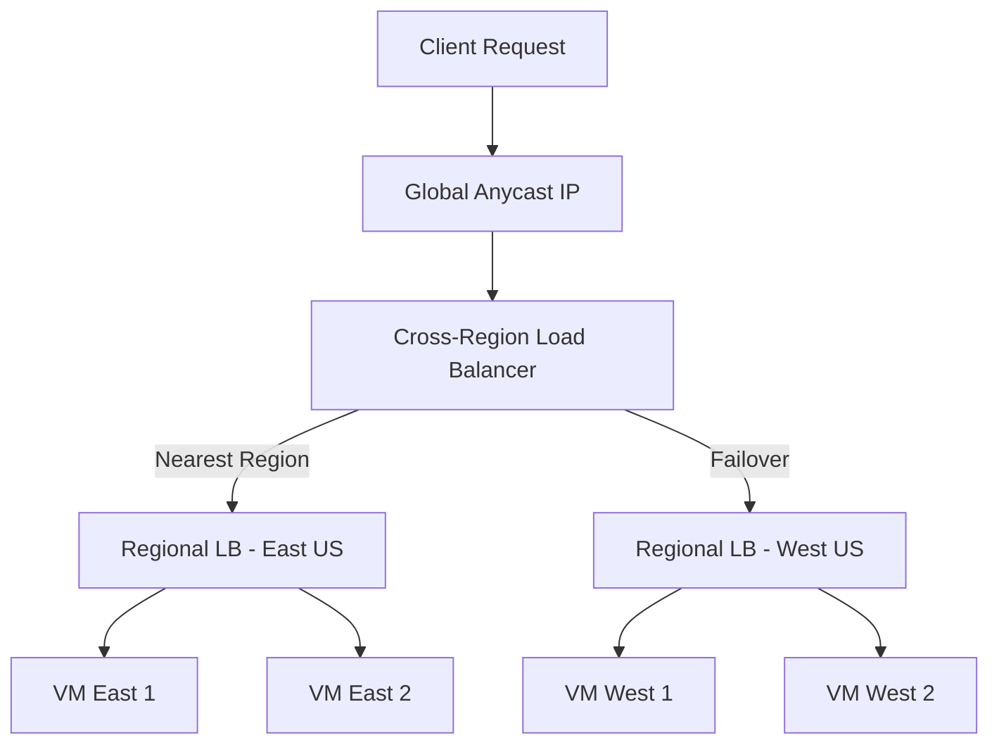
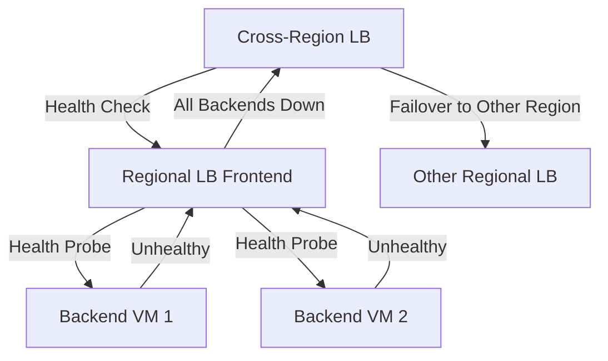

# How to Configure Azure Load Balancer Cross-Region for Global Load Balancing

Author: [nawazdhandala](https://www.github.com/nawazdhandala)

Tags: Azure, Load Balancer, Cross-Region, Global Load Balancing, High Availability, Networking, Disaster Recovery

Description: Deploy Azure Cross-Region Load Balancer to distribute traffic globally across regional load balancers for high availability and disaster recovery.

---

Azure Cross-Region Load Balancer is a global load balancing solution that distributes incoming traffic across multiple regional Standard Load Balancers. It operates at Layer 4 (TCP/UDP) and provides an anycast public IP that routes traffic to the closest healthy region. If a region goes down, traffic automatically shifts to the next healthy region.

This is different from Azure Traffic Manager (DNS-based) or Azure Front Door (Layer 7). Cross-Region Load Balancer works at the network layer, which makes it suitable for non-HTTP workloads like gaming servers, IoT endpoints, or custom TCP protocols.

In this post, I will walk through setting up a Cross-Region Load Balancer that spans two regions, with regional load balancers as backends.

## Architecture Overview

The Cross-Region Load Balancer sits in front of your regional load balancers. It uses an anycast global IP, meaning the IP address is advertised from multiple Azure regions simultaneously. Traffic from a client is routed to the nearest Azure region based on network proximity.



## Step 1: Set Up Regional Load Balancers

First, you need Standard Load Balancers in each region. If you already have these, skip ahead.

### East US Regional Load Balancer

```bash
# Create resource group for East US
az group create \
  --name rg-lb-eastus \
  --location eastus

# Create a public IP for the East US load balancer
az network public-ip create \
  --resource-group rg-lb-eastus \
  --name pip-lb-eastus \
  --sku Standard \
  --allocation-method Static \
  --location eastus

# Create the East US regional load balancer
az network lb create \
  --resource-group rg-lb-eastus \
  --name lb-regional-eastus \
  --sku Standard \
  --frontend-ip-name fe-eastus \
  --public-ip-address pip-lb-eastus \
  --backend-pool-name bp-eastus \
  --location eastus

# Create a health probe
az network lb probe create \
  --resource-group rg-lb-eastus \
  --lb-name lb-regional-eastus \
  --name probe-tcp \
  --protocol Tcp \
  --port 80 \
  --interval 5

# Create a load balancing rule
az network lb rule create \
  --resource-group rg-lb-eastus \
  --lb-name lb-regional-eastus \
  --name rule-http \
  --frontend-ip-name fe-eastus \
  --frontend-port 80 \
  --backend-pool-name bp-eastus \
  --backend-port 80 \
  --protocol Tcp \
  --probe-name probe-tcp
```

### West US Regional Load Balancer

```bash
# Create resource group for West US
az group create \
  --name rg-lb-westus \
  --location westus2

# Create a public IP for the West US load balancer
az network public-ip create \
  --resource-group rg-lb-westus \
  --name pip-lb-westus \
  --sku Standard \
  --allocation-method Static \
  --location westus2

# Create the West US regional load balancer
az network lb create \
  --resource-group rg-lb-westus \
  --name lb-regional-westus \
  --sku Standard \
  --frontend-ip-name fe-westus \
  --public-ip-address pip-lb-westus \
  --backend-pool-name bp-westus \
  --location westus2

# Create a health probe
az network lb probe create \
  --resource-group rg-lb-westus \
  --lb-name lb-regional-westus \
  --name probe-tcp \
  --protocol Tcp \
  --port 80 \
  --interval 5

# Create a load balancing rule
az network lb rule create \
  --resource-group rg-lb-westus \
  --lb-name lb-regional-westus \
  --name rule-http \
  --frontend-ip-name fe-westus \
  --frontend-port 80 \
  --backend-pool-name bp-westus \
  --backend-port 80 \
  --protocol Tcp \
  --probe-name probe-tcp
```

## Step 2: Create the Cross-Region Load Balancer

Now create the global Cross-Region Load Balancer.

```bash
# Create a resource group for the global load balancer
az group create \
  --name rg-lb-global \
  --location eastus

# Create a global public IP with the Standard tier for cross-region
az network public-ip create \
  --resource-group rg-lb-global \
  --name pip-lb-global \
  --sku Standard \
  --tier Global \
  --allocation-method Static

# Create the Cross-Region Load Balancer
az network cross-region-lb create \
  --resource-group rg-lb-global \
  --name lb-cross-region \
  --frontend-ip-name fe-global \
  --public-ip-address pip-lb-global \
  --backend-pool-name bp-global
```

The `--tier Global` on the public IP is what makes this a global anycast IP. This IP address is advertised from all Azure regions simultaneously.

## Step 3: Add Regional Load Balancers as Backends

Add the regional load balancers as backend endpoints for the cross-region load balancer.

```bash
# Get the frontend IP configuration IDs of the regional load balancers
EASTUS_FE_ID=$(az network lb frontend-ip show \
  --resource-group rg-lb-eastus \
  --lb-name lb-regional-eastus \
  --name fe-eastus \
  --query id \
  --output tsv)

WESTUS_FE_ID=$(az network lb frontend-ip show \
  --resource-group rg-lb-westus \
  --lb-name lb-regional-westus \
  --name fe-westus \
  --query id \
  --output tsv)

# Add the East US regional load balancer to the global backend pool
az network cross-region-lb address-pool address add \
  --resource-group rg-lb-global \
  --lb-name lb-cross-region \
  --pool-name bp-global \
  --name backend-eastus \
  --frontend-ip-address $EASTUS_FE_ID

# Add the West US regional load balancer to the global backend pool
az network cross-region-lb address-pool address add \
  --resource-group rg-lb-global \
  --lb-name lb-cross-region \
  --pool-name bp-global \
  --name backend-westus \
  --frontend-ip-address $WESTUS_FE_ID
```

## Step 4: Create the Cross-Region Load Balancing Rule

Create a rule that defines how the cross-region load balancer distributes traffic.

```bash
# Create a load balancing rule for the cross-region load balancer
az network cross-region-lb rule create \
  --resource-group rg-lb-global \
  --lb-name lb-cross-region \
  --name rule-global-http \
  --frontend-ip-name fe-global \
  --frontend-port 80 \
  --backend-pool-name bp-global \
  --backend-port 80 \
  --protocol Tcp
```

## Step 5: Verify the Setup

Check that everything is connected properly.

```bash
# Verify the cross-region load balancer configuration
az network cross-region-lb show \
  --resource-group rg-lb-global \
  --name lb-cross-region \
  --output table

# List the backend pool members
az network cross-region-lb address-pool show \
  --resource-group rg-lb-global \
  --lb-name lb-cross-region \
  --name bp-global \
  --output table

# Get the global IP address for testing
az network public-ip show \
  --resource-group rg-lb-global \
  --name pip-lb-global \
  --query ipAddress \
  --output tsv
```

Test connectivity by sending requests to the global IP.

```bash
# Test the global endpoint
curl http://<global-ip-address>/

# Test from different geographic locations using online tools
# Traffic should be routed to the nearest healthy region
```

## How Health Monitoring Works

The Cross-Region Load Balancer monitors the health of regional load balancers, not individual backend VMs. The health status cascades up:

1. Regional load balancer probes individual backend VMs
2. If enough VMs are unhealthy, the regional load balancer's frontend becomes unavailable
3. Cross-Region Load Balancer detects the regional frontend is down
4. Traffic shifts to the next healthy region

This is automatic and transparent to clients. The failover time depends on the health probe intervals configured at each level.



## Handling DNS for Global IP

Point your application's domain to the global anycast IP.

```bash
# Create an A record pointing to the global IP
az network dns record-set a add-record \
  --resource-group rg-dns \
  --zone-name example.com \
  --record-set-name app \
  --ipv4-address $(az network public-ip show \
    --resource-group rg-lb-global \
    --name pip-lb-global \
    --query ipAddress \
    --output tsv)
```

Since the IP is anycast, you only need one A record. Azure's network handles routing to the closest region automatically.

## Monitoring and Alerts

Set up monitoring to track the global load balancer's behavior.

```bash
# View load balancer metrics
az monitor metrics list \
  --resource $(az network cross-region-lb show \
    -g rg-lb-global -n lb-cross-region --query id -o tsv) \
  --metric "ByteCount" \
  --interval PT1M \
  --aggregation Total \
  --output table

# Create an alert for backend health degradation
az monitor metrics alert create \
  --resource-group rg-lb-global \
  --name alert-global-lb-health \
  --scopes $(az network cross-region-lb show \
    -g rg-lb-global -n lb-cross-region --query id -o tsv) \
  --condition "avg DipAvailability < 100" \
  --window-size 5m \
  --evaluation-frequency 1m \
  --severity 2 \
  --description "Cross-region LB backend health degraded"
```

## Limitations and Considerations

**Protocol support**: Cross-Region Load Balancer supports TCP and UDP only. It does not inspect HTTP headers, so no URL-based routing, cookie affinity, or SSL termination. For Layer 7 features, use Azure Front Door.

**Supported regions**: Not all Azure regions support Cross-Region Load Balancer as a home region. Check the Azure documentation for the current list.

**Backend type**: Only Standard Load Balancer frontend IPs can be backends. You cannot add individual VMs or other resource types directly.

**No outbound rules**: Cross-Region Load Balancer does not support outbound rules. Outbound connectivity must be handled by the regional load balancers.

**Latency**: There is a small additional latency from the global anycast routing compared to connecting directly to a regional load balancer. For most applications this is negligible, but latency-sensitive workloads should measure the impact.

## When to Use Cross-Region vs. Other Options

| Feature | Cross-Region LB | Traffic Manager | Front Door |
|---|---|---|---|
| Layer | L4 (TCP/UDP) | DNS | L7 (HTTP/S) |
| Protocol | Any TCP/UDP | Any | HTTP/HTTPS |
| SSL Termination | No | No | Yes |
| URL Routing | No | No | Yes |
| Anycast | Yes | No | Yes |
| Health Check | TCP/HTTP | TCP/HTTP/HTTPS | HTTP/HTTPS |

Choose Cross-Region Load Balancer when you need global load balancing for non-HTTP workloads at Layer 4. For web applications, Azure Front Door is usually the better choice. For DNS-based routing with broader protocol support, consider Traffic Manager.

Cross-Region Load Balancer fills a specific gap in Azure's global load balancing portfolio. It gives you anycast IP routing at Layer 4 with automatic regional failover, which is exactly what you need for globally distributed TCP/UDP services.
