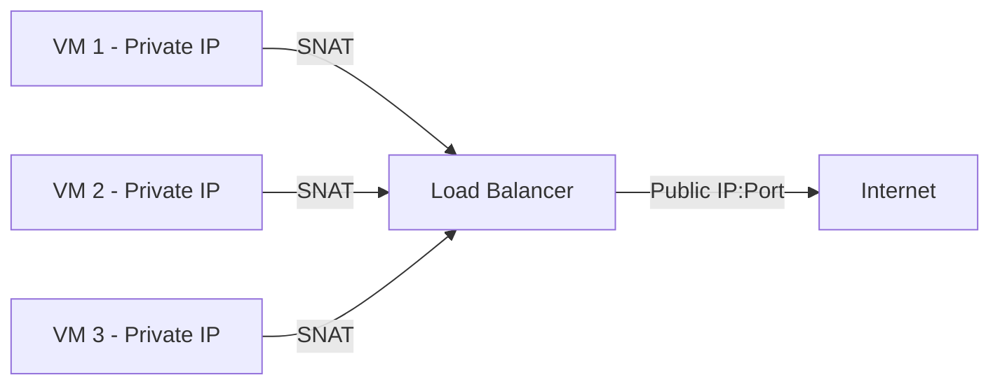

# How to Configure Azure Load Balancer Outbound Rules for SNAT Port Allocation

Author: [nawazdhandala](https://www.github.com/nawazdhandala)

Tags: Azure, Load Balancer, SNAT, Outbound Rules, Networking, Port Allocation, NAT

Description: Learn how to configure Azure Load Balancer outbound rules to manage SNAT port allocation and prevent port exhaustion for your workloads.

---

SNAT port exhaustion is one of those problems that sneaks up on you. Everything works fine in development and staging, then you push to production, traffic ramps up, and suddenly your outbound connections start failing with timeouts and connection errors. The root cause is almost always running out of SNAT (Source Network Address Translation) ports on your Azure Load Balancer.

In this post, I will explain how SNAT works in Azure, why port exhaustion happens, and how to configure outbound rules on a Standard Load Balancer to control port allocation and avoid the problem entirely.

## What is SNAT and Why Does It Matter?

When a VM behind an Azure Load Balancer needs to make an outbound connection to the internet, Azure performs SNAT. It translates the VM's private IP address and source port to a public IP address and a port from a pool of available SNAT ports. This is how multiple VMs can share the same public IP for outbound traffic.

Each public IP address provides 64,512 SNAT ports. These ports are shared across all the VMs in the backend pool. By default, Azure allocates these ports automatically, which works fine for small deployments. But as your backend pool grows, the per-VM allocation shrinks, and you can run into exhaustion.



The default allocation formula is roughly: 64,512 ports divided by the number of backend pool members. With 100 VMs, that is only about 645 ports per VM. If any single VM needs to make more than 645 simultaneous outbound connections, it hits exhaustion.

## Symptoms of SNAT Port Exhaustion

You will know you have a SNAT problem when you see:

- Outbound connection failures or timeouts
- Intermittent errors connecting to external APIs, databases, or storage
- The `SnatConnectionCount` metric in Azure Monitor showing failed allocations
- Application logs showing "connection refused" or socket timeout errors for outbound calls

These symptoms get worse under load and may clear up during off-peak hours, which makes them tricky to debug if you are not looking at the right metrics.

## Configuring Outbound Rules

Outbound rules give you explicit control over how SNAT ports are allocated. They are only available on Standard SKU load balancers. Let us set one up.

### Step 1: Create the Load Balancer with a Public IP

```bash
# Create a resource group
az group create \
  --name rg-lb-outbound \
  --location eastus

# Create a public IP for outbound SNAT
az network public-ip create \
  --resource-group rg-lb-outbound \
  --name pip-lb-outbound-1 \
  --sku Standard \
  --allocation-method Static

# Create a Standard Load Balancer
az network lb create \
  --resource-group rg-lb-outbound \
  --name lb-main \
  --sku Standard \
  --frontend-ip-name fe-outbound \
  --public-ip-address pip-lb-outbound-1 \
  --backend-pool-name bp-main
```

### Step 2: Create the Outbound Rule

Now create an outbound rule that explicitly allocates SNAT ports.

```bash
# Create an outbound rule that allocates 10,000 ports per backend instance
# This gives each VM a dedicated pool of SNAT ports
az network lb outbound-rule create \
  --resource-group rg-lb-outbound \
  --lb-name lb-main \
  --name rule-outbound \
  --frontend-ip-configs fe-outbound \
  --protocol All \
  --idle-timeout 15 \
  --outbound-ports 10000 \
  --address-pool bp-main
```

The key parameter is `--outbound-ports 10000`. This allocates 10,000 SNAT ports per backend instance. With one public IP providing 64,512 ports, this means you can have up to 6 backend instances (64,512 / 10,000 = 6.45).

If you need more capacity, add more public IP addresses.

### Step 3: Add More Public IPs for Scaling

Each public IP adds another 64,512 ports to the pool. If you need to support more backend instances or higher port allocations, add public IPs.

```bash
# Create additional public IPs for more SNAT capacity
az network public-ip create \
  --resource-group rg-lb-outbound \
  --name pip-lb-outbound-2 \
  --sku Standard \
  --allocation-method Static

az network public-ip create \
  --resource-group rg-lb-outbound \
  --name pip-lb-outbound-3 \
  --sku Standard \
  --allocation-method Static

# Add the new IPs to the load balancer frontend
az network lb frontend-ip create \
  --resource-group rg-lb-outbound \
  --lb-name lb-main \
  --name fe-outbound-2 \
  --public-ip-address pip-lb-outbound-2

az network lb frontend-ip create \
  --resource-group rg-lb-outbound \
  --lb-name lb-main \
  --name fe-outbound-3 \
  --public-ip-address pip-lb-outbound-3

# Update the outbound rule to use all three frontend IPs
az network lb outbound-rule create \
  --resource-group rg-lb-outbound \
  --lb-name lb-main \
  --name rule-outbound \
  --frontend-ip-configs fe-outbound fe-outbound-2 fe-outbound-3 \
  --protocol All \
  --idle-timeout 15 \
  --outbound-ports 10000 \
  --address-pool bp-main
```

With three public IPs, you now have 193,536 total ports (3 x 64,512). At 10,000 ports per instance, that supports 19 backend instances.

## Choosing the Right Port Allocation

How many ports does each VM actually need? That depends on your workload. Here are some guidelines:

- **Web servers making API calls**: 1,024 to 2,048 ports is usually enough
- **Application servers with many outbound connections**: 4,096 to 8,192 ports
- **Microservices calling many external services**: 8,192 to 16,384 ports
- **Connection-heavy workloads (scraping, bulk API calls)**: 16,384+ ports

You can calculate the maximum number of backend instances supported by your configuration with this formula:

```
Max instances = (Number of public IPs x 64,512) / Ports per instance
```

## Configuring Idle Timeout

SNAT ports are held for a period after the connection closes to handle late-arriving packets. The idle timeout controls how long a port stays allocated after the TCP connection goes idle.

```bash
# Set the idle timeout to 4 minutes (minimum) to recycle ports faster
az network lb outbound-rule update \
  --resource-group rg-lb-outbound \
  --lb-name lb-main \
  --name rule-outbound \
  --idle-timeout 4
```

The default is 4 minutes, and you can set it up to 30 minutes. Shorter timeouts mean ports get recycled faster, which helps prevent exhaustion. But setting it too low can cause problems if your connections are legitimately idle for extended periods.

## TCP Reset on Idle Timeout

Enabling TCP reset sends a RST packet when the idle timeout expires, which lets both sides of the connection clean up immediately rather than waiting for the connection to time out.

```bash
# Enable TCP reset for cleaner connection cleanup
az network lb outbound-rule update \
  --resource-group rg-lb-outbound \
  --lb-name lb-main \
  --name rule-outbound \
  --enable-tcp-reset true
```

This is almost always a good idea. It prevents half-open connections from lingering and consuming ports.

## Monitoring SNAT Usage

Set up alerts on SNAT metrics to catch exhaustion before it impacts users.

```bash
# Query SNAT connection count metrics for the load balancer
az monitor metrics list \
  --resource $(az network lb show -g rg-lb-outbound -n lb-main --query id -o tsv) \
  --metric "SnatConnectionCount" \
  --interval PT1M \
  --aggregation Total \
  --filter "ConnectionState eq 'Failed'" \
  --output table
```

If the "Failed" SNAT connection count is greater than zero, you are hitting exhaustion. Create an alert rule to notify you when this happens.

```bash
# Create an alert rule for SNAT failures
az monitor metrics alert create \
  --resource-group rg-lb-outbound \
  --name alert-snat-exhaustion \
  --scopes $(az network lb show -g rg-lb-outbound -n lb-main --query id -o tsv) \
  --condition "total SnatConnectionCount > 0 where ConnectionState includes Failed" \
  --window-size 5m \
  --evaluation-frequency 1m \
  --description "SNAT port exhaustion detected" \
  --severity 2
```

## Best Practices

**Use connection pooling**: The most effective way to reduce SNAT usage is to reuse connections. Enable HTTP keep-alive, use connection pools for database connections, and avoid creating new connections for every request.

**Prefer private endpoints**: If you are connecting to Azure services like Storage, SQL Database, or Cosmos DB, use private endpoints instead of public endpoints. Private endpoint traffic does not consume SNAT ports.

**Consider NAT Gateway**: For VM-based workloads that do not need a load balancer, Azure NAT Gateway is often a better choice for outbound connectivity. It provides 64,512 ports per public IP and distributes them dynamically across all VMs in the subnet, which is more efficient than static allocation.

**Separate inbound and outbound**: You can create different frontend IP configurations for inbound and outbound traffic. This prevents inbound traffic patterns from affecting your outbound SNAT port pool.

SNAT port management is one of those infrastructure details that is easy to overlook until it bites you. Configuring explicit outbound rules, monitoring SNAT metrics, and following connection pooling best practices will keep your outbound connectivity reliable even at scale.
