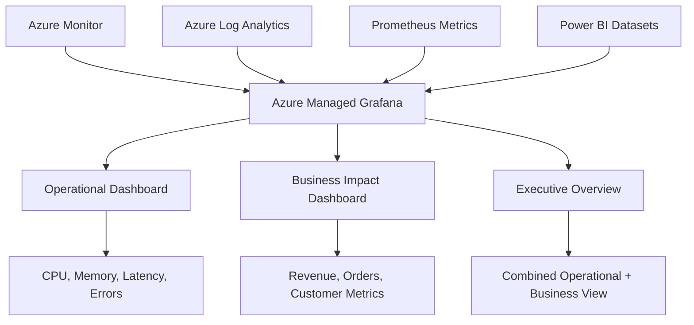

# How to Implement Azure Managed Grafana Dashboards with Power BI Dataset Integration for Hybrid Monitoring

Author: [nawazdhandala](https://www.github.com/nawazdhandala)

Tags: Azure, Grafana, Power BI, Monitoring, Dashboards, Observability, Hybrid

Description: Implement Azure Managed Grafana dashboards integrated with Power BI datasets to create a hybrid monitoring solution combining operational and business metrics.

---

Most organizations end up with two separate worlds of dashboards - engineering teams use Grafana (or similar tools) for infrastructure and application monitoring, while business teams use Power BI for revenue, customer metrics, and operational KPIs. The problem is that these two views are disconnected. When there is a production incident, the engineering team sees the technical impact in Grafana but cannot see the business impact. When business metrics dip, the business team sees the numbers but cannot correlate them with infrastructure events.

Azure Managed Grafana with Power BI dataset integration bridges this gap. You can display operational metrics from Azure Monitor alongside business metrics from Power BI datasets on the same dashboard, giving both teams a unified view.

## Architecture

The hybrid monitoring solution pulls data from multiple sources into Grafana dashboards.



The key insight is that Grafana excels at time-series visualization and alerting, while Power BI excels at business data modeling and DAX calculations. By connecting both to Grafana, you get Grafana's real-time monitoring capabilities with Power BI's business logic.

## Setting Up Azure Managed Grafana

```bash
# Create a resource group
az group create --name rg-monitoring --location eastus

# Create an Azure Managed Grafana instance
az grafana create \
  --name hybrid-monitoring \
  --resource-group rg-monitoring \
  --location eastus \
  --sku Standard

# Get the Grafana endpoint URL
az grafana show \
  --name hybrid-monitoring \
  --resource-group rg-monitoring \
  --query "properties.endpoint" -o tsv
```

The Standard SKU supports custom plugins, which you will need for the Power BI integration. The Grafana instance is automatically integrated with Azure AD for authentication.

## Configuring Azure Monitor Data Source

Azure Managed Grafana comes pre-configured with Azure Monitor as a data source. Grant it access to the resources you want to monitor.

```bash
# Get the Grafana managed identity
GRAFANA_IDENTITY=$(az grafana show \
  --name hybrid-monitoring \
  --resource-group rg-monitoring \
  --query "identity.principalId" -o tsv)

# Grant Monitoring Reader role on the subscription
az role assignment create \
  --assignee $GRAFANA_IDENTITY \
  --role "Monitoring Reader" \
  --scope "/subscriptions/YOUR_SUBSCRIPTION_ID"

# Grant Log Analytics Reader for querying workspaces
az role assignment create \
  --assignee $GRAFANA_IDENTITY \
  --role "Log Analytics Reader" \
  --scope "/subscriptions/YOUR_SUBSCRIPTION_ID"
```

## Integrating Power BI Datasets

To query Power BI datasets from Grafana, you need a bridge that exposes Power BI data through an API that Grafana can consume. There are a couple of approaches.

### Approach 1: Azure Functions API Bridge

Create an Azure Function that queries Power BI datasets and returns data in a format Grafana's JSON API plugin understands.

```javascript
// src/functions/powerbi-bridge.js
const { app } = require('@azure/functions');
const msal = require('@azure/msal-node');
const axios = require('axios');

const msalConfig = {
  auth: {
    clientId: process.env.PBI_CLIENT_ID,
    clientSecret: process.env.PBI_CLIENT_SECRET,
    authority: `https://login.microsoftonline.com/${process.env.TENANT_ID}`
  }
};

const cca = new msal.ConfidentialClientApplication(msalConfig);

// Grafana JSON API compatible endpoint - /search
app.http('pbi-search', {
  methods: ['POST'],
  route: 'grafana/search',
  handler: async (request, context) => {
    // Return available metrics from Power BI
    return {
      jsonBody: [
        'daily_revenue',
        'active_customers',
        'orders_count',
        'avg_order_value',
        'customer_satisfaction',
        'churn_rate',
        'support_tickets',
        'conversion_rate'
      ]
    };
  }
});

// Grafana JSON API compatible endpoint - /query
app.http('pbi-query', {
  methods: ['POST'],
  route: 'grafana/query',
  handler: async (request, context) => {
    const body = await request.json();
    const { targets, range } = body;

    // Get Power BI access token
    const tokenResponse = await cca.acquireTokenByClientCredential({
      scopes: ['https://analysis.windows.net/powerbi/api/.default']
    });

    const results = [];

    for (const target of targets) {
      // Execute a DAX query against the Power BI dataset
      const daxQuery = buildDaxQuery(target.target, range);
      const data = await executeDaxQuery(
        tokenResponse.accessToken,
        process.env.PBI_DATASET_ID,
        daxQuery
      );

      // Format for Grafana time series
      results.push({
        target: target.target,
        datapoints: data.map(row => [
          row.value,
          new Date(row.date).getTime()
        ])
      });
    }

    return { jsonBody: results };
  }
});

// Build a DAX query based on the metric and time range
function buildDaxQuery(metric, range) {
  const startDate = range.from;
  const endDate = range.to;

  // Map metric names to DAX queries
  const queries = {
    daily_revenue: `
      EVALUATE
      SUMMARIZECOLUMNS(
        'Date'[Date],
        KEEPFILTERS(FILTER(ALL('Date'[Date]),
          'Date'[Date] >= DATE(${new Date(startDate).getFullYear()},${new Date(startDate).getMonth()+1},${new Date(startDate).getDate()})
          && 'Date'[Date] <= DATE(${new Date(endDate).getFullYear()},${new Date(endDate).getMonth()+1},${new Date(endDate).getDate()})
        )),
        "value", [Total Revenue]
      )
      ORDER BY 'Date'[Date]
    `,
    active_customers: `
      EVALUATE
      SUMMARIZECOLUMNS(
        'Date'[Date],
        KEEPFILTERS(FILTER(ALL('Date'[Date]),
          'Date'[Date] >= DATE(${new Date(startDate).getFullYear()},${new Date(startDate).getMonth()+1},${new Date(startDate).getDate()})
          && 'Date'[Date] <= DATE(${new Date(endDate).getFullYear()},${new Date(endDate).getMonth()+1},${new Date(endDate).getDate()})
        )),
        "value", [Active Customers]
      )
      ORDER BY 'Date'[Date]
    `,
    orders_count: `
      EVALUATE
      SUMMARIZECOLUMNS(
        'Date'[Date],
        KEEPFILTERS(FILTER(ALL('Date'[Date]),
          'Date'[Date] >= DATE(${new Date(startDate).getFullYear()},${new Date(startDate).getMonth()+1},${new Date(startDate).getDate()})
          && 'Date'[Date] <= DATE(${new Date(endDate).getFullYear()},${new Date(endDate).getMonth()+1},${new Date(endDate).getDate()})
        )),
        "value", [Order Count]
      )
      ORDER BY 'Date'[Date]
    `
  };

  return queries[metric] || queries.daily_revenue;
}

// Execute a DAX query against a Power BI dataset
async function executeDaxQuery(accessToken, datasetId, daxQuery) {
  const response = await axios.post(
    `https://api.powerbi.com/v1.0/myorg/datasets/${datasetId}/executeQueries`,
    {
      queries: [{ query: daxQuery }],
      serializerSettings: { includeNulls: true }
    },
    {
      headers: {
        Authorization: `Bearer ${accessToken}`,
        'Content-Type': 'application/json'
      }
    }
  );

  // Parse the DAX query result
  const table = response.data.results[0].tables[0];
  return table.rows.map(row => ({
    date: row['Date[Date]'] || row[Object.keys(row)[0]],
    value: row['[value]'] || row[Object.keys(row)[1]]
  }));
}
```

### Approach 2: Direct Power BI Plugin

Azure Managed Grafana Standard tier supports installing community plugins. If a Power BI Grafana plugin is available, install it directly.

```bash
# Install a Grafana plugin
az grafana update \
  --name hybrid-monitoring \
  --resource-group rg-monitoring \
  --grafana-plugins "grafana-powerbi-datasource"
```

## Building the Hybrid Dashboard

Create a Grafana dashboard that combines operational and business metrics.

```json
{
  "dashboard": {
    "title": "Hybrid Operations & Business Monitoring",
    "rows": [
      {
        "title": "Business Metrics (from Power BI)",
        "panels": [
          {
            "title": "Daily Revenue",
            "type": "timeseries",
            "datasource": "Power BI Bridge",
            "targets": [{ "target": "daily_revenue" }],
            "fieldConfig": {
              "defaults": {
                "unit": "currencyUSD",
                "color": { "mode": "fixed", "fixedColor": "green" }
              }
            }
          },
          {
            "title": "Active Customers",
            "type": "stat",
            "datasource": "Power BI Bridge",
            "targets": [{ "target": "active_customers" }]
          },
          {
            "title": "Orders Today",
            "type": "gauge",
            "datasource": "Power BI Bridge",
            "targets": [{ "target": "orders_count" }],
            "fieldConfig": {
              "defaults": {
                "thresholds": {
                  "steps": [
                    { "color": "red", "value": 0 },
                    { "color": "yellow", "value": 100 },
                    { "color": "green", "value": 500 }
                  ]
                }
              }
            }
          }
        ]
      },
      {
        "title": "Infrastructure Metrics (from Azure Monitor)",
        "panels": [
          {
            "title": "API Response Time",
            "type": "timeseries",
            "datasource": "Azure Monitor",
            "targets": [{
              "resourceGroup": "rg-production",
              "resourceName": "api-app-service",
              "metricDefinition": "Microsoft.Web/sites",
              "metricName": "HttpResponseTime",
              "aggregation": "Average"
            }]
          },
          {
            "title": "Error Rate",
            "type": "timeseries",
            "datasource": "Azure Monitor",
            "targets": [{
              "resourceGroup": "rg-production",
              "resourceName": "api-app-service",
              "metricDefinition": "Microsoft.Web/sites",
              "metricName": "Http5xx",
              "aggregation": "Total"
            }]
          },
          {
            "title": "Database CPU",
            "type": "timeseries",
            "datasource": "Azure Monitor",
            "targets": [{
              "resourceGroup": "rg-production",
              "resourceName": "production-sql",
              "metricDefinition": "Microsoft.Sql/servers/databases",
              "metricName": "cpu_percent",
              "aggregation": "Average"
            }]
          }
        ]
      }
    ]
  }
}
```

## Setting Up Alerts

Configure Grafana alerts that combine operational and business signals. For example, alert when both error rates spike AND revenue drops - indicating a customer-impacting incident.

In the Grafana UI, create an alert rule.

```yaml
# Alert: Revenue drop correlated with errors
name: Revenue Impact Incident
condition: |
  error_rate > 5 AND revenue_change < -20
for: 5m
labels:
  severity: critical
  team: engineering
  impact: revenue
annotations:
  summary: "Revenue has dropped {{ $value }}% while error rate is {{ $labels.error_rate }}%"
  description: "This may indicate a production incident affecting customer transactions"
  runbook_url: "https://wiki.contoso.com/runbooks/revenue-impact"
```

## Access Control

Configure role-based access so different teams see relevant dashboards.

```bash
# Grant the engineering team Grafana Editor role
az grafana user assign \
  --name hybrid-monitoring \
  --resource-group rg-monitoring \
  --user "engineering-team@contoso.com" \
  --role Editor

# Grant the business team Grafana Viewer role
az grafana user assign \
  --name hybrid-monitoring \
  --resource-group rg-monitoring \
  --user "business-analytics@contoso.com" \
  --role Viewer

# Grant the SRE team Grafana Admin role
az grafana user assign \
  --name hybrid-monitoring \
  --resource-group rg-monitoring \
  --user "sre-team@contoso.com" \
  --role Admin
```

## Creating Annotations for Incident Correlation

Use Grafana annotations to mark business events on operational dashboards and vice versa. When a marketing campaign launches, an annotation on the infrastructure dashboard helps engineers understand traffic spikes. When a deployment happens, an annotation on the business dashboard explains a brief dip in metrics.

```javascript
// Add deployment annotations to Grafana via API
const axios = require('axios');

async function addDeploymentAnnotation(version, environment) {
  await axios.post(
    `${process.env.GRAFANA_URL}/api/annotations`,
    {
      dashboardUID: 'hybrid-overview',
      time: Date.now(),
      tags: ['deployment', environment],
      text: `Deployed version ${version} to ${environment}`
    },
    {
      headers: {
        Authorization: `Bearer ${process.env.GRAFANA_API_KEY}`,
        'Content-Type': 'application/json'
      }
    }
  );
}
```

## Wrapping Up

Azure Managed Grafana with Power BI integration gives you a single pane of glass that combines operational and business metrics. Engineers can see how infrastructure issues impact revenue. Business teams can see when metric dips correlate with technical incidents. The Azure Functions bridge pattern connects Power BI's rich business data models to Grafana's real-time visualization and alerting. This hybrid approach is more effective than having separate dashboards because the most important insights come from correlating signals across both domains. When you can see that a 200ms increase in API latency caused a 15% drop in checkout conversions, you have the data you need to prioritize the right fixes.
