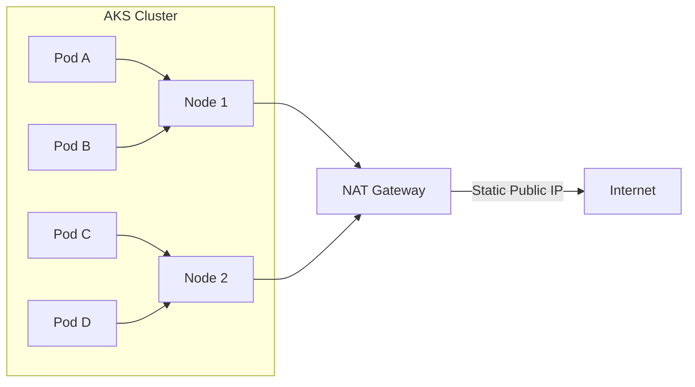

# How to Configure Azure NAT Gateway for Azure Kubernetes Service Egress

Author: [nawazdhandala](https://www.github.com/nawazdhandala)

Tags: Azure, NAT Gateway, AKS, Kubernetes, Egress, Networking, SNAT

Description: Configure Azure NAT Gateway as the egress solution for AKS clusters to get predictable outbound IPs and avoid SNAT port exhaustion.

---

If you have run Azure Kubernetes Service (AKS) with the default outbound configuration, you have probably encountered SNAT port exhaustion at some point. The default AKS load balancer allocates a limited number of SNAT ports per node, and when your pods make a lot of outbound connections - to external APIs, databases, or container registries - those ports run out.

Azure NAT Gateway is the recommended solution for AKS egress. It provides 64,512 SNAT ports per public IP address, distributes them dynamically across all nodes in the subnet, and gives you predictable, static outbound IP addresses. In this guide, I will walk through configuring NAT Gateway for an AKS cluster, both for new deployments and for migrating existing clusters.

## Why NAT Gateway Over the Default Load Balancer?

The default AKS outbound type uses the cluster's Standard Load Balancer for egress. This works but has several limitations:

- SNAT ports are statically allocated per node. More nodes mean fewer ports per node.
- Adding nodes requires load balancer reconfiguration.
- Outbound IPs change when the load balancer is updated.
- Port exhaustion is common in clusters with many outbound connections.

NAT Gateway avoids all of these problems:

- 64,512 ports per public IP, dynamically allocated across all VMs in the subnet
- No static per-node allocation - ports go where they are needed
- Supports up to 16 public IPs (over 1 million SNAT ports total)
- Outbound IPs are stable and predictable
- No load balancer reconfiguration when nodes scale



## Step 1: Create the NAT Gateway

Start by creating the NAT Gateway resources.

```bash
# Create a resource group
az group create \
  --name rg-aks \
  --location eastus

# Create a public IP for NAT Gateway outbound traffic
az network public-ip create \
  --resource-group rg-aks \
  --name pip-nat-aks \
  --sku Standard \
  --allocation-method Static \
  --location eastus

# Create the NAT Gateway
az network nat gateway create \
  --resource-group rg-aks \
  --name natgw-aks \
  --location eastus \
  --public-ip-addresses pip-nat-aks \
  --idle-timeout 4
```

The `--idle-timeout 4` sets the idle timeout to 4 minutes (the minimum). This recycles SNAT ports faster. You can set it up to 120 minutes, but lower values are generally better for Kubernetes workloads.

## Step 2: Add More Public IPs for High-Scale Clusters

If your cluster makes a very large number of outbound connections, add more public IPs to the NAT Gateway.

```bash
# Create additional public IPs for more SNAT capacity
az network public-ip create \
  --resource-group rg-aks \
  --name pip-nat-aks-2 \
  --sku Standard \
  --allocation-method Static

az network public-ip create \
  --resource-group rg-aks \
  --name pip-nat-aks-3 \
  --sku Standard \
  --allocation-method Static

# Associate additional IPs with the NAT Gateway
az network nat gateway update \
  --resource-group rg-aks \
  --name natgw-aks \
  --public-ip-addresses pip-nat-aks pip-nat-aks-2 pip-nat-aks-3
```

With three public IPs, you have 193,536 SNAT ports available (3 x 64,512). NAT Gateway distributes these dynamically across all nodes.

## Step 3: Create a VNet and Associate NAT Gateway with the Subnet

AKS needs a VNet with a subnet. Associate the NAT Gateway with the subnet that the AKS nodes will use.

```bash
# Create a VNet for the AKS cluster
az network vnet create \
  --resource-group rg-aks \
  --name vnet-aks \
  --address-prefix 10.0.0.0/16 \
  --subnet-name snet-aks-nodes \
  --subnet-prefix 10.0.0.0/20

# Associate the NAT Gateway with the AKS node subnet
az network vnet subnet update \
  --resource-group rg-aks \
  --vnet-name vnet-aks \
  --name snet-aks-nodes \
  --nat-gateway natgw-aks
```

The /20 subnet gives you 4,094 usable IPs, which is enough for a large AKS cluster with Azure CNI networking.

## Step 4: Create the AKS Cluster with NAT Gateway Egress

Now create the AKS cluster configured to use the NAT Gateway for outbound traffic.

```bash
# Get the subnet resource ID
SUBNET_ID=$(az network vnet subnet show \
  --resource-group rg-aks \
  --vnet-name vnet-aks \
  --name snet-aks-nodes \
  --query id --output tsv)

# Create the AKS cluster with userAssignedNATGateway outbound type
az aks create \
  --resource-group rg-aks \
  --name aks-main \
  --location eastus \
  --node-count 3 \
  --node-vm-size Standard_D4s_v3 \
  --network-plugin azure \
  --vnet-subnet-id $SUBNET_ID \
  --outbound-type userAssignedNATGateway \
  --generate-ssh-keys
```

The `--outbound-type userAssignedNATGateway` tells AKS to use the NAT Gateway on the subnet instead of creating its own load balancer outbound rules.

## Step 5: Verify the Configuration

After the cluster is created, verify that outbound traffic uses the NAT Gateway's public IP.

```bash
# Get the AKS credentials
az aks get-credentials \
  --resource-group rg-aks \
  --name aks-main

# Deploy a test pod that checks the outbound IP
kubectl run test-egress --image=curlimages/curl \
  --restart=Never \
  --command -- curl -s https://api.ipify.org

# Check the pod's output for the outbound IP
kubectl logs test-egress

# Clean up the test pod
kubectl delete pod test-egress
```

The IP address returned should match one of the NAT Gateway's public IPs. Compare it with:

```bash
# Get the NAT Gateway's public IPs
az network public-ip show \
  --resource-group rg-aks \
  --name pip-nat-aks \
  --query ipAddress \
  --output tsv
```

## Migrating an Existing AKS Cluster

If you have an existing AKS cluster using the default load balancer egress, you can migrate to NAT Gateway. The process involves associating the NAT Gateway with the subnet and updating the cluster's outbound type.

```bash
# Find the AKS node subnet
NODE_RG=$(az aks show -g rg-aks -n aks-main --query nodeResourceGroup -o tsv)

# Associate NAT Gateway with the existing AKS node subnet
az network vnet subnet update \
  --resource-group rg-aks \
  --vnet-name vnet-aks \
  --name snet-aks-nodes \
  --nat-gateway natgw-aks

# Update the AKS cluster to use NAT Gateway
az aks update \
  --resource-group rg-aks \
  --name aks-main \
  --outbound-type userAssignedNATGateway
```

Note that changing the outbound type triggers a rolling update of the cluster nodes. Plan for some disruption during this process.

## Handling IP Allowlisting

One of the biggest advantages of NAT Gateway is predictable outbound IPs. This matters when external services require IP allowlisting. Get all the outbound IPs for documentation or firewall rules.

```bash
# List all public IPs associated with the NAT Gateway
az network nat gateway show \
  --resource-group rg-aks \
  --name natgw-aks \
  --query "publicIpAddresses[].id" \
  --output tsv | while read ip_id; do
    az network public-ip show --ids $ip_id --query ipAddress --output tsv
done
```

These IPs will not change unless you explicitly modify the NAT Gateway configuration. Share them with external service providers for allowlisting.

## Monitoring NAT Gateway

Monitor SNAT port usage to make sure you are not approaching exhaustion.

```bash
# Check SNAT connection count
az monitor metrics list \
  --resource $(az network nat gateway show -g rg-aks -n natgw-aks --query id -o tsv) \
  --metric "SNATConnectionCount" \
  --interval PT5M \
  --aggregation Total \
  --output table

# Check for dropped packets (indicates port exhaustion)
az monitor metrics list \
  --resource $(az network nat gateway show -g rg-aks -n natgw-aks --query id -o tsv) \
  --metric "DroppedPacketCount" \
  --interval PT5M \
  --aggregation Total \
  --output table
```

Create an alert for SNAT failures.

```bash
# Alert when NAT Gateway starts dropping packets
az monitor metrics alert create \
  --resource-group rg-aks \
  --name alert-natgw-drops \
  --scopes $(az network nat gateway show -g rg-aks -n natgw-aks --query id -o tsv) \
  --condition "total DroppedPacketCount > 0" \
  --window-size 5m \
  --evaluation-frequency 1m \
  --severity 2 \
  --description "NAT Gateway dropping packets - potential SNAT exhaustion"
```

## Cost Considerations

NAT Gateway pricing has two components:

- **Resource hour**: Charged per hour the NAT Gateway exists, regardless of usage.
- **Data processed**: Charged per GB of data processed through the NAT Gateway.

Public IPs associated with the NAT Gateway are also billed separately.

For most AKS clusters, the NAT Gateway cost is small compared to the node VM costs. But for clusters with very high outbound data volumes, factor in the data processing charges.

## Best Practices

**Right-size your public IP count**: Start with one public IP (64,512 ports) and add more only if monitoring shows you are approaching limits. Most clusters work fine with one or two IPs.

**Keep idle timeout low**: For Kubernetes workloads, a 4-minute idle timeout is usually sufficient. Lower timeouts recycle ports faster.

**Use private endpoints for Azure services**: If your pods connect to Azure Storage, SQL Database, or other Azure services, use private endpoints. This traffic bypasses the NAT Gateway entirely, reducing SNAT port usage and data processing costs.

**Monitor regularly**: Set up alerts on DroppedPacketCount and SNATConnectionCount metrics. Catching port exhaustion early prevents outages.

NAT Gateway is the best egress solution for AKS clusters in production. It eliminates SNAT exhaustion concerns, gives you predictable outbound IPs, and scales automatically with your cluster. The setup is straightforward, and the operational benefits are immediate.
