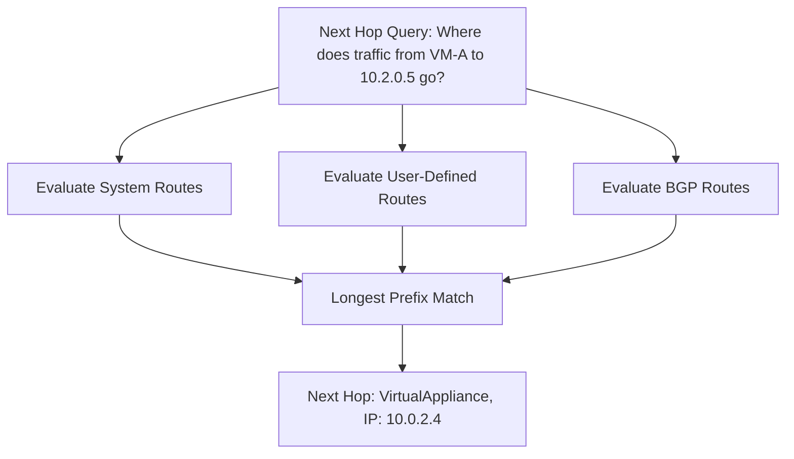

# How to Use Azure Network Watcher Next Hop to Diagnose Routing Problems

Author: [nawazdhandala](https://www.github.com/nawazdhandala)

Tags: Azure, Network Watcher, Next Hop, Routing, Troubleshooting, Networking, Diagnostics

Description: Use Azure Network Watcher Next Hop feature to diagnose and troubleshoot routing problems in your Azure virtual network infrastructure.

---

When a VM cannot reach another resource in Azure, the problem is almost always routing. Traffic might be going to the wrong next hop, hitting a blackhole route, or getting dropped by a network virtual appliance. The tricky part is figuring out which one it is, because Azure has multiple layers of routing - system routes, user-defined routes, BGP routes, and service endpoint routes - that all interact.

Azure Network Watcher's Next Hop feature cuts through this complexity. It tells you exactly where a packet from a specific source will go next. Instead of manually inspecting route tables and trying to figure out which route wins, you ask Network Watcher and it gives you the answer.

## What is Next Hop?

Next Hop is a diagnostic tool that evaluates the effective routes for a virtual machine's network interface and tells you the next hop for a packet destined for a specific IP address. It considers all route sources:

- System routes (automatically created by Azure)
- User-defined routes (UDRs) from route tables
- BGP routes (from VPN Gateway or ExpressRoute)
- Service endpoint routes

The output tells you three things:
1. The next hop type (VirtualNetwork, Internet, VirtualAppliance, etc.)
2. The next hop IP address (if applicable)
3. The route table that contains the winning route



## Running a Next Hop Query

The simplest way to use Next Hop is through the Azure CLI. You need the source VM's resource ID, the source NIC's ID, the source IP, and the destination IP.

```bash
# Run a Next Hop diagnostic to find where traffic from VM-A to 10.2.0.5 goes
az network watcher show-next-hop \
  --resource-group rg-networking \
  --vm vm-web-01 \
  --source-ip 10.0.1.4 \
  --dest-ip 10.2.0.5
```

The output looks something like this:

```json
{
  "nextHopIpAddress": "10.0.2.4",
  "nextHopType": "VirtualAppliance",
  "routeTableId": "/subscriptions/.../routeTables/rt-spoke1"
}
```

This tells us that traffic from `10.0.1.4` to `10.2.0.5` will be sent to `10.0.2.4` (a virtual appliance like a firewall), and this route comes from the route table `rt-spoke1`.

## Common Next Hop Types

Here are the next hop types you will see and what they mean:

**VirtualNetworkGateway** - Traffic is sent to a VPN Gateway or ExpressRoute Gateway. This is normal for traffic destined for on-premises networks.

**VirtualNetwork** - Traffic stays within the virtual network. Azure handles routing directly between subnets in the same VNet.

**Internet** - Traffic is routed to the internet. If you see this for traffic that should stay internal, you have a routing problem.

**VirtualAppliance** - Traffic is sent to a network virtual appliance (NVA) like a firewall. The next hop IP shows which appliance.

**None** - The traffic will be dropped. This means no matching route exists, or the matching route has a next hop of "None" (a blackhole route). This is often the culprit when connectivity fails.

## Diagnosing Common Routing Problems

### Problem 1: VM Cannot Reach Another Subnet

You have two subnets in the same VNet, but VMs in one subnet cannot reach VMs in the other.

```bash
# Check what happens to traffic from subnet A to subnet B
az network watcher show-next-hop \
  --resource-group rg-networking \
  --vm vm-in-subnet-a \
  --source-ip 10.0.1.4 \
  --dest-ip 10.0.2.10
```

If the next hop type is "VirtualNetwork," routing is correct and the problem is likely an NSG blocking traffic. If the next hop type is "VirtualAppliance" or "None," a user-defined route is overriding the default system route.

### Problem 2: Traffic Not Reaching the Firewall

In a hub-and-spoke architecture, you expect traffic to flow through a firewall, but connectivity tests show it is going directly.

```bash
# Verify that traffic from a spoke VM to the internet goes through the firewall
az network watcher show-next-hop \
  --resource-group rg-networking \
  --vm vm-spoke-1 \
  --source-ip 10.1.1.4 \
  --dest-ip 8.8.8.8
```

If the next hop type is "Internet" instead of "VirtualAppliance," the route table with the 0.0.0.0/0 route pointing to the firewall is either not associated with the subnet or has a misconfigured route.

### Problem 3: On-Premises Traffic Going Wrong Way

Traffic to your on-premises network (192.168.0.0/16) should go through the VPN gateway but is not connecting.

```bash
# Check routing for on-premises destined traffic
az network watcher show-next-hop \
  --resource-group rg-networking \
  --vm vm-app-01 \
  --source-ip 10.0.1.10 \
  --dest-ip 192.168.1.50
```

If the next hop is "Internet" instead of "VirtualNetworkGateway," the VPN gateway has not propagated its routes, or a UDR is overriding the BGP route.

## Checking Effective Routes

Next Hop gives you the answer for a specific destination. If you want to see the full routing table, use the effective routes feature.

```bash
# Show all effective routes for a VM's network interface
az network nic show-effective-route-table \
  --resource-group rg-networking \
  --name nic-vm-web-01 \
  --output table
```

This shows every route that applies to the NIC, including system routes, UDRs, and BGP routes. It also shows which route source wins for each prefix.

The output might look like this:

```
Source    State    Address Prefix    Next Hop Type       Next Hop IP
------    -----    ---------------   ----------------    -----------
Default   Active   10.0.0.0/16       VirtualNetwork
Default   Active   0.0.0.0/0         Internet
User      Active   0.0.0.0/0         VirtualAppliance    10.0.2.4
User      Active   10.2.0.0/16       VirtualAppliance    10.0.2.4
Default   Invalid  0.0.0.0/0         Internet
```

Notice how the UDR for 0.0.0.0/0 with next hop VirtualAppliance makes the system's default Internet route "Invalid." The UDR wins because user-defined routes take precedence over system routes.

## Automating Routing Diagnostics

For larger environments, you can script Next Hop checks across multiple VMs.

```bash
# Check routing for all VMs in a resource group to a specific destination
# Useful for verifying firewall routing is consistent across all workload VMs
DEST_IP="8.8.8.8"
RESOURCE_GROUP="rg-production"

for vm_name in $(az vm list -g $RESOURCE_GROUP --query "[].name" -o tsv); do
  # Get the VM's primary private IP
  source_ip=$(az vm show -g $RESOURCE_GROUP -n $vm_name \
    --query "networkProfile.networkInterfaces[0]" -o tsv | \
    xargs -I{} az network nic show --ids {} \
    --query "ipConfigurations[0].privateIPAddress" -o tsv)

  # Run Next Hop check
  result=$(az network watcher show-next-hop \
    -g $RESOURCE_GROUP \
    --vm $vm_name \
    --source-ip $source_ip \
    --dest-ip $DEST_IP \
    --query "{type:nextHopType, ip:nextHopIpAddress}" -o tsv)

  echo "$vm_name ($source_ip) -> $DEST_IP: $result"
done
```

This script checks every VM in a resource group and reports where internet traffic will be routed. If any VM shows "Internet" instead of "VirtualAppliance," you know that VM's subnet is missing the firewall route.

## Integrating with Monitoring

You can set up periodic Next Hop checks as part of your monitoring strategy. Run the diagnostic on a schedule and alert if the expected routing changes.

```bash
# Example: verify critical route and return exit code for monitoring
EXPECTED_NEXT_HOP="VirtualAppliance"
ACTUAL_NEXT_HOP=$(az network watcher show-next-hop \
  --resource-group rg-production \
  --vm vm-web-01 \
  --source-ip 10.0.1.4 \
  --dest-ip 0.0.0.0 \
  --query "nextHopType" \
  --output tsv)

if [ "$ACTUAL_NEXT_HOP" != "$EXPECTED_NEXT_HOP" ]; then
  echo "ALERT: Routing changed! Expected $EXPECTED_NEXT_HOP but got $ACTUAL_NEXT_HOP"
  # Send alert via your monitoring system
fi
```

## Troubleshooting Tips

**Next Hop shows "None"**: This usually means there is an explicit route with a next hop type of "None," which drops traffic. Check your route tables for blackhole routes. These are sometimes added intentionally to prevent traffic from reaching certain destinations, but they can also be mistakes.

**Asymmetric routing**: Next Hop only shows the forward path. If the forward path goes through a firewall but the return path does not, you will get connection failures even though Next Hop shows the correct route. Check the routing from both sides.

**NSG versus routing**: If Next Hop shows the correct route but traffic still does not flow, the problem might be an NSG rule, not routing. Use Network Watcher's IP Flow Verify feature to check NSG rules separately.

**BGP route propagation delay**: If you recently added or changed BGP routes (through VPN Gateway or ExpressRoute), there can be a propagation delay. Wait a few minutes and check again.

Network Watcher Next Hop is one of the most underused diagnostic tools in Azure. It answers the single most important networking question - where does this packet go? - and it does it in seconds. Next time you hit a routing problem, start here before diving into route tables manually.
