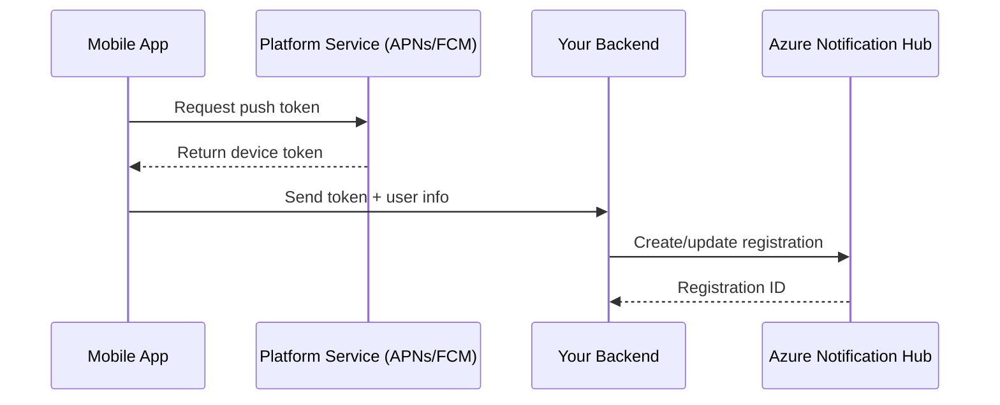

# How to Set Up Azure Notification Hubs for Cross-Platform Push Notifications in Mobile Apps

Author: [nawazdhandala](https://www.github.com/nawazdhandala)

Tags: Azure, Notification Hubs, Push Notifications, Mobile Development, Cross-Platform

Description: Learn how to set up Azure Notification Hubs to deliver cross-platform push notifications to iOS, Android, and Windows mobile apps from a single backend.

---

Push notifications are one of those features that sound simple until you actually try to build them for multiple platforms. Each platform - Apple Push Notification Service (APNs), Firebase Cloud Messaging (FCM), Windows Notification Service (WNS) - has its own protocol, authentication mechanism, and payload format. If you are building a mobile app that targets iOS, Android, and Windows, you quickly end up writing three different notification pipelines. Azure Notification Hubs solves this by providing a unified abstraction layer that handles platform-specific details for you.

In this guide, I will walk through setting up Azure Notification Hubs from scratch, registering devices, and sending your first cross-platform push notification.

## Why Azure Notification Hubs

Before we dig into the setup, let me explain why Notification Hubs is worth using over rolling your own solution. The core problem with push notifications at scale is device registration management. Every time a user installs your app, the device gets a platform-specific token. These tokens change over time - APNs tokens rotate, FCM tokens can expire. You need to maintain a registry of all active tokens and route messages to the correct platform notification service.

Azure Notification Hubs handles all of this. It manages device registrations, deduplicates tokens, handles token refresh, and provides a single API for sending to all platforms. It also supports tagging, which lets you target specific user segments without building your own routing logic.

The free tier supports up to 1 million pushes per month and 500 active devices, which is enough for development and small apps.

## Creating the Notification Hub

Start by creating a Notification Hub namespace and hub in the Azure portal. You can also do this via the Azure CLI.

The following CLI commands create a resource group, a Notification Hubs namespace, and a hub inside that namespace.

```bash
# Create a resource group in East US
az group create --name rg-notifications --location eastus

# Create a Notification Hubs namespace (must be globally unique)
az notification-hub namespace create \
  --resource-group rg-notifications \
  --name my-app-notifications-ns \
  --location eastus \
  --sku Free

# Create a notification hub inside the namespace
az notification-hub create \
  --resource-group rg-notifications \
  --namespace-name my-app-notifications-ns \
  --name my-app-hub
```

Once the hub is created, you need to configure each platform notification service you plan to support.

## Configuring APNs for iOS

Apple Push Notification Service requires either a certificate or token-based authentication. Token-based auth is the recommended approach because it does not expire the way certificates do.

You will need an Apple Developer account. Go to the Apple Developer portal, create a key for APNs, and download the .p8 file. You will also need the Key ID and your Team ID.

```bash
# Configure APNs credentials on the notification hub
az notification-hub credential apns update \
  --resource-group rg-notifications \
  --namespace-name my-app-notifications-ns \
  --notification-hub-name my-app-hub \
  --apns-certificate "/path/to/key.p8" \
  --key-id YOUR_KEY_ID \
  --app-id YOUR_BUNDLE_ID \
  --token
```

Set the endpoint to `gateway.sandbox.push.apple.com` for development and `gateway.push.apple.com` for production.

## Configuring FCM for Android

For Android, you need a Firebase project. Go to the Firebase Console, create a project (or use an existing one), and navigate to Project Settings. Under Cloud Messaging, you will find your Server Key and Sender ID.

```bash
# Configure FCM (GCM) credentials
az notification-hub credential gcm update \
  --resource-group rg-notifications \
  --namespace-name my-app-notifications-ns \
  --notification-hub-name my-app-hub \
  --google-api-key YOUR_SERVER_KEY
```

Note that Azure Notification Hubs still refers to this as GCM in some APIs, but it works with FCM. Google has maintained backward compatibility.

## Configuring WNS for Windows

For Windows apps, register your app in the Windows Dev Center. You will get a Package SID and a Client Secret.

```bash
# Configure WNS credentials
az notification-hub credential wns update \
  --resource-group rg-notifications \
  --namespace-name my-app-notifications-ns \
  --notification-hub-name my-app-hub \
  --package-sid YOUR_PACKAGE_SID \
  --secret-key YOUR_CLIENT_SECRET
```

## Registering Devices from Your Mobile App

Each mobile app needs to register with Notification Hubs on launch. The flow looks like this: the app gets a platform-specific push token from APNs/FCM/WNS, then sends that token to your backend, which registers it with the notification hub.

Here is a simplified flow of what happens.



On the backend side, you use the Azure Notification Hubs SDK to create a registration. Here is an example using the .NET SDK.

```csharp
// Install: dotnet add package Microsoft.Azure.NotificationHubs
using Microsoft.Azure.NotificationHubs;

// Create the hub client with the connection string from Azure portal
var hub = NotificationHubClient.CreateClientFromConnectionString(
    "Endpoint=sb://my-app-notifications-ns.servicebus.windows.net/;SharedAccessKeyName=DefaultFullSharedAccessSignature;SharedAccessKey=YOUR_KEY",
    "my-app-hub"
);

// Register an iOS device
public async Task<string> RegisterIosDevice(string deviceToken, string userId)
{
    // Create an APNs native registration with tags
    var registration = new AppleRegistrationDescription(deviceToken);
    registration.Tags = new HashSet<string> { $"user:{userId}", "platform:ios" };

    var result = await hub.CreateOrUpdateRegistrationAsync(registration);
    return result.RegistrationId;
}

// Register an Android device
public async Task<string> RegisterAndroidDevice(string fcmToken, string userId)
{
    // Create an FCM native registration with tags
    var registration = new FcmRegistrationDescription(fcmToken);
    registration.Tags = new HashSet<string> { $"user:{userId}", "platform:android" };

    var result = await hub.CreateOrUpdateRegistrationAsync(registration);
    return result.RegistrationId;
}
```

The tags I am adding here (like `user:123` and `platform:ios`) become really important when you want to target specific users or platforms.

## Sending Cross-Platform Notifications

Now for the fun part - sending notifications. You can send platform-specific payloads or use templates to send a single message that gets adapted for each platform.

Here is how to send a notification to all iOS devices.

```csharp
// Send a notification to all iOS devices
var iosPayload = @"{""aps"":{""alert"":""You have a new message!"",""sound"":""default""}}";
await hub.SendAppleNativeNotificationAsync(iosPayload);

// Send a notification to all Android devices
var androidPayload = @"{""notification"":{""title"":""New Message"",""body"":""You have a new message!""}}";
await hub.SendFcmNativeNotificationAsync(androidPayload);
```

To send to a specific user across all their devices (regardless of platform), use tag expressions.

```csharp
// Send to a specific user on all their devices
var iosPayload = @"{""aps"":{""alert"":""Your order has shipped!"",""sound"":""default""}}";
var androidPayload = @"{""notification"":{""title"":""Order Update"",""body"":""Your order has shipped!""}}";

// The tag expression targets all devices registered with this user tag
await hub.SendAppleNativeNotificationAsync(iosPayload, "user:456");
await hub.SendFcmNativeNotificationAsync(androidPayload, "user:456");
```

## Monitoring and Debugging

Azure Notification Hubs provides telemetry through the Azure portal. You can see metrics like successful sends, failed sends, and registration counts. For debugging, enable per-message telemetry.

```csharp
// Enable per-message telemetry for debugging
var outcome = await hub.SendAppleNativeNotificationAsync(iosPayload, "user:456");

// Check the notification outcome
if (outcome.State == NotificationOutcomeState.Completed)
{
    // Get detailed results
    var results = await hub.GetNotificationOutcomeDetailsAsync(outcome.NotificationId);
    Console.WriteLine($"Success: {results.Success}, Failure: {results.Failure}");
}
```

Common issues include expired device tokens (Notification Hubs handles cleanup automatically), incorrect platform credentials, and payload format errors. The Test Send feature in the Azure portal is invaluable for validating your setup before writing code.

## Scaling Considerations

The free tier is fine for development, but production apps should use the Basic or Standard tier. The Standard tier adds features like scheduled sends, rich telemetry, and multi-tenancy support. It also increases the active device limit.

For high-throughput scenarios, Notification Hubs can handle millions of pushes in under a minute. The service automatically scales, but you should batch your sends using the `SendNotificationAsync` method with tag expressions rather than sending one-by-one.

## Wrapping Up

Azure Notification Hubs takes the pain out of cross-platform push notifications. Instead of maintaining separate connections to APNs, FCM, and WNS, you get a single registration API and a unified sending interface. The tagging system is particularly powerful for targeting user segments without building your own routing. If you are building a mobile app that needs to reach users on multiple platforms, this is one of the easier Azure services to get started with and one that scales well as your user base grows.
