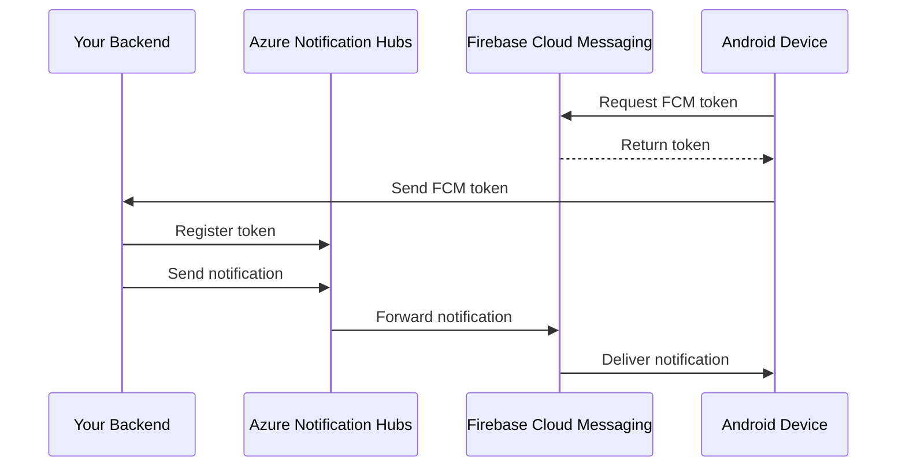

# How to Configure Azure Notification Hubs with Firebase Cloud Messaging for Android Apps

Author: [nawazdhandala](https://www.github.com/nawazdhandala)

Tags: Azure, Notification Hubs, Firebase, FCM, Android, Push Notifications

Description: Step-by-step guide to configuring Azure Notification Hubs with Firebase Cloud Messaging to send push notifications to Android apps.

---

If you are building an Android app and want to send push notifications through Azure Notification Hubs, you need Firebase Cloud Messaging (FCM) as the transport layer. Azure does not talk directly to Android devices - it sends messages through Google's FCM service, which then delivers them to the device. Setting this up correctly involves configuring Firebase, linking it to Azure Notification Hubs, and writing the client-side code to handle incoming messages.

This guide walks through the entire setup, from creating a Firebase project to receiving your first notification on an Android device.

## How the Flow Works

Before jumping into configuration, it helps to understand the full message flow.



Your backend sends a notification to Azure Notification Hubs. Notification Hubs translates it into an FCM-compatible payload and sends it to Google's servers. FCM then delivers it to the specific device using the FCM token.

## Setting Up Firebase

Start by creating a Firebase project if you do not have one already.

1. Go to the Firebase Console at console.firebase.google.com
2. Click "Add project" and give it a name
3. Follow the setup wizard (you can skip Google Analytics for now)
4. Once created, click the gear icon next to "Project Overview" and select "Project settings"

You need two things from Firebase: the Server Key (or better, a service account JSON for FCM v1) and the google-services.json file for your Android app.

### Getting FCM Credentials

Firebase has moved from legacy FCM to FCM v1 API. Azure Notification Hubs now supports both, but I recommend using FCM v1 as Google will eventually deprecate the legacy API.

For FCM v1, you need a service account JSON file:

1. In Firebase Console, go to Project Settings
2. Navigate to the "Service accounts" tab
3. Click "Generate new private key"
4. Download and save the JSON file securely

For the legacy API (still supported but not recommended for new projects):

1. In Firebase Console, go to Project Settings
2. Navigate to the "Cloud Messaging" tab
3. Copy the Server Key

## Configuring Azure Notification Hubs

Now link Firebase to your Azure Notification Hub. You can do this through the Azure portal or CLI.

### Using the Azure Portal

1. Navigate to your Notification Hub in the Azure portal
2. Under "Settings", click "Google (GCM/FCM)"
3. For FCM v1, select "FCM v1" and paste the contents of your service account JSON
4. For legacy, paste the Server Key in the API Key field
5. Click Save

### Using the Azure CLI

```bash
# For legacy FCM (GCM) - using the server key
az notification-hub credential gcm update \
  --resource-group rg-notifications \
  --namespace-name my-notifications-ns \
  --notification-hub-name my-hub \
  --google-api-key "YOUR_FCM_SERVER_KEY"
```

For FCM v1 configuration, the portal is currently the easier option as CLI support for v1 credentials is still maturing.

## Setting Up the Android App

Add Firebase to your Android project. In your app-level `build.gradle`, add the Firebase dependencies.

```groovy
// app/build.gradle
plugins {
    id 'com.android.application'
    id 'com.google.gms.google-services'  // Firebase plugin
}

dependencies {
    // Firebase Cloud Messaging
    implementation 'com.google.firebase:firebase-messaging:23.4.0'

    // Azure Notification Hubs SDK for Android
    implementation 'com.microsoft.azure:notification-hubs-android-sdk:2.0.0'

    // Required for hub registration
    implementation 'com.google.firebase:firebase-core:21.1.1'
}
```

Also add the Google services plugin to your project-level `build.gradle`.

```groovy
// project-level build.gradle
buildscript {
    dependencies {
        classpath 'com.google.gms:google-services:4.4.0'
    }
}
```

Place the `google-services.json` file you downloaded from Firebase into the `app/` directory of your Android project.

## Registering with Notification Hubs

The Android app needs to get an FCM token and register it with Azure Notification Hubs. The Notification Hubs Android SDK handles most of this.

First, configure the hub connection in your Application class.

```java
// MyApplication.java
import com.microsoft.windowsazure.messaging.notificationhubs.NotificationHub;
import android.app.Application;

public class MyApplication extends Application {

    @Override
    public void onCreate() {
        super.onCreate();

        // Initialize Notification Hubs with your hub name and connection string
        // Use the "Listen" access policy connection string (not Full)
        NotificationHub.start(
            this,
            "my-hub",  // Hub name
            "Endpoint=sb://my-notifications-ns.servicebus.windows.net/;SharedAccessKeyName=DefaultListenSharedAccessSignature;SharedAccessKey=YOUR_LISTEN_KEY"
        );

        // Optionally add tags for targeting
        NotificationHub.addTag("topic:general");
        NotificationHub.addTag("platform:android");
    }
}
```

Add user-specific tags after authentication.

```java
// After user logs in
public void onUserLoggedIn(String userId) {
    NotificationHub.addTag("user:" + userId);

    // Set the user ID for installation-based targeting
    NotificationHub.setUserId(userId);
}
```

## Handling Incoming Notifications

Create a service that extends `FirebaseMessagingService` to handle incoming messages.

```java
// MyFirebaseService.java
import com.google.firebase.messaging.FirebaseMessagingService;
import com.google.firebase.messaging.RemoteMessage;
import android.app.NotificationChannel;
import android.app.NotificationManager;
import android.os.Build;
import androidx.core.app.NotificationCompat;

public class MyFirebaseService extends FirebaseMessagingService {

    private static final String CHANNEL_ID = "default_channel";

    @Override
    public void onCreate() {
        super.onCreate();
        createNotificationChannel();
    }

    // Called when a message is received while the app is in the foreground
    @Override
    public void onMessageReceived(RemoteMessage remoteMessage) {
        super.onMessageReceived(remoteMessage);

        String title = "Notification";
        String body = "";

        // Check for notification payload
        if (remoteMessage.getNotification() != null) {
            title = remoteMessage.getNotification().getTitle();
            body = remoteMessage.getNotification().getBody();
        }

        // Check for data payload (custom key-value pairs)
        if (remoteMessage.getData().size() > 0) {
            handleDataPayload(remoteMessage.getData());
        }

        // Show the notification
        showNotification(title, body);
    }

    // Called when the FCM token is refreshed
    @Override
    public void onNewToken(String token) {
        super.onNewToken(token);
        // The Notification Hubs SDK handles token refresh automatically
        // but you can add custom logic here if needed
    }

    private void handleDataPayload(java.util.Map<String, String> data) {
        // Process custom data from the notification
        String type = data.get("type");
        String payload = data.get("payload");

        // Route based on notification type
        if ("order_update".equals(type)) {
            // Handle order update
        } else if ("chat_message".equals(type)) {
            // Handle chat message
        }
    }

    private void showNotification(String title, String body) {
        NotificationManager manager =
            (NotificationManager) getSystemService(NOTIFICATION_SERVICE);

        NotificationCompat.Builder builder = new NotificationCompat.Builder(this, CHANNEL_ID)
            .setSmallIcon(R.drawable.ic_notification)
            .setContentTitle(title)
            .setContentText(body)
            .setPriority(NotificationCompat.PRIORITY_HIGH)
            .setAutoCancel(true);

        manager.notify((int) System.currentTimeMillis(), builder.build());
    }

    // Required for Android 8.0+ (API 26)
    private void createNotificationChannel() {
        if (Build.VERSION.SDK_INT >= Build.VERSION_CODES.O) {
            NotificationChannel channel = new NotificationChannel(
                CHANNEL_ID,
                "Default Notifications",
                NotificationManager.IMPORTANCE_HIGH
            );
            channel.setDescription("Default notification channel");

            NotificationManager manager = getSystemService(NotificationManager.class);
            manager.createNotificationChannel(channel);
        }
    }
}
```

Register the service in your AndroidManifest.xml.

```xml
<!-- AndroidManifest.xml -->
<application>
    <service
        android:name=".MyFirebaseService"
        android:exported="false">
        <intent-filter>
            <action android:name="com.google.firebase.MESSAGING_EVENT" />
        </intent-filter>
    </service>
</application>
```

## Sending Notifications from Your Backend

With everything configured, you can send notifications from your backend. Here is a .NET example that sends a notification specifically formatted for FCM.

```csharp
var hub = NotificationHubClient.CreateClientFromConnectionString(
    connectionString, hubName);

// Send an FCM notification payload
var fcmPayload = @"{
    ""notification"": {
        ""title"": ""New Order"",
        ""body"": ""You have a new order #12345""
    },
    ""data"": {
        ""type"": ""order_update"",
        ""orderId"": ""12345"",
        ""status"": ""new""
    }
}";

// Send to a specific user's Android devices
await hub.SendFcmNativeNotificationAsync(fcmPayload, "user:789");
```

## Testing the Setup

The Azure portal provides a Test Send feature that is perfect for verifying your configuration. Go to your Notification Hub, click "Test Send", select Google (GCM) as the platform, and paste your FCM payload. If everything is configured correctly, you should see the notification arrive on your Android device within seconds.

Common issues to watch for include incorrect google-services.json placement, using the wrong connection string (use the Listen policy for the client, Full for the backend), and missing the notification channel setup on Android 8.0 and above.

## Wrapping Up

The integration between Azure Notification Hubs and Firebase Cloud Messaging is straightforward once you have the credential exchange configured correctly. Firebase handles the device delivery, Azure handles the registration management and targeting, and your backend just needs to know the Notification Hubs API. The key takeaway is to use FCM v1 credentials for new projects, handle token refresh gracefully, and make sure your Android notification channels are set up properly for modern Android versions.
