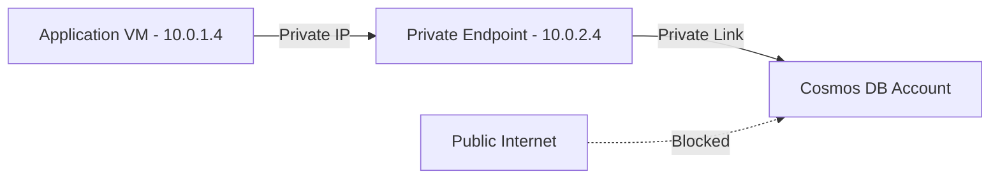

# How to Set Up Azure Private Endpoint for Azure Cosmos DB

Author: [nawazdhandala](https://www.github.com/nawazdhandala)

Tags: Azure, Private Endpoint, Cosmos DB, Private Link, Networking, Security, Database

Description: Secure your Azure Cosmos DB account by configuring private endpoints to eliminate public internet exposure and keep traffic on the Azure backbone.

---

Azure Cosmos DB is a powerful globally distributed database, but by default, it is accessible over the public internet. For production workloads handling sensitive data, that is not acceptable. You want your database traffic to stay on the Azure backbone network, never touching the public internet. Azure Private Endpoint makes this possible by projecting Cosmos DB into your virtual network with a private IP address.

In this guide, I will walk through setting up a private endpoint for Azure Cosmos DB, configuring DNS resolution, disabling public access, and verifying the setup end to end.

## How Private Endpoints Work

A private endpoint is a network interface with a private IP address from your VNet's address space. It connects you to an Azure service through Azure Private Link. When you create a private endpoint for Cosmos DB, traffic between your VNet and Cosmos DB travels over the Microsoft backbone network.



From your application's perspective, nothing changes. It still connects to `yourdb.documents.azure.com`. The difference is that DNS now resolves this to a private IP in your VNet instead of a public IP.

## Step 1: Create the Cosmos DB Account

If you already have a Cosmos DB account, skip to Step 2.

```bash
# Create a resource group
az group create \
  --name rg-cosmos-private \
  --location eastus

# Create a Cosmos DB account with SQL API
az cosmosdb create \
  --resource-group rg-cosmos-private \
  --name cosmosdb-myapp \
  --kind GlobalDocumentDB \
  --locations regionName=eastus failoverPriority=0 \
  --default-consistency-level Session
```

## Step 2: Create the Virtual Network and Subnet

Your private endpoint needs a subnet to deploy into. This subnet must have the `privateEndpointNetworkPolicies` setting disabled.

```bash
# Create a VNet for the application workload
az network vnet create \
  --resource-group rg-cosmos-private \
  --name vnet-app \
  --address-prefix 10.0.0.0/16 \
  --subnet-name snet-app \
  --subnet-prefix 10.0.1.0/24

# Create a subnet specifically for private endpoints
# Disable network policies so private endpoints can be deployed here
az network vnet subnet create \
  --resource-group rg-cosmos-private \
  --vnet-name vnet-app \
  --name snet-private-endpoints \
  --address-prefix 10.0.2.0/24 \
  --disable-private-endpoint-network-policies true
```

The `--disable-private-endpoint-network-policies true` flag is important. Without it, NSG rules and UDRs could interfere with private endpoint traffic.

## Step 3: Create the Private Endpoint

Now create the private endpoint that connects your VNet to Cosmos DB.

```bash
# Get the Cosmos DB account resource ID
COSMOS_ID=$(az cosmosdb show \
  --resource-group rg-cosmos-private \
  --name cosmosdb-myapp \
  --query id \
  --output tsv)

# Create a private endpoint for Cosmos DB SQL API
# The group-id "Sql" targets the SQL API endpoint
az network private-endpoint create \
  --resource-group rg-cosmos-private \
  --name pe-cosmosdb \
  --vnet-name vnet-app \
  --subnet snet-private-endpoints \
  --private-connection-resource-id $COSMOS_ID \
  --group-id Sql \
  --connection-name connection-cosmosdb
```

The `--group-id` parameter specifies which Cosmos DB API endpoint you are connecting to. The options are:

- `Sql` for the SQL (Core) API
- `MongoDB` for the MongoDB API
- `Cassandra` for the Cassandra API
- `Gremlin` for the Gremlin API
- `Table` for the Table API

If your Cosmos DB account uses the MongoDB API, change the group-id accordingly.

## Step 4: Configure Private DNS Zone

This is the part that people often get wrong. For the private endpoint to work transparently, DNS needs to resolve the Cosmos DB hostname to the private IP. Azure Private DNS zones handle this.

```bash
# Create a private DNS zone for Cosmos DB
az network private-dns zone create \
  --resource-group rg-cosmos-private \
  --name "privatelink.documents.azure.com"

# Link the DNS zone to your VNet so VMs in the VNet use it
az network private-dns link vnet create \
  --resource-group rg-cosmos-private \
  --zone-name "privatelink.documents.azure.com" \
  --name link-vnet-app \
  --virtual-network vnet-app \
  --registration-enabled false
```

Now create the DNS records that point the Cosmos DB hostname to the private endpoint's IP.

```bash
# Create a DNS zone group that auto-manages DNS records for the private endpoint
az network private-endpoint dns-zone-group create \
  --resource-group rg-cosmos-private \
  --endpoint-name pe-cosmosdb \
  --name zonegroupname \
  --private-dns-zone "privatelink.documents.azure.com" \
  --zone-name cosmosdb
```

The DNS zone group automatically creates the A records needed. After this, any VM in the linked VNet will resolve `cosmosdb-myapp.documents.azure.com` to the private endpoint's IP address (something like 10.0.2.4) instead of the public IP.

## Step 5: Disable Public Network Access

With the private endpoint in place, you should disable public access to the Cosmos DB account. This ensures that the database is only reachable through the private endpoint.

```bash
# Disable public network access to the Cosmos DB account
az cosmosdb update \
  --resource-group rg-cosmos-private \
  --name cosmosdb-myapp \
  --public-network-access Disabled
```

After this change, any attempt to connect to the Cosmos DB account from outside the VNet will fail. This includes connections from the Azure portal data explorer, so plan accordingly.

If you need portal access for management, you can keep public access enabled but restrict it to specific IP ranges.

```bash
# Alternative: allow public access only from your office IP
az cosmosdb update \
  --resource-group rg-cosmos-private \
  --name cosmosdb-myapp \
  --public-network-access Enabled \
  --ip-range-filter "203.0.113.50"
```

## Step 6: Verify the Setup

Let us verify that everything is working. First, check the private endpoint connection status.

```bash
# Check private endpoint connection status - should show "Approved"
az network private-endpoint show \
  --resource-group rg-cosmos-private \
  --name pe-cosmosdb \
  --query "privateLinkServiceConnections[0].privateLinkServiceConnectionState.status" \
  --output tsv
```

This should return "Approved". If it says "Pending", the Cosmos DB account has not auto-approved the connection.

Next, verify DNS resolution from a VM in the VNet.

```bash
# From a VM in the VNet, check DNS resolution
# Should resolve to a private IP (10.0.2.x) not a public IP
nslookup cosmosdb-myapp.documents.azure.com
```

The response should show the private IP address assigned to the private endpoint. If it still resolves to a public IP, the DNS zone linking is not working correctly.

## Working with Multiple Regions

If your Cosmos DB account has replicas in multiple regions, you need a private endpoint in each region where your applications are deployed.

```bash
# Create a private endpoint in West US for the same Cosmos DB account
az network private-endpoint create \
  --resource-group rg-cosmos-private \
  --name pe-cosmosdb-westus \
  --vnet-name vnet-app-westus \
  --subnet snet-private-endpoints \
  --private-connection-resource-id $COSMOS_ID \
  --group-id Sql \
  --connection-name connection-cosmosdb-westus \
  --location westus
```

Each regional private endpoint gets its own private IP, and the DNS records are set up so that applications in each region connect through their local private endpoint.

## Handling Cosmos DB SDK Connection

When using the Cosmos DB SDK with private endpoints, set the connection mode to Direct (which is the default for .NET SDK v3+). Direct mode works well with private endpoints because it resolves the gateway and data endpoints to private IPs.

Here is a quick C# example showing the SDK configuration.

```csharp
// Configure Cosmos DB client for private endpoint connectivity
// Direct mode provides better performance with private endpoints
var cosmosClient = new CosmosClient(
    "https://cosmosdb-myapp.documents.azure.com:443/",
    "<your-primary-key>",
    new CosmosClientOptions
    {
        // Direct mode is recommended for private endpoints
        ConnectionMode = ConnectionMode.Direct,
        // Set the preferred region to minimize latency
        ApplicationPreferredRegions = new List<string> { "East US" }
    }
);
```

## Troubleshooting Common Issues

**Connection timeouts**: If your application cannot connect after setting up the private endpoint, check DNS resolution first. The most common issue is that DNS is still resolving to the public IP. Verify the private DNS zone is linked to the correct VNet.

**Pending connection state**: If the private endpoint shows "Pending" status, the Cosmos DB account may require manual approval. Check the network settings of the Cosmos DB account in the portal and approve the pending connection.

**Portal data explorer not working**: If you disabled public access, the Azure portal cannot reach the data explorer. You can either re-enable public access with IP filtering for your client IP, or use Azure Bastion to connect to a VM in the VNet and access the portal from there.

**Cross-region issues**: Applications in a region without a private endpoint will not be able to reach Cosmos DB through the private endpoint in another region (unless VNet peering is configured). Make sure you have private endpoints in every region where your application runs.

Private endpoints for Cosmos DB give you the best combination of security and simplicity. Your connection strings stay the same, your SDK configuration barely changes, and your database traffic never leaves the Azure network. It is one of those setups where the security benefit is high and the implementation cost is low.
