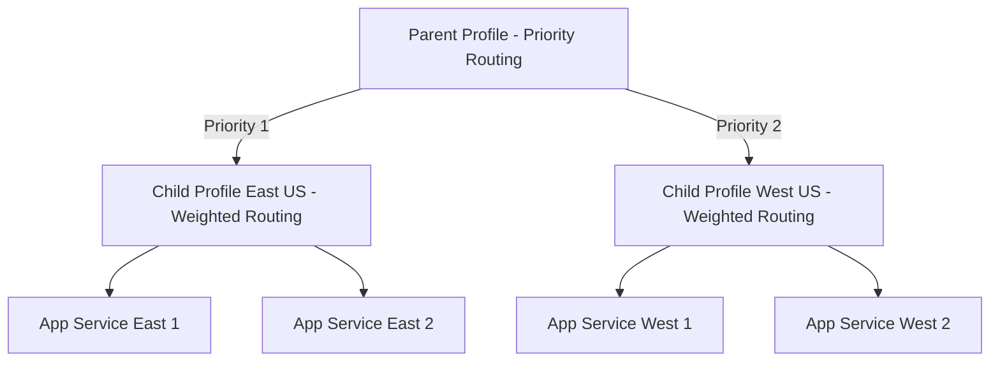
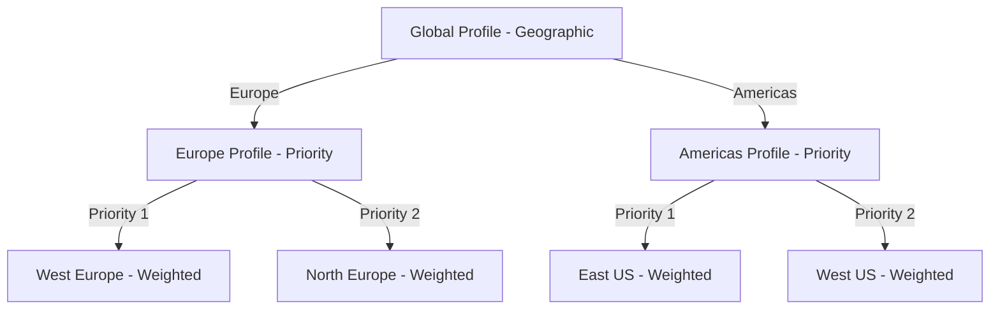

# How to Configure Azure Traffic Manager Nested Profiles for Multi-Region Failover

Author: [nawazdhandala](https://www.github.com/nawazdhandala)

Tags: Azure, Traffic Manager, Nested Profiles, Multi-Region, Failover, DNS, High Availability

Description: Set up Azure Traffic Manager with nested profiles to implement multi-region failover with granular routing and health monitoring.

---

Azure Traffic Manager is a DNS-based traffic routing service. It works well for simple failover scenarios, but when you need more sophisticated routing logic - like combining priority-based failover between regions with performance-based routing within regions - you need nested profiles. Nested profiles let you chain Traffic Manager profiles together, where a child profile acts as an endpoint in a parent profile.

This guide covers how to set up a nested Traffic Manager configuration for multi-region failover with load balancing within each region.

## Why Nested Profiles?

A single Traffic Manager profile supports one routing method: priority, weighted, performance, geographic, or multivalue. But real-world architectures often need combinations. For example:

- Priority routing between regions (primary in East US, failover to West US)
- Performance routing within each region (multiple endpoints, route to the fastest one)
- Geographic routing at the top level, with weighted distribution within each geographic group

Nested profiles solve this by letting you use different routing methods at different levels of the hierarchy.



In this setup, the parent profile uses priority routing to prefer East US. If all endpoints in East US fail, it falls over to West US. Within each region, a child profile uses weighted routing to distribute traffic across multiple app instances.

## Step 1: Create the Child Profiles

Start with the child profiles - one per region. These handle the routing within each region.

```bash
# Create a resource group for Traffic Manager profiles
az group create \
  --name rg-traffic-manager \
  --location eastus

# Create the East US child profile with weighted routing
az network traffic-manager profile create \
  --resource-group rg-traffic-manager \
  --name tm-child-eastus \
  --routing-method Weighted \
  --unique-dns-name tm-child-eastus-myapp \
  --ttl 30 \
  --protocol HTTPS \
  --port 443 \
  --path "/health" \
  --interval 10 \
  --timeout 5 \
  --max-failures 3
```

The health check parameters matter a lot here. We set a 10-second probe interval with a 5-second timeout and 3 tolerated failures. That means a failing endpoint is detected in about 30 seconds.

```bash
# Create the West US child profile with weighted routing
az network traffic-manager profile create \
  --resource-group rg-traffic-manager \
  --name tm-child-westus \
  --routing-method Weighted \
  --unique-dns-name tm-child-westus-myapp \
  --ttl 30 \
  --protocol HTTPS \
  --port 443 \
  --path "/health" \
  --interval 10 \
  --timeout 5 \
  --max-failures 3
```

## Step 2: Add Endpoints to Child Profiles

Add your actual application endpoints to each child profile.

```bash
# Add App Service endpoints to the East US child profile
az network traffic-manager endpoint create \
  --resource-group rg-traffic-manager \
  --profile-name tm-child-eastus \
  --type azureEndpoints \
  --name app-east-1 \
  --target-resource-id $(az webapp show -g rg-app-eastus -n app-east-1 --query id -o tsv) \
  --weight 50 \
  --endpoint-status Enabled

az network traffic-manager endpoint create \
  --resource-group rg-traffic-manager \
  --profile-name tm-child-eastus \
  --type azureEndpoints \
  --name app-east-2 \
  --target-resource-id $(az webapp show -g rg-app-eastus -n app-east-2 --query id -o tsv) \
  --weight 50 \
  --endpoint-status Enabled

# Add App Service endpoints to the West US child profile
az network traffic-manager endpoint create \
  --resource-group rg-traffic-manager \
  --profile-name tm-child-westus \
  --type azureEndpoints \
  --name app-west-1 \
  --target-resource-id $(az webapp show -g rg-app-westus -n app-west-1 --query id -o tsv) \
  --weight 50 \
  --endpoint-status Enabled

az network traffic-manager endpoint create \
  --resource-group rg-traffic-manager \
  --profile-name tm-child-westus \
  --type azureEndpoints \
  --name app-west-2 \
  --target-resource-id $(az webapp show -g rg-app-westus -n app-west-2 --query id -o tsv) \
  --weight 50 \
  --endpoint-status Enabled
```

## Step 3: Create the Parent Profile

The parent profile orchestrates failover between regions using priority routing.

```bash
# Create the parent profile with priority routing for regional failover
az network traffic-manager profile create \
  --resource-group rg-traffic-manager \
  --name tm-parent-global \
  --routing-method Priority \
  --unique-dns-name myapp-global \
  --ttl 30 \
  --protocol HTTPS \
  --port 443 \
  --path "/health" \
  --interval 10 \
  --timeout 5 \
  --max-failures 3
```

## Step 4: Add Child Profiles as Nested Endpoints

This is where the nesting happens. You add the child profiles as endpoints in the parent profile.

```bash
# Get the child profile IDs
CHILD_EASTUS_ID=$(az network traffic-manager profile show \
  --resource-group rg-traffic-manager \
  --name tm-child-eastus \
  --query id \
  --output tsv)

CHILD_WESTUS_ID=$(az network traffic-manager profile show \
  --resource-group rg-traffic-manager \
  --name tm-child-westus \
  --query id \
  --output tsv)

# Add East US child as the primary (priority 1) nested endpoint
az network traffic-manager endpoint create \
  --resource-group rg-traffic-manager \
  --profile-name tm-parent-global \
  --type nestedEndpoints \
  --name region-eastus \
  --target-resource-id $CHILD_EASTUS_ID \
  --priority 1 \
  --min-child-endpoints 1 \
  --min-child-ipv4 1 \
  --endpoint-status Enabled

# Add West US child as the failover (priority 2) nested endpoint
az network traffic-manager endpoint create \
  --resource-group rg-traffic-manager \
  --profile-name tm-parent-global \
  --type nestedEndpoints \
  --name region-westus \
  --target-resource-id $CHILD_WESTUS_ID \
  --priority 2 \
  --min-child-endpoints 1 \
  --min-child-ipv4 1 \
  --endpoint-status Enabled
```

The `--min-child-endpoints 1` parameter is critical. It tells the parent profile: "Consider this nested endpoint healthy only if at least 1 child endpoint within it is healthy." If both endpoints in the East US child profile go down, the parent sees the East US region as unhealthy and fails over to West US.

You can adjust this threshold. Setting it to 2 would mean both endpoints in a region must be healthy for the region to be considered available.

## Step 5: Configure DNS

Point your application's domain to the parent Traffic Manager profile.

```bash
# Create a CNAME record pointing your domain to the parent profile
# This example uses Azure DNS, but works with any DNS provider
az network dns record-set cname set-record \
  --resource-group rg-dns \
  --zone-name example.com \
  --record-set-name app \
  --cname myapp-global.trafficmanager.net
```

Users hitting `app.example.com` now go through the parent profile, which routes to the appropriate regional child profile.

## Testing the Failover

Verify the configuration by checking the profile status and simulating failures.

```bash
# Check the status of all nested endpoints
az network traffic-manager endpoint list \
  --resource-group rg-traffic-manager \
  --profile-name tm-parent-global \
  --output table

# Check the status of endpoints in the East US child profile
az network traffic-manager endpoint list \
  --resource-group rg-traffic-manager \
  --profile-name tm-child-eastus \
  --output table
```

To simulate a failover, you can disable the endpoints in the East US child profile.

```bash
# Disable all East US endpoints to simulate regional failure
az network traffic-manager endpoint update \
  --resource-group rg-traffic-manager \
  --profile-name tm-child-eastus \
  --type azureEndpoints \
  --name app-east-1 \
  --endpoint-status Disabled

az network traffic-manager endpoint update \
  --resource-group rg-traffic-manager \
  --profile-name tm-child-eastus \
  --type azureEndpoints \
  --name app-east-2 \
  --endpoint-status Disabled
```

After disabling both East US endpoints, DNS queries for the parent profile should now return the West US child profile's endpoints. You can verify with dig or nslookup.

```bash
# Verify DNS resolution now points to West US
dig app.example.com
```

Remember to re-enable the endpoints after testing.

## Monitoring Nested Profiles

Set up alerts to be notified when failover happens.

```bash
# Create an alert for when an endpoint becomes degraded
az monitor metrics alert create \
  --resource-group rg-traffic-manager \
  --name alert-tm-endpoint-degraded \
  --scopes $(az network traffic-manager profile show \
    -g rg-traffic-manager -n tm-parent-global --query id -o tsv) \
  --condition "avg ProbeAgentCurrentEndpointStateByProfileResourceId < 1" \
  --window-size 5m \
  --evaluation-frequency 1m \
  --severity 2 \
  --description "Traffic Manager endpoint health degraded"
```

## TTL Considerations

Traffic Manager works through DNS, so the TTL (Time to Live) on DNS records directly affects how fast failover happens. We set the TTL to 30 seconds in our configuration, which means:

- DNS resolvers cache the response for 30 seconds
- When a failover happens, it takes up to 30 seconds for clients to get the new endpoint
- Lower TTL = faster failover but more DNS queries (slightly higher latency)
- Higher TTL = slower failover but fewer DNS queries

For production systems where fast failover is critical, a TTL of 10-30 seconds is common. For less critical services, 60-300 seconds is reasonable.

## Three-Tier Nesting Example

You can nest up to three levels deep. Here is an example with geographic routing at the top, priority routing in the middle, and weighted routing at the bottom.



This gives you geographic affinity at the top level, regional failover in the middle, and load distribution at the bottom.

Nested Traffic Manager profiles give you the flexibility to build sophisticated multi-region routing strategies. The key is planning your hierarchy upfront - decide which routing method goes at which level, set appropriate health check thresholds, and test your failover scenarios before you need them in production.
