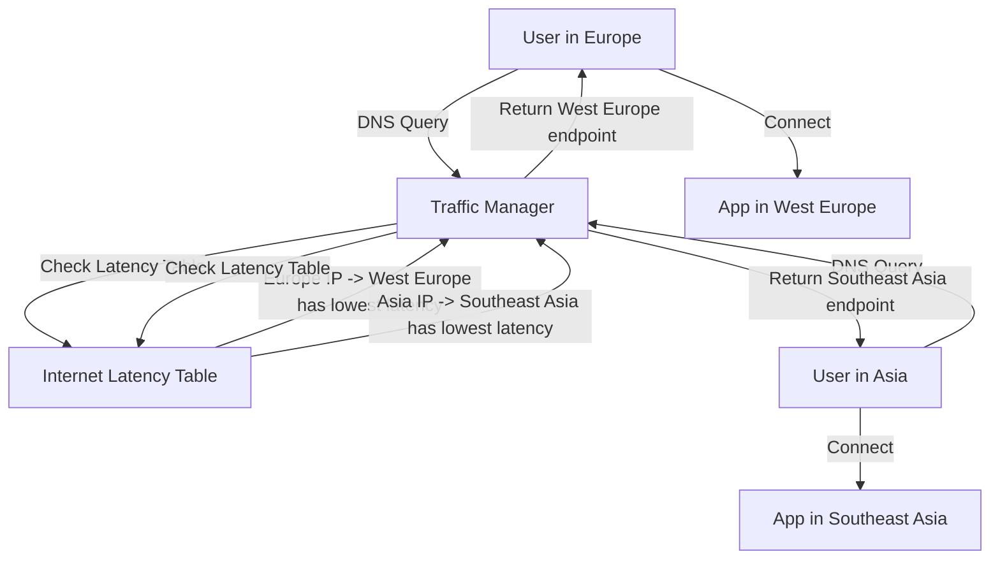

# How to Set Up Azure Traffic Manager with Performance Routing for Latency-Based Routing

Author: [nawazdhandala](https://www.github.com/nawazdhandala)

Tags: Azure, Traffic Manager, Performance Routing, Latency, DNS, Global Routing, Multi-Region

Description: Configure Azure Traffic Manager with performance routing to automatically direct users to the lowest-latency endpoint for their geographic location.

---

When you deploy an application across multiple Azure regions, you want users to connect to the closest region. Not the geographically closest - the one with the lowest network latency. A user in London might get better latency to a server in Amsterdam than one in Dublin, depending on the network path.

Azure Traffic Manager's performance routing method handles this automatically. It maintains an Internet Latency Table that maps IP address ranges to the Azure region with the lowest latency. When a DNS query comes in, Traffic Manager looks up the source IP, finds the best-performing endpoint, and returns its address.

In this post, I will walk through setting up Traffic Manager with performance routing, configuring endpoints across regions, and tuning the setup for optimal user experience.

## How Performance Routing Works

Traffic Manager does not measure latency in real-time for each user request. Instead, Microsoft maintains a global Internet Latency Table that tracks the round-trip time from IP ranges across the internet to each Azure region. This table is updated regularly based on measurements from Microsoft's global network.

When a DNS query arrives at Traffic Manager:

1. Traffic Manager identifies the source IP of the DNS resolver (not the end user)
2. It looks up the latency table to find which Azure region has the lowest latency for that IP range
3. It checks if the endpoint in that region is healthy
4. If healthy, it returns that endpoint's address
5. If unhealthy, it falls back to the next lowest-latency healthy endpoint



## Step 1: Create the Traffic Manager Profile

```bash
# Create a resource group
az group create \
  --name rg-tm-perf \
  --location eastus

# Create a Traffic Manager profile with performance routing
az network traffic-manager profile create \
  --resource-group rg-tm-perf \
  --name tm-myapp-perf \
  --routing-method Performance \
  --unique-dns-name myapp-perf \
  --ttl 30 \
  --protocol HTTPS \
  --port 443 \
  --path "/health" \
  --interval 10 \
  --timeout 5 \
  --max-failures 3
```

The routing method is set to `Performance`. The health probe parameters are aggressive (10-second intervals, 5-second timeout, 3 failures) to quickly detect and route around unhealthy endpoints.

## Step 2: Deploy Endpoints Across Regions

For performance routing to work well, you need endpoints in multiple Azure regions. The more regions you cover, the better the latency for users worldwide.

Let us add endpoints in three regions as an example.

```bash
# Add an endpoint in East US
az network traffic-manager endpoint create \
  --resource-group rg-tm-perf \
  --profile-name tm-myapp-perf \
  --type azureEndpoints \
  --name ep-eastus \
  --target-resource-id $(az webapp show \
    -g rg-app-eastus -n myapp-eastus --query id -o tsv) \
  --endpoint-status Enabled

# Add an endpoint in West Europe
az network traffic-manager endpoint create \
  --resource-group rg-tm-perf \
  --profile-name tm-myapp-perf \
  --type azureEndpoints \
  --name ep-westeurope \
  --target-resource-id $(az webapp show \
    -g rg-app-westeurope -n myapp-westeurope --query id -o tsv) \
  --endpoint-status Enabled

# Add an endpoint in Southeast Asia
az network traffic-manager endpoint create \
  --resource-group rg-tm-perf \
  --profile-name tm-myapp-perf \
  --type azureEndpoints \
  --name ep-southeastasia \
  --target-resource-id $(az webapp show \
    -g rg-app-sea -n myapp-sea --query id -o tsv) \
  --endpoint-status Enabled
```

## Step 3: Add External Endpoints

If you have servers outside of Azure (in your own data center or another cloud), you can add them as external endpoints. For performance routing, you must specify which Azure region the external endpoint is closest to.

```bash
# Add an external endpoint in an AWS region close to US West
az network traffic-manager endpoint create \
  --resource-group rg-tm-perf \
  --profile-name tm-myapp-perf \
  --type externalEndpoints \
  --name ep-aws-uswest \
  --target "myapp-uswest.example.com" \
  --endpoint-location "westus2" \
  --endpoint-status Enabled
```

The `--endpoint-location "westus2"` tells Traffic Manager to treat this endpoint as if it were in the West US 2 Azure region for latency table lookups. Users who would get the lowest latency to West US 2 will be directed to this endpoint.

## Step 4: Configure DNS

Point your domain to the Traffic Manager profile.

```bash
# Create a CNAME record for your subdomain
az network dns record-set cname set-record \
  --resource-group rg-dns \
  --zone-name example.com \
  --record-set-name "app" \
  --cname "myapp-perf.trafficmanager.net"

# For the zone apex, use an alias record
az network dns record-set a create \
  --resource-group rg-dns \
  --zone-name example.com \
  --name "@" \
  --target-resource $(az network traffic-manager profile show \
    -g rg-tm-perf -n tm-myapp-perf --query id -o tsv)
```

## Testing Performance Routing

Verify that Traffic Manager returns different endpoints based on the source location.

```bash
# Test from your current location
dig app.example.com

# Use Traffic Manager's test tool to simulate queries from different regions
# This shows which endpoint would be returned for a given source IP
az network traffic-manager profile show \
  --resource-group rg-tm-perf \
  --name tm-myapp-perf \
  --query "dnsConfig.fqdn" \
  --output tsv
```

You can also use online DNS lookup tools from different global locations to verify that different regions get routed to different endpoints.

## Monitoring Endpoint Performance

Track how traffic is distributed across your endpoints.

```bash
# Check endpoint health status
az network traffic-manager endpoint list \
  --resource-group rg-tm-perf \
  --profile-name tm-myapp-perf \
  --query "[].{name:name, status:endpointStatus, monitor:endpointMonitorStatus}" \
  --output table
```

Enable diagnostic logging to see query patterns.

```bash
# Enable diagnostic logging for Traffic Manager
az monitor diagnostic-settings create \
  --resource $(az network traffic-manager profile show \
    -g rg-tm-perf -n tm-myapp-perf --query id -o tsv) \
  --name tm-diagnostics \
  --logs '[{"category":"ProbeHealthStatusEvents","enabled":true}]' \
  --metrics '[{"category":"AllMetrics","enabled":true}]' \
  --workspace $(az monitor log-analytics workspace show \
    -g rg-monitoring -n law-main --query id -o tsv)
```

Query Traffic Manager metrics to understand traffic distribution.

```bash
# Get query count by endpoint over the last hour
az monitor metrics list \
  --resource $(az network traffic-manager profile show \
    -g rg-tm-perf -n tm-myapp-perf --query id -o tsv) \
  --metric "QueriesByEndpoint" \
  --interval PT1H \
  --aggregation Count \
  --output table
```

## TTL and Failover Speed

The TTL setting on the Traffic Manager profile controls how long DNS resolvers cache the response. This directly affects failover speed:

- **Low TTL (10-30 seconds)**: Faster failover but more DNS queries hitting Traffic Manager. Good for latency-sensitive applications.
- **High TTL (60-300 seconds)**: Slower failover but fewer DNS queries. Good for applications where a brief routing delay is acceptable.

```bash
# Set TTL to 10 seconds for fastest failover
az network traffic-manager profile update \
  --resource-group rg-tm-perf \
  --name tm-myapp-perf \
  --ttl 10
```

Keep in mind that many DNS resolvers enforce a minimum TTL regardless of what the authoritative server returns. Some ISP resolvers cache for at least 30-60 seconds.

## Performance Routing Limitations

There are some things to be aware of with performance routing:

**DNS resolver location matters, not user location**: Traffic Manager routes based on the source IP of the DNS query, which is the DNS resolver's IP, not the end user's IP. If a user in Tokyo uses a DNS resolver in San Francisco, they will be routed to the US endpoint. This is rare with modern DNS (which supports EDNS Client Subnet), but it can happen.

**No real-time latency measurement**: The Internet Latency Table is based on aggregate measurements, not real-time probes. Temporary network congestion or routing changes are not reflected immediately.

**Single endpoint per query**: Traffic Manager returns one endpoint per DNS query. There is no weighted distribution within performance routing. If you need that, combine with nested profiles.

## Combining Performance with Weighted Routing

If you have multiple endpoints in the same region and want to distribute load between them, use nested profiles.

```bash
# Create a child profile for East US with weighted routing
az network traffic-manager profile create \
  --resource-group rg-tm-perf \
  --name tm-eastus-weighted \
  --routing-method Weighted \
  --unique-dns-name myapp-eastus-weighted \
  --ttl 30 \
  --protocol HTTPS \
  --port 443 \
  --path "/health"

# Add two endpoints with different weights
az network traffic-manager endpoint create \
  --resource-group rg-tm-perf \
  --profile-name tm-eastus-weighted \
  --type azureEndpoints \
  --name ep-eastus-1 \
  --target-resource-id $(az webapp show -g rg-app -n myapp-eastus-1 --query id -o tsv) \
  --weight 70

az network traffic-manager endpoint create \
  --resource-group rg-tm-perf \
  --profile-name tm-eastus-weighted \
  --type azureEndpoints \
  --name ep-eastus-2 \
  --target-resource-id $(az webapp show -g rg-app -n myapp-eastus-2 --query id -o tsv) \
  --weight 30

# Add the child profile as a nested endpoint in the parent performance profile
az network traffic-manager endpoint create \
  --resource-group rg-tm-perf \
  --profile-name tm-myapp-perf \
  --type nestedEndpoints \
  --name nested-eastus \
  --target-resource-id $(az network traffic-manager profile show \
    -g rg-tm-perf -n tm-eastus-weighted --query id -o tsv) \
  --min-child-endpoints 1 \
  --endpoint-location "eastus"
```

The `--endpoint-location "eastus"` is required for nested endpoints in a performance routing profile. It tells Traffic Manager which Azure region to associate with this nested endpoint for latency table lookups.

## Real-World Deployment Tips

**Start with at least three regions**: Two regions give you basic coverage, but three (Americas, Europe, Asia-Pacific) provide good global reach. Add more regions as your user base grows.

**Use application-level health checks**: Configure the health probe to hit an endpoint that checks actual application health, not just whether the web server responds. A `/health` endpoint that verifies database connectivity and key dependencies will catch more issues.

**Monitor from multiple locations**: Use external monitoring tools to verify that users in different regions are actually getting routed correctly and experiencing low latency.

**Plan for asymmetric routing**: With performance routing, the DNS response might direct a user to Region A, but if the user is behind a corporate proxy, the HTTP request might come from a different location. This is rare but worth testing for.

Performance routing with Traffic Manager gives you automatic latency optimization for globally distributed applications. Users get routed to the best endpoint without any client-side changes, and failover happens automatically when endpoints go down. It is the simplest way to improve global application performance at the DNS layer.
