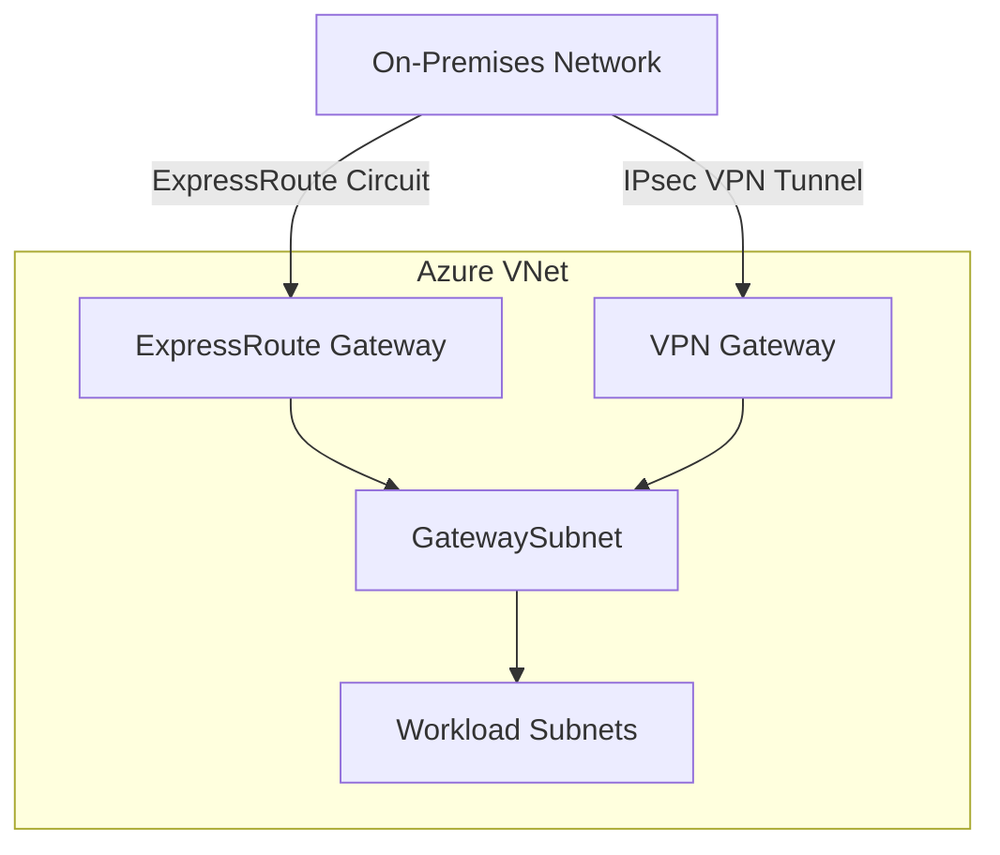
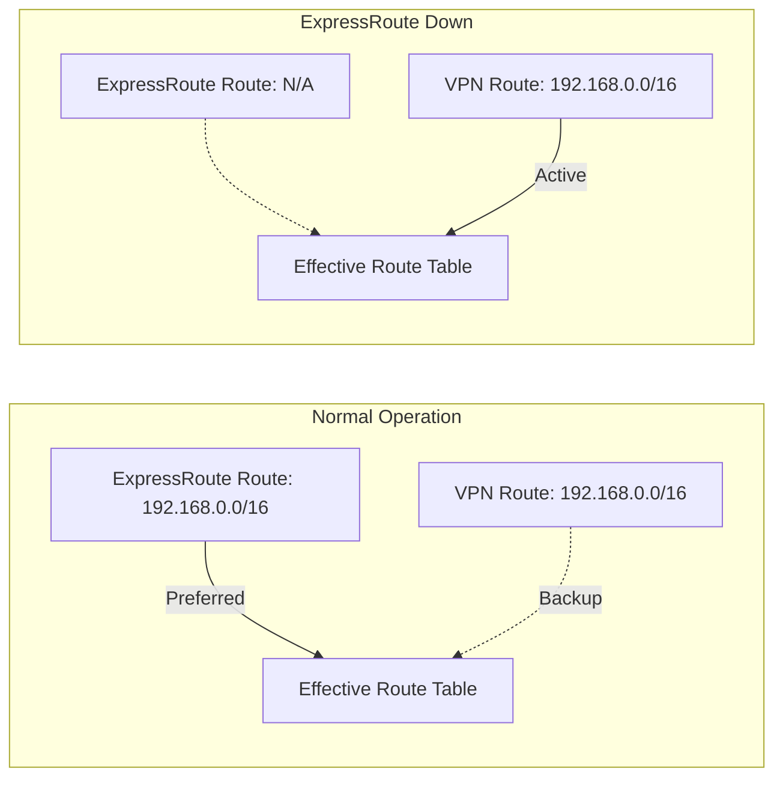

# How to Configure Azure VPN Gateway for Coexistence with ExpressRoute

Author: [nawazdhandala](https://www.github.com/nawazdhandala)

Tags: Azure, VPN Gateway, ExpressRoute, Coexistence, Hybrid Networking, Redundancy, BGP

Description: Set up Azure VPN Gateway alongside ExpressRoute for redundant hybrid connectivity with automatic failover between the two connections.

---

ExpressRoute provides a reliable private connection between your on-premises network and Azure, but what happens when the ExpressRoute circuit goes down? If it is your only connection, your hybrid connectivity is gone. That is why running a site-to-site VPN alongside ExpressRoute - known as coexistence - is a common and recommended pattern.

With coexistence, ExpressRoute handles traffic during normal operation (lower latency, higher bandwidth), and the VPN connection automatically takes over if ExpressRoute fails. It is a safety net that costs relatively little compared to the cost of losing connectivity.

In this guide, I will walk through configuring VPN Gateway to coexist with ExpressRoute on the same VNet, including the routing considerations that make failover work properly.

## Architecture Overview

Both the ExpressRoute gateway and VPN gateway deploy into the same VNet's GatewaySubnet. They share the subnet but operate independently, each with its own public IP and connection.



BGP handles the routing intelligence. Both gateways advertise routes to the VNet, and the effective route table determines which gateway handles traffic. ExpressRoute routes are preferred over VPN routes by default (ExpressRoute has a shorter AS path), so traffic uses ExpressRoute when it is available and fails over to VPN when it is not.

## Prerequisites

Before setting up coexistence, you need:

- An existing ExpressRoute circuit in "Provisioned" state with private peering configured
- An ExpressRoute gateway deployed in the VNet
- BGP must be enabled on both the VPN gateway and your on-premises VPN device
- The GatewaySubnet must be /27 or larger (to accommodate both gateways)

## Step 1: Verify Your GatewaySubnet Size

Both gateways share the GatewaySubnet. It must be large enough for both.

```bash
# Check the current GatewaySubnet size
az network vnet subnet show \
  --resource-group rg-hybrid \
  --vnet-name vnet-main \
  --name GatewaySubnet \
  --query "addressPrefix" \
  --output tsv
```

If the subnet is smaller than /27, you will need to resize it. Unfortunately, you cannot resize a subnet that has resources deployed in it, so this might require recreating the ExpressRoute gateway with a larger subnet. Plan this carefully.

A /27 gives you 32 addresses, which is the minimum. /26 (64 addresses) or /25 (128 addresses) gives you more room for growth and is recommended for production.

## Step 2: Create the VPN Gateway

Deploy a VPN gateway in the same VNet. It will automatically use the GatewaySubnet.

```bash
# Create a public IP for the VPN gateway
az network public-ip create \
  --resource-group rg-hybrid \
  --name pip-vpngw \
  --sku Standard \
  --allocation-method Static

# Create the VPN gateway with BGP enabled
# This command takes 30-45 minutes to complete
az network vnet-gateway create \
  --resource-group rg-hybrid \
  --name vpngw-backup \
  --vnet vnet-main \
  --public-ip-address pip-vpngw \
  --gateway-type Vpn \
  --vpn-type RouteBased \
  --sku VpnGw2AZ \
  --asn 65515 \
  --no-wait
```

Important notes:

- `--gateway-type Vpn` - This must be Vpn (not ExpressRoute, which is your existing gateway)
- `--asn 65515` - This is the default Azure BGP ASN. If your ExpressRoute gateway also uses 65515, that is fine - they share the same ASN within the VNet
- `--sku VpnGw2AZ` - Use a zone-redundant SKU for production

Wait for the VPN gateway to finish deploying before continuing.

```bash
# Check the VPN gateway provisioning status
az network vnet-gateway show \
  --resource-group rg-hybrid \
  --name vpngw-backup \
  --query "provisioningState" \
  --output tsv
```

## Step 3: Create the Local Network Gateway

The local network gateway represents your on-premises VPN device.

```bash
# Create the local network gateway with BGP enabled
az network local-gateway create \
  --resource-group rg-hybrid \
  --name lgw-onprem \
  --gateway-ip-address 203.0.113.100 \
  --local-address-prefixes 192.168.0.0/16 \
  --asn 65001 \
  --bgp-peering-address 192.168.1.1
```

If you are using BGP (which you should be for coexistence), include the `--asn` and `--bgp-peering-address` parameters. The ASN is your on-premises network's BGP ASN, and the BGP peering address is the IP on your on-premises router that will establish the BGP session.

## Step 4: Create the VPN Connection

Create the site-to-site VPN connection with BGP enabled.

```bash
# Create the S2S VPN connection with BGP
az network vpn-connection create \
  --resource-group rg-hybrid \
  --name conn-vpn-onprem \
  --vnet-gateway1 vpngw-backup \
  --local-gateway2 lgw-onprem \
  --shared-key "YourPreSharedKey123!" \
  --enable-bgp true
```

The `--enable-bgp true` flag is critical for coexistence. Without BGP, you would need to manually manage routes, and the automatic failover between ExpressRoute and VPN would not work.

## Step 5: Configure Your On-Premises VPN Device

Your on-premises VPN device needs to:

1. Establish an IPsec tunnel to the Azure VPN gateway's public IP
2. Run BGP over the tunnel with Azure's BGP ASN (65515) and peer IP
3. Advertise the same on-premises routes that ExpressRoute advertises

Get the Azure VPN gateway's BGP settings.

```bash
# Get the VPN gateway's BGP configuration
az network vnet-gateway show \
  --resource-group rg-hybrid \
  --name vpngw-backup \
  --query "{asn:bgpSettings.asn, peerAddress:bgpSettings.bgpPeeringAddresses[0].defaultBgpIpAddresses[0]}" \
  --output table
```

Configure your on-premises device with these BGP peer parameters. The specific configuration depends on your device vendor.

## How Routing and Failover Works

With both gateways running BGP, the VNet learns routes from both sources. Here is how Azure determines which route to use:

1. **Longest prefix match** applies first - the most specific route wins
2. For routes with the same prefix, **ExpressRoute routes are preferred** over VPN routes
3. If ExpressRoute routes are withdrawn (circuit goes down), VPN routes take over



The failover happens automatically through BGP route withdrawal. When ExpressRoute goes down, the routes it advertised are withdrawn, and the VPN routes become the only option.

You can verify the effective routes on a NIC to see which gateway is currently being used.

```bash
# Check effective routes for a NIC in the VNet
az network nic show-effective-route-table \
  --resource-group rg-hybrid \
  --name nic-vm-app-01 \
  --output table
```

Look for the on-premises routes (192.168.x.x in our example). The "Next Hop Type" column tells you whether the route goes through VirtualNetworkGateway.

## Step 6: Verify Both Connections

Check that both connections are established.

```bash
# Check VPN connection status
az network vpn-connection show \
  --resource-group rg-hybrid \
  --name conn-vpn-onprem \
  --query "connectionStatus" \
  --output tsv

# Check ExpressRoute connection status
az network vpn-connection show \
  --resource-group rg-hybrid \
  --name conn-er-main \
  --query "connectionStatus" \
  --output tsv

# List learned routes from both gateways
echo "=== ExpressRoute learned routes ==="
az network vnet-gateway list-learned-routes \
  --resource-group rg-hybrid \
  --name ergw-main \
  --output table

echo "=== VPN learned routes ==="
az network vnet-gateway list-learned-routes \
  --resource-group rg-hybrid \
  --name vpngw-backup \
  --output table
```

Both gateways should show learned routes for your on-premises networks. The routes should be identical (same prefixes) but with different next hops.

## Testing Failover

To test VPN failover without actually bringing down ExpressRoute, you can simulate by disabling the ExpressRoute connection temporarily.

```bash
# Disable the ExpressRoute peering to simulate circuit failure
az network express-route peering update \
  --resource-group rg-hybrid \
  --circuit-name er-circuit-main \
  --name AzurePrivatePeering \
  --state Disabled
```

After disabling, check the effective routes again. The on-premises routes should now show as coming through the VPN gateway instead of the ExpressRoute gateway.

```bash
# Verify traffic has failed over to VPN
az network nic show-effective-route-table \
  --resource-group rg-hybrid \
  --name nic-vm-app-01 \
  --output table
```

Test actual connectivity by pinging on-premises resources. Re-enable ExpressRoute when done.

```bash
# Re-enable ExpressRoute peering
az network express-route peering update \
  --resource-group rg-hybrid \
  --circuit-name er-circuit-main \
  --name AzurePrivatePeering \
  --state Enabled
```

## Monitoring Both Connections

Set up alerts for both connections so you know immediately when one fails.

```bash
# Alert on VPN connection status change
az monitor metrics alert create \
  --resource-group rg-hybrid \
  --name alert-vpn-status \
  --scopes $(az network vpn-connection show \
    -g rg-hybrid -n conn-vpn-onprem --query id -o tsv) \
  --condition "avg TunnelAverageBandwidth < 1" \
  --window-size 5m \
  --evaluation-frequency 1m \
  --severity 2 \
  --description "VPN tunnel bandwidth dropped to zero"
```

## Performance Expectations

When traffic fails over from ExpressRoute to VPN:

- **Latency increases**: ExpressRoute provides lower latency than VPN over the internet. Expect 10-50ms additional latency depending on the internet path.
- **Bandwidth decreases**: ExpressRoute circuits are typically 1-10 Gbps. VPN gateway throughput maxes out at 1.25 Gbps (VpnGw3) to 10 Gbps (VpnGw5).
- **Jitter increases**: Internet paths have more variable latency than dedicated circuits.

For most applications, VPN performance is adequate as a temporary backup. For bandwidth-intensive applications, consider a redundant ExpressRoute circuit instead of (or in addition to) VPN.

## Cost Considerations

Running both gateways means paying for both:

- ExpressRoute gateway: hourly charge based on SKU
- VPN gateway: hourly charge based on SKU
- VPN gateway public IP: static IP charge
- VPN data transfer: per-GB charge for data through the tunnel

The VPN costs during normal operation are low because no data flows through it (only BGP keepalives). The cost is essentially the gateway hourly rate and the static IP, which is a small price for redundant connectivity.

Coexistence between VPN Gateway and ExpressRoute gives you the reliability of redundant hybrid connectivity. The setup requires careful planning around subnet sizing and BGP configuration, but once running, the failover is automatic and transparent to your applications.
