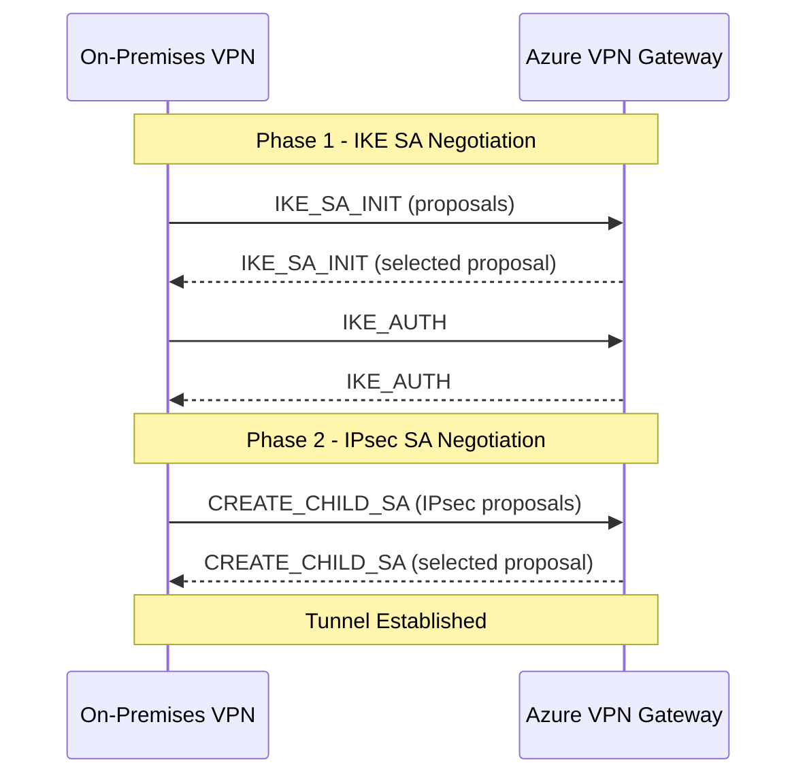

# How to Set Up Azure VPN Gateway with IKEv2 Custom IPsec Policy

Author: [nawazdhandala](https://www.github.com/nawazdhandala)

Tags: Azure, VPN Gateway, IKEv2, IPsec, Site-to-Site VPN, Networking, Security

Description: Configure Azure VPN Gateway with custom IKEv2 IPsec policies to meet specific encryption and security requirements for site-to-site connections.

---

Azure VPN Gateway supports default IPsec/IKE policies that work well for most scenarios. But sometimes "default" is not good enough. Your organization might have compliance requirements that mandate specific encryption algorithms, or you need to match the configuration on your on-premises VPN device. In these cases, you need a custom IPsec policy.

In this guide, I will cover how to set up an Azure VPN Gateway with IKEv2 and a custom IPsec policy for a site-to-site connection. We will go through the parameters, configure the gateway, and apply the policy.

## Understanding IKE and IPsec Parameters

Before we configure anything, let us understand what we are setting. IKEv2 negotiation happens in two phases:

**Phase 1 (IKE SA)** - Also called Main Mode. This establishes a secure channel between the two VPN peers. Parameters include:
- Encryption algorithm (AES-256, AES-128, etc.)
- Integrity/hash algorithm (SHA-256, SHA-384, etc.)
- Diffie-Hellman group (DHGroup14, DHGroup24, etc.)
- SA lifetime

**Phase 2 (IPsec SA)** - Also called Quick Mode. This negotiates the actual tunnel parameters for data traffic. Parameters include:
- IPsec encryption algorithm
- IPsec integrity algorithm
- PFS (Perfect Forward Secrecy) group
- SA lifetime
- SA size (KB)



## Step 1: Create the VPN Gateway Infrastructure

Let us set up the VNet, gateway subnet, and VPN gateway.

```bash
# Create the resource group
az group create \
  --name rg-vpn \
  --location eastus

# Create a VNet with a GatewaySubnet
az network vnet create \
  --resource-group rg-vpn \
  --name vnet-main \
  --address-prefix 10.0.0.0/16 \
  --subnet-name GatewaySubnet \
  --subnet-prefix 10.0.255.0/27

# Create a public IP for the VPN gateway
az network public-ip create \
  --resource-group rg-vpn \
  --name pip-vpngw \
  --sku Standard \
  --allocation-method Static

# Create the VPN gateway (this takes 30-45 minutes)
az network vnet-gateway create \
  --resource-group rg-vpn \
  --name vpngw-main \
  --vnet vnet-main \
  --public-ip-address pip-vpngw \
  --gateway-type Vpn \
  --vpn-type RouteBased \
  --sku VpnGw2 \
  --generation Generation2 \
  --no-wait
```

The `--no-wait` flag lets the command return immediately while the gateway deploys in the background. VPN gateway creation typically takes 30-45 minutes.

## Step 2: Create the Local Network Gateway

The local network gateway represents your on-premises VPN device.

```bash
# Create a local network gateway representing the on-premises site
# Replace the IP and address space with your actual values
az network local-gateway create \
  --resource-group rg-vpn \
  --name lgw-onprem \
  --gateway-ip-address 203.0.113.100 \
  --local-address-prefixes 192.168.0.0/16 172.16.0.0/12
```

The `--gateway-ip-address` is the public IP of your on-premises VPN device. The `--local-address-prefixes` are the on-premises networks you want reachable through the tunnel.

## Step 3: Create the Connection with a Custom IPsec Policy

Now create the site-to-site connection and attach a custom IPsec policy.

```bash
# Create a site-to-site VPN connection with a custom IPsec policy
az network vpn-connection create \
  --resource-group rg-vpn \
  --name conn-to-onprem \
  --vnet-gateway1 vpngw-main \
  --local-gateway2 lgw-onprem \
  --shared-key "YourSuperSecretPreSharedKey123!" \
  --enable-bgp false
```

Now apply the custom IPsec policy to the connection.

```bash
# Apply a custom IPsec/IKE policy to the connection
# This example uses strong encryption suitable for most compliance requirements
az network vpn-connection ipsec-policy add \
  --resource-group rg-vpn \
  --connection-name conn-to-onprem \
  --ike-encryption AES256 \
  --ike-integrity SHA256 \
  --dh-group DHGroup14 \
  --ipsec-encryption AES256 \
  --ipsec-integrity SHA256 \
  --pfs-group PFS2048 \
  --sa-lifetime 28800 \
  --sa-max-size 102400000
```

Let me break down each parameter:

- `--ike-encryption AES256`: Phase 1 uses AES-256 for encryption
- `--ike-integrity SHA256`: Phase 1 uses SHA-256 for integrity verification
- `--dh-group DHGroup14`: Phase 1 uses Diffie-Hellman group 14 (2048-bit MODP)
- `--ipsec-encryption AES256`: Phase 2 uses AES-256 for data encryption
- `--ipsec-integrity SHA256`: Phase 2 uses SHA-256 for data integrity
- `--pfs-group PFS2048`: Perfect Forward Secrecy uses 2048-bit MODP group
- `--sa-lifetime 28800`: Security association lifetime of 28,800 seconds (8 hours)
- `--sa-max-size 102400000`: Rekey after 102 GB of data transfer

## Available Algorithm Options

Here are all the supported algorithms you can choose from:

**IKE Encryption**: AES256, AES192, AES128, DES3, DES

**IKE Integrity**: SHA384, SHA256, SHA1, MD5

**DH Groups**: DHGroup24, DHGroup14, DHGroup2048, DHGroup2, DHGroup1, ECP384, ECP256

**IPsec Encryption**: GCMAES256, GCMAES192, GCMAES128, AES256, AES192, AES128, DES3, DES, None

**IPsec Integrity**: GCMAES256, GCMAES192, GCMAES128, SHA256, SHA1, MD5

**PFS Groups**: PFS24, PFSMM, PFS2048, PFS2, PFS1, ECP384, ECP256, None

For the strongest security, a common recommended configuration is:

```bash
# High-security policy using GCM for authenticated encryption
az network vpn-connection ipsec-policy add \
  --resource-group rg-vpn \
  --connection-name conn-to-onprem \
  --ike-encryption AES256 \
  --ike-integrity SHA384 \
  --dh-group DHGroup24 \
  --ipsec-encryption GCMAES256 \
  --ipsec-integrity GCMAES256 \
  --pfs-group ECP384 \
  --sa-lifetime 14400 \
  --sa-max-size 102400000
```

GCM (Galois/Counter Mode) provides both encryption and integrity in one operation, which is more efficient than separate encryption and integrity algorithms.

## Step 4: Verify the Custom Policy

After applying the policy, verify it was set correctly.

```bash
# List the IPsec policies applied to the connection
az network vpn-connection ipsec-policy list \
  --resource-group rg-vpn \
  --connection-name conn-to-onprem \
  --output table
```

Check the connection status.

```bash
# Check the VPN connection status - should show "Connected" after negotiation
az network vpn-connection show \
  --resource-group rg-vpn \
  --name conn-to-onprem \
  --query "connectionStatus" \
  --output tsv
```

## Matching On-Premises Configuration

The custom policy you set on Azure must exactly match what your on-premises device is configured with. If there is a mismatch, the IKE negotiation will fail and the tunnel will not come up.

Here is an example configuration for a Cisco IOS device that matches our Azure policy.

```
! Phase 1 - IKE SA parameters matching Azure configuration
crypto ikev2 proposal azure-proposal
  encryption aes-cbc-256
  integrity sha256
  group 14

crypto ikev2 policy azure-policy
  proposal azure-proposal

! Phase 2 - IPsec transform set matching Azure configuration
crypto ipsec transform-set azure-transform esp-aes 256 esp-sha256-hmac
  mode tunnel

crypto ipsec profile azure-profile
  set transform-set azure-transform
  set pfs group14
  set security-association lifetime seconds 28800
  set security-association lifetime kilobytes 102400000
```

For other device vendors (Fortinet, Palo Alto, Juniper, etc.), consult their documentation for the equivalent configuration syntax. The algorithm selections must be identical on both sides.

## Troubleshooting Connection Issues

If the tunnel is not coming up, here are the common culprits:

**Algorithm mismatch**: This is the most common problem. Double-check that every parameter matches between Azure and the on-premises device. Even one difference will cause negotiation failure.

**Pre-shared key mismatch**: The shared key must be identical on both sides. Copy-paste it to avoid typos.

**Public IP issues**: Verify the on-premises device's public IP is what you configured in the local network gateway.

**Firewall blocking**: Ensure UDP ports 500 and 4500 are open between the two endpoints for IKE traffic. Also ensure ESP protocol (IP protocol 50) is allowed.

You can use Azure Network Watcher VPN diagnostics to get detailed error logs.

```bash
# Run VPN diagnostics to identify connection issues
az network watcher troubleshooting start \
  --resource-group rg-vpn \
  --resource vpngw-main \
  --resource-type vpnGateway \
  --storage-account stvpndiag \
  --storage-path "https://stvpndiag.blob.core.windows.net/vpndiag"
```

## Resetting the IPsec Policy

If you need to revert to the default Azure IPsec policy, clear the custom policy from the connection.

```bash
# Remove all custom IPsec policies and revert to defaults
az network vpn-connection ipsec-policy clear \
  --resource-group rg-vpn \
  --connection-name conn-to-onprem
```

## SA Lifetime Recommendations

The SA lifetime controls how often the tunnel rekeying occurs. Shorter lifetimes are more secure but increase overhead.

- **Production**: 8-24 hours (28800-86400 seconds)
- **High security**: 4-8 hours (14400-28800 seconds)
- **Maximum security**: 1-4 hours (3600-14400 seconds)

Both sides must agree on the lifetime. If they are different, the shorter value is used.

Custom IPsec policies on Azure VPN Gateway give you the control you need to meet compliance requirements and interoperate with a wide variety of on-premises VPN devices. The key is making sure both sides of the tunnel have perfectly matching configurations and using the strongest algorithms your devices support.
