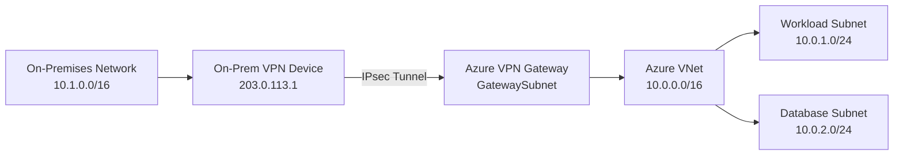

# How to Build Azure VPN Gateway Site-to-Site Connections with Terraform

Author: [nawazdhandala](https://www.github.com/nawazdhandala)

Tags: Azure, Terraform, VPN Gateway, Networking, Site-to-Site, Infrastructure as Code, Hybrid Cloud

Description: Build Azure VPN Gateway with site-to-site connections using Terraform for secure hybrid cloud connectivity between on-premises and Azure networks.

---

Site-to-site VPN connections bridge your on-premises network with Azure, creating a secure tunnel over the public internet. This is the foundation of hybrid cloud architectures where some workloads run in your data center and others in Azure. Setting up a VPN gateway through the portal works for a one-time setup, but when you need to manage connections to multiple sites, handle failover configurations, or replicate the setup across environments, Terraform is the right tool.

This post walks through building a complete site-to-site VPN setup with Terraform, including the VPN gateway, local network gateway, connection, and the networking prerequisites.

## Architecture

A site-to-site VPN connection has several components on the Azure side. The VPN gateway sits in a dedicated subnet within your VNet. A local network gateway represents your on-premises VPN device. The connection resource links them together with encryption settings and a shared key.



## Network Foundation

Start with the VNet and the required GatewaySubnet. Azure requires this subnet to be named exactly "GatewaySubnet."

```hcl
# main.tf
# VPN Gateway site-to-site connection infrastructure

terraform {
  required_providers {
    azurerm = {
      source  = "hashicorp/azurerm"
      version = "~> 3.80"
    }
  }
}

provider "azurerm" {
  features {}
}

resource "azurerm_resource_group" "networking" {
  name     = "rg-networking-prod"
  location = "eastus"
  tags = {
    environment = "production"
    purpose     = "hybrid-connectivity"
  }
}

# Virtual network for Azure workloads
resource "azurerm_virtual_network" "main" {
  name                = "vnet-hub-prod"
  location            = azurerm_resource_group.networking.location
  resource_group_name = azurerm_resource_group.networking.name
  address_space       = ["10.0.0.0/16"]

  tags = azurerm_resource_group.networking.tags
}

# GatewaySubnet - must be named exactly "GatewaySubnet"
# Minimum /27 recommended, /26 for high availability
resource "azurerm_subnet" "gateway" {
  name                 = "GatewaySubnet"
  resource_group_name  = azurerm_resource_group.networking.name
  virtual_network_name = azurerm_virtual_network.main.name
  address_prefixes     = ["10.0.255.0/27"]
}

# Workload subnet
resource "azurerm_subnet" "workloads" {
  name                 = "snet-workloads"
  resource_group_name  = azurerm_resource_group.networking.name
  virtual_network_name = azurerm_virtual_network.main.name
  address_prefixes     = ["10.0.1.0/24"]
}

# Public IP for the VPN gateway
resource "azurerm_public_ip" "vpn_gateway" {
  name                = "pip-vpn-gateway"
  location            = azurerm_resource_group.networking.location
  resource_group_name = azurerm_resource_group.networking.name
  allocation_method   = "Static"
  sku                 = "Standard"  # Standard SKU required for VpnGw2 and above

  tags = azurerm_resource_group.networking.tags
}
```

## Creating the VPN Gateway

The VPN gateway is the most time-consuming resource to provision - it typically takes 30-45 minutes. Plan accordingly.

```hcl
# vpn-gateway.tf
# Azure VPN Gateway for site-to-site connectivity

resource "azurerm_virtual_network_gateway" "main" {
  name                = "vgw-prod"
  location            = azurerm_resource_group.networking.location
  resource_group_name = azurerm_resource_group.networking.name

  type     = "Vpn"
  vpn_type = "RouteBased"  # Route-based is recommended for most scenarios

  # Gateway SKU - determines throughput and features
  # VpnGw2 provides up to 1.25 Gbps throughput
  sku = "VpnGw2"

  # Active-active for high availability (requires two public IPs)
  active_active = false

  # Enable BGP for dynamic routing (recommended for multi-site)
  enable_bgp = true

  bgp_settings {
    asn = 65515  # Azure default ASN, can be changed

    peering_addresses {
      ip_configuration_name = "vnetGatewayConfig"
      apipa_addresses       = ["169.254.21.1"]
    }
  }

  ip_configuration {
    name                          = "vnetGatewayConfig"
    public_ip_address_id          = azurerm_public_ip.vpn_gateway.id
    private_ip_address_allocation = "Dynamic"
    subnet_id                     = azurerm_subnet.gateway.id
  }

  tags = azurerm_resource_group.networking.tags
}
```

The SKU choice affects throughput, number of tunnels, and cost. Here is a quick reference for common SKUs.

- VpnGw1: 650 Mbps, 30 tunnels
- VpnGw2: 1.25 Gbps, 30 tunnels
- VpnGw3: 2.5 Gbps, 30 tunnels

For production workloads, VpnGw2 or VpnGw3 is typical.

## Local Network Gateway

The local network gateway represents your on-premises VPN device. You need the public IP of your device and the address ranges of your on-premises network.

```hcl
# local-network-gateway.tf
# Represents the on-premises VPN device and network

resource "azurerm_local_network_gateway" "onprem_datacenter" {
  name                = "lgw-datacenter-primary"
  location            = azurerm_resource_group.networking.location
  resource_group_name = azurerm_resource_group.networking.name

  # Public IP of your on-premises VPN device
  gateway_address = "203.0.113.1"

  # On-premises network address ranges
  address_space = [
    "10.1.0.0/16",   # Main office network
    "10.2.0.0/16",   # Branch office network
    "172.16.0.0/12",  # Internal services
  ]

  # BGP settings for the on-premises device
  bgp_settings {
    asn                 = 65001  # Your on-premises BGP ASN
    bgp_peering_address = "10.1.0.1"
  }

  tags = azurerm_resource_group.networking.tags
}

# Second local network gateway for a branch office
resource "azurerm_local_network_gateway" "onprem_branch" {
  name                = "lgw-branch-office"
  location            = azurerm_resource_group.networking.location
  resource_group_name = azurerm_resource_group.networking.name

  gateway_address = "198.51.100.1"

  address_space = [
    "10.3.0.0/16",  # Branch office network
  ]

  tags = azurerm_resource_group.networking.tags
}
```

## Creating the VPN Connection

The connection resource ties the VPN gateway to the local network gateway with encryption settings.

```hcl
# connection.tf
# Site-to-site VPN connections with security settings

# Primary datacenter connection
resource "azurerm_virtual_network_gateway_connection" "datacenter" {
  name                = "cn-datacenter-primary"
  location            = azurerm_resource_group.networking.location
  resource_group_name = azurerm_resource_group.networking.name

  type                       = "IPsec"
  virtual_network_gateway_id = azurerm_virtual_network_gateway.main.id
  local_network_gateway_id   = azurerm_local_network_gateway.onprem_datacenter.id

  # Shared key - must match on both sides
  shared_key = var.vpn_shared_key_datacenter

  # Enable BGP for dynamic routing
  enable_bgp = true

  # Connection protocol
  connection_protocol = "IKEv2"

  # Custom IPsec/IKE policy for stronger encryption
  ipsec_policy {
    # IKE Phase 1 (SA) settings
    ike_encryption   = "AES256"
    ike_integrity    = "SHA256"
    dh_group         = "DHGroup14"

    # IKE Phase 2 (IPsec) settings
    ipsec_encryption = "AES256"
    ipsec_integrity  = "SHA256"
    pfs_group        = "PFS14"

    # SA lifetime
    sa_lifetime = 27000  # seconds (7.5 hours)
    sa_datasize = 102400000  # KB (100 GB)
  }

  # Traffic selector for policy-based routing
  traffic_selector_policy {
    local_address_cidrs  = ["10.0.0.0/16"]
    remote_address_cidrs = ["10.1.0.0/16", "10.2.0.0/16"]
  }

  tags = azurerm_resource_group.networking.tags
}

# Branch office connection
resource "azurerm_virtual_network_gateway_connection" "branch" {
  name                = "cn-branch-office"
  location            = azurerm_resource_group.networking.location
  resource_group_name = azurerm_resource_group.networking.name

  type                       = "IPsec"
  virtual_network_gateway_id = azurerm_virtual_network_gateway.main.id
  local_network_gateway_id   = azurerm_local_network_gateway.onprem_branch.id

  shared_key          = var.vpn_shared_key_branch
  connection_protocol = "IKEv2"

  ipsec_policy {
    ike_encryption   = "AES256"
    ike_integrity    = "SHA256"
    dh_group         = "DHGroup14"
    ipsec_encryption = "AES256"
    ipsec_integrity  = "SHA256"
    pfs_group        = "PFS14"
    sa_lifetime      = 27000
    sa_datasize      = 102400000
  }

  tags = azurerm_resource_group.networking.tags
}
```

## Variables and Secrets

```hcl
# variables.tf
variable "vpn_shared_key_datacenter" {
  description = "Shared key for the datacenter VPN connection"
  type        = string
  sensitive   = true
}

variable "vpn_shared_key_branch" {
  description = "Shared key for the branch office VPN connection"
  type        = string
  sensitive   = true
}
```

Store the shared keys securely using Terraform variables files or environment variables. Never commit them to version control.

```bash
# Set shared keys via environment variables
export TF_VAR_vpn_shared_key_datacenter="your-strong-random-key-here"
export TF_VAR_vpn_shared_key_branch="another-strong-random-key"

# Deploy the VPN infrastructure
terraform apply
```

## Monitoring VPN Connections

Add diagnostics to monitor tunnel health and throughput.

```hcl
# monitoring.tf
# Diagnostic settings for VPN gateway monitoring

resource "azurerm_monitor_diagnostic_setting" "vpn_gateway" {
  name                       = "vpn-diagnostics"
  target_resource_id         = azurerm_virtual_network_gateway.main.id
  log_analytics_workspace_id = var.log_analytics_workspace_id

  enabled_log {
    category = "GatewayDiagnosticLog"
  }

  enabled_log {
    category = "TunnelDiagnosticLog"
  }

  enabled_log {
    category = "RouteDiagnosticLog"
  }

  enabled_log {
    category = "IKEDiagnosticLog"
  }

  metric {
    category = "AllMetrics"
    enabled  = true
  }
}

# Alert on tunnel disconnection
resource "azurerm_monitor_metric_alert" "tunnel_down" {
  name                = "vpn-tunnel-down"
  resource_group_name = azurerm_resource_group.networking.name
  scopes              = [azurerm_virtual_network_gateway.main.id]
  description         = "Alert when VPN tunnel status changes to disconnected"
  severity            = 1
  frequency           = "PT5M"
  window_size         = "PT15M"

  criteria {
    metric_namespace = "Microsoft.Network/virtualNetworkGateways"
    metric_name      = "TunnelEgressBytes"
    aggregation      = "Total"
    operator         = "LessThan"
    threshold        = 1  # No traffic indicates tunnel may be down
  }

  action {
    action_group_id = var.alert_action_group_id
  }
}
```

## Outputs

```hcl
# outputs.tf
output "vpn_gateway_public_ip" {
  value       = azurerm_public_ip.vpn_gateway.ip_address
  description = "Public IP of the Azure VPN gateway - provide this to your on-premises network team"
}

output "vpn_gateway_bgp_asn" {
  value = azurerm_virtual_network_gateway.main.bgp_settings[0].asn
}

output "vpn_gateway_bgp_peering_address" {
  value = azurerm_virtual_network_gateway.main.bgp_settings[0].peering_addresses[0].default_addresses[0]
}
```

## Summary

Building Azure VPN Gateway site-to-site connections with Terraform gives you version-controlled, repeatable hybrid connectivity. The key components are the VNet with a properly sized GatewaySubnet, the VPN gateway with appropriate SKU and BGP configuration, local network gateways representing each on-premises site, and connection resources with strong IPsec policies. With multi-site support and BGP-based dynamic routing, you can manage connectivity to multiple offices through a single Terraform configuration. The 30-45 minute provisioning time for the gateway is a one-time cost - after that, adding new connections and modifying routing is fast and safe through Terraform.
