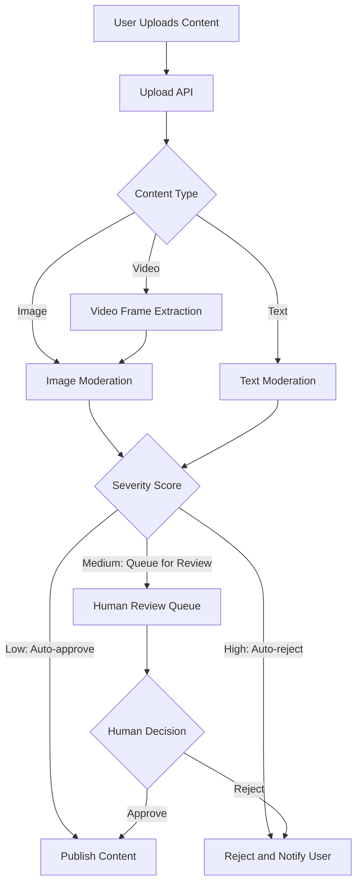

# How to Implement Content Moderation for User-Generated Media with Azure Content Safety API

Author: [nawazdhandala](https://www.github.com/nawazdhandala)

Tags: Azure, Content Safety, Content Moderation, AI, Media, User-Generated Content, API

Description: Implement automated content moderation for user-generated images, text, and video using Azure Content Safety API to detect harmful or inappropriate content.

---

Any platform that accepts user-generated content faces a moderation challenge. Users upload images, text, and videos that could contain violence, adult content, hate speech, or other harmful material. Manual moderation does not scale - if your platform gets thousands of uploads per day, you cannot have humans review every one. Azure Content Safety API provides AI-powered content moderation that can automatically screen text and images in real time, flagging or blocking content that violates your policies.

In this guide, I will build a content moderation pipeline that screens user uploads before they go live on your platform.

## Architecture

The moderation pipeline sits between the user upload and content publishing. Nothing goes live without passing through moderation.



The key insight is that you do not need to moderate everything manually. Content Safety gives you severity scores. Low-severity content gets auto-approved. High-severity content gets auto-rejected. Only the gray area in the middle needs human review, which dramatically reduces the manual workload.

## Setting Up Azure Content Safety

```bash
# Create a Content Safety resource
az cognitiveservices account create \
  --name content-safety-service \
  --resource-group rg-moderation \
  --kind ContentSafety \
  --sku S0 \
  --location eastus \
  --yes

# Get the endpoint and key
az cognitiveservices account show \
  --name content-safety-service \
  --resource-group rg-moderation \
  --query "{endpoint:properties.endpoint}" -o table

az cognitiveservices account keys list \
  --name content-safety-service \
  --resource-group rg-moderation \
  --query key1 -o tsv
```

## Text Content Moderation

Text moderation analyzes written content for hate speech, sexual content, violence, and self-harm. Each category gets a severity score from 0 to 6.

```javascript
// src/moderation/text-moderator.js
const { ContentSafetyClient } = require('@azure-rest/ai-content-safety');
const { AzureKeyCredential } = require('@azure/core-auth');

const client = ContentSafetyClient(
  process.env.CONTENT_SAFETY_ENDPOINT,
  new AzureKeyCredential(process.env.CONTENT_SAFETY_KEY)
);

// Moderate text content and return a decision
async function moderateText(text) {
  const response = await client.path('/text:analyze').post({
    body: {
      text: text,
      // Categories to check
      categories: ['Hate', 'SelfHarm', 'Sexual', 'Violence'],
      // Block list IDs (custom blocked terms)
      blocklistNames: ['custom-blocked-terms'],
      // Break long text into segments for better analysis
      haltOnBlocklistHit: false
    }
  });

  if (response.status !== '200') {
    throw new Error(`Content Safety API error: ${response.status}`);
  }

  const result = response.body;

  // Extract category scores
  const scores = {
    hate: findCategoryScore(result.categoriesAnalysis, 'Hate'),
    selfHarm: findCategoryScore(result.categoriesAnalysis, 'SelfHarm'),
    sexual: findCategoryScore(result.categoriesAnalysis, 'Sexual'),
    violence: findCategoryScore(result.categoriesAnalysis, 'Violence')
  };

  // Check for blocked terms
  const blockedTerms = result.blocklistsMatch || [];

  // Make a moderation decision based on scores
  return makeModerationDecision(scores, blockedTerms);
}

function findCategoryScore(categories, categoryName) {
  const category = categories.find(c => c.category === categoryName);
  return category ? category.severity : 0;
}

// Decision logic based on your platform's policies
function makeModerationDecision(scores, blockedTerms) {
  const maxScore = Math.max(
    scores.hate, scores.selfHarm, scores.sexual, scores.violence
  );

  // If any blocked term is found, auto-reject
  if (blockedTerms.length > 0) {
    return {
      decision: 'reject',
      reason: 'Blocked terms detected',
      scores: scores,
      blockedTerms: blockedTerms.map(t => t.blocklistItemText)
    };
  }

  // Severity thresholds (adjust based on your platform's tolerance)
  if (maxScore >= 4) {
    return {
      decision: 'reject',
      reason: `High severity content detected (score: ${maxScore})`,
      scores: scores
    };
  }

  if (maxScore >= 2) {
    return {
      decision: 'review',
      reason: `Medium severity content needs human review (score: ${maxScore})`,
      scores: scores
    };
  }

  return {
    decision: 'approve',
    reason: 'Content within acceptable limits',
    scores: scores
  };
}

module.exports = { moderateText };
```

## Image Content Moderation

Image moderation analyzes photos and graphics for the same categories.

```javascript
// src/moderation/image-moderator.js
const fs = require('fs');

// Moderate an image from a URL
async function moderateImageFromUrl(imageUrl) {
  const response = await client.path('/image:analyze').post({
    body: {
      image: {
        url: imageUrl
      },
      categories: ['Hate', 'SelfHarm', 'Sexual', 'Violence']
    }
  });

  if (response.status !== '200') {
    throw new Error(`Image moderation error: ${response.status}`);
  }

  const result = response.body;

  const scores = {
    hate: findCategoryScore(result.categoriesAnalysis, 'Hate'),
    selfHarm: findCategoryScore(result.categoriesAnalysis, 'SelfHarm'),
    sexual: findCategoryScore(result.categoriesAnalysis, 'Sexual'),
    violence: findCategoryScore(result.categoriesAnalysis, 'Violence')
  };

  return makeModerationDecision(scores, []);
}

// Moderate an image from binary data (uploaded file)
async function moderateImageFromData(imageBuffer) {
  const base64Content = imageBuffer.toString('base64');

  const response = await client.path('/image:analyze').post({
    body: {
      image: {
        content: base64Content
      },
      categories: ['Hate', 'SelfHarm', 'Sexual', 'Violence']
    }
  });

  if (response.status !== '200') {
    throw new Error(`Image moderation error: ${response.status}`);
  }

  const result = response.body;

  const scores = {
    hate: findCategoryScore(result.categoriesAnalysis, 'Hate'),
    selfHarm: findCategoryScore(result.categoriesAnalysis, 'SelfHarm'),
    sexual: findCategoryScore(result.categoriesAnalysis, 'Sexual'),
    violence: findCategoryScore(result.categoriesAnalysis, 'Violence')
  };

  return makeModerationDecision(scores, []);
}

module.exports = { moderateImageFromUrl, moderateImageFromData };
```

## Custom Blocklists

Create blocklists for terms specific to your platform that the AI might not catch.

```javascript
// scripts/manage-blocklist.js
// Create and manage custom blocked term lists

async function createBlocklist() {
  // Create a new blocklist
  const response = await client
    .path('/text/blocklists/{blocklistName}', 'custom-blocked-terms')
    .patch({
      body: {
        description: 'Custom blocked terms for our platform'
      },
      contentType: 'application/merge-patch+json'
    });

  console.log('Blocklist created:', response.body);
}

async function addBlockedTerms(terms) {
  // Add terms to the blocklist
  const blocklistItems = terms.map(term => ({
    description: `Blocked: ${term}`,
    text: term
  }));

  const response = await client
    .path('/text/blocklists/{blocklistName}:addOrUpdateBlocklistItems',
          'custom-blocked-terms')
    .post({
      body: {
        blocklistItems: blocklistItems
      }
    });

  console.log(`Added ${response.body.blocklistItems.length} terms`);
}

// Add platform-specific blocked terms
addBlockedTerms([
  'competitor-spam-term',
  'known-scam-phrase',
  'prohibited-product-name'
]);
```

## Video Moderation Pipeline

Video moderation is more complex because you need to analyze individual frames. Extract key frames and moderate each one.

```javascript
// src/moderation/video-moderator.js
const ffmpeg = require('fluent-ffmpeg');
const { moderateImageFromData } = require('./image-moderator');
const fs = require('fs');
const path = require('path');

// Extract frames from video and moderate each one
async function moderateVideo(videoPath) {
  const frameDir = `/tmp/frames-${Date.now()}`;
  fs.mkdirSync(frameDir, { recursive: true });

  // Extract one frame every 5 seconds
  await new Promise((resolve, reject) => {
    ffmpeg(videoPath)
      .outputOptions([
        '-vf', 'fps=1/5',     // One frame every 5 seconds
        '-q:v', '2'            // High quality JPEG
      ])
      .output(`${frameDir}/frame-%04d.jpg`)
      .on('end', resolve)
      .on('error', reject)
      .run();
  });

  // Get all extracted frames
  const frames = fs.readdirSync(frameDir)
    .filter(f => f.endsWith('.jpg'))
    .sort();

  // Moderate each frame
  const results = [];
  let worstDecision = 'approve';

  for (const frame of frames) {
    const framePath = path.join(frameDir, frame);
    const frameBuffer = fs.readFileSync(framePath);

    const result = await moderateImageFromData(frameBuffer);
    results.push({
      frame: frame,
      timestamp: extractTimestamp(frame),
      ...result
    });

    // Track the worst decision
    if (result.decision === 'reject') {
      worstDecision = 'reject';
    } else if (result.decision === 'review' && worstDecision !== 'reject') {
      worstDecision = 'review';
    }
  }

  // Clean up temporary frames
  fs.rmSync(frameDir, { recursive: true });

  return {
    decision: worstDecision,
    frameCount: frames.length,
    flaggedFrames: results.filter(r => r.decision !== 'approve'),
    allResults: results
  };
}

function extractTimestamp(frameName) {
  // frame-0001.jpg means 0 seconds, frame-0002.jpg means 5 seconds, etc.
  const frameNumber = parseInt(frameName.replace('frame-', '').replace('.jpg', ''));
  return (frameNumber - 1) * 5;
}

module.exports = { moderateVideo };
```

## Upload API with Moderation

Tie everything together in an Express API that moderates content before publishing.

```javascript
// src/api/upload.js
const express = require('express');
const multer = require('multer');
const { moderateText } = require('../moderation/text-moderator');
const { moderateImageFromData } = require('../moderation/image-moderator');

const upload = multer({ storage: multer.memoryStorage() });
const router = express.Router();

// Post creation endpoint with text and image moderation
router.post('/posts', upload.single('image'), async (req, res) => {
  try {
    const { title, body } = req.body;
    const image = req.file;

    // Moderate the text content
    const textResult = await moderateText(`${title} ${body}`);

    // If text is rejected, stop here
    if (textResult.decision === 'reject') {
      return res.status(400).json({
        error: 'Content rejected',
        reason: textResult.reason
      });
    }

    // Moderate the image if one was uploaded
    let imageResult = null;
    if (image) {
      imageResult = await moderateImageFromData(image.buffer);

      if (imageResult.decision === 'reject') {
        return res.status(400).json({
          error: 'Image rejected',
          reason: imageResult.reason
        });
      }
    }

    // Determine overall decision
    const needsReview = textResult.decision === 'review' ||
                        (imageResult && imageResult.decision === 'review');

    // Save the post
    const post = {
      title,
      body,
      status: needsReview ? 'pending_review' : 'published',
      moderationScores: {
        text: textResult.scores,
        image: imageResult ? imageResult.scores : null
      }
    };

    // Save to database
    const savedPost = await savePost(post);

    if (needsReview) {
      // Add to human review queue
      await addToReviewQueue(savedPost.id, {
        textScores: textResult.scores,
        imageScores: imageResult ? imageResult.scores : null
      });
    }

    res.status(201).json({
      id: savedPost.id,
      status: post.status,
      message: needsReview
        ? 'Your post is being reviewed and will be published shortly'
        : 'Your post has been published'
    });
  } catch (error) {
    res.status(500).json({ error: error.message });
  }
});

module.exports = router;
```

## Monitoring Moderation Performance

Track moderation metrics to tune your thresholds over time.

```javascript
// Track moderation decisions for analysis
async function logModerationDecision(contentId, contentType, result) {
  const logEntry = {
    contentId,
    contentType,
    decision: result.decision,
    scores: result.scores,
    timestamp: new Date().toISOString()
  };

  // Log to your analytics system
  // Track: auto-approve rate, auto-reject rate, review queue size
  console.log('Moderation:', JSON.stringify(logEntry));
}
```

## Wrapping Up

Azure Content Safety API turns content moderation from an overwhelming manual task into an automated pipeline with human review only where needed. The combination of text analysis, image analysis, and custom blocklists gives you comprehensive coverage. The severity scoring system lets you set thresholds that match your platform's policies - stricter for a children's platform, more relaxed for an adult community. Start with conservative thresholds (more content goes to human review) and gradually tune them as you build confidence in the AI's decisions. The goal is not to eliminate human moderation entirely, but to reduce it to a manageable volume.
