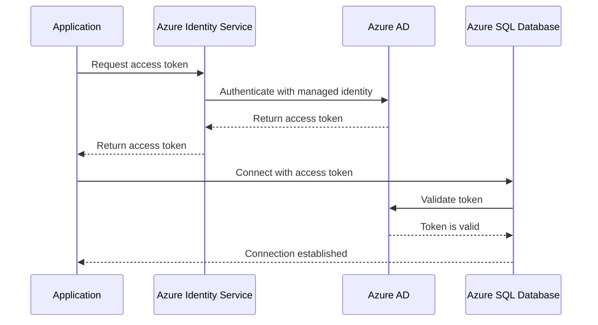

# How to Use Dapper with Azure SQL Database and Managed Identity Authentication in C#

Author: [nawazdhandala](https://www.github.com/nawazdhandala)

Tags: Dapper, Azure SQL, Managed Identity, C#, .NET, Database, Security

Description: Connect to Azure SQL Database using Dapper with Managed Identity authentication in C# for passwordless, secure database access.

---

Storing database passwords in configuration files or environment variables is a security risk that most teams accept because the alternative seems complicated. Azure Managed Identity eliminates this entirely. Your application authenticates to Azure SQL Database using its Azure identity - no passwords, no connection strings with secrets, no credentials to rotate. Pair this with Dapper, the lightweight micro-ORM that gives you the performance of raw ADO.NET with the convenience of object mapping, and you have a fast, secure data access layer.

This guide shows how to set up Dapper with Azure SQL Database using Managed Identity authentication.

## How Managed Identity Works

When your application runs on an Azure service (App Service, Container Apps, Virtual Machines, etc.), Azure assigns it an identity. This identity can be granted access to other Azure resources, including SQL Database. When your application needs to connect, it requests an access token from Azure AD using its managed identity, then presents that token to SQL Database instead of a password.



## Prerequisites

- .NET 8 SDK
- An Azure SQL Database
- An Azure App Service or other compute resource with Managed Identity enabled
- Azure CLI installed and authenticated
- Basic C# and SQL knowledge

## Setting Up Managed Identity

First, enable the system-assigned managed identity on your Azure resource:

```bash
# Enable managed identity on App Service
az webapp identity assign \
  --name my-app-service \
  --resource-group my-rg

# Note the principalId from the output
```

Then grant the identity access to your SQL Database. This requires running SQL commands as the Azure AD admin of the SQL Server:

```bash
# Set an Azure AD admin for the SQL Server
az sql server ad-admin create \
  --server my-sql-server \
  --resource-group my-rg \
  --display-name "SQL Admin" \
  --object-id YOUR_ADMIN_OBJECT_ID
```

Connect to the database as the Azure AD admin and create a user for the managed identity:

```sql
-- Run these commands in the target database
-- Create a user for the managed identity
CREATE USER [my-app-service] FROM EXTERNAL PROVIDER;

-- Grant appropriate permissions
ALTER ROLE db_datareader ADD MEMBER [my-app-service];
ALTER ROLE db_datawriter ADD MEMBER [my-app-service];

-- If the app needs to execute stored procedures
GRANT EXECUTE TO [my-app-service];
```

## Project Setup

```bash
# Create the project
dotnet new webapi -n DapperManagedIdentity
cd DapperManagedIdentity

# Install Dapper and Azure Identity packages
dotnet add package Dapper
dotnet add package Azure.Identity
dotnet add package Microsoft.Data.SqlClient
```

## Configuring the Database Connection

Create a service that manages database connections with Managed Identity:

```csharp
// Services/DatabaseConnectionFactory.cs - Connection factory with managed identity
using Azure.Identity;
using Microsoft.Data.SqlClient;
using Azure.Core;

namespace DapperManagedIdentity.Services;

public interface IDatabaseConnectionFactory
{
    Task<SqlConnection> CreateConnectionAsync();
}

public class ManagedIdentityConnectionFactory : IDatabaseConnectionFactory
{
    private readonly string _connectionString;
    private readonly TokenCredential _credential;
    private AccessToken? _cachedToken;
    private readonly SemaphoreSlim _tokenLock = new(1, 1);

    // Azure SQL scope for token acquisition
    private const string AzureSqlScope = "https://database.windows.net/.default";

    public ManagedIdentityConnectionFactory(IConfiguration configuration)
    {
        // Connection string without password - managed identity handles auth
        _connectionString = configuration.GetConnectionString("DefaultConnection")!;

        // Use DefaultAzureCredential which tries multiple auth methods
        // In Azure, it uses the managed identity
        // Locally, it can use Azure CLI credentials
        _credential = new DefaultAzureCredential(new DefaultAzureCredentialOptions
        {
            // Exclude credential types that are not needed to speed up auth
            ExcludeEnvironmentCredential = false,
            ExcludeManagedIdentityCredential = false,
            ExcludeAzureCliCredential = false,
            ExcludeVisualStudioCredential = true,
            ExcludeVisualStudioCodeCredential = true,
            ExcludeInteractiveBrowserCredential = true,
        });
    }

    public async Task<SqlConnection> CreateConnectionAsync()
    {
        var connection = new SqlConnection(_connectionString);

        // Get an access token for Azure SQL
        var token = await GetTokenAsync();
        connection.AccessToken = token;

        await connection.OpenAsync();
        return connection;
    }

    // Cache the token to avoid requesting a new one for every connection
    private async Task<string> GetTokenAsync()
    {
        await _tokenLock.WaitAsync();
        try
        {
            // Use cached token if it has not expired (with 5-minute buffer)
            if (_cachedToken.HasValue &&
                _cachedToken.Value.ExpiresOn > DateTimeOffset.UtcNow.AddMinutes(5))
            {
                return _cachedToken.Value.Token;
            }

            // Request a new token
            var tokenResult = await _credential.GetTokenAsync(
                new TokenRequestContext(new[] { AzureSqlScope }),
                CancellationToken.None);

            _cachedToken = tokenResult;
            return tokenResult.Token;
        }
        finally
        {
            _tokenLock.Release();
        }
    }
}
```

The connection string does not include a password:

```json
{
  "ConnectionStrings": {
    "DefaultConnection": "Server=my-sql-server.database.windows.net;Database=MyApp;Encrypt=True;TrustServerCertificate=False;"
  }
}
```

## Building the Data Access Layer

Create a repository using Dapper with the managed identity connection factory:

```csharp
// Repositories/ProductRepository.cs - Dapper repository with managed identity
using Dapper;
using DapperManagedIdentity.Models;
using DapperManagedIdentity.Services;

namespace DapperManagedIdentity.Repositories;

public interface IProductRepository
{
    Task<IEnumerable<Product>> GetAllAsync(int page, int pageSize);
    Task<Product?> GetByIdAsync(int id);
    Task<int> CreateAsync(Product product);
    Task<bool> UpdateAsync(Product product);
    Task<bool> DeleteAsync(int id);
    Task<IEnumerable<Product>> SearchAsync(string term);
}

public class ProductRepository : IProductRepository
{
    private readonly IDatabaseConnectionFactory _connectionFactory;

    public ProductRepository(IDatabaseConnectionFactory connectionFactory)
    {
        _connectionFactory = connectionFactory;
    }

    // Get all products with pagination
    public async Task<IEnumerable<Product>> GetAllAsync(int page, int pageSize)
    {
        // Open a connection using managed identity
        using var connection = await _connectionFactory.CreateConnectionAsync();

        // Dapper maps SQL results directly to objects
        const string sql = @"
            SELECT Id, Name, Description, Price, StockQuantity, Category, IsActive, CreatedAt
            FROM Products
            WHERE IsActive = 1
            ORDER BY CreatedAt DESC
            OFFSET @Offset ROWS FETCH NEXT @PageSize ROWS ONLY";

        return await connection.QueryAsync<Product>(sql, new
        {
            Offset = (page - 1) * pageSize,
            PageSize = pageSize,
        });
    }

    // Get a product by ID
    public async Task<Product?> GetByIdAsync(int id)
    {
        using var connection = await _connectionFactory.CreateConnectionAsync();

        const string sql = @"
            SELECT Id, Name, Description, Price, StockQuantity, Category, IsActive, CreatedAt
            FROM Products
            WHERE Id = @Id";

        return await connection.QueryFirstOrDefaultAsync<Product>(sql, new { Id = id });
    }

    // Create a new product and return the generated ID
    public async Task<int> CreateAsync(Product product)
    {
        using var connection = await _connectionFactory.CreateConnectionAsync();

        const string sql = @"
            INSERT INTO Products (Name, Description, Price, StockQuantity, Category, IsActive, CreatedAt)
            VALUES (@Name, @Description, @Price, @StockQuantity, @Category, @IsActive, @CreatedAt);
            SELECT CAST(SCOPE_IDENTITY() AS INT)";

        return await connection.QuerySingleAsync<int>(sql, product);
    }

    // Update an existing product
    public async Task<bool> UpdateAsync(Product product)
    {
        using var connection = await _connectionFactory.CreateConnectionAsync();

        const string sql = @"
            UPDATE Products
            SET Name = @Name,
                Description = @Description,
                Price = @Price,
                StockQuantity = @StockQuantity,
                Category = @Category,
                IsActive = @IsActive
            WHERE Id = @Id";

        var rowsAffected = await connection.ExecuteAsync(sql, product);
        return rowsAffected > 0;
    }

    // Soft delete a product
    public async Task<bool> DeleteAsync(int id)
    {
        using var connection = await _connectionFactory.CreateConnectionAsync();

        const string sql = "UPDATE Products SET IsActive = 0 WHERE Id = @Id";
        var rowsAffected = await connection.ExecuteAsync(sql, new { Id = id });
        return rowsAffected > 0;
    }

    // Search products by name or description
    public async Task<IEnumerable<Product>> SearchAsync(string term)
    {
        using var connection = await _connectionFactory.CreateConnectionAsync();

        const string sql = @"
            SELECT Id, Name, Description, Price, StockQuantity, Category, IsActive, CreatedAt
            FROM Products
            WHERE IsActive = 1
              AND (Name LIKE @Term OR Description LIKE @Term)
            ORDER BY Name";

        return await connection.QueryAsync<Product>(sql, new { Term = $"%{term}%" });
    }
}
```

## Registering Services

```csharp
// Program.cs - Register the connection factory and repositories
using DapperManagedIdentity.Services;
using DapperManagedIdentity.Repositories;

var builder = WebApplication.CreateBuilder(args);

// Register the managed identity connection factory as singleton
// Token caching makes singleton the right choice
builder.Services.AddSingleton<IDatabaseConnectionFactory, ManagedIdentityConnectionFactory>();

// Register repositories
builder.Services.AddScoped<IProductRepository, ProductRepository>();

builder.Services.AddControllers();
var app = builder.Build();

app.MapControllers();
app.Run();
```

## Local Development

When developing locally, `DefaultAzureCredential` falls back to Azure CLI credentials:

```bash
# Log in to Azure CLI with your account
az login

# Set the subscription that contains your SQL Server
az account set --subscription "your-subscription-id"
```

As long as your Azure account has access to the SQL Database, the same code works locally without any changes.

## Wrapping Up

Dapper with Managed Identity gives you the performance of direct SQL with the security of passwordless authentication. There are no credentials to manage, rotate, or accidentally commit to source control. The `DefaultAzureCredential` class transparently handles authentication in both Azure (using the managed identity) and local development (using Azure CLI). The connection factory pattern shown here caches tokens efficiently so you are not requesting a new token for every database call. For applications running on Azure that need fast, direct SQL access, this combination of Dapper and Managed Identity is hard to beat.
