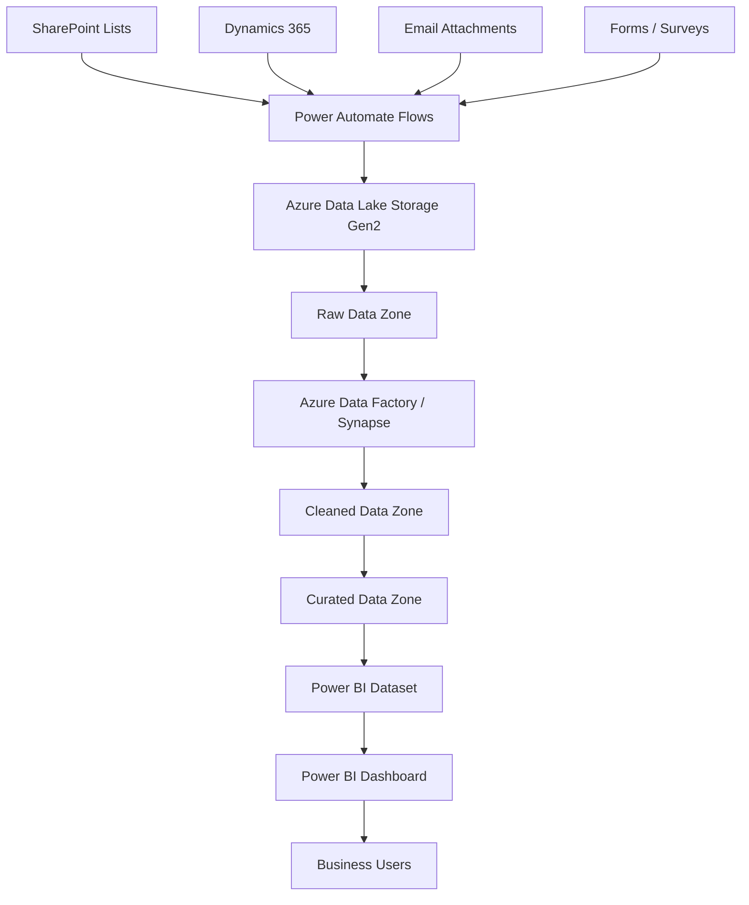

# How to Build an End-to-End Data Pipeline from Power Automate to Azure Data Lake to Power BI

Author: [nawazdhandala](https://www.github.com/nawazdhandala)

Tags: Power Automate, Azure Data Lake, Power BI, Data Pipeline, ETL, Analytics, Azure

Description: Build an end-to-end data pipeline that collects data through Power Automate, stores it in Azure Data Lake, transforms it, and visualizes it in Power BI.

---

Many organizations have data scattered across dozens of systems - SharePoint lists, Dynamics 365, third-party APIs, email inboxes, and manual forms. Getting this data into a centralized analytics platform typically requires custom ETL code, which creates a maintenance burden and often breaks when source systems change. Power Automate can collect data from virtually any source without code, Azure Data Lake provides cheap, scalable storage for the raw data, and Power BI turns it into interactive dashboards.

In this guide, I will build an end-to-end pipeline that uses Power Automate to ingest data from multiple sources, lands it in Azure Data Lake Storage, transforms it with Azure Synapse or Data Factory, and surfaces it in Power BI for analysis.

## Architecture

The pipeline has four layers: collection, storage, transformation, and presentation.



The raw zone stores data exactly as it came from the source. The cleaned zone has standardized schemas and deduplication applied. The curated zone has business logic applied and is optimized for reporting.

## Setting Up Azure Data Lake Storage Gen2

```bash
# Create a storage account with Data Lake Gen2 enabled
az storage account create \
  --name analyticsdatalake \
  --resource-group rg-data-pipeline \
  --location eastus \
  --sku Standard_LRS \
  --kind StorageV2 \
  --hns true

# Create the data zone containers
az storage fs create \
  --name raw \
  --account-name analyticsdatalake

az storage fs create \
  --name cleaned \
  --account-name analyticsdatalake

az storage fs create \
  --name curated \
  --account-name analyticsdatalake
```

The `--hns true` flag enables the hierarchical namespace, which is what makes it "Data Lake Gen2" rather than plain Blob Storage. This enables directory-level operations and POSIX-like permissions.

## Organizing the Data Lake

Structure the raw zone by source system and date for easy management.

```
raw/
  sharepoint/
    project-tasks/
      2026/02/16/
        tasks-20260216-143000.json
    site-metrics/
      2026/02/16/
        metrics-20260216-060000.json
  dynamics365/
    leads/
      2026/02/16/
        leads-20260216-080000.json
    opportunities/
      2026/02/16/
        opportunities-20260216-080000.json
  forms/
    customer-surveys/
      2026/02/16/
        survey-responses-20260216.json
```

This partitioning by date makes it easy to reprocess specific days, manage retention policies, and run incremental transformations.

## Building Power Automate Flows for Data Collection

Create Power Automate flows that extract data from various sources and write it to the Data Lake.

### Flow 1: SharePoint List to Data Lake

This flow runs daily, exports a SharePoint list to JSON, and writes it to the raw zone.

In Power Automate, create a new flow with a Recurrence trigger.

```
Trigger: Recurrence
  - Frequency: Day
  - Interval: 1
  - Start time: 06:00 AM

Action 1: Get Items (SharePoint)
  - Site Address: https://contoso.sharepoint.com/sites/projects
  - List Name: Project Tasks
  - Top Count: 5000

Action 2: Compose (Create JSON)
  - Input: body('Get_items')?['value']

Action 3: Create Blob (Azure Blob Storage)
  - Storage Account: analyticsdatalake
  - Container: raw
  - Blob Path: sharepoint/project-tasks/@{formatDateTime(utcNow(),'yyyy')}/@{formatDateTime(utcNow(),'MM')}/@{formatDateTime(utcNow(),'dd')}/tasks-@{formatDateTime(utcNow(),'yyyyMMdd-HHmmss')}.json
  - Blob Content: @{outputs('Compose')}
```

### Flow 2: Dynamics 365 Leads to Data Lake

```
Trigger: Recurrence
  - Frequency: Day
  - Interval: 1

Action 1: List Records (Dataverse)
  - Environment: Default
  - Table name: Leads
  - Filter rows: modifiedon ge @{addDays(utcNow(), -1)}
  - Select columns: fullname,emailaddress1,telephone1,leadsourcecode,statuscode,createdon,modifiedon

Action 2: Select (Transform to clean schema)
  - From: body('List_records')?['value']
  - Map:
    - name: item()?['fullname']
    - email: item()?['emailaddress1']
    - phone: item()?['telephone1']
    - source: item()?['leadsourcecode']
    - status: item()?['statuscode']
    - created: item()?['createdon']
    - modified: item()?['modifiedon']

Action 3: Create Blob
  - Path: dynamics365/leads/@{formatDateTime(utcNow(),'yyyy/MM/dd')}/leads-@{formatDateTime(utcNow(),'yyyyMMdd-HHmmss')}.json
  - Content: @{body('Select')}
```

### Flow 3: Email Attachments to Data Lake

This flow monitors a shared mailbox for reports sent as email attachments.

```
Trigger: When a new email arrives (V3)
  - Folder: Inbox
  - Include Attachments: Yes
  - Subject Filter: "Monthly Report"

Condition: Has Attachments
  - If yes:
    For each attachment:
      Action: Create Blob
        - Path: email-reports/@{formatDateTime(utcNow(),'yyyy/MM/dd')}/@{items('For_each')?['name']}
        - Content: @{items('For_each')?['contentBytes']}
```

## Data Transformation with Azure Data Factory

Create a Data Factory pipeline that transforms the raw data into a clean, analytics-ready format.

```bash
# Create a Data Factory instance
az datafactory create \
  --name analytics-data-factory \
  --resource-group rg-data-pipeline \
  --location eastus
```

Define a mapping data flow that reads from the raw zone, applies transformations, and writes to the cleaned zone.

```json
{
  "name": "TransformSharePointTasks",
  "properties": {
    "type": "MappingDataFlow",
    "typeProperties": {
      "sources": [
        {
          "name": "RawTasks",
          "dataset": {
            "type": "DatasetReference",
            "referenceName": "RawSharePointTasks"
          }
        }
      ],
      "transformations": [
        {
          "name": "CleanData",
          "description": "Standardize column names and types",
          "type": "DerivedColumn",
          "columns": [
            {
              "name": "task_name",
              "expression": "trim(Title)"
            },
            {
              "name": "assigned_to",
              "expression": "lower(trim(AssignedTo))"
            },
            {
              "name": "due_date",
              "expression": "toDate(DueDate, 'yyyy-MM-dd')"
            },
            {
              "name": "status",
              "expression": "iif(isNull(Status), 'Not Started', Status)"
            },
            {
              "name": "priority",
              "expression": "iif(isNull(Priority), 'Normal', Priority)"
            },
            {
              "name": "days_until_due",
              "expression": "datediff(currentDate(), toDate(DueDate))"
            },
            {
              "name": "is_overdue",
              "expression": "currentDate() > toDate(DueDate) && Status != 'Completed'"
            }
          ]
        },
        {
          "name": "RemoveDuplicates",
          "type": "Aggregate",
          "description": "Deduplicate by task ID, keeping the latest version",
          "groupBy": ["Id"],
          "aggregates": [
            { "name": "task_name", "expression": "last(task_name)" },
            { "name": "assigned_to", "expression": "last(assigned_to)" },
            { "name": "due_date", "expression": "last(due_date)" },
            { "name": "status", "expression": "last(status)" },
            { "name": "priority", "expression": "last(priority)" }
          ]
        }
      ],
      "sinks": [
        {
          "name": "CleanedTasks",
          "dataset": {
            "type": "DatasetReference",
            "referenceName": "CleanedSharePointTasks"
          }
        }
      ]
    }
  }
}
```

Schedule the transformation pipeline to run after the Power Automate flows complete.

```bash
# Create a trigger that runs the pipeline daily at 7 AM
az datafactory trigger create \
  --factory-name analytics-data-factory \
  --resource-group rg-data-pipeline \
  --name daily-transform-trigger \
  --properties '{
    "type": "ScheduleTrigger",
    "typeProperties": {
      "recurrence": {
        "frequency": "Day",
        "interval": 1,
        "startTime": "2026-02-16T07:00:00Z",
        "timeZone": "Eastern Standard Time"
      }
    },
    "pipelines": [
      { "pipelineReference": { "referenceName": "TransformAllSources", "type": "PipelineReference" } }
    ]
  }'
```

## Building the Curated Layer

The curated layer combines data from multiple sources into business-ready tables. For example, combining SharePoint tasks with Dynamics leads to create a project management view.

```sql
-- Azure Synapse SQL script to create the curated layer
-- Combines tasks, leads, and survey responses into unified views

CREATE VIEW curated.project_overview AS
SELECT
    t.task_name,
    t.assigned_to,
    t.due_date,
    t.status AS task_status,
    t.priority,
    t.is_overdue,
    l.name AS lead_name,
    l.source AS lead_source,
    l.status AS lead_status,
    s.satisfaction_score,
    s.feedback_text
FROM cleaned.sharepoint_tasks t
LEFT JOIN cleaned.dynamics_leads l
    ON t.related_lead_id = l.id
LEFT JOIN cleaned.survey_responses s
    ON t.project_id = s.project_id
WHERE t.due_date >= DATEADD(month, -3, GETDATE());
```

## Connecting Power BI

Create a Power BI dataset that connects to the curated layer in Data Lake.

In Power BI Desktop, use the Azure Data Lake Storage Gen2 connector.

1. Get Data > Azure > Azure Data Lake Storage Gen2
2. Enter the storage account URL: `https://analyticsdatalake.dfs.core.windows.net/`
3. Navigate to the curated container
4. Select the Parquet files (or connect to Synapse views directly)

Create your report visuals and publish to the Power BI service.

```
// Power BI DAX measures for the dashboard

// Task completion rate
Task Completion Rate =
DIVIDE(
    COUNTROWS(FILTER(Tasks, Tasks[status] = "Completed")),
    COUNTROWS(Tasks),
    0
)

// Overdue tasks count
Overdue Tasks = COUNTROWS(FILTER(Tasks, Tasks[is_overdue] = TRUE()))

// Average satisfaction score
Avg Satisfaction = AVERAGE(Surveys[satisfaction_score])

// Lead conversion rate
Lead Conversion Rate =
DIVIDE(
    COUNTROWS(FILTER(Leads, Leads[status] = "Qualified")),
    COUNTROWS(Leads),
    0
)
```

## Monitoring the Pipeline

Set up alerts for pipeline failures so you know when data is not flowing.

```bash
# Create an alert for Data Factory pipeline failures
az monitor activity-log alert create \
  --name "Pipeline Failure Alert" \
  --resource-group rg-data-pipeline \
  --condition category=Administrative and operationName=Microsoft.DataFactory/factories/pipelines/runs/write and status=Failed \
  --action-group pipeline-alerts-group
```

## Wrapping Up

The combination of Power Automate, Azure Data Lake, and Power BI creates a data pipeline that business users can largely manage themselves. Power Automate connects to data sources without code. Data Lake stores everything cheaply with room to grow. Data Factory handles the transformations needed to turn raw data into analytics-ready tables. And Power BI provides the interactive dashboards that make the data useful. This pattern works well for organizations that have data in many systems but lack the engineering resources to build custom ETL pipelines. The pipeline runs on schedule, handles failures gracefully, and scales as you add more data sources.
