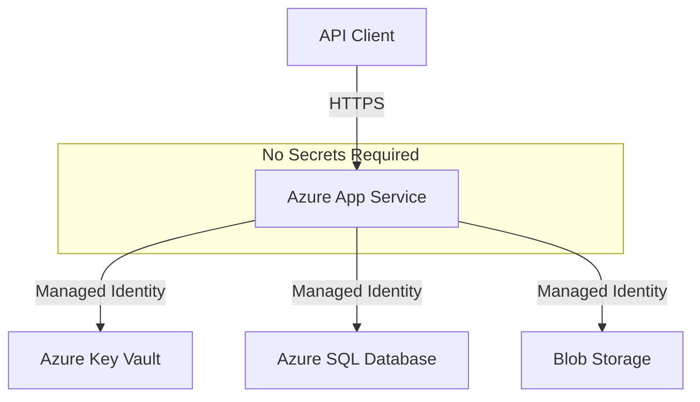

# How to Deploy an ASP.NET Core Web API to Azure App Service with Managed Identity

Author: [nawazdhandala](https://www.github.com/nawazdhandala)

Tags: Azure, ASP.NET Core, App Service, Managed Identity, C#, Deployment, Security

Description: Deploy an ASP.NET Core Web API to Azure App Service and configure managed identity for secure access to Azure services without secrets.

---

Deploying an ASP.NET Core Web API to Azure App Service is straightforward. The part that gets interesting is doing it securely - without storing any secrets in configuration files or environment variables. Managed identity lets your App Service authenticate to other Azure services (databases, Key Vault, Storage) using its own identity, with no passwords or connection strings to manage.

In this post, I will deploy a Web API to App Service and wire it up to Azure SQL Database and Key Vault using managed identity exclusively.

## The Application

Here is the Web API we are deploying. It reads secrets from Key Vault and queries data from Azure SQL.

```csharp
// Program.cs
using Azure.Identity;
using Azure.Security.KeyVault.Secrets;
using Microsoft.EntityFrameworkCore;

var builder = WebApplication.CreateBuilder(args);

// Use DefaultAzureCredential - works locally and in production
var credential = new DefaultAzureCredential();

// Load configuration from Key Vault
var keyVaultUrl = builder.Configuration["KeyVault:Url"];
if (!string.IsNullOrEmpty(keyVaultUrl))
{
    builder.Configuration.AddAzureKeyVault(new Uri(keyVaultUrl), credential);
}

// Register Key Vault client for runtime secret access
builder.Services.AddSingleton(new SecretClient(
    new Uri(keyVaultUrl ?? "https://placeholder.vault.azure.net/"),
    credential
));

// Configure database with connection string from configuration
// In production, this comes from Key Vault
builder.Services.AddDbContext<AppDbContext>(options =>
    options.UseSqlServer(
        builder.Configuration.GetConnectionString("DefaultConnection"),
        sql => sql.EnableRetryOnFailure(5)
    )
);

var app = builder.Build();

// Health check
app.MapGet("/health", () => Results.Ok(new { status = "healthy" }));

// Example endpoint that uses the database
app.MapGet("/api/items", async (AppDbContext db) =>
{
    var items = await db.Items.AsNoTracking().ToListAsync();
    return Results.Ok(items);
});

// Example endpoint that reads a secret
app.MapGet("/api/config/{key}", async (string key, SecretClient secretClient) =>
{
    try
    {
        var secret = await secretClient.GetSecretAsync(key);
        return Results.Ok(new { key, hasValue = !string.IsNullOrEmpty(secret.Value.Value) });
    }
    catch (Azure.RequestFailedException ex) when (ex.Status == 404)
    {
        return Results.NotFound();
    }
});

app.Run();

// Simple DbContext
public class AppDbContext : DbContext
{
    public AppDbContext(DbContextOptions<AppDbContext> options) : base(options) { }
    public DbSet<Item> Items => Set<Item>();
}

public class Item
{
    public int Id { get; set; }
    public string Name { get; set; } = string.Empty;
    public string Description { get; set; } = string.Empty;
}
```

## Creating Azure Resources

Let me create all the resources needed.

```bash
# Variables
RG="api-demo-rg"
LOCATION="eastus"
APP_NAME="my-secure-api"
SQL_SERVER="my-api-sql-server"
KV_NAME="my-api-keyvault"

# Resource group
az group create --name $RG --location $LOCATION

# App Service Plan (Linux)
az appservice plan create \
    --name "${APP_NAME}-plan" \
    --resource-group $RG \
    --is-linux \
    --sku B1

# Web App
az webapp create \
    --name $APP_NAME \
    --resource-group $RG \
    --plan "${APP_NAME}-plan" \
    --runtime "DOTNET|8.0"

# Azure SQL Server (with Azure AD admin)
az sql server create \
    --name $SQL_SERVER \
    --resource-group $RG \
    --location $LOCATION \
    --admin-user sqladmin \
    --admin-password "Temp@dminP@ss1"

# SQL Database
az sql db create \
    --resource-group $RG \
    --server $SQL_SERVER \
    --name apidb \
    --service-objective S0

# Key Vault with RBAC
az keyvault create \
    --name $KV_NAME \
    --resource-group $RG \
    --location $LOCATION \
    --enable-rbac-authorization true
```

## Enabling Managed Identity

Enable system-assigned managed identity on the App Service.

```bash
# Enable managed identity
az webapp identity assign \
    --name $APP_NAME \
    --resource-group $RG

# Get the principal ID for role assignments
PRINCIPAL_ID=$(az webapp identity show \
    --name $APP_NAME \
    --resource-group $RG \
    --query principalId -o tsv)

echo "Managed Identity Principal ID: $PRINCIPAL_ID"
```

## Assigning RBAC Roles

Now give the managed identity access to Key Vault and other services.

```bash
# Key Vault - read secrets
KV_ID=$(az keyvault show --name $KV_NAME --query id -o tsv)
az role assignment create \
    --role "Key Vault Secrets User" \
    --assignee $PRINCIPAL_ID \
    --scope $KV_ID

# If using Blob Storage
# az role assignment create \
#     --role "Storage Blob Data Contributor" \
#     --assignee $PRINCIPAL_ID \
#     --scope <storage-account-id>
```

For Azure SQL with managed identity, create a database user for the App Service.

```bash
# Set yourself as Azure AD admin on the SQL server
az sql server ad-admin create \
    --resource-group $RG \
    --server-name $SQL_SERVER \
    --display-name "SQL Admin" \
    --object-id $(az ad signed-in-user show --query id -o tsv)
```

Then connect to the database and create the user.

```sql
-- Run this as the Azure AD admin
CREATE USER [my-secure-api] FROM EXTERNAL PROVIDER;
ALTER ROLE db_datareader ADD MEMBER [my-secure-api];
ALTER ROLE db_datawriter ADD MEMBER [my-secure-api];
ALTER ROLE db_ddladmin ADD MEMBER [my-secure-api];
```

## Configuring the App Service

Set the application settings. Notice there are no secrets - just URLs and configuration.

```bash
# Set app settings (no secrets!)
az webapp config appsettings set \
    --name $APP_NAME \
    --resource-group $RG \
    --settings \
    "KeyVault__Url=https://${KV_NAME}.vault.azure.net/" \
    "ConnectionStrings__DefaultConnection=Server=${SQL_SERVER}.database.windows.net;Database=apidb;Authentication=Active Directory Managed Identity;Encrypt=True;"
```

The connection string uses `Authentication=Active Directory Managed Identity` instead of a username and password. The SQL Server driver handles the token acquisition automatically when using Microsoft.Data.SqlClient.

## Storing Initial Secrets in Key Vault

```bash
# Store secrets in Key Vault
az keyvault secret set \
    --vault-name $KV_NAME \
    --name "ExternalApiKey" \
    --value "your-external-api-key"

az keyvault secret set \
    --vault-name $KV_NAME \
    --name "SmtpPassword" \
    --value "your-smtp-password"
```

## Deploying the Application

There are several deployment options.

### Option 1: Publish from Visual Studio / VS Code

```bash
# Publish the project
dotnet publish -c Release -o ./publish

# Deploy using Azure CLI
cd publish
zip -r ../deploy.zip .
cd ..
az webapp deployment source config-zip \
    --name $APP_NAME \
    --resource-group $RG \
    --src deploy.zip
```

### Option 2: GitHub Actions

Create a workflow file for CI/CD.

```yaml
# .github/workflows/deploy.yml
name: Deploy to Azure App Service

on:
  push:
    branches: [main]

jobs:
  deploy:
    runs-on: ubuntu-latest
    steps:
      - uses: actions/checkout@v4

      - name: Setup .NET
        uses: actions/setup-dotnet@v4
        with:
          dotnet-version: '8.0.x'

      - name: Publish
        run: dotnet publish -c Release -o ./publish

      - name: Deploy to Azure
        uses: azure/webapps-deploy@v3
        with:
          app-name: my-secure-api
          publish-profile: ${{ secrets.AZURE_PUBLISH_PROFILE }}
          package: ./publish
```

### Option 3: Azure CLI One-Liner

```bash
az webapp up \
    --name $APP_NAME \
    --resource-group $RG \
    --runtime "DOTNET|8.0"
```

## Verifying the Deployment

```bash
# Check if the app is running
curl "https://${APP_NAME}.azurewebsites.net/health"

# Test database access
curl "https://${APP_NAME}.azurewebsites.net/api/items"

# Test Key Vault access
curl "https://${APP_NAME}.azurewebsites.net/api/config/ExternalApiKey"
```

## The Security Architecture

Here is what the final architecture looks like. No secrets anywhere in the application configuration.



The App Service authenticates to each service using its managed identity. Azure AD handles the token exchange behind the scenes. Your application code just uses DefaultAzureCredential and everything works.

## Logging and Monitoring

Enable Application Insights for monitoring.

```bash
# Create Application Insights
az monitor app-insights component create \
    --app "${APP_NAME}-insights" \
    --location $LOCATION \
    --resource-group $RG

# Get the connection string
INSIGHTS_CONN=$(az monitor app-insights component show \
    --app "${APP_NAME}-insights" \
    --resource-group $RG \
    --query connectionString -o tsv)

# Set it as an app setting
az webapp config appsettings set \
    --name $APP_NAME \
    --resource-group $RG \
    --settings "APPLICATIONINSIGHTS_CONNECTION_STRING=$INSIGHTS_CONN"
```

Add Application Insights to your application.

```bash
dotnet add package Microsoft.ApplicationInsights.AspNetCore
```

```csharp
// In Program.cs
builder.Services.AddApplicationInsightsTelemetry();
```

## Scaling

```bash
# Scale up (bigger instance)
az appservice plan update \
    --name "${APP_NAME}-plan" \
    --resource-group $RG \
    --sku P1v3

# Scale out (more instances)
az webapp scale --name $APP_NAME --resource-group $RG --instance-count 3

# Auto-scale based on CPU
az monitor autoscale create \
    --resource-group $RG \
    --name "${APP_NAME}-autoscale" \
    --resource "${APP_NAME}-plan" \
    --resource-type "Microsoft.Web/serverfarms" \
    --min-count 1 \
    --max-count 5 \
    --count 1
```

## Deployment Slots

Use deployment slots for zero-downtime deployments.

```bash
# Create a staging slot
az webapp deployment slot create \
    --name $APP_NAME \
    --resource-group $RG \
    --slot staging

# Deploy to staging
az webapp deployment source config-zip \
    --name $APP_NAME \
    --resource-group $RG \
    --slot staging \
    --src deploy.zip

# Test staging
curl "https://${APP_NAME}-staging.azurewebsites.net/health"

# Swap staging to production
az webapp deployment slot swap \
    --name $APP_NAME \
    --resource-group $RG \
    --slot staging \
    --target-slot production
```

## Best Practices

1. **Never store secrets in app settings.** Use Key Vault with managed identity instead.
2. **Use the Key Vault configuration provider** to load secrets at startup.
3. **Use Active Directory authentication for SQL.** The connection string does not need a password.
4. **Enable Application Insights** from day one. Debugging production issues without telemetry is painful.
5. **Use deployment slots** for zero-downtime deploys in production.
6. **Set up auto-scaling** based on your traffic patterns.

## Wrapping Up

Deploying an ASP.NET Core Web API to Azure App Service with managed identity gives you a production setup where no secrets exist outside of Key Vault. The application authenticates to databases, storage, and other services using its Azure AD identity. This eliminates an entire category of security risks and simplifies your deployment pipeline since there are no secrets to inject or rotate.
