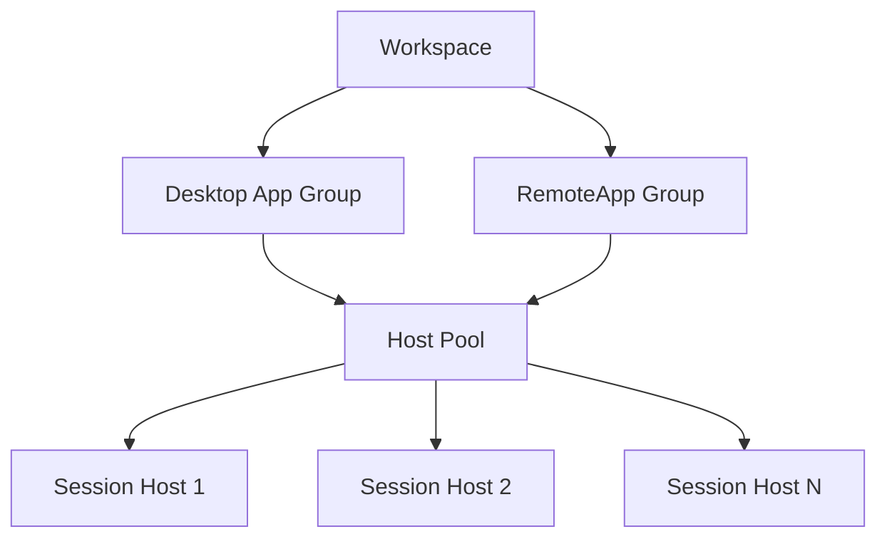

# How to Deploy Azure Virtual Desktop Host Pools with Session Hosts in Terraform

Author: [nawazdhandala](https://www.github.com/nawazdhandala)

Tags: Azure, Terraform, Virtual Desktop, AVD, Infrastructure as Code, Remote Work, Cloud Computing

Description: Deploy Azure Virtual Desktop host pools with session hosts using Terraform for scalable, managed virtual desktop infrastructure.

---

Azure Virtual Desktop (AVD) lets organizations deliver Windows desktops and applications to users anywhere. It is the managed replacement for traditional RDS deployments, handling the session brokering, load balancing, and gateway infrastructure for you. But setting up AVD through the portal involves a lot of clicking and is hard to reproduce. Terraform brings repeatability and version control to the process.

This post walks through deploying a complete AVD environment with Terraform, including host pools, application groups, workspaces, and session host VMs.

## Architecture Overview

An AVD deployment has several components that fit together. The host pool is the collection of session hosts (VMs) that users connect to. Application groups define what users can access - either a full desktop or individual applications. Workspaces group application groups together for user access. And finally, the session hosts are the actual VMs that run the desktops.



## Setting Up the Host Pool

The host pool is the core resource. It defines how sessions are distributed and what type of desktops users get.

```hcl
# main.tf
# Deploys Azure Virtual Desktop infrastructure

terraform {
  required_providers {
    azurerm = {
      source  = "hashicorp/azurerm"
      version = "~> 3.80"
    }
    azuread = {
      source  = "hashicorp/azuread"
      version = "~> 2.47"
    }
  }
}

provider "azurerm" {
  features {}
}

resource "azurerm_resource_group" "avd" {
  name     = "rg-avd-production"
  location = "eastus"
  tags = {
    environment = "production"
    service     = "virtual-desktop"
  }
}

# Host pool - defines the collection of session hosts
resource "azurerm_virtual_desktop_host_pool" "main" {
  name                = "hp-avd-production"
  location            = azurerm_resource_group.avd.location
  resource_group_name = azurerm_resource_group.avd.name

  # Pooled means multiple users share session hosts
  # Personal means each user gets their own dedicated VM
  type               = "Pooled"
  load_balancer_type = "BreadthFirst"  # Spread users across hosts evenly

  # Maximum sessions per host - depends on VM size
  maximum_sessions_allowed = 10

  # Validation environment for testing updates
  validate_environment = false

  # Start VM on connect - saves costs by starting VMs only when needed
  start_vm_on_connect = true

  # Custom RDP properties for the session
  custom_rdp_properties = "audiocapturemode:i:1;audiomode:i:0;camerastoredirect:s:*;redirectclipboard:i:1;redirectprinters:i:0;use multimon:i:1;"

  # Session host configuration
  scheduled_agent_updates {
    enabled = true
    schedule {
      day_of_week = "Saturday"
      hour_of_day = 2
    }
  }

  tags = {
    environment = "production"
  }
}

# Registration token for joining session hosts to the pool
resource "azurerm_virtual_desktop_host_pool_registration_info" "main" {
  hostpool_id     = azurerm_virtual_desktop_host_pool.main.id
  # Token valid for 24 hours - enough for deployment
  expiration_date = timeadd(timestamp(), "24h")
}
```

The `load_balancer_type` matters. `BreadthFirst` spreads users across all available hosts, which is better for consistent performance. `DepthFirst` fills one host before moving to the next, which is better for cost optimization since empty hosts can be shut down.

## Application Groups and Workspace

Application groups determine what users see. A desktop application group gives full desktop access, while a RemoteApp group publishes individual applications.

```hcl
# app-groups.tf
# Defines application groups and workspace

# Desktop application group - full desktop experience
resource "azurerm_virtual_desktop_application_group" "desktop" {
  name                = "ag-desktop-production"
  location            = azurerm_resource_group.avd.location
  resource_group_name = azurerm_resource_group.avd.name
  host_pool_id        = azurerm_virtual_desktop_host_pool.main.id
  type                = "Desktop"
  friendly_name       = "Production Desktop"
  description         = "Full Windows desktop for production users"
}

# RemoteApp application group - individual published apps
resource "azurerm_virtual_desktop_application_group" "remoteapp" {
  name                = "ag-remoteapp-production"
  location            = azurerm_resource_group.avd.location
  resource_group_name = azurerm_resource_group.avd.name
  host_pool_id        = azurerm_virtual_desktop_host_pool.main.id
  type                = "RemoteApp"
  friendly_name       = "Production Applications"
  description         = "Published applications for production users"
}

# Publish specific applications in the RemoteApp group
resource "azurerm_virtual_desktop_application" "excel" {
  name                         = "excel"
  application_group_id         = azurerm_virtual_desktop_application_group.remoteapp.id
  friendly_name                = "Microsoft Excel"
  description                  = "Microsoft Excel spreadsheet application"
  path                         = "C:\\Program Files\\Microsoft Office\\root\\Office16\\EXCEL.EXE"
  command_line_argument_policy = "DoNotAllow"
  show_in_portal               = true
  icon_path                    = "C:\\Program Files\\Microsoft Office\\root\\Office16\\EXCEL.EXE"
  icon_index                   = 0
}

# Workspace groups application groups for user access
resource "azurerm_virtual_desktop_workspace" "main" {
  name                = "ws-avd-production"
  location            = azurerm_resource_group.avd.location
  resource_group_name = azurerm_resource_group.avd.name
  friendly_name       = "Production Workspace"
  description         = "Production virtual desktop workspace"
}

# Associate application groups with the workspace
resource "azurerm_virtual_desktop_workspace_application_group_association" "desktop" {
  workspace_id         = azurerm_virtual_desktop_workspace.main.id
  application_group_id = azurerm_virtual_desktop_application_group.desktop.id
}

resource "azurerm_virtual_desktop_workspace_application_group_association" "remoteapp" {
  workspace_id         = azurerm_virtual_desktop_workspace.main.id
  application_group_id = azurerm_virtual_desktop_application_group.remoteapp.id
}
```

## Deploying Session Hosts

Session hosts are the actual VMs. They need to be domain-joined (or Azure AD joined) and registered with the host pool.

```hcl
# session-hosts.tf
# Deploys the VM-based session hosts that users connect to

variable "session_host_count" {
  description = "Number of session hosts to deploy"
  type        = number
  default     = 3
}

variable "admin_password" {
  description = "Admin password for session hosts"
  type        = string
  sensitive   = true
}

# Network interface for each session host
resource "azurerm_network_interface" "session_host" {
  count               = var.session_host_count
  name                = "nic-avd-sh-${count.index}"
  location            = azurerm_resource_group.avd.location
  resource_group_name = azurerm_resource_group.avd.name

  ip_configuration {
    name                          = "internal"
    subnet_id                     = azurerm_subnet.avd.id
    private_ip_address_allocation = "Dynamic"
  }
}

# Session host VMs
resource "azurerm_windows_virtual_machine" "session_host" {
  count               = var.session_host_count
  name                = "vm-avd-sh-${count.index}"
  location            = azurerm_resource_group.avd.location
  resource_group_name = azurerm_resource_group.avd.name
  size                = "Standard_D4s_v5"  # 4 vCPU, 16GB RAM
  admin_username      = "avdadmin"
  admin_password      = var.admin_password

  network_interface_ids = [
    azurerm_network_interface.session_host[count.index].id,
  ]

  os_disk {
    caching              = "ReadWrite"
    storage_account_type = "Premium_LRS"
    disk_size_gb         = 128
  }

  # Windows 11 Enterprise multi-session image
  source_image_reference {
    publisher = "MicrosoftWindowsDesktop"
    offer     = "windows-11"
    sku       = "win11-23h2-avd"
    version   = "latest"
  }

  # Join to Azure AD
  identity {
    type = "SystemAssigned"
  }

  tags = {
    role        = "avd-session-host"
    host_pool   = azurerm_virtual_desktop_host_pool.main.name
    environment = "production"
  }
}

# Azure AD join extension
resource "azurerm_virtual_machine_extension" "aad_join" {
  count                = var.session_host_count
  name                 = "AADLoginForWindows"
  virtual_machine_id   = azurerm_windows_virtual_machine.session_host[count.index].id
  publisher            = "Microsoft.Azure.ActiveDirectory"
  type                 = "AADLoginForWindows"
  type_handler_version = "2.0"
}

# Register session hosts with the AVD host pool
resource "azurerm_virtual_machine_extension" "avd_register" {
  count                = var.session_host_count
  name                 = "AVDRegistration"
  virtual_machine_id   = azurerm_windows_virtual_machine.session_host[count.index].id
  publisher            = "Microsoft.PowerShell"
  type                 = "DSC"
  type_handler_version = "2.73"

  settings = jsonencode({
    modulesUrl            = "https://wvdportalstorageblob.blob.core.windows.net/galleryartifacts/Configuration_1.0.02714.342.zip"
    configurationFunction = "Configuration.ps1\\AddSessionHost"
    properties = {
      hostPoolName          = azurerm_virtual_desktop_host_pool.main.name
      registrationInfoToken = azurerm_virtual_desktop_host_pool_registration_info.main.token
      aadJoin               = true
    }
  })

  depends_on = [
    azurerm_virtual_machine_extension.aad_join,
  ]
}
```

## Networking

Session hosts need a VNet with proper connectivity.

```hcl
# networking.tf
# Network infrastructure for AVD session hosts

resource "azurerm_virtual_network" "avd" {
  name                = "vnet-avd"
  location            = azurerm_resource_group.avd.location
  resource_group_name = azurerm_resource_group.avd.name
  address_space       = ["10.10.0.0/16"]
}

resource "azurerm_subnet" "avd" {
  name                 = "snet-avd-hosts"
  resource_group_name  = azurerm_resource_group.avd.name
  virtual_network_name = azurerm_virtual_network.avd.name
  address_prefixes     = ["10.10.1.0/24"]
}

# NSG to restrict traffic
resource "azurerm_network_security_group" "avd" {
  name                = "nsg-avd-hosts"
  location            = azurerm_resource_group.avd.location
  resource_group_name = azurerm_resource_group.avd.name

  # Allow outbound to Azure services
  security_rule {
    name                       = "AllowAzureCloud"
    priority                   = 100
    direction                  = "Outbound"
    access                     = "Allow"
    protocol                   = "Tcp"
    source_port_range          = "*"
    destination_port_range     = "443"
    source_address_prefix      = "*"
    destination_address_prefix = "AzureCloud"
  }
}

resource "azurerm_subnet_network_security_group_association" "avd" {
  subnet_id                 = azurerm_subnet.avd.id
  network_security_group_id = azurerm_network_security_group.avd.id
}
```

## User Assignment

Assign users to application groups using Azure AD role assignments.

```hcl
# access.tf
# Grant users access to the virtual desktop

# Desktop Users group gets full desktop access
resource "azurerm_role_assignment" "desktop_users" {
  scope                = azurerm_virtual_desktop_application_group.desktop.id
  role_definition_name = "Desktop Virtualization User"
  principal_id         = var.desktop_users_group_id
}

# App Users group gets RemoteApp access
resource "azurerm_role_assignment" "app_users" {
  scope                = azurerm_virtual_desktop_application_group.remoteapp.id
  role_definition_name = "Desktop Virtualization User"
  principal_id         = var.app_users_group_id
}

# VM login access for Azure AD joined session hosts
resource "azurerm_role_assignment" "vm_user_login" {
  count                = var.session_host_count
  scope                = azurerm_windows_virtual_machine.session_host[count.index].id
  role_definition_name = "Virtual Machine User Login"
  principal_id         = var.desktop_users_group_id
}
```

## Scaling Plan

AVD supports automatic scaling to reduce costs during off-hours.

```hcl
# scaling.tf
# Automatic scaling for session hosts

resource "azurerm_virtual_desktop_scaling_plan" "main" {
  name                = "sp-avd-production"
  location            = azurerm_resource_group.avd.location
  resource_group_name = azurerm_resource_group.avd.name
  friendly_name       = "Production Scaling Plan"
  time_zone           = "Eastern Standard Time"

  schedule {
    name                                 = "weekday-schedule"
    days_of_week                         = ["Monday", "Tuesday", "Wednesday", "Thursday", "Friday"]
    ramp_up_start_time                   = "07:00"
    ramp_up_load_balancing_algorithm     = "BreadthFirst"
    ramp_up_minimum_hosts_percent        = 50
    ramp_up_capacity_threshold_percent   = 75
    peak_start_time                      = "09:00"
    peak_load_balancing_algorithm        = "BreadthFirst"
    ramp_down_start_time                 = "17:00"
    ramp_down_load_balancing_algorithm   = "DepthFirst"
    ramp_down_minimum_hosts_percent      = 25
    ramp_down_capacity_threshold_percent = 90
    ramp_down_force_logoff_users         = false
    ramp_down_notification_message       = "Your session will end in 15 minutes. Please save your work."
    ramp_down_wait_time_minutes          = 15
    off_peak_start_time                  = "20:00"
    off_peak_load_balancing_algorithm    = "DepthFirst"
  }

  host_pool {
    hostpool_id          = azurerm_virtual_desktop_host_pool.main.id
    scaling_plan_enabled = true
  }
}
```

## Summary

Deploying Azure Virtual Desktop with Terraform gives you a reproducible, version-controlled desktop infrastructure. The key pieces are the host pool for session management, application groups for access control, session host VMs with proper Azure AD join and host pool registration, and scaling plans for cost optimization. With everything defined in Terraform, you can spin up identical AVD environments for different departments or regions, test changes in a validation pool before production, and track every configuration change through pull requests.
