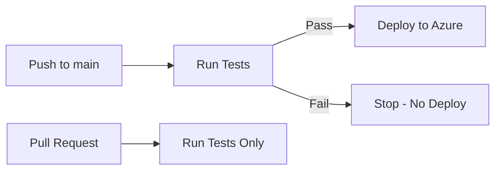

# How to Deploy a Flask REST API to Azure App Service with CI/CD from GitHub Actions

Author: [nawazdhandala](https://www.github.com/nawazdhandala)

Tags: Azure, Flask, Python, GitHub Actions, CI/CD, App Service, REST API

Description: Build a Flask REST API and deploy it to Azure App Service with automated CI/CD using GitHub Actions for continuous deployment.

---

Flask is a popular choice for building REST APIs in Python because it stays out of your way. You write your endpoints, add the libraries you need, and skip the boilerplate. Deploying that API to Azure App Service with GitHub Actions gives you automated deployments on every push - no manual upload steps, no forgetting to deploy after merging a PR.

This post covers building a Flask REST API, deploying it to Azure App Service, and setting up a GitHub Actions workflow for continuous deployment.

## Building the Flask API

Let me start with a simple but realistic API. This one manages a list of tasks - a practical CRUD example.

```bash
# Project setup
mkdir flask-api && cd flask-api
python -m venv venv
source venv/bin/activate
pip install flask gunicorn
```

Here is the main application file.

```python
# app.py
from flask import Flask, jsonify, request, abort
from datetime import datetime

app = Flask(__name__)

# In-memory storage (replace with a database in production)
tasks = {}
next_id = 1


@app.route("/api/health", methods=["GET"])
def health_check():
    """Health check endpoint for monitoring."""
    return jsonify({"status": "healthy", "timestamp": datetime.utcnow().isoformat()})


@app.route("/api/tasks", methods=["GET"])
def get_tasks():
    """Return all tasks, optionally filtered by status."""
    status_filter = request.args.get("status")

    if status_filter:
        filtered = {k: v for k, v in tasks.items() if v["status"] == status_filter}
        return jsonify(list(filtered.values()))

    return jsonify(list(tasks.values()))


@app.route("/api/tasks/<int:task_id>", methods=["GET"])
def get_task(task_id):
    """Return a single task by ID."""
    task = tasks.get(task_id)
    if not task:
        abort(404, description=f"Task {task_id} not found")
    return jsonify(task)


@app.route("/api/tasks", methods=["POST"])
def create_task():
    """Create a new task."""
    global next_id

    if not request.json or "title" not in request.json:
        abort(400, description="Title is required")

    task = {
        "id": next_id,
        "title": request.json["title"],
        "description": request.json.get("description", ""),
        "status": "pending",
        "created_at": datetime.utcnow().isoformat()
    }

    tasks[next_id] = task
    next_id += 1

    return jsonify(task), 201


@app.route("/api/tasks/<int:task_id>", methods=["PUT"])
def update_task(task_id):
    """Update an existing task."""
    task = tasks.get(task_id)
    if not task:
        abort(404, description=f"Task {task_id} not found")

    data = request.json
    if "title" in data:
        task["title"] = data["title"]
    if "description" in data:
        task["description"] = data["description"]
    if "status" in data:
        if data["status"] not in ["pending", "in_progress", "completed"]:
            abort(400, description="Invalid status")
        task["status"] = data["status"]

    task["updated_at"] = datetime.utcnow().isoformat()
    return jsonify(task)


@app.route("/api/tasks/<int:task_id>", methods=["DELETE"])
def delete_task(task_id):
    """Delete a task."""
    if task_id not in tasks:
        abort(404, description=f"Task {task_id} not found")

    del tasks[task_id]
    return "", 204


@app.errorhandler(404)
def not_found(error):
    return jsonify({"error": str(error)}), 404


@app.errorhandler(400)
def bad_request(error):
    return jsonify({"error": str(error)}), 400


if __name__ == "__main__":
    app.run(debug=True)
```

## Adding Tests

Good CI/CD starts with tests. Create a test file that GitHub Actions will run before deploying.

```python
# test_app.py
import pytest
import json
from app import app


@pytest.fixture
def client():
    """Create a test client for the Flask app."""
    app.config["TESTING"] = True
    with app.test_client() as client:
        yield client


def test_health_check(client):
    """Test the health endpoint returns 200."""
    response = client.get("/api/health")
    assert response.status_code == 200
    data = json.loads(response.data)
    assert data["status"] == "healthy"


def test_create_task(client):
    """Test creating a new task."""
    response = client.post(
        "/api/tasks",
        data=json.dumps({"title": "Write tests", "description": "Add unit tests"}),
        content_type="application/json"
    )
    assert response.status_code == 201
    data = json.loads(response.data)
    assert data["title"] == "Write tests"
    assert data["status"] == "pending"


def test_create_task_missing_title(client):
    """Test that creating a task without a title returns 400."""
    response = client.post(
        "/api/tasks",
        data=json.dumps({"description": "No title here"}),
        content_type="application/json"
    )
    assert response.status_code == 400


def test_get_nonexistent_task(client):
    """Test that getting a missing task returns 404."""
    response = client.get("/api/tasks/9999")
    assert response.status_code == 404
```

## Project Structure

Your project should look like this before deployment.

```
flask-api/
    app.py
    test_app.py
    requirements.txt
    startup.sh
    .github/
        workflows/
            deploy.yml
```

The requirements.txt file.

```
Flask>=3.0
gunicorn>=21.2
pytest>=7.4
```

The startup script for App Service.

```bash
#!/bin/bash
# startup.sh - Starts the Flask app with Gunicorn
gunicorn app:app --bind=0.0.0.0:8000 --workers=2 --timeout=120
```

## Creating Azure Resources

```bash
# Create resource group
az group create --name flask-api-rg --location eastus

# Create App Service plan
az appservice plan create \
    --name flask-api-plan \
    --resource-group flask-api-rg \
    --is-linux \
    --sku B1

# Create the web app
az webapp create \
    --name my-flask-api \
    --resource-group flask-api-rg \
    --plan flask-api-plan \
    --runtime "PYTHON:3.11"

# Set the startup command
az webapp config set \
    --name my-flask-api \
    --resource-group flask-api-rg \
    --startup-file "startup.sh"
```

## Getting the Publish Profile

GitHub Actions needs credentials to deploy to your App Service. The publish profile is the simplest way to set this up.

```bash
# Download the publish profile
az webapp deployment list-publishing-profiles \
    --name my-flask-api \
    --resource-group flask-api-rg \
    --xml
```

Copy the entire XML output. In your GitHub repository, go to Settings > Secrets and variables > Actions, and create a new secret called `AZURE_WEBAPP_PUBLISH_PROFILE` with the XML content as the value.

## GitHub Actions Workflow

Create the workflow file that runs tests and deploys on every push to main.

```yaml
# .github/workflows/deploy.yml
name: Deploy Flask API to Azure

on:
  push:
    branches:
      - main
  pull_request:
    branches:
      - main

jobs:
  test:
    runs-on: ubuntu-latest
    steps:
      - name: Checkout code
        uses: actions/checkout@v4

      - name: Set up Python
        uses: actions/setup-python@v5
        with:
          python-version: "3.11"

      - name: Install dependencies
        run: |
          python -m pip install --upgrade pip
          pip install -r requirements.txt

      - name: Run tests
        run: pytest test_app.py -v

  deploy:
    needs: test  # Only deploy if tests pass
    runs-on: ubuntu-latest
    if: github.ref == 'refs/heads/main' && github.event_name == 'push'

    steps:
      - name: Checkout code
        uses: actions/checkout@v4

      - name: Set up Python
        uses: actions/setup-python@v5
        with:
          python-version: "3.11"

      - name: Install dependencies
        run: |
          python -m pip install --upgrade pip
          pip install -r requirements.txt

      - name: Deploy to Azure Web App
        uses: azure/webapps-deploy@v3
        with:
          app-name: "my-flask-api"
          publish-profile: ${{ secrets.AZURE_WEBAPP_PUBLISH_PROFILE }}
```

## How the Workflow Works

The workflow has two jobs: `test` and `deploy`.

The `test` job runs on every push and every pull request. It checks out the code, installs dependencies, and runs pytest. If any test fails, the workflow stops.

The `deploy` job only runs if the tests pass AND the push is to the main branch. Pull requests trigger tests but not deployment. This gives you confidence that every deployment has passed your test suite.



## Adding Environment Variables

If your Flask app needs environment variables, configure them in App Service.

```bash
# Set environment variables
az webapp config appsettings set \
    --name my-flask-api \
    --resource-group flask-api-rg \
    --settings \
    FLASK_ENV="production" \
    DATABASE_URL="postgresql://..." \
    API_KEY="your-api-key"
```

## Deployment Slots for Zero-Downtime Deploys

For production APIs, you want zero-downtime deployments. Deployment slots let you deploy to a staging slot, verify it works, then swap it into production.

```bash
# Create a staging slot
az webapp deployment slot create \
    --name my-flask-api \
    --resource-group flask-api-rg \
    --slot staging

# Update the GitHub Actions workflow to deploy to staging
# Then swap staging to production after verification
az webapp deployment slot swap \
    --name my-flask-api \
    --resource-group flask-api-rg \
    --slot staging \
    --target-slot production
```

Update your GitHub Actions deploy step to target the staging slot.

```yaml
      - name: Deploy to staging slot
        uses: azure/webapps-deploy@v3
        with:
          app-name: "my-flask-api"
          publish-profile: ${{ secrets.AZURE_WEBAPP_PUBLISH_PROFILE_STAGING }}
          slot-name: "staging"
```

## Monitoring Your API

After deployment, set up monitoring.

```bash
# Enable application logging
az webapp log config \
    --name my-flask-api \
    --resource-group flask-api-rg \
    --application-logging filesystem

# Stream logs
az webapp log tail \
    --name my-flask-api \
    --resource-group flask-api-rg
```

Add Application Insights for deeper monitoring.

```bash
# Create an Application Insights resource
az monitor app-insights component create \
    --app flask-api-insights \
    --location eastus \
    --resource-group flask-api-rg

# Get the instrumentation key and set it as an app setting
INSTRUMENTATION_KEY=$(az monitor app-insights component show \
    --app flask-api-insights \
    --resource-group flask-api-rg \
    --query instrumentationKey -o tsv)

az webapp config appsettings set \
    --name my-flask-api \
    --resource-group flask-api-rg \
    --settings APPINSIGHTS_INSTRUMENTATIONKEY=$INSTRUMENTATION_KEY
```

## Wrapping Up

Deploying a Flask REST API to Azure App Service with GitHub Actions gives you a clean development workflow. Write code, push to a branch, open a PR, tests run automatically, merge to main, and the deployment happens without you lifting a finger. The key pieces are: a properly structured Flask app, a startup script for Gunicorn, Azure resources configured with the right settings, and a GitHub Actions workflow that gates deployment behind passing tests. This setup scales well from side projects to production APIs.
