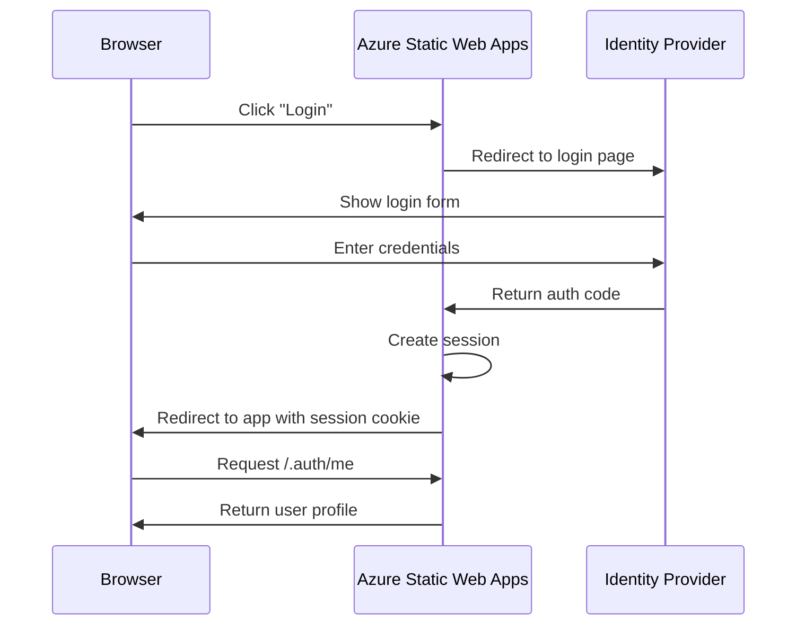

# How to Deploy a Vue.js Application to Azure Static Web Apps with Custom Authentication

Author: [nawazdhandala](https://www.github.com/nawazdhandala)

Tags: Vue.js, Azure, Static Web Apps, Authentication, Deployment, JavaScript, Security

Description: Deploy a Vue.js application to Azure Static Web Apps and implement custom authentication with role-based access control.

---

Vue.js applications benefit from the same Azure Static Web Apps features as React and Angular - global CDN, automatic deployments, and integrated APIs. But the authentication story deserves special attention. Azure Static Web Apps comes with built-in authentication providers (GitHub, Twitter, Azure AD), and you can also configure custom OpenID Connect providers. This means you can use Auth0, Okta, or any OIDC-compliant identity provider without writing authentication middleware yourself.

This guide covers deploying a Vue.js application with custom authentication, protected routes, and role-based access control.

## Prerequisites

- Node.js 18 or later
- Vue CLI or Vite
- Azure account and CLI
- GitHub account
- An OpenID Connect provider (we will use Auth0 as the example)

## Creating the Vue.js Application

```bash
# Create a new Vue.js project with Vite
npm create vue@latest vue-swa-auth -- --typescript --router --pinia
cd vue-swa-auth
npm install
```

## Setting Up Authentication

Azure Static Web Apps handles the OAuth flow for you. You configure the provider, and the platform manages tokens, sessions, and redirects. Here is how authentication flows through the application:



## Configuring the Custom Authentication Provider

Create `staticwebapp.config.json` in your project root:

```json
{
  "auth": {
    "identityProviders": {
      "customOpenIdConnectProviders": {
        "auth0": {
          "registration": {
            "clientIdSettingName": "AUTH0_CLIENT_ID",
            "clientCredential": {
              "clientSecretSettingName": "AUTH0_CLIENT_SECRET"
            },
            "openIdConnectConfiguration": {
              "wellKnownOpenIdConfiguration": "https://YOUR_DOMAIN.auth0.com/.well-known/openid-configuration"
            }
          },
          "login": {
            "nameClaimType": "name",
            "scopes": ["openid", "profile", "email"]
          }
        }
      }
    }
  },
  "routes": [
    {
      "route": "/login",
      "rewrite": "/.auth/login/auth0"
    },
    {
      "route": "/logout",
      "redirect": "/.auth/logout"
    },
    {
      "route": "/admin/*",
      "allowedRoles": ["admin"]
    },
    {
      "route": "/dashboard/*",
      "allowedRoles": ["authenticated"]
    },
    {
      "route": "/api/admin/*",
      "allowedRoles": ["admin"]
    }
  ],
  "responseOverrides": {
    "401": {
      "redirect": "/login",
      "statusCode": 302
    }
  },
  "navigationFallback": {
    "rewrite": "/index.html",
    "exclude": ["/api/*", "/assets/*", "/.auth/*"]
  }
}
```

Set the Auth0 credentials in your Static Web App:

```bash
# Configure the authentication secrets
az staticwebapp appsettings set \
  --name vue-swa-auth \
  --resource-group vue-swa-rg \
  --setting-names \
    AUTH0_CLIENT_ID="your-auth0-client-id" \
    AUTH0_CLIENT_SECRET="your-auth0-client-secret"
```

## Building the Authentication Composable

Create a Vue composable that wraps the authentication API:

```typescript
// src/composables/useAuth.ts - Authentication composable
import { ref, computed, onMounted } from 'vue';

// User profile returned by Azure SWA auth
interface UserProfile {
  identityProvider: string;
  userId: string;
  userDetails: string;
  userRoles: string[];
  claims: Array<{ typ: string; val: string }>;
}

// Reactive state for the current user
const user = ref<UserProfile | null>(null);
const loading = ref(true);
const error = ref<string | null>(null);

// Fetch the current user from the built-in auth endpoint
async function fetchUser() {
  try {
    loading.value = true;
    const response = await fetch('/.auth/me');
    const data = await response.json();

    if (data.clientPrincipal) {
      user.value = data.clientPrincipal;
    } else {
      user.value = null;
    }
  } catch (err) {
    error.value = 'Failed to fetch user profile';
    user.value = null;
  } finally {
    loading.value = false;
  }
}

export function useAuth() {
  // Fetch user on first use
  onMounted(() => {
    if (user.value === null && loading.value) {
      fetchUser();
    }
  });

  const isAuthenticated = computed(() => user.value !== null);
  const isAdmin = computed(() => user.value?.userRoles.includes('admin') ?? false);
  const userName = computed(() => user.value?.userDetails ?? 'Guest');

  // Get a specific claim value
  function getClaim(type: string): string | undefined {
    return user.value?.claims.find((c) => c.typ === type)?.val;
  }

  // Login by redirecting to the auth provider
  function login() {
    window.location.href = '/login';
  }

  // Logout by hitting the SWA logout endpoint
  function logout() {
    window.location.href = '/logout';
  }

  return {
    user,
    loading,
    error,
    isAuthenticated,
    isAdmin,
    userName,
    getClaim,
    login,
    logout,
    refreshUser: fetchUser,
  };
}
```

## Building Protected Routes

Set up Vue Router with authentication guards:

```typescript
// src/router/index.ts - Vue Router with auth guards
import { createRouter, createWebHistory } from 'vue-router';
import HomeView from '../views/HomeView.vue';

const router = createRouter({
  history: createWebHistory(),
  routes: [
    {
      path: '/',
      name: 'home',
      component: HomeView,
    },
    {
      path: '/dashboard',
      name: 'dashboard',
      component: () => import('../views/DashboardView.vue'),
      meta: { requiresAuth: true },
    },
    {
      path: '/admin',
      name: 'admin',
      component: () => import('../views/AdminView.vue'),
      meta: { requiresAuth: true, requiresAdmin: true },
    },
    {
      path: '/profile',
      name: 'profile',
      component: () => import('../views/ProfileView.vue'),
      meta: { requiresAuth: true },
    },
  ],
});

// Navigation guard for client-side route protection
router.beforeEach(async (to) => {
  if (to.meta.requiresAuth) {
    // Check authentication status
    const response = await fetch('/.auth/me');
    const data = await response.json();

    if (!data.clientPrincipal) {
      // Redirect to login if not authenticated
      window.location.href = `/login?post_login_redirect_uri=${to.fullPath}`;
      return false;
    }

    if (to.meta.requiresAdmin && !data.clientPrincipal.userRoles.includes('admin')) {
      // Redirect home if user lacks admin role
      return { name: 'home' };
    }
  }
});

export default router;
```

## Navigation Component

Build a navigation bar that adapts to authentication state:

```vue
<!-- src/components/NavBar.vue - Navigation with auth state -->
<template>
  <nav class="navbar">
    <div class="nav-brand">
      <router-link to="/">MyApp</router-link>
    </div>

    <div class="nav-links">
      <router-link to="/">Home</router-link>
      <router-link v-if="isAuthenticated" to="/dashboard">Dashboard</router-link>
      <router-link v-if="isAdmin" to="/admin">Admin</router-link>
    </div>

    <div class="nav-auth">
      <template v-if="loading">
        <span class="loading-text">Loading...</span>
      </template>
      <template v-else-if="isAuthenticated">
        <router-link to="/profile" class="user-name">{{ userName }}</router-link>
        <button @click="logout" class="btn-logout">Logout</button>
      </template>
      <template v-else>
        <button @click="login" class="btn-login">Login</button>
      </template>
    </div>
  </nav>
</template>

<script setup lang="ts">
import { useAuth } from '../composables/useAuth';

// Destructure auth state and methods
const { isAuthenticated, isAdmin, userName, loading, login, logout } = useAuth();
</script>
```

## Profile Page

Show the user their profile information from the authentication claims:

```vue
<!-- src/views/ProfileView.vue - User profile page -->
<template>
  <div class="profile-page">
    <h1>Your Profile</h1>

    <div v-if="loading" class="loading">Loading profile...</div>

    <div v-else-if="user" class="profile-card">
      <div class="profile-field">
        <label>Name</label>
        <span>{{ userName }}</span>
      </div>

      <div class="profile-field">
        <label>Email</label>
        <span>{{ getClaim('http://schemas.xmlsoap.org/ws/2005/05/identity/claims/emailaddress') || 'Not available' }}</span>
      </div>

      <div class="profile-field">
        <label>Identity Provider</label>
        <span>{{ user.identityProvider }}</span>
      </div>

      <div class="profile-field">
        <label>Roles</label>
        <div class="roles">
          <span v-for="role in user.userRoles" :key="role" class="role-badge">
            {{ role }}
          </span>
        </div>
      </div>

      <div class="profile-field">
        <label>All Claims</label>
        <table class="claims-table">
          <tr v-for="claim in user.claims" :key="claim.typ">
            <td>{{ claim.typ.split('/').pop() }}</td>
            <td>{{ claim.val }}</td>
          </tr>
        </table>
      </div>
    </div>
  </div>
</template>

<script setup lang="ts">
import { useAuth } from '../composables/useAuth';

const { user, loading, userName, getClaim } = useAuth();
</script>
```

## Assigning Custom Roles

Azure Static Web Apps lets you assign roles to users through the Azure portal or API. For programmatic role assignment, create an API endpoint:

```javascript
// api/src/functions/roles.js - Role assignment API
const { app } = require('@azure/functions');

// Invitations endpoint for role assignment
app.http('assignRole', {
  methods: ['POST'],
  authLevel: 'anonymous',
  route: 'admin/roles',
  handler: async (request) => {
    const { email, role } = await request.json();

    // In production, call the Azure Static Web Apps management API
    // to create a role invitation
    const managementUrl = `https://management.azure.com/subscriptions/{sub}/resourceGroups/{rg}/providers/Microsoft.Web/staticSites/{site}/invitations`;

    // This is a simplified example
    return {
      jsonBody: {
        success: true,
        message: `Role ${role} assigned to ${email}`,
      },
    };
  },
});
```

## Deploying

Push to GitHub and deploy:

```bash
# Push to GitHub
git add .
git commit -m "Vue.js app with custom authentication"
gh repo create vue-swa-auth --public --push --source .

# Create the Static Web App
az staticwebapp create \
  --name vue-swa-auth \
  --resource-group vue-swa-rg \
  --source https://github.com/YOUR_USERNAME/vue-swa-auth \
  --location eastus \
  --branch main \
  --app-location "/" \
  --api-location "api" \
  --output-location "dist" \
  --login-with-github
```

## Wrapping Up

Azure Static Web Apps gives Vue.js applications authentication without writing authentication code. The custom OpenID Connect provider support means you are not locked into Microsoft's identity providers - you can use Auth0, Okta, or any OIDC-compliant service. The route-level access control in `staticwebapp.config.json` protects both your frontend routes and API endpoints based on user roles. Combined with Vue Router's navigation guards for client-side protection, you get defense in depth without building an authentication system from scratch. The whole setup deploys automatically from GitHub, and staging environments let you test authentication flows on pull requests before merging to production.
